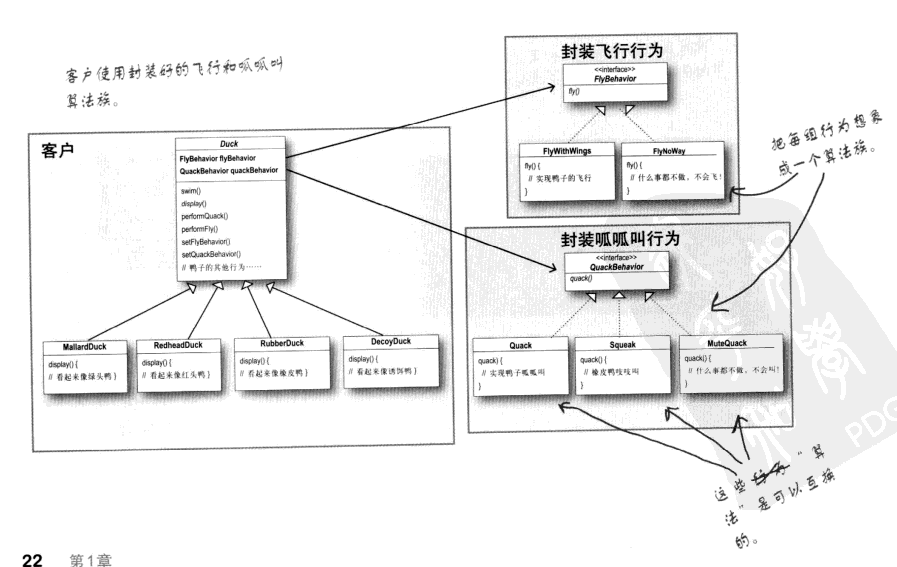

## 策略模式具体实现

> 策略模式: **将行为定义成算法族,分别封装起来,让他们之间可以相互替换,此模式是让算法的变化独立于使用算法的客户**



### 飞行行为族定义
```java
// 飞行行为定义
public interface FlyBehavior {
    void fly();
}
// 无法飞行是飞行的一种行为
public class FlyNotWay implements FlyBehavior {
    @Override
    public void fly() {
        System.out.println("i can't fly");
    }
}
// 用翅膀飞行也是飞行的一种行为
public class FlyWithWings implements FlyBehavior {
    @Override
    public void fly() {
        System.out.println("i am flying");
    }
}

```

### 嘎嘎叫行为族定义
```java
// 嘎嘎叫行为定义
public interface QuackBehavior {
    void quack();
}
// 静音嘎嘎叫是嘎嘎叫的一种行为
public class MuteQuack implements QuackBehavior {
    @Override
    public void quack() {
        System.out.println("mute quack");
    }
}
// 吱吱嘎嘎叫也是嘎嘎叫的一种行为
public class Squeak implements QuackBehavior {
    @Override
    public void quack() {
        System.out.println("squeak quack");
    }
}
```

### 定义鸭子类
``` java
public abstract class DuckBase {
    // 飞行行为族
    FlyBehavior flyBehavior;

    // 嘎嘎叫行为族
    QuackBehavior quackBehavior;

    // 设置飞行行为的具体实现
    public void setFlyBehavior(FlyBehavior flyBehavior) {
        this.flyBehavior = flyBehavior;
    }

    // 设置嘎嘎叫行为的具体实现
    public void setQuackBehavior(QuackBehavior quackBehavior) {
        this.quackBehavior = quackBehavior;
    }

    public abstract void display();

    // 飞行
    public void fly() {
        flyBehavior.fly();
    }

    // 嘎嘎叫
    public void quack() {
        quackBehavior.quack();
    }
}

```


### 测试
```java
// 动物鸭 可以飞 可以吱吱叫
public class AnimalDuck extends DuckBase {
    @Override
    public void display() {
        System.out.println("i am normal duck");
    }

    public static void main(String[] args) {
        AnimalDuck animalDuck = new AnimalDuck();
        animalDuck.setFlyBehavior(new FlyWithWings());
        animalDuck.setQuackBehavior(new Squeak());

        animalDuck.display();

        animalDuck.fly();
        animalDuck.quack();
    }
}

// 模型鸭 不可以飞 不可以叫
public class ModelDuck extends DuckBase {
    @Override
    public void display() {
        System.out.println("i am model duck");
    }

    public static void main(String[] args) {
        ModelDuck modelDuck = new ModelDuck();
        modelDuck.setFlyBehavior(new FlyNotWay());
        modelDuck.setQuackBehavior(new MuteQuack());

        modelDuck.display();

        modelDuck.fly();
        modelDuck.quack();
    
    }
}

```
### 理解
- 当行为族定义的时候,在基类的中我们可以面向接口编程
- 在基类中定位行为，说明定义的行为的列表,而在子类中通过set方法进行设置行为则体现子类可以自由组合行为。符合组合大于继承的原则
- 在面向对象的定义中,对象是行为和属性的集合体。而在在实现具体行为的时候，不但可以实现具体的行为 也可以定义某种行为的私有属性.行为和属性则构建了一个完整的对象
- 策略模式最重要的是**利用多态构成的(组合 + 替换)**


