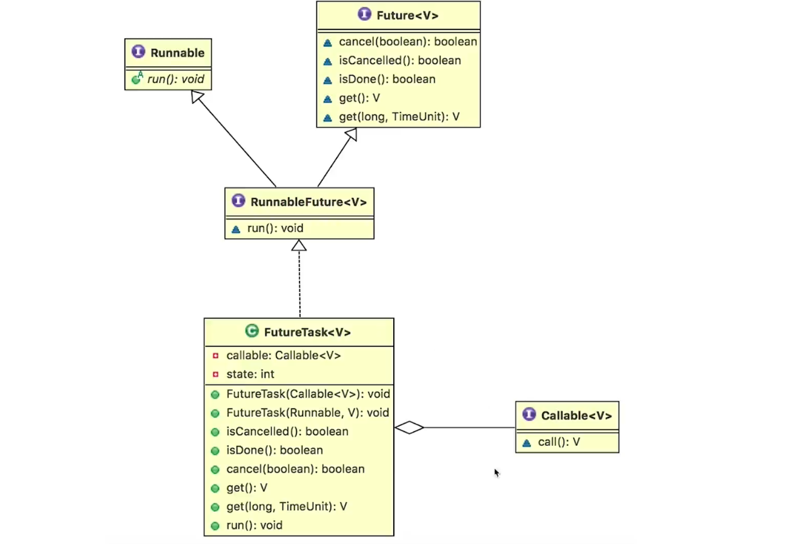
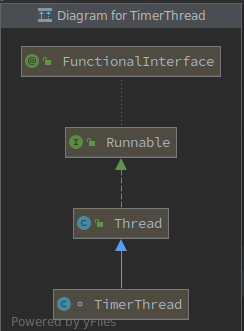

# 实现多线程的正确姿势
---
## 如何创建线程
>  根据oracle的文档，创建线程只有两种方式，**实现Runnable接口(优先)，继承Thread类，其他的实现方式不过是将这两种方式进行包装，以另外的方式创建线程，但是本质上还是这两种方式的衍生**

* 继承 Thread类的缺点：
    * 从结构角度，任务应该与线程解耦
    * 从效率角度，创建销毁一个线程需要的系统开销很大，实现Runnable接口，有线程池，效率相比较继承Thead的方式，效率更高
    * java 不支持多继承，但是支持多实现

> 这两种方式本质上都是执行run方法，但是两者而在源码中的实现方式不同

###  继承Thread类的方式

```java
package threadcoreknowledge.createthread;

/**
 * @ClassName: ThreadStyle
 * @Description: 通过继承Thread的方式实现多线程
 * @Author: debian
 * @Date: 2020/1/2 下午4:43
 * @Version: 1.0
 **/
public class ThreadStyle extends Thread {
    public static void main(String[] args) {
        new ThreadStyle().start();
    }
    @Override
    public void run()
    {
        System.out.println("通过继承Thread的方式实现多线程");
    }
}
```
> 这种方式是继承Thread类，重写run方法，后续执行的之后，直接执行该类的run方法

### 实现Runnable接口的方式

```java
package threadcoreknowledge.createthread;

/**
 * @ClassName: RunnableStyle
 * @Description: 通过实现Runnable接口的方式实现多线程
 * @Author: debian
 * @Date: 2020/1/2 下午4:42
 * @Version: 1.0
 **/
public class RunnableStyle implements Runnable {
    public static void main(String[] args) {
        new Thread(new RunnableStyle()).start();
    }
    @Override
    public void run() {
        System.out.println("通过实现Runnable接口的方式实现多线程");
    }
}
```

```java
@Override
public void run() {
    if (target != null) {
        target.run();
    }
}
```
> 这种方式是实现Runnable接口，在Thread的构造函数中传入Runnable接口的实现类(target)，然后调用target的run方法

### 实现Runnable和继承Thread方式的区别
* 方法一和方法二，也就是“实现Runnable接口并传入Thread类”和“继承Thread类然后重写run()”在实现多线程的本质上，并没有区别，都是最终调用了start()方法来新建线程。这两个方法的最主要区别在于run()方法的内容来源：
```java
@Override
public void run() {
    if (target != null) {
        target.run();
    }
}
```
* 方法一: 最终调用target.run()
* 方法二: 重写整个run()

### 思考题：同时使用两种方法创建线程会如何?
```java
package threadcoreknowledge.createthread;

/**
 * @ClassName: BothRunnableThread
 * @Description: 同时使用两种方式创建线程，最后执行的是那个run方法?
 * @Author: debian
 * @Date: 2020/1/2 下午5:01
 * @Version: 1.0
 **/
public class BothRunnableThread {
    public static void main(String[] args) {
        new Thread(new Runnable() {
            @Override
            public void run() {
                System.out.println("我来自Runnable");
            }
        }){
            @Override
            public void run()
            {
                System.out.println("我来自Thread");
            }
        }.start();
    }
}
```
> 执行结果是:我来自Thread，因为 虽然传入的target，但是后面重写了整个run方法,target.run()没有执行，因此执行结果是:我来自Thread

### 创建线程最精确的描述
结论:**我们只能通过新建Thread类这一种方式来创建线程，但是类里面的run方法有两种方式来实现，第一种是重写run方法，第二种实现Runnable接口的run方法，然后再把该Runnable实例传给Thread类，通过target.run()方式调用。除此之外，从表面上看线程池、定时器等工具类也可以创建线程，但是它们的本质都逃不出刚才所说的范围。**

### 创建线程池典型的错误观点
#### 线程池也是创建线程的一种方式（错误观点）
```java
package threadcoreknowledge.createthread.wrongways;

import java.util.concurrent.ExecutorService;
import java.util.concurrent.Executors;

/**
 * @ClassName: ThreadPool
 * @Description: 创建线程的错误描述，线程池
 * @Author: debian
 * @Date: 2020/1/2 下午5:11
 * @Version: 1.0
 **/
public class ThreadPool {
    public static void main(String[] args) {
        ExecutorService executorService = Executors.newCachedThreadPool();
        for(int i=0;i<500;i++)
        {
            executorService.submit(new Task());
        }
    }
}
class Task implements Runnable
{
    @Override
    public void run() {
        try {
            Thread.sleep(500);
        } catch (InterruptedException e) {
            e.printStackTrace();
        }
        System.out.println(Thread.currentThread().getName());
    }
}
```
> 表面是线程池也可以创建线程，但是在Executors 中 DefaultThreadFactory 的源码中可以明显的看到，本质还是通过new Thread的方式创建的线程
```java
public Thread newThread(Runnable r) {
    Thread t = new Thread(group, r,namePrefix + threadNumber.getAndIncrement(),0);
    if (t.isDaemon())
        t.setDaemon(false);
    if (t.getPriority() != Thread.NORM_PRIORITY)
        t.setPriority(Thread.NORM_PRIORITY);
    return t;
}
```
####  Callable 和 FutureTask也是创建线程的一种方式（错误观点）
```java
package threadcoreknowledge.createthread.wrongways;

import java.util.concurrent.*;

/**
 * @ClassName: CallableAndFutureTask
 * @Description: 创建线程的错误描述: 通过 Callable和TutureTask的方式
 * @Author: debian
 * @Date: 2020/1/2 下午5:25
 * @Version: 1.0
 **/
public class CallableAndFutureTask {

    public static void main(String[] args) {
        ExecutorService executorService = Executors.newCachedThreadPool();
        Future<Integer> result = executorService.submit(new Task());
        executorService.shutdown();
        try {
            System.out.println("task运行结果"+result.get());
        } catch (InterruptedException e) {
            e.printStackTrace();
        } catch (ExecutionException e) {
            e.printStackTrace();
        }
    }
}
class Task implements Callable<Integer>
{

    @Override
    public Integer call() throws Exception {
        Thread.sleep(500);
        int sum = 0;
        for(int i=0;i<100;i++)
            sum += i;
        return sum;
    }
}
```




> 从上面两张实现图中可以清晰的看到，CallableAndFutureTask 本质上也是通过 Runnable 和 Thread进行实现的，不过是添加了一层包装

####  定时器也是创建线程的一种方式（错误观点）

```java
package threadcoreknowledge.createthread.wrongways;

import java.util.Timer;
import java.util.TimerTask;

/**
 * @ClassName: DemoTimmerTask
 * @Description: 创建线程的错误描述: 通过 定时器创建线程
 * @Author: debian
 * @Date: 2020/1/9 下午2:53
 * @Version: 1.0
 **/
public class DemoTimmerTask {

    public static void main(String[] args) {
        Timer timer = new Timer();

        timer.scheduleAtFixedRate(new TimerTask() {
            @Override
            public void run() {
                System.out.println(Thread.currentThread().getName());
            }
        },1000,1000);
    }
}

```



> 定时器也是通过Runnable 和 Tread的凡是进行实现的，Timer 通过TimerThread来创建线程，从TimerThread的类结构图中可以知道，本质上也是对 Thread的再次包装

####  匿名内部类创建线程（错误观点）
```java
package threadcoreknowledge.createthread.wrongways;

/**
 * @ClassName: AnonymousInnerClassDemo
 * @Description: 创建线程的错误描述: 通过 匿名内部类的方式
 * @Author: debian
 * @Date: 2020/1/9 下午4:14
 * @Version: 1.0
 **/
public class AnonymousInnerClassDemo {

    public static void main(String[] args) {
        new Thread(){
            @Override
            public void run()
            {
                System.out.println(Thread.currentThread().getName());
            }
        }.start();

        new Thread(new Runnable() {
            @Override
            public void run() {
                System.out.println(Thread.currentThread().getName());
            }
        }).start();

    }

}
```

####  Lambda创建线程（错误观点）
```java
package threadcoreknowledge.createthread.wrongways;

/**
 * @ClassName: Lambda
 * @Description: 创建线程的错误描述: Lambda 表达式创建线程
 * @Author: debian
 * @Date: 2020/1/9 下午4:18
 * @Version: 1.0
 **/
public class Lambda {
    public static void main(String[] args) {
        new Thread(()->System.out.println(Thread.currentThread().getName())).start();
    }
}
```
