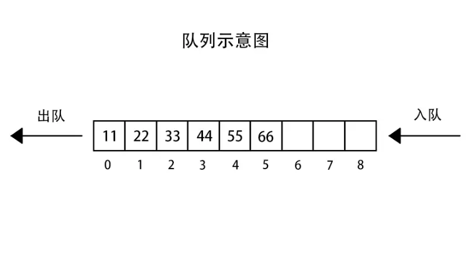
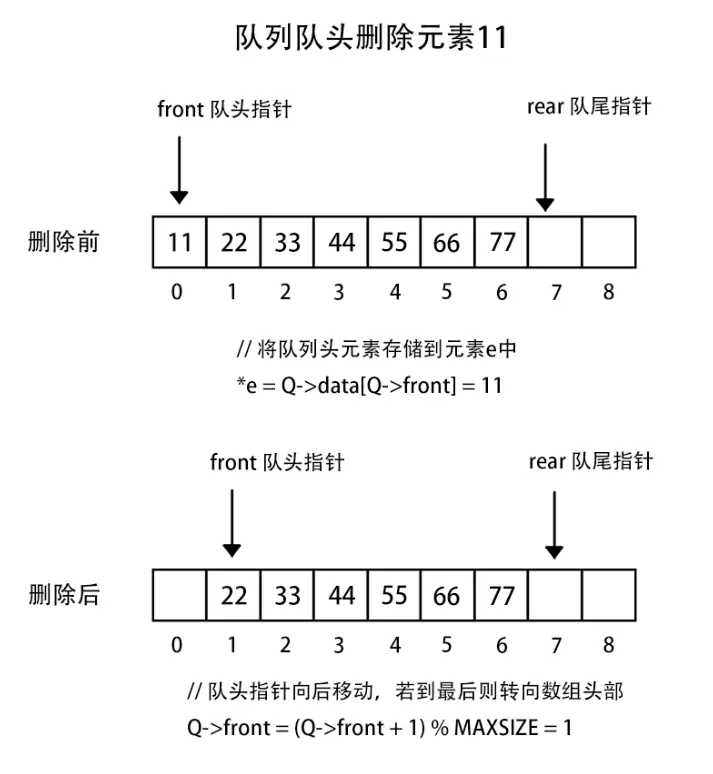

# 栈 队列 循环队列
---
## 栈
### 基本定义
- 栈是一种线性结构
- 相比较数组，栈对应的操作是数组的子集
- 只能从一端添加元素，同样只能从一端获取元素（操作的一端称之为栈顶）
- 栈是一种后进先出的一种数据结构 Last In First Out(LIFO)
> 栈操作最常见的应用就是 Undo(撤销操作)
> 程序调用的系统栈（子函数调用）

### 栈的时间复杂度
- void push(E e)    O(1)    均摊时间复杂度
- E pop()    O(1)    均摊时间复杂度
- E peek()    O(1)    
- int getSize()    O(1)
- boolean isEmpty()    O(1)

### 通过ArrayStack 构造栈 
``` java
package stack;

public interface Stack<E> {
    /**
     * 入栈
     * @param e
     */
    void push(E e);
    /**
     * 出栈
     * @return
     */
    E pop();
    /**
     * 获取栈顶元素
     * @return
     */
    E peek();
    /**
     * 是否为空
     * @return
     */
    boolean isEmpty();
    /**
     * 栈的长度
     * @return
     */
    int getSize();
}
```
``` java
package stack;
import array.Array;
public class ArrayStack<E> implements Stack<E> {

    Array<E> array = null;
    
    public ArrayStack()
    {
        array = new Array<E>();
    }

    public ArrayStack(int capacity)
    {
        array = new Array<E>(capacity);
    }

    @Override
    public void push(E e) {
        array.addLast(e);
    }

    @Override
    public E pop() {
        return array.removeLast();
    }

    @Override
    public E peek() {
        return array.getLast();
    }

    @Override
    public boolean isEmpty() {
        return array.isEmpty();
    }

    @Override
    public int getSize() {
        return array.getSize();
    }

    @Override
    public String toString() {
        StringBuffer stringBuffer = new StringBuffer();

        stringBuffer.append(String.format("Stack: size=%d capacity=%d",this.getSize(),this.getCapacity()));
        stringBuffer.append("\n");
        stringBuffer.append("Stack: [");

        for(int i=0;i<array.getSize();i++)
        {
            stringBuffer.append(i);
            if(i != array.getSize()-1)
            {
                stringBuffer.append(", ");
            }
        }
        stringBuffer.append(" ] top");
        return stringBuffer.toString();
    }
    public int getCapacity()
    {
        return array.getCapacity();
    }
}
```
### leetcode 括号匹配的问题
``` java
// 测试括号匹配
    public static boolean testStack(String str)
    {
        Stack<Character> stack = new Stack<>();

        for(int i=0;i<str.length();i++)
        {
            char c = str.charAt(i);

            if(c == '(' || c == '[' || c == '{')
            {
                stack.push(c);
            }
            else
            {
                if(stack.empty())
                {
                    return false;
                }
                Character pop = stack.pop();
                if(c == ')' && pop != '(')
                    return false;
                if(c == ']' && pop != '[')
                    return false;
                if(c == '}' && pop != '{')
                    return false;
            }
        }
        return stack.isEmpty();
    }
```
## 队列
#### 基本定义
- 队列也是一种线性结构
- 相比较数组，队列对应的操作是数组的子集
- 只能从一端（队尾）添加元素，从另一端（队首）获取元素
### 队列的时间复杂度
- void enqueue(E e)           O（1）
- E dequeue()                  O（n） 
- E getFront()                  O（1） 
- int getSize()                  O（1）
- boolean isEmpty()        O（1）
#### 源码
通过ArrayStack 构造栈

``` java
package stack;

public interface Stack<E> {

    /**
     * 入栈
     * @param e
     */
    void push(E e);

    /**
     * 出栈
     * @return
     */
    E pop();

    /**
     * 获取栈顶元素
     * @return
     */
    E peek();

    /**
     * 是否为空
     * @return
     */
    boolean isEmpty();

    /**
     * 栈的长度
     * @return
     */
    int getSize();

}

````
``` java
package stack;

import array.Array;

public class ArrayStack<E> implements Stack<E> {

    Array<E> array = null;


    public ArrayStack()
    {
        array = new Array<E>();
    }

    public ArrayStack(int capacity)
    {
        array = new Array<E>(capacity);
    }

    @Override
    public void push(E e) {
        array.addLast(e);
    }

    @Override
    public E pop() {
        return array.removeLast();
    }

    @Override
    public E peek() {
        return array.getLast();
    }

    @Override
    public boolean isEmpty() {
        return array.isEmpty();
    }

    @Override
    public int getSize() {
        return array.getSize();
    }

    @Override
    public String toString() {
        StringBuffer stringBuffer = new StringBuffer();

        stringBuffer.append(String.format("Stack: size=%d capacity=%d",this.getSize(),this.getCapacity()));
        stringBuffer.append("\n");
        stringBuffer.append("Stack: [");

        for(int i=0;i<array.getSize();i++)
        {
            stringBuffer.append(i);
            if(i != array.getSize()-1)
            {
                stringBuffer.append(", ");
            }
        }
        stringBuffer.append(" ] top");


        return stringBuffer.toString();
    }

    public int getCapacity()
    {
        return array.getCapacity();
    }
}
```
### 循环队列
> 在数组队中，如果进行 dequeue 操作，删除队首的元素，其后所有的元素都需要往前移动一个位置，因此造成这个 dequeue的时间复杂度为 O（n），解决这个方法就是使用循环队列

#### 循环队列定义
> 循环队列是在队列基础上，有意识的浪费一个capacity，使dequeue 操作的时间复杂度为O（1）





#### 循环队列LoopQueue
``` java
package queue;
import java.util.Arrays;
public class LoopQueue<E> implements Queue<E> {
    private E[] data;
    private int front,tail,size;
    public LoopQueue(int capacity)
    {
        data = (E[])new Object[capacity+1];
        this.front = 0;
        this.tail = 0;
        this.size = 0;
    }
    public LoopQueue()
    {
       this(10);
    }
    public int getCapacity()
    {
        return data.length - 1;
    }
    @Override
    public void enqueue(E e) {
        // 队列已满，tail 和 front 相差 1
        if((tail+1)% data.length == front)
        {
            resize(getCapacity() * 2);
        }
        data[tail] = e;
        tail = (tail+1)%data.length;
        size++;
    }
    @Override
    public E dequeue() {
        if(isEmpty())
        {
            throw new IllegalArgumentException("cannot dequeue from an empty queue");
        }
        E result = data[front];
        data[front] = null;
        front = (front + 1)%data.length;
        size --;
        // 出队缩容
        if(size == getCapacity()/4 && getCapacity()/2 != 0)
        {
            resize(getCapacity()/2);
        }
        return result;
    }
    @Override
    public E getFront() {
        if(isEmpty())
        {
            throw new IllegalArgumentException("cannot dequeue from an empty queue");
        }
        return data[front];
    }
    @Override
    public int getSize() {
        return this.size;
    }
    @Override
    public boolean isEmpty() {
        return front == tail;
    }
    @Override
    public String toString() {
        StringBuffer stringBuffer = new StringBuffer();
        stringBuffer.append(String.format("Queue: size=%d capacity=%d",this.getSize(),this.getCapacity()));
        stringBuffer.append("\n");
        stringBuffer.append("Queue: front [");
        for(int i=front;i != tail; i=(i+1)%data.length)
        {
            stringBuffer.append(i);
            if((i+1)%data.length != tail)
            {
                stringBuffer.append(", ");
            }
        }
        stringBuffer.append(" ] tail");
        return stringBuffer.toString();
    }
    public void resize(int newCapacity)
    {
        E[] newData = (E[])new Object[newCapacity + 1];
        for(int i=0;i<size;i++) {
            newData[i] = data[(front + 1) % data.length];
        }
        data = newData;
        front = 0;
        tail = size;
    }
    public E[] getData()
    {
        return this.data;
    }
    public static void main(String[] args) {
        LoopQueue<Integer> queue = new LoopQueue<Integer>();
        for(int i=100;i<115;i++)
        {
            queue.enqueue(Integer.valueOf(i));
            System.out.println(queue);
            if(i%3 ==2)
            {
                queue.dequeue();
                System.out.println(queue);
            }
        }
    }
}
```
#### 循环队列复杂度分析
操作 | 时间复杂度
-|-
 void enqueue(E e)|均摊 $O(1)$
 E dequeue(E e)|均摊 $O(1)$
 E getFront()|$O(1)$
 int getSize()|$O(1)$
 boolean isEmpty()|$O(1)$