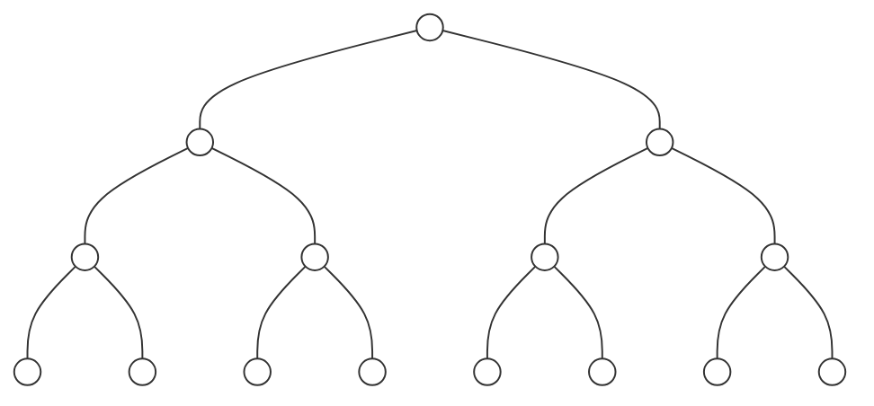
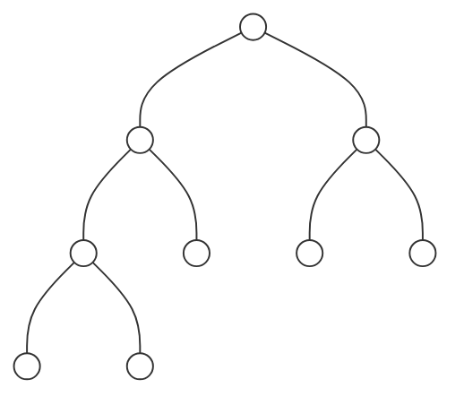
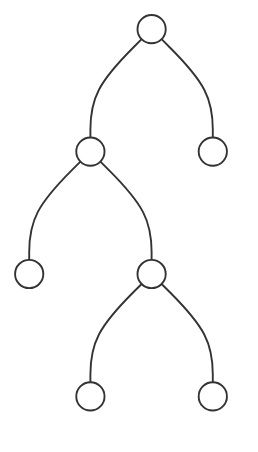
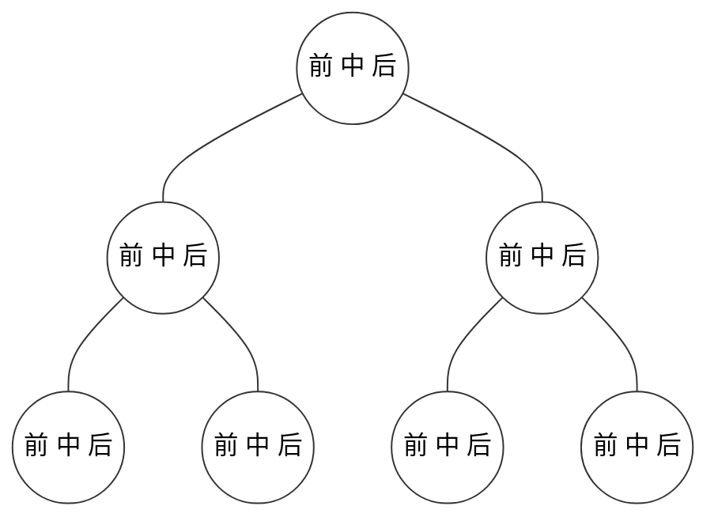
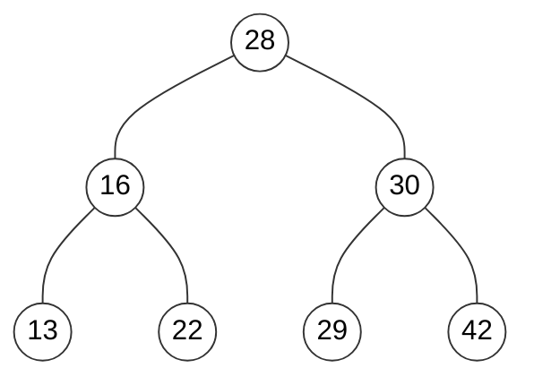
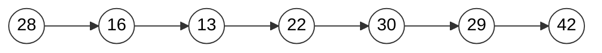
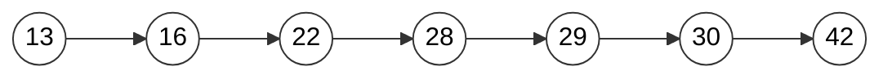
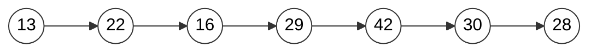

# 二分搜索树
--- 

## 树结构
### 树 的基本概念
> **树是由结点或顶点和边组成的(可能是非线性的)且不存在着任何环的一种数据结构。没有结点的树称为空(null或empty)树。一棵非空的树包括一个根结点，还(很可能)有多个附加结点，所有结点构成一个多级分层结构**
### 二叉树的性质
> **每个结点至多拥有两棵子树(即二叉树中不存在度大于2的结点)，并且，二叉树的子树有左右之分，其次序不能任意颠倒**

- 若二叉树的层次从0开始，则在二叉树的第i层至多有_2^i_个结点(i>=0)
- 高度为`k`的二叉树最多有_2^{k+1} - 1_个结点_k>=-1_(空树的高度为-1)
- 对任何一棵二叉树，如果其叶子结点(度为0)数为_m_, 度为2的结点数为_n_, 则_m=n+1_
## 二分搜索树
> 二分搜索树是基于二叉树的动态数据结构，其每个节点的值都大于其左子树的所有节点的值，每个节点的值都小于其右子树的所有节点的值,一颗子树也是二分搜索树.
> 存储的元素必须有可比较性, Java中的话就要求二分搜索树保存的数据类型要实现Comparable接口, 或者使用额外的比较器实现，一般二分搜索树不包含重复元素, 当然也可以定义包含重复元素的二分搜索树(如果想要包含重复元素的话, 只需要定义二分搜索树的左节点的值小于等于当前节点的值或右节点的值大于等于当前节点即可)

### 二叉树的分类
#### 完美二叉树

#### 完全二叉树


#### 完满二叉树

### 二叉树的分类对比
完美二叉树 |除叶子节点外的每个节点都有两个孩子节点，每一层包括最后一层的叶子节点都被完全填充
-|-
完全二叉树 |除最后一层外的其他层都被完全填充，并且所有节点保持向左对齐
完满二叉树 |除叶子节点外的每个节点都有两个孩子节点

### 二叉树常用方法实现
#### 二分搜索树添加元素
``` java
public void add_old(E e)
{
    if(root == null)
    {
        root = new Node(e);
        size ++;
    }
    else
    {
        add(root,e);
    }
}

private void add_old(Node node,E e)
{
    // 终止条件
    if(node.e.equals(e))
    {
        return;
    }
    else if(e.compareTo(node.e) < 0 && node.left == null)
    {
        node.left = new Node(e);
        size ++;
        return;
    }
    else if(e.compareTo(node.e) > 0 && node.right == null)
    {
        node.right = new Node(e);
        size ++;
        return;
    }

    // 递归实现
    if(e.compareTo(node.e) < 0)
    {
        add(node.left,e);
    }
    else
    {
        add(node.right,e);
    }
}
```
---
```java 
public void add(E e)
{
    root = add(root,e);
}

public Node add(Node node,E e)
{
    if(node == null)
    {
        size ++;
        return new Node(e);
    }

    if(e.compareTo(node.e) < 0)
    {
        node.left = add(node.left,e);
    }
    else if(e.compareTo(node.e) > 0)
    {
        node.right = add(node.right,e);
    }
    return node;
}
```
#### 遍历访问时机

> 每个节点有三次访问机会，按照前-中-后的顺序依次访问，前序遍历，中序遍历和后续遍历的本质区别是访问节点的时机不同
#### 前序遍历


> 前序遍历是一种最常用的遍历方式
```java 
public void preOrder()
{
    preOrder(root);
}


public void preOrder(Node node)
{
    // 终止条件
    if(node == null)
        return;

    // ------------------------------------
    //节点操作
    System.out.println(node.e);
    // ------------------------------------

    // 遍历节点
    preOrder(node.left);
    preOrder(node.right);
}
```
#### 中序遍历（顺序遍历）


> 由于中序遍历是先递归遍历左边，然后递归遍历右边，因此中序遍历是从左往右，小往大的顺序遍历，因此，二分搜索树又称为有序树
```java
public void inOrder()
{
    inOrder(root);
}
private void inOrder(Node node)
{
    if(node == null)
        return;

    inOrder(node.left);

    System.out.print(node.e);

    inOrder(node.right);
}   
```
#### 后序遍历


> 在某些情况下 需要首先遍历左子树和右子树，然后再访问节点进行相关的操作，比如说二分搜索树内存的释放
```java 
public void postOrder()
{
    postOrder(root);
}
private void postOrder(Node node)
{
    // 终止条件
    if(node == null)
        return;

    // 遍历左右子树
    postOrder(node.left);
    postOrder(node.right);

    // 访问节点进行相关的操作
    System.out.println(node.e);
}
```
#### 二分搜索树的前，中，后 序遍历的顺序
> 对于递归遍历二分搜索树来说，每个节点可以被访问三次，第一次到该节点的时候可以访问第一次，遍历左子数的时候访问第二次，遍历完成左子树遍历右子树的时候访问第三次，访问顺序是** 先看左，再看右，重复不做任何操作 **
#### 二分搜索树的遍历方式(前序遍历) 非递归
> 对于二分搜索树额前序遍历需要借助栈，另外需要首先压入右节点，然后压入左节点（栈的顺序是后入先出）
```java 
 public void preOrderNR()
{
    Stack<Node> stack = new Stack<Node>();
    stack.push(root);

    while(!stack.isEmpty())
    {
        Node current = stack.pop();
        System.out.println(current.e);

        if(current.right != null)
            stack.push(current.right);
        if(current.left != null)
            stack.push(current.left);
    }

}
```
#### 二分搜索树遍历
- 二分搜索树遍历的非递归遍历比递归遍历复杂
- 中序遍历和后序遍历 非递归遍历更加复杂
- 中序遍历和后序遍历 非递归遍历 应用不广
#### 二分搜索树的层序遍历
> 不同于深度优先遍历，二分搜索树的层序优先遍历是广度优先遍历，需要借助队列，由于队列是先进先出，因此先左后右
```java
public void levelOrder()
{
    Queue<Node> queue = new LinkedList<>();

    queue.add(root);

    while(!queue.isEmpty())
    {
        Node current = queue.remove();
        System.out.println(current.e);

        if(current.left != null)
            queue.add(current.left);

        if(current.right != null)
            queue.add(current.right);
    }
}
```
**广度优先遍历（层序遍历）比 深度优先遍历 更快的寻找到元素，主要用于搜索策略，而不是遍历上，通常用于算法设计，最短路径问题**
#### 删除二分搜索树的值
##### 寻找二分搜索树的 最小值 和 最大值

```java 
public E minimum()
{
    if(this.size == 0)
        throw new IllegalArgumentException("BST is Empty");

    return minimum(root).e;
}

private Node minimum(Node node)
{
    if(node.left == null)
        return node;

    return minimum(node.left);
}

public E maximum()
{
    if(this.size == 0)
        throw new IllegalArgumentException("BST is Empty");

    return maximum(root).e;
}

private Node maximum(Node node)
{
    if(node.right  == null)
        return node;

    return maximum(node.right);
}
```
##### 删除二分搜索树的最小值 和 最大值

```java 
public E removeMax()
{
    E result = maximum();

    root = removeMax(root);

    return result;
}
public Node removeMax(Node node)
{
    if(node.right == null)
    {
        Node leftNode = node.left;
        node.left = null;
        size --;
        return leftNode;
    }
    node.left = removeMax(node.right);
    return node;
}

public E removeMin()
{
    E result = minimum();

    root = removeMin(root);

    return result;
}

private Node removeMin(Node node)
{
    if(node.left == null)
    {
        Node rightNode = node.right;
        node.right = null;
        size --;
        return rightNode;
    }
    node.left = removeMin(node.left);
    return node;
}
```
#### 删除二分搜索树的任意元素

> 删除二分搜索树需要考虑三种情况，左子树为空，右子树为空，左右子树均不为空
> - 左子树为空，需要将删除节点的右子树挂接在待删除节点的位置
> - 右子树为空，需要将删除节点的左子树挂接在待删除节点的位置
> - 左右子树均不为空，待删除节点左子树保持不变，待删除节点的右子树中寻找最小值（后继节点），替换到待删除节点上面

```java 
public E minimum()
{
    if(this.size == 0)
        throw new IllegalArgumentException("BST is Empty");

    return minimum(root).e;
}

private Node minimum(Node node)
{
    if(node.left == null)
        return node;

    return minimum(node.left);
}

public E maximum()
{
    if(this.size == 0)
        throw new IllegalArgumentException("BST is Empty");

    return maximum(root).e;
}

private Node maximum(Node node)
{
    if(node.right  == null)
        return node;

    return maximum(node.right);
}

public E removeMax()
{
    E result = maximum();

    root = removeMax(root);

    return result;
}
public Node removeMax(Node node)
{
    if(node.right == null)
    {
        Node leftNode = node.left;
        node.left = null;
        size --;
        return node;
    }
    node.left = removeMax(node.right);
    return node;
}

public E removeMin()
{
    E result = minimum();

    root = removeMin(root);

    return result;
}

private Node removeMin(Node node)
{
    if(node.left == null)
    {
        Node rightNode = node.right;
        node.right = null;
        size --;
        return rightNode;
    }

    node.left = removeMin(node.left);

    return node;
}

public void remove(E e)
{
    remove(root,e);
}

private Node remove(Node node,E e)
{
    if(node == null)
        return null;

    if(e.compareTo(node.e) <0)
    {
        node.left = remove(node.left,e);
        return node;
    }
    else if(e.compareTo(node.e) >0)
    {
        node.right = remove(node.right,e);
    }

    // 待删除节点左子树为空
    if(node.left == null)
    {
        Node rightNode = node.right;
        node.right = null;
        size --;
        return rightNode;
    }

    // 待删除节点右子树为空
    if(node.right == null)
    {
        Node leftNode = node.left;
        node.left = null;
        size --;
        return leftNode;
    }

    // --------------------       后继的方式删除节点
    // 待删除节点左右元素均不为空
    // 1，查找待删除节点的后继节点，即，待删除节点右子树中的最小节点
    Node minimum = minimum(node.right);

    // 2, 用后继节点替代待删除节点
    minimum.right = removeMin(node.right);
    // 3，左子树正常
    minimum.left = node.left;

    node.left = node.right = null;

    /*
        前驱的方式删除节点

        Node maximum = maximum(node.left);
        maximum.left = removeMax(node.left);
        maximum.right = node.right;
        node.left = node.right = null;
    */

    return minimum;
}
```
### 二分搜索树完整代码
```java 
package bts;

import java.util.LinkedList;
import java.util.Queue;
import java.util.Stack;
import java.util.concurrent.ArrayBlockingQueue;
import java.util.prefs.BackingStoreException;

public class BTS<E extends Comparable<E>> {

    private Node root;
    private int size;

    public void add(E e) {
        root = add(root, e);
    }

    public Node add(Node node, E e) {
        if (node == null) {
            size++;
            return new Node(e);
        }

        if (e.compareTo(node.e) < 0) {
            node.left = add(node.left, e);
        } else if (e.compareTo(node.e) > 0) {
            node.right = add(node.right, e);
        }
        return node;
    }

    public boolean contains(E e) {
        return contains(root, e);
    }

    public boolean contains(Node node, E e) {

        if (node == null)
            return false;

        if (e.compareTo(node.e) == 0) {
            return true;
        } else if (e.compareTo(node.e) < 0) {
            return contains(node.left, e);
        } else {
            return contains(node.right, e);
        }
    }

    public void preOrder() {
        preOrder(root);
    }


    public void preOrder(Node node) {
        // 终止条件
        if (node == null)
            return;

        // ------------------------------------
        //节点操作
        System.out.println(node.e);
        // ------------------------------------

        // 遍历节点
        preOrder(node.left);
        preOrder(node.right);
    }

    public void preOrderNR() {
        Stack<Node> stack = new Stack<Node>();
        stack.push(root);

        while (!stack.isEmpty()) {
            Node current = stack.pop();
            System.out.println(current.e);

            if (current.right != null)
                stack.push(current.right);
            if (current.left != null)
                stack.push(current.left);
        }

    }

    public void inOrder() {
        inOrder(root);
    }

    private void inOrder(Node node) {
        if (node == null)
            return;

        inOrder(node.left);

        System.out.println(node.e);

        inOrder(node.right);
    }

    public void postOrder() {
        postOrder(root);
    }

    private void postOrder(Node node) {
        // 终止条件
        if (node == null)
            return;

        // 遍历左右子树
        postOrder(node.left);
        postOrder(node.right);

        // 访问节点进行相关的操作
        System.out.println(node.e);
    }

    public void levelOrder() {
        Queue<Node> queue = new LinkedList<>();

        queue.add(root);

        while (!queue.isEmpty()) {
            Node current = queue.remove();
            System.out.println(current.e);

            if (current.left != null)
                queue.add(current.left);

            if (current.right != null)
                queue.add(current.right);
        }
    }

    public E minimum()
    {
        if(this.size == 0)
            throw new IllegalArgumentException("BST is Empty");

        return minimum(root).e;
    }

    private Node minimum(Node node)
    {
        if(node.left == null)
            return node;

        return minimum(node.left);
    }

    public E maximum()
    {
        if(this.size == 0)
            throw new IllegalArgumentException("BST is Empty");

        return maximum(root).e;
    }

    private Node maximum(Node node)
    {
        if(node.right  == null)
            return node;

        return maximum(node.right);
    }

    public E removeMax()
    {
        E result = maximum();

        root = removeMax(root);

        return result;
    }
    public Node removeMax(Node node)
    {
        if(node.right == null)
        {
            Node leftNode = node.left;
            node.left = null;
            size --;
            return leftNode;
        }
        node.left = removeMax(node.right);
        return node;
    }

    public E removeMin()
    {
        E result = minimum();

        root = removeMin(root);

        return result;
    }

    private Node removeMin(Node node)
    {
        if(node.left == null)
        {
            Node rightNode = node.right;
            node.right = null;
            size --;
            return rightNode;
        }

        node.left = removeMin(node.left);

        return node;
    }

    public void remove(E e)
    {
        remove(root,e);
    }

    private Node remove(Node node,E e)
    {
        if(node == null)
            return null;

        if(e.compareTo(node.e) <0)
        {
            node.left = remove(node.left,e);
            return node;
        }
        else if(e.compareTo(node.e) >0)
        {
            node.right = remove(node.right,e);
        }

        // 待删除节点左子树为空
        if(node.left == null)
        {
            Node rightNode = node.right;
            node.right = null;
            size --;
            return rightNode;
        }

        // 待删除节点右子树为空
        if(node.right == null)
        {
            Node leftNode = node.left;
            node.left = null;
            size --;
            return leftNode;
        }

        // --------------------       后继的方式删除节点
        // 待删除节点左右元素均不为空
        // 1，查找待删除节点的后继节点，即，待删除节点右子树中的最小节点
        Node minimum = minimum(node.right);

        // 2, 用后继节点替代待删除节点
        minimum.right = removeMin(node.right);
        // 3，左子树正常
        minimum.left = node.left;

        node.left = node.right = null;

        /*
            前驱的方式删除节点

            Node maximum = maximum(node.left);
            maximum.left = removeMax(node.left);
            maximum.right = node.right;
            node.left = node.right = null;
        */
        return minimum;
    }


    public void add_old(E e)
    {
        if(root == null)
        {
            root = new Node(e);
            size ++;
        }
        else
        {
            add(root,e);
        }
    }

    private void add_old(Node node,E e)
    {
        // 终止条件
        if(node.e.equals(e))
        {
            return;
        }
        else if(e.compareTo(node.e) < 0 && node.left == null)
        {
            node.left = new Node(e);
            size ++;
            return;
        }
        else if(e.compareTo(node.e) > 0 && node.right == null)
        {
            node.right = new Node(e);
            size ++;
            return;
        }

        // 递归实现
        if(e.compareTo(node.e) < 0)
        {
            add(node.left,e);
        }
        else
        {
            add(node.right,e);
        }
    }

    public int getSize()
    {
        return this.size;
    }

    public boolean isEmpty()
    {
        return size == 0;
    }

    public class Node
    {
        public E e;
        public BTS.Node left;
        public Node right;

        Node(E e)
        {
            this.e = e;
            this.left = null;
            this.right = null;
        }
    }
}
```


