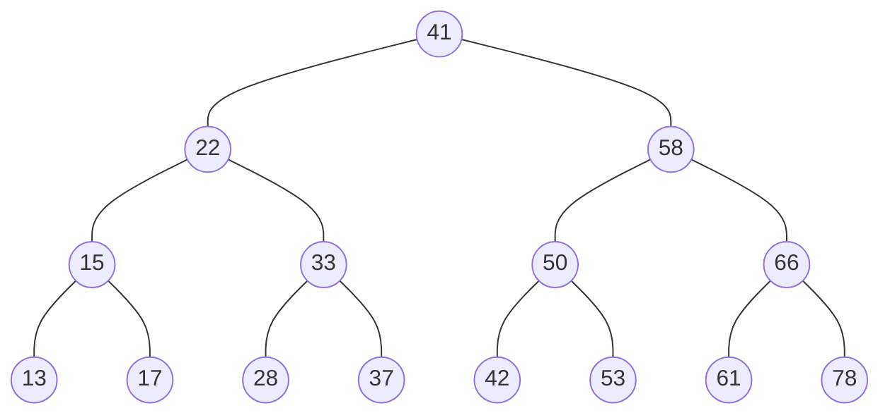

# 集合和映射
---
## 集合
### 概念
> - 集合通常是由一组无序的, 不能重复的元素构成.
>   - 和数学中的集合名词比较相似, 但是数学中的集合范围更大一些, 也允许集合中的元素重复.
>   - 在计算机中, 集合通常表示的结构中元素是不允许重复的.
> - 看成一种特殊的数组
>   - 其实集合你可以将它看成一种特殊的数组.
>   - 特殊之处在于里面的元素没有顺序, 也不能重复.
>   - 没有顺序意味着不能通过下标值进行访问, 不能重复意味着相同的对象在集合中只会存在一份.
> - 由于集合的无重复性，因此二分搜索树是适合集合的底层数据结构

### 接口定义

```java 
    Set<E> 
        void add(E e);  // 不能添加重复元素
        void remove(E e);
        boolean contains(E e);
        int getSize();
        boolean isEmpty();
```
### 基于二分搜索树的集合

```java
package set;

public class BTSSet<E extends Comparable<E>> implements Set<E> {
    Node root;
    int size;
    @Override
    public void add(E e) {

        if (root == null)
            root = new Node(e);
        else {
            add(root, e);
        }
    }

    private Node add(Node node, E e) {
        if (node == null) {
            size++;
            return new Node(e);
        }
        if (e.compareTo(node.e) < 0)
            node.left = add(node.left, e);
        else if (e.compareTo(node.e) > 0)
            node.right = add(node.right, e);

        return node;
    }

    @Override
    public void remove(E e) {
        Node remove = remove(root, e);
    }

    public Node remove(Node node, E e) {
        if (node == null)
            return null;

        if (e.compareTo(node.e) < 0) {
            node.left = remove(node.left, e);
            return node;
        }
        else if (e.compareTo(node.e) > 0) {
            node.right = remove(node.right, e);
            return node;
        }

        if (node.left == null) {
            Node nodeRight = node.right;
            node.right = null;
            size--;
            return nodeRight;
        }
        if (node.right == null) {
            Node nodeLeft = node.left;
            node.left = null;
            size--;
            return nodeLeft;
        }

        Node minNode = getMin(node.right);
        minNode.right = removeMin(node.right);
        minNode.left = node.left;

        node.left = node.right = null;
        return minNode;
    }

    private Node removeMax() {
        return removeMax(root);
    }

    private Node removeMax(Node node) {

        if (node.right == null) {
            Node nodeLeft = node.left;
            node.left = null;
            size--;
            return nodeLeft;
        }

        node.right = removeMax(node.right);

        return node;
    }

    private Node removeMin() {
        return removeMin(root);
    }

    private Node removeMin(Node node) {
        if (node.left == null) {
            Node nodeRight = node.right;
            node.right = null;
            size--;
            return nodeRight;
        }

        node.left = removeMin(node.left);
        return node;
    }

    private Node getMax() {
        return getMax(root);
    }

    private Node getMax(Node node) {
        if (node.right == null)
            return node;

        return getMax(node.right);

    }

    private Node getMin() {
        return getMin(root);
    }

    private Node getMin(Node node) {
        if (node.left == null)
            return node;

        return getMin(node.left);
    }

    public void inOrder() {
        inOrder(root);
    }

    public void inOrder(Node node) {
        if (node == null)
            return;

        inOrder(node.left);
        System.out.println(node.e);
        inOrder(node.right);
    }


    @Override
    public boolean contains(E e) {
        return contains(root, e);
    }

    private boolean contains(Node node, E e) {
        if (node == null)
            return false;

        if (node.e.compareTo(e) == 0)
            return true;
        else if (e.compareTo(e) < 0)
            return contains(node.left, e);
        else
            return contains(node.right, e);
    }

    @Override
    public int getSize() {
        return size;
    }

    @Override
    public boolean isEmpty() {
        return size == 0;
    }

    public class Node {
        public E e;
        public Node left;
        public Node right;

        Node(E e) {
            this.e = e;
            this.left = null;
            this.right = null;
        }
    }

    public static void main(String[] args) {
        BTSSet<Integer> set = new BTSSet<>();

        int[] arr = new int[]{41, 22, 58, 15, 33, 50, 63, 13, 37, 42, 53};
        for (int i = 0; i < arr.length; i++) {
            set.add(arr[i]);
        }
        set.inOrder();
        set.removeMax();
        System.out.println("---");
        set.inOrder();
        System.out.println("---");
        set.removeMin();
        set.inOrder();
        System.out.println("---");
        set.remove(33);
        set.inOrder();


    }

}

```

### 基于链表的集合

```java 
package set;

import java.util.Random;

public class LinkedListSet<E extends Comparable<E>> implements Set<E> {

    private Node root;

    private int size;

    @Override
    public void add(E e) {
        if(root == null)
        {
            size++;
            root = new Node(e);
        }
        else
        {
            if(!contains(e))
            {
                add(root,e);
            }
        }

    }

    private Node add(Node node,E e)
    {
        if(node == null)
        {
            size++;
            return new Node(e);
        }
        node.next = add(node.next,e);
        return node;
    }

    @Override
    public void remove(E e) {
        if(contains(e))
        {
            remove(root,e);
        }
    }

    public Node remove(Node node,E e)
    {
        if(e.compareTo(node.e) == 0)
        {
            size --;
            return node.next;
        }
        node.next =remove(node.next,e);
        return node;
    }

    @Override
    public boolean contains(E e) {
        if(root == null)
            return false;
        return contains(root,e);
    }

    private boolean contains(Node node,E e)
    {
        if(node == null)
            return false;
        if(node.e.compareTo(e) == 0)
            return true;
        else
            return contains(node.next, e);

    }

    @Override
    public int getSize() {
        return size;
    }

    @Override
    public boolean isEmpty() {
        return size == 0;
    }

    private class Node
    {
        public E e;
        public Node next;

        public Node(E e, Node next)
        {
            this.e = e;
            this.next = next;
        }

        public Node(E e)
        {
            this(e,null);
        }

        public Node()
        {
            this(null,null);
        }

        @Override
        public String toString() {
            return String.valueOf(e) ;
        }
    }

    @Override
    public String toString() {
        StringBuffer buffer = new StringBuffer();

        buffer.append("size="+size+"\n");
        buffer.append("front ");

        Node current = root;

        while(current != null)
        {
            buffer.append(current.e);

            if(current.next != null)
                buffer.append("=>");

            current = current.next;
        }

        buffer.append(" tail");
        return buffer.toString();
    }

    public static void main(String[] args) {
        LinkedListSet<Integer> set = new LinkedListSet<>();
        Random random = new Random();

        for(int i=0;i<15;i++)
        {
            set.add(i%5);
        }

        System.out.println(set);
        System.out.println("--");
        set.remove(3);
        System.out.println(set);
    }
}

```

### 集合的时间复杂度分析


**_h_ 和 _n_ 关系**

> 假设二叉树的每一层都是满的，因此，_h-1_层=_2^{h-1}_
> _2^0+2^1+2^2+2^3+2^4+2^5+2^h-1_，如果一个满二叉树，他的层数有h层，则一共有_2^{h-1}_个节点
> 因此 _h=log_2(n+1)_,通常 h 和 n的关系称之为_O(log_2n)_(_O(logn)_)

-|LinkedLstSet|BSTSet| BSTSet平均时间复杂度| BSTSet最差的情况
-|-|-|-|-
添加操作  add| _O(n)_| _O(h)_|_O(logn)_ | _O(n)_
查询操作  contains |_O(n)_| _O(h)_|_O(logn)_ | _O(n)_
删除操作  remove |_O(n)_| _O(h)_|_O(logn)_ | _O(n)_

> 在顺序插入的情况下，二分搜索树有可能退化成链接，他的层数和节点次数相同

**有序集合和无序集合**
> 有序集合中的元素具有顺序性，基于二分搜索树实现
> 无序集合中的元素顺序与插入元素顺序相同（基于链表实现的二分搜索树没有顺序性）


## 映射
>Map数据结构类似于对象，也是键值对的集合，但是“键”的范围不限于字符串，各种类型的值（包括对象）都可以当作键。也就是说，Object 结构提供了“字符串—值”的对应，Map 结构提供了“值—值”的对应，是一种更完善的 Hash 结构实现。

### 接口
```java
public interface Map<K,V> {
    void add(K key,V value);
    V remove(K key);
    boolean contains(K key);
    V get(K key);
    void set(K key,V value);

    int getSize();
    boolean isEmpty();
}
```
### 基于链表实现Map
```java
package map;

public class LinkedListMap<K,V> implements Map<K,V> {

    private Node dummyHead;
    private int size;

    LinkedListMap()
    {
        this.dummyHead = new Node();
        this.size = 0;
    }

    @Override
    public void add(K key, V value) {
        Node node = getNode(key);
        if(node == null)
        {
            size ++;
            dummyHead.next = new Node(key,value,dummyHead.next);
        }
        else
        {
            node.value = value;
        }
    }

    @Override
    public V remove(K key) {

        Node prev = dummyHead;

        while(prev.next != null)
        {

            if(prev.next.key.equals(key))
                break;
            prev = prev.next;
        }

        if(prev.next != null)
        {
            Node deleteNode = prev.next;
            prev.next = deleteNode.next;
            deleteNode.next = null;
            size--;
            return deleteNode.value;
        }
        return null;
    }

    @Override
    public boolean contains(K key) {
       return getNode(key) != null;
    }

    @Override
    public V get(K key) {
        Node node = getNode(key);
        return node == null?null:node.value;
    }

    @Override
    public void set(K key, V value) {
        Node node = getNode(key);
        if(node == null)
        {
           throw new IllegalArgumentException("key 不存在");
        }
        else
        {
            node.value = value;
        }
    }

    @Override
    public int getSize() {
        return getSize();
    }

    @Override
    public boolean isEmpty() {
        return this.size == 0;
    }

    private Node getNode(K key)
    {
        Node current = dummyHead.next;
        while(current != null)
        {
            if(current.key.equals(key))
            {
                return current;
            }
            current = current.next;
        }
        return null;
    }

    private class Node
    {
        public K key;
        public V value;
        public Node next;
        Node()
        {
            this(null,null,null);
        }
        Node(K key)
        {
            this(key,null,null);
        }
        Node(K key,V value,Node next)
        {
            this.key = key;
            this.value = value;
            this.next = next;
        }
    }

    @Override
    public String toString() {
        StringBuffer buffer = new StringBuffer();
        buffer.append("front \n");
        Node current = dummyHead.next;
        while(current != null)
        {
            buffer.append("key="+current.key +" -- "+"value="+current.value);
            buffer.append("\n");
            current = current.next;
        }
        return buffer.toString();
    }

    public static void main(String[] args) {
        LinkedListMap<Character, Integer> map = new LinkedListMap<Character, Integer>();

        long start = System.nanoTime();

        char[] chars = new char[100000000];
        for(int i=0;i<100000000;i++)
        {
            chars[i] = (char)(Math.random()*26+'A');
        }
        long end = System.nanoTime();

        for(char item:chars)
        {
            if(map.contains(item))
            {
                Integer count = map.get(item);
                map.set(item,count+1);
            }
            else
            {
                map.add(item,1);
            }
        }

        System.out.println(map);
        System.out.println(end - start);

    }
}
```
### 基于二分搜索树的Map
```java
package map;

public class BSTMap<K extends Comparable<K>, V> implements Map<K, V> {

    private Node root;
    private int size;

    BSTMap() {
        root = null;
        size = 0;
    }

    @Override
    public void add(K key, V value) {
        add(root, key, value);
    }

    public Node add(Node node, K key, V value) {
        if (node == null) {
            size++;
            return new Node(key, value);
        }

        if (key.compareTo(node.key) > 0)
            node.right = add(node.right, key, value);
        else if (key.compareTo(node.key) < 0)
            node.left = add(node.left, key, value);
        else
            node.value = value;

        return node;
    }


    @Override
    public V remove(K key) {
        Node node = getNode(root, key);
        if (node != null) {
            root = remove(root, key);
            return node.value;
        }

        return null;
    }

    private Node remove(Node node, K key) {
        if (node == null)
            return null;

        if (key.compareTo(node.key) > 0) {
            node.right = remove(node.right, key);
            return node;
        } else if (key.compareTo(node.key) < 0) {
            node.left = remove(node.left, key);
            return node;
        } else {
            if (node.left == null) {
                Node rightNode = node.right;
                node.right = null;
                size--;
                return rightNode;
            }

            if (node.right == null) {
                Node leftNode = node.left;
                node.left = null;
                size--;
                return leftNode;
            }
            // 两者均不为空的情况下
            Node min = getMin(root.right);

            min.right = remove(root.right, key);
            min.left = node.left;

            node.left = node.right = null;

            return min;
        }

    }

    @Override
    public boolean contains(K key) {
        Node node = getNode(root, key);
        return node != null;
    }

    @Override
    public V get(K key) {
        Node node = getNode(root, key);
        return node == null ? null : node.value;
    }

    @Override
    public void set(K key, V value) {
        Node node = getNode(root, key);
        if (node == null)
            throw new IllegalArgumentException("key doesn't exist");
        else
            node.value = value;
    }


    @Override
    public int getSize() {
        return size;
    }

    @Override
    public boolean isEmpty() {
        return size == 0;
    }


    private Node getMin(Node node) {
        if (node.left == null)
            return node;

        return getMin(node.left);
    }

    private Node removeMin(Node node) {
        if (node.left == null) {
            Node rightNode = node.right;
            node.right = null;
            size--;
            return rightNode;
        }
        node.left = removeMin(node.left);
        return node;
    }

    private Node getNode(Node node, K key) {
        if (node == null)
            return null;

        if (key.compareTo(node.key) > 0)
            return getNode(node.right, key);
        else if (key.compareTo(node.key) < 0)
            return getNode(node.left, key);
        else
            return node;
    }

    private class Node {
        public K key;
        public V value;

        public Node left;
        public Node right;

        public Node(K key, V value) {
            this.key = key;
            this.value = value;
            this.left = null;
            this.right = null;
        }
    }

    public static void main(String[] args) {
        BSTMap<Character, Integer> map = new BSTMap<>();
        long start = System.nanoTime();

        char[] chars = new char[100000000];
        for(int i=0;i<100000000;i++)
        {
            chars[i] = (char)(Math.random()*26+'A');
        }
        long end = System.nanoTime();

        for(char item:chars)
        {
            if(map.contains(item))
            {
                Integer count = map.get(item);
                map.set(item,count+1);
            }
            else
            {
                map.add(item,1);
            }
        }
    }
}

```
### 映射的时间复杂度分析
-|LinkedListMap|BSTMap|BSTMAP平均时间复杂度|BSTMAP最差时间复杂度
-|-|-|-|-
增加 add| _O(n)_| _O(h)_|_O(logn)_ | _O(n)_
删除 remove| _O(n)_| _O(h)_|_O(logn)_ | _O(n)_
修改 set| _O(n)_| _O(h)_|_O(logn)_ | _O(n)_
查询 get| _O(n)_| _O(h)_|_O(logn)_ | _O(n)_
查询 contains| _O(n)_| _O(h)_|_O(logn)_ | _O(n)_
