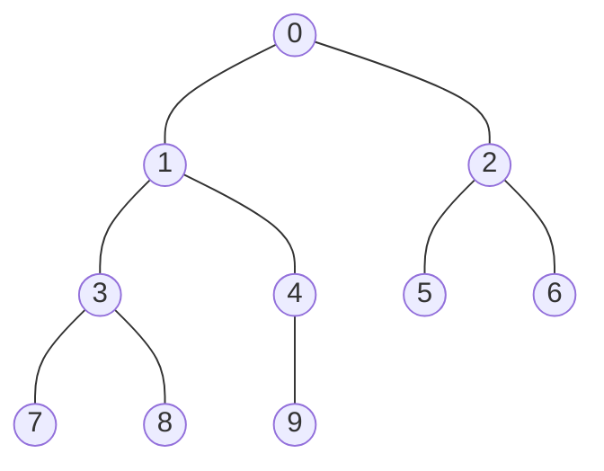
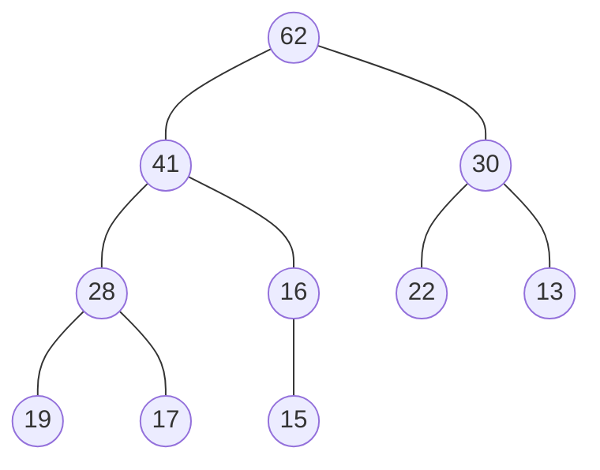
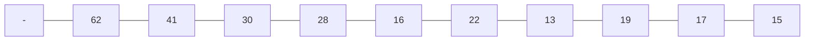

# 优先队列 和 堆
---
## 优先队列
>普通的队列是一种先进先出的数据结构，元素在队列尾追加，而从队列头删除。在优先队列中，元素被赋予优先级。当访问元素时，具有最高优先级的元素最先删除。优先队列具有最高级先出 （largest-in，first-out）的行为特征。


-|入队|出队
-|-|-
普通线性结构 | _O(1)_ |_O(n)_
顺序线性结构 | _O(n)_ | _O(1)_
堆| _O(logn)_|_O(logn)_

### 完全二叉树
> 对于满二叉树来说，每一层存放的叶子节点数量是固定的，处理叶子节点外的所有节点均存在左右孩子，但是对于完全二叉树来说，叶子节点上层的节点均是满的，而叶子层是从左向右依次存放元素，确实的节点是在叶子节点层的右边



### 二叉堆的特性
    - 二叉堆是一个平衡二叉树，所有叶子节点层次相差不大于1
    - 堆中的某个节点总是不大于其父节点的值(最大堆，根节点为最大值)
    - 堆中的某个节点总是不小于其父节点的值(最小堆，根节点为最小值)
    - 节点大小和所在的层次没有任何关系

**最大堆**


>使用数组存储二叉堆，可以很容易的根据当前元素的下标获取到父节点下标，左孩子下标，右孩子下标
-   parent = _i/2_
-   left child = _2*i_
-   right child = _2*i+1_

> 由于index=0空出，方便计算，但是如果不空出来，同样可以，
- parent = _(i-1)/2_
- left child = _(2*i)+1_
- right child = _(2*i)+2_

### 二叉堆插入元素(shift up)
> shift up :从数组角度来看是在数组的末尾插入元素，不过 插入的元素需要调整位置，以达到满足二叉堆的性质（堆中的某个节点总是不大于其父节点的值）,因此需要与其父节点相比较，如果大于父节点，需要与父节点交换位置，一次这个操作称之为 shift up，堆中元素的上浮

```java
// Array
public void swap(int i,int j)
    {
        if(i<0 || i>= size || j<0 || j>= size)
        {
            throw new IllegalArgumentException("index is error");
        }

        E t = data[i];
        data[i] = data[j];
        data[j] = t;
    }
// MaxHeap
public void add(E e)
{
    data.addLast(e);
    siftUp(data.getSize() -1);
}

private void siftUp(int k)
{
    // k 必须大于0，另外 parent(k)的值必须大于当前的k的值，如果不大于，则交换k和parent(k)的值，直到满足条件
    while(k > 0 && data.get(parent(k)).compareTo(data.get(k)) < 0)
    {
        data.swap(k,parent(k));
        k = parent(k);
    }
}
```
### 二叉堆取出元素(shift down)
> 从二叉堆中取出元素，只能取出最大值或最小值，即index=0的元素，另外在取出元素之后，需要维护二叉堆的性质（堆中的某个节点总是不大于其父节点的值）
-需要将最后一个元素移动到index= 0的位置，然后进行shift down操作，父节点与左右孩子相比较，如果大于左右孩子则，位置正确，如果小于左右孩子，则 与 左右孩子中值最大的孩子相交换位置，直到满足条件，这个过程称之为元素的下浮过程，shift down
```java
 public E extractMax()
{
    E max = findMax();

    data.swap(0,data.getSize()-1);
    data.removeLast();

    siftDown(0);
    return max;
}

private void siftDown(int k)
{
    while(leftChild(k) < data.getSize())
    {
        // 首先 j 存储的是左孩子
        int j = leftChild(k);

        // 左孩子的值大于右孩子的值，则 j = 右孩子的值
        if(j+1<data.getSize() && data.get(j+1).compareTo(data.get(j)) > 0)
        {
            j = rightChild(k);
        }

        // 如果 左右孩子节点 小于等于 父亲节点 则 break 循环
        if(data.get(k).compareTo(data.get(j))>=0)
        {
            break;
        }

        // 如果 左右孩子节点 大于 父亲节点，则交换元素，k=j 开始下一轮循环
        data.swap(k,j);
        k = j;
    }

}
```
**堆的add 和 extractMax操作均是 _O(logn)_(_0(h)_)级别的操作，并且永远不会退化成链表**

### replace 和 heapify
#### replace
> 取出最大元素，放入一个新的元素
> 实现：可以先 extractMax，然后再进行一个add操作，两次_O(logn)_
> 实现：可以直接将堆顶元素替换以后，进行 shift down操作，一次 _O(logn)_

```java
public E replace(E e)
{
    E max = findMax();

    data.set(0,e);
    siftDown(0);

    return max;
}
```
#### heapify
> 讲任意数组整理成堆的形状
> 从最后一个**非叶子**节点不断进行 shift Down
>**最后一个非叶子节点的索引为 最后一个节点的parent**

- 将n各元素不断的插入到一个空的最大堆，算法复杂度是_O(nlogn)_
- heapify 的过程,算法复杂度为 _O(n)_

```java
public MaxHeap(E[] arr)
{
    data = new Array<E>(arr);
    for(int i=(parent(data.getSize() -1));i>=0;i--)
    {
        siftDown(i);
    }
}
```
### 二叉堆源码

```java
package Heap;

import array.Array;

import java.util.Random;

public class MaxHeap<E extends Comparable<E>> {

    Array<E> data = new Array<E>();

    public MaxHeap(int capacity) {
        data = new Array<>(capacity);
    }

    public MaxHeap(E[] arr)
    {
        data = new Array<E>(arr);
        for(int i=(parent(data.getSize() -1));i>=0;i--)
        {
            siftDown(i);
        }
    }

    public MaxHeap() {
        data = new Array<>();
    }

    public int getSize()
    {
        return this.getSize();
    }

    public boolean isEmpty()
    {
        return this.data.isEmpty();
    }

    private int parent(int index)
    {
        if(index == 0)
            throw new RuntimeException("index 0 is not have parent");

        return (index-1)/2;
    }

    private int leftChild(int index)
    {
        return 2*index + 1;
    }

    private int rightChild(int index)
    {
        return 2*index + 2;
    }

    /**
     * Shift Up(堆中元素的上浮)
     * @param e
     */
    public void add(E e)
    {
        data.addLast(e);
        siftUp(data.getSize() -1);
    }

    private void siftUp(int k)
    {
        // k 必须大于0，另外 parent(k)的值必须大于当前的k的值，如果不大于，则交换k和parent(k)的值，直到满足条件
        while(k > 0 && data.get(parent(k)).compareTo(data.get(k)) < 0)
        {
            data.swap(k,parent(k));
            k = parent(k);
        }
    }

    public E findMax()
    {
        if(data.getSize() == 0)
            throw new IllegalArgumentException("heap is empty");

        return data.get(0);
    }

    public E extractMax()
    {
        E max = findMax();

        data.swap(0,data.getSize()-1);
        data.removeLast();

        siftDown(0);
        return max;
    }

    public E replace(E e)
    {
        E max = findMax();

        data.set(0,e);
        siftDown(0);

        return max;
    }

    private void siftDown(int k)
    {
        while(leftChild(k) < data.getSize())
        {
            // 首先 j 存储的是左孩子
            int j = leftChild(k);

            // 左孩子的值大于右孩子的值，则 j = 右孩子的值
            if(j+1<data.getSize() && data.get(j+1).compareTo(data.get(j)) > 0)
            {
                j = rightChild(k);
            }

            // 如果 左右孩子节点 小于等于 父亲节点 则 break 循环
            if(data.get(k).compareTo(data.get(j))>=0)
            {
                break;
            }

            // 如果 左右孩子节点 大于 父亲节点，则交换元素，k=j 开始下一轮循环
            data.swap(k,j);
            k = j;
        }

    }

    private static void testMaxHeap(Integer[] testData,boolean isHeapify)
    {
        long start = System.nanoTime();
        MaxHeap<Integer> maxHeap;
        if(isHeapify)
        {
            maxHeap = new MaxHeap<>(testData);
        }
        else
        {
            maxHeap = new MaxHeap<>();

            for(int i=0;i<testData.length;i++)
            {
                maxHeap.add(testData[i]);
            }
        }

        int[] arr= new int[testData.length];
        for(int i=0;i<testData.length;i++)
        {
            arr[i] = maxHeap.extractMax();
        }

        for(int i=1;i<testData.length;i++)
        {
            if(arr[i-1] < arr[i])
            {
                throw new RuntimeException("error");
            }
        }
        long end = System.nanoTime();

        System.out.println("用时 ："+((end - start)/1000000000.0));
    }

    public static void main(String[] args) {
        int n = 10000000;

        Integer[] arr = new Integer[n];
        Random random = new Random();

        for(int i=0;i<n;i++)
        {
            arr[i] = random.nextInt(Integer.MAX_VALUE);
        }

        System.out.println("循环添加");
        testMaxHeap(arr,false);
        System.out.println("heapify");
        testMaxHeap(arr,true);

        System.out.println("success");
    }
}

```
### 基于二叉堆实现的 优先队列
```java
package queue;

import Heap.MaxHeap;

public class PriorityQueue<E extends Comparable<E>> implements Queue<E> {

    private MaxHeap<E> maxHeap = new MaxHeap<>();

    @Override
    public void enqueue(E e) {
        maxHeap.add(e);
    }

    @Override
    public E dequeue() {
        return  maxHeap.extractMax();
    }

    @Override
    public E getFront() {
        return maxHeap.findMax();
    }

    @Override
    public int getSize() {
        return maxHeap.getSize();
    }

    @Override
    public boolean isEmpty() {
        return maxHeap.isEmpty();
    }
}
```
### java.lang.uitl 优先队列实例

```java
// 主要是方法名的不同 和 比较器
 public List<Integer> topKFrequent(int[] nums, int k) {

    TreeMap<Integer,Integer> map = new TreeMap<Integer,Integer>();
    for(int item:nums)
    {
        if(map.containsKey(item))
            map.put(item,map.get(item)+1);
        else
            map.put(item,1);
    }
    PriorityQueue<Integer> pq = new PriorityQueue<Integer>(new Comparator<Integer>() {
        @Override
        public int compare(Integer a, Integer b) {
            return map.get(a) - map.get(b);
        }
    });
    for(int key:map.keySet())
    {
        if(pq.size() < k)
        {
            pq.add(key);
        }
        else if(map.get(key) > map.get(pq.peek()))
        {
            pq.remove();
            pq.add(key);
        }
    }
    ArrayList<Integer> result =  new ArrayList<Integer>();
    while(!pq.isEmpty())
    {
        result.add(pq.remove());
    }

    return result;
}
```


