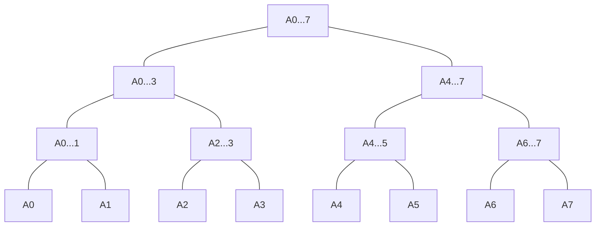
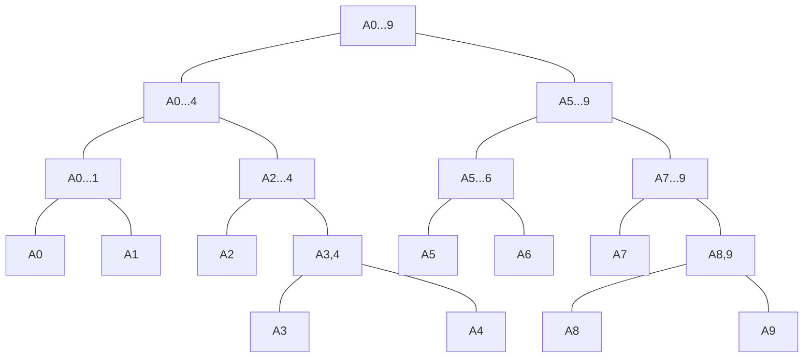

# 线段树
## 线段树的使用场景
> 最经典的线段树问题 区间染色
> 在一面墙中，每次选择一段区间进行染色，后者会覆盖前者，在m次操作后，整面墙可以看到多少种颜色?在m次操作后，[i,j]可以看到多少种颜色?
> 可以使用 数组的方式来解决，但是时间复杂度太差

-|使用数组实现|使用线段树实现
-|-|-
染色操作(更新区间)|_O(n)_|_O(logn)_
查询操作(查找区间)|_O(n)_|_O(logn)_

### 线段树 
>线段树是一种二叉搜索树，与区间树相似，它将一个区间划分成一些单元区间，每个单元区间对应线段树中的一个叶结点

>线段树不一定是完全二叉树或者不一定是满二叉树，但是 线段树是一个平衡二叉树

>整颗平衡二叉树不会退化成链表，整棵树的高度和节点之间的关系是_log_的关系

> 对于满二叉树而言，h层，一共有 _2^{h-1}_ 个节点，大约是 _2^h_ ,最后一层 _(h-1)_层有 _2^{h-1}_ 个节点，最后一层的节点数大致等于前面所有层节点之和

> 如果有_n_个元素需要存储，数组表示需要至少需要 _4n_ 的空间来存储线段树(线段树不考虑添加元素，即区间固定，使用_4n_的静态空间即可)，不过线段树不是二叉树，因此在最坏的情况下_n = 2^n+1_的，需要浪费近乎一半的空间




#### 线段树添加元素
```java 
private E[] tree;

    private E[] data;

    private Merger<E> merger;

    SegmentTree2(E[] arr,Merger<E> merger)
    {
        this.merger = merger;

        data = (E[])new Object[arr.length];

        for(int i=0;i<arr.length;i++)
        {
            data[i] = arr[i];
        }

        tree = (E[]) new Object[arr.length*4];

        buildSegmentTree(0,0,data.length-1);
    }

    public E[] getTree()
    {
        return tree;
    }

    private void buildSegmentTree(int treeIndex,int l,int r)
    {
        // 如果是叶子节点 字
        if(l == r)
        {
            tree[treeIndex] = data[l];
            return;
        }
        
        int mid = l + (r -l)/2;

        int leftTreeIndex = left(treeIndex);
        int rightTreeIndex = right(treeIndex);

        buildSegmentTree(leftTreeIndex,l,mid);
        buildSegmentTree(rightTreeIndex,mid+1,r);

        tree[treeIndex] = merger.merge(tree[leftTreeIndex],tree[rightTreeIndex]);
    }


    private int parent(int index)
    {
        return (index-1)/2;
    }

    private int left(int index)
    {
        return index*2 + 1;
    }

    private int right(int index)
    {
        return index*2 + 2;
    }
}
```
#### 修改
```java
public void set(int index,E e)
    {
        if(index<0 || index>data.length)
        {
            data[index] = e;
            set(0,0,data.length-1,index,e);
        }
    }

    // 在TreeIndex 的线段树中更新index的值为E
    public void set(int treeIndex,int l,int r,int index,E e)
    {
        // 叶子
        if(l == r)
        {
            tree[treeIndex] = e;
            return;
        }

        int mid = l +(r-l)/2;
        int leftTreeIndex = leftChild(treeIndex);
        int rightTreeIndex = rightChild(treeIndex);

        if(index >= mid+1)
        {
            set(rightTreeIndex,mid+1,r,index,e);
        }
        else// index <= mid
        {
            set(leftTreeIndex,l,mid,index,e);
        }
        tree[treeIndex] = merger.merge(tree[leftTreeIndex],tree[rightTreeIndex]);
    }
```
#### 线段树完整源码
```java

public class SegmentTree<E> {

    private E[] tree;
    private E[] data;
    private Merger<E> merger;

    public SegmentTree(E[] arr, Merger<E> merger){

        this.merger = merger;

        data = (E[])new Object[arr.length];
        for(int i = 0 ; i < arr.length ; i ++)
            data[i] = arr[i];

        tree = (E[])new Object[4 * arr.length];
        buildSegmentTree(0, 0, arr.length - 1);
    }

    // 在treeIndex的位置创建表示区间[l...r]的线段树
    private void buildSegmentTree(int treeIndex, int l, int r){

        if(l == r){
            tree[treeIndex] = data[l];
            return;
        }

        int leftTreeIndex = leftChild(treeIndex);
        int rightTreeIndex = rightChild(treeIndex);

        // int mid = (l + r) / 2;
        int mid = l + (r - l) / 2;
        buildSegmentTree(leftTreeIndex, l, mid);
        buildSegmentTree(rightTreeIndex, mid + 1, r);

        tree[treeIndex] = merger.merge(tree[leftTreeIndex], tree[rightTreeIndex]);
    }

    public int getSize(){
        return data.length;
    }

    public E get(int index){
        if(index < 0 || index >= data.length)
            throw new IllegalArgumentException("Index is illegal.");
        return data[index];
    }

    // 返回完全二叉树的数组表示中，一个索引所表示的元素的左孩子节点的索引
    private int leftChild(int index){
        return 2*index + 1;
    }

    // 返回完全二叉树的数组表示中，一个索引所表示的元素的右孩子节点的索引
    private int rightChild(int index){
        return 2*index + 2;
    }

    // 返回区间[queryL, queryR]的值
    public E query(int queryL, int queryR){

        if(queryL < 0 || queryL >= data.length ||
                queryR < 0 || queryR >= data.length || queryL > queryR)
            throw new IllegalArgumentException("Index is illegal.");

        return query(0, 0, data.length - 1, queryL, queryR);
    }

    // 在以treeIndex为根的线段树中[l...r]的范围里，搜索区间[queryL...queryR]的值
    private E query(int treeIndex, int l, int r, int queryL, int queryR){

        if(l == queryL && r == queryR)
            return tree[treeIndex];

        int mid = l + (r - l) / 2;
        // treeIndex的节点分为[l...mid]和[mid+1...r]两部分

        int leftTreeIndex = leftChild(treeIndex);
        int rightTreeIndex = rightChild(treeIndex);
        if(queryL >= mid + 1)
            return query(rightTreeIndex, mid + 1, r, queryL, queryR);
        else if(queryR <= mid)
            return query(leftTreeIndex, l, mid, queryL, queryR);

        E leftResult = query(leftTreeIndex, l, mid, queryL, mid);
        E rightResult = query(rightTreeIndex, mid + 1, r, mid + 1, queryR);
        return merger.merge(leftResult, rightResult);
    }


    public void set(int index,E e)
    {
        if(index<0 || index>data.length)
        {
            data[index] = e;
            set(0,0,data.length-1,index,e);
        }
    }

    // 在TreeIndex 的线段树中更新index的值为E
    public void set(int treeIndex,int l,int r,int index,E e)
    {
        // 叶子
        if(l == r)
        {
            tree[treeIndex] = e;
            return;
        }

        int mid = l +(r-l)/2;
        int leftTreeIndex = leftChild(treeIndex);
        int rightTreeIndex = rightChild(treeIndex);

        if(index >= mid+1)
        {
            set(rightTreeIndex,mid+1,r,index,e);
        }
        else// index <= mid
        {
            set(leftTreeIndex,l,mid,index,e);
        }
        tree[treeIndex] = merger.merge(tree[leftTreeIndex],tree[rightTreeIndex]);
    }


    @Override
    public String toString(){
        StringBuilder res = new StringBuilder();
        res.append('[');
        for(int i = 0 ; i < tree.length ; i ++){
            if(tree[i] != null)
                res.append(tree[i]);
            else
                res.append("null");

            if(i != tree.length - 1)
                res.append(", ");
        }
        res.append(']');
        return res.toString();
    }

    public E[] getTree()
    {
        return tree;
    }

    public E[] getData()
    {
        return data;
    }

    public static void main(String[] args) {
        Integer[] arr = new Integer[]{0,1,2,3,4,5,6,7};

        SegmentTree<Integer> segmentTree = new SegmentTree<Integer>(arr, new Merger<Integer>() {
            @Override
            public Integer merge(Integer a, Integer b) {
                return a + b;
            }
        });

        System.out.println("old_tree = " + Arrays.toString(segmentTree.getTree()));
        System.out.println("old_data = " + Arrays.toString(segmentTree.getData()));

        segmentTree.set(2,9);

        System.out.println("new_tree = " + Arrays.toString(segmentTree.getTree()));
        System.out.println("new_data = " + Arrays.toString(segmentTree.getData()));

    }
}
```
##### 线段树扩展
- 对某个区间进行更新（懒惰更新）
- 动态线段树 使用链表构建
- 经典RMQ(Range Minimum Query)


