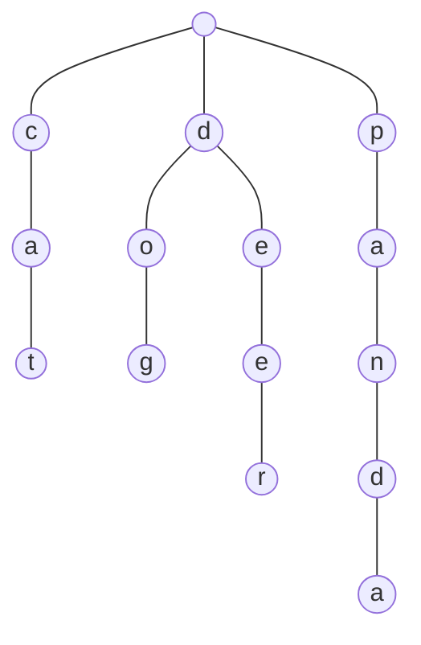

# Trie 字典树
---
> Trie 是专门为字典设计的一种数据结构，如果存在N 个条目，使用树结构(平衡二叉树)，则它的查询时间复杂度为 _O(logn)_ ,使用平衡二叉树的查询，它的时间复杂度和 _h_ 相关，则查询的时间复杂度为 _O(n)_ ,但是如果使用Trie，则它的时间复杂度和字符串的长度相关，字符串的长度为 _w_ ,则它的时间复杂度为 _O(w)_ ,绝大多数的英语单词的长度在10个之内


> 每个节点 存在26个向下的指针，考虑不同的语言和情景，每个节点的向下的指针实际上是不固定的，由于一个路径到叶子节点上存储的字母表示一个单词，但是，一个路径到叶子节点上存储的字母之内可能表示另一个单词，因此，每个节点需要一个标识，判断是不是另一个单词。

### trie 添加

```java
 // 非递归写法
public void add(String word)
{
    Node current = root;
    // 填充字符
    for(int i=0;i<word.length();i++)
    {
        char c = word.charAt(i);
        if(current.next.get(c) == null)
            current.next.put(c,new Node());

        current = current.next.get(c);
    }
    if(!current.isWord)
    {
        // 更新word标识
        current.isWord = true;
        //维护size
        size ++;
    }
}

//递归写法
public void add_recursive(String word)
{
    add_recursive(root,word);
}
private void add_recursive(Node node,String c)
{
    if(c.equals(""))
    {
        if(!node.isWord)
        {
            node.isWord = true;
            size ++;
        }
        return;
    }
    if(node.next.get(c.charAt(0)) == null)
        node.next.put(c.charAt(0),new Node());
    add_recursive(node.next.get(c.charAt(0)),c.substring(1));
}
```
### trie 包含元素
```java
// 非递归写法
public boolean contains(String word)
{
    Node current = root;

    for(int i=0;i<word.length();i++)
    {
        char c = word.charAt(i);
        if(current.next.get(c) == null)
            return false;
        current = current.next.get(c);
    }

    return current.isWord;
}

//递归写法
public boolean contains_recursive(String word)
{
    return contains_recursive(root,word);
}

public boolean contains_recursive(Node node,String word)
{
    if(word.equals(""))
        return node.isWord;
    if(node.next.get(word.charAt(0)) == null)
        return false;
    return contains_recursive(node.next.get(word.charAt(0)),word.substring(1));
}
```
### trie 前缀查询
```java
// 非递归写法
public boolean isPrefix(String prefix)
{
    Node current = root;

    for(int i=0;i<prefix.length();i++)
    {
        char c = prefix.charAt(i);
        if(current.next.get(c) == null)
            return false;
        current = current.next.get(c);
    }

    return true;
}

// 递归写法
public boolean isPrefix_recursive(String prefix)
{
    return isPrefix_recursive(root,prefix);
}
private boolean isPrefix_recursive(Node node,String prefix)
{
    if(prefix.equals(""))
        return true;

    if(node.next.get(prefix.indexOf(0)) == null)
        return false;

    return isPrefix_recursive(node.next.get(prefix.indexOf(0)),prefix.substring(1));
}
```
### trie 最大的问题

> tree，可实现字符串的快速访问，最大的问题是空间的占用过大，比如是26个字母表，如果需要完全存储的话需要str.length* 27，解决这个问题可以使用 压缩字典树 Compressed Trie

### 三分搜索树（Ternary Search Tree）

### 字符串的常见问题
> 子串查询
* KMP算法
* Boyer-Moore 算法
* Rabin-Karp 算法
> 文件压缩
> 霍夫曼压缩算法

