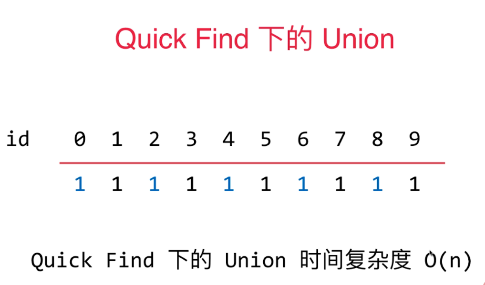
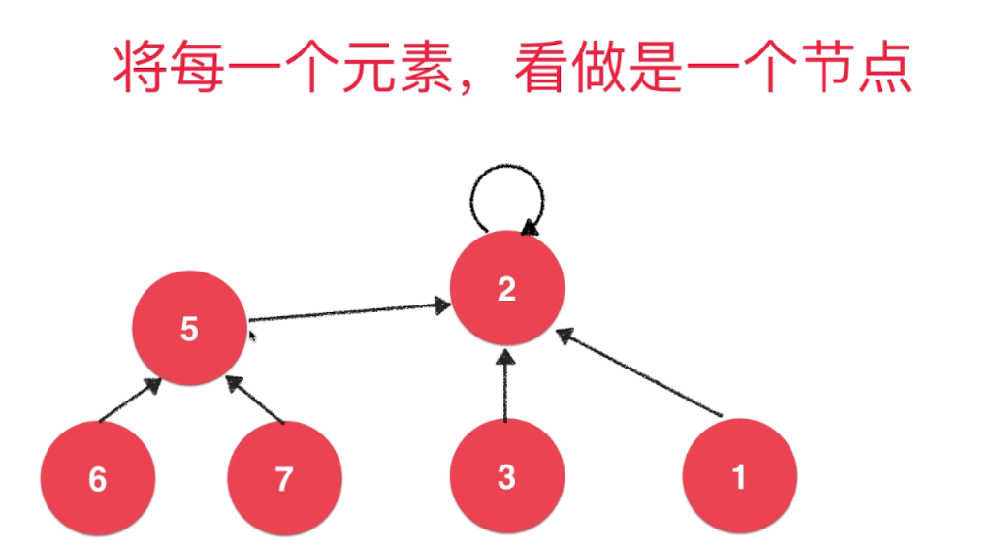
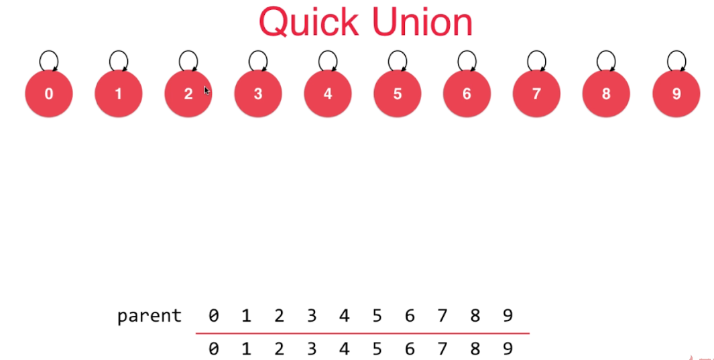
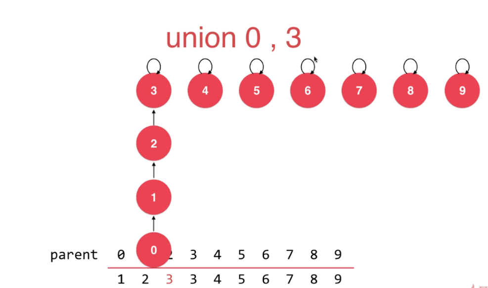
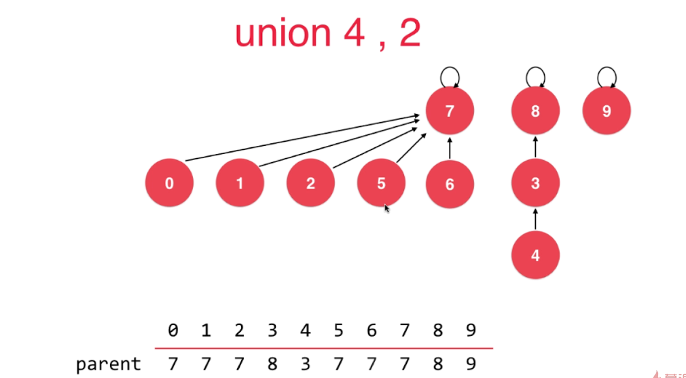
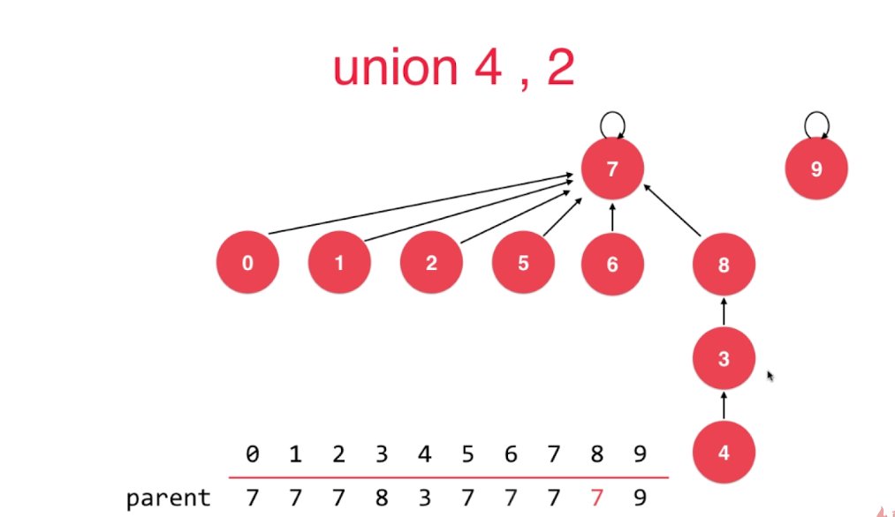
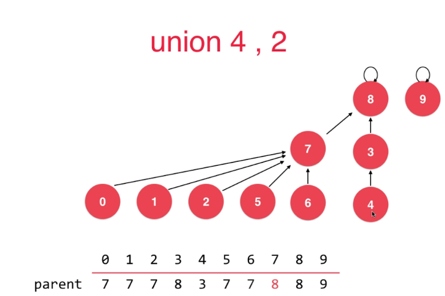
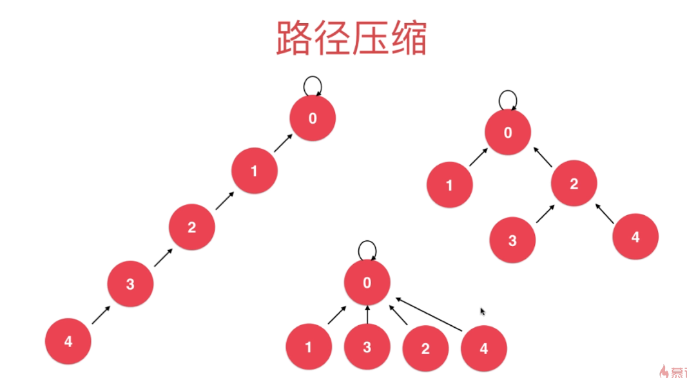

# 并查集
---
> 并查集处理的主要是连接问题和路径问题，网络（任何节点组成的网络，例如社交网络）中节点的状态；数学中的集合类的实现
## 并查集的主要功能
> 对于一组给定的数据，主要支持两个动作
    * union(p,q) 合并两个集合
    * isConnected(p,q) 两个元素是否属于同一个集合
## quick find




### quick find
操作|时间复杂度
-|-
void unionElement(int p,int q)| _O(n)_
boolean isConnected(int p,int q)| _O(1)_

### quick find 源码
``` java
package union_find;
public class UnionFind1 implements UF {
    private int[] id;
    public UnionFind1(int size)
    {
        id = new int[size];
        for(int i=0;i<size;i++)
        {
            id[i] = i;
        }
    }
    @Override
    public boolean isConnected(int p, int q) {
        return find(p) == find(q);
    }
    @Override
    public void unionElement(int p, int q) {
        int pID = find(p);
        int qID = find(q);

        if(pID == qID)
            return;

        for(int i=0;i<id.length;i++)
        {
            if(id[i] == pID)
            {
                id[i] = qID;
            }
        }

    }

    @Override
    public int getSize() {
        return id.length;
    }

    private int find(int p)
    {
        if(p < 0 || p >=getSize())
            throw new IllegalArgumentException("p is error");
        return id[p];
    }
}
```
## quick union
> quick union 是并查集的主要实现思路，不过底层同样是一种树结构，不过是一种特殊的数结构，由孩子指向父亲



> 孩子节点指向父亲节点，到最后的根节点则是根节点元素指向自己，如果是一个元素和一个树合并，则是将要合并的单独元
素指向树的根节点，如果是两个树合并，则是将一棵树的根节点指向另一颗树的根节点



> 按照这样的上面的情况，进行指针的更改，最后会形成一个多叉树，不过他们的union操作的时间复杂度为 _O(h)_ 即 _O(logn)_，isConnected的实现原理是，查询两个元素的根元素是不是同一个，是同一个则是true，反之则是false，因此isConnected的时间复杂度是 _O(h)_ 即 _O(logn)_


### quick union 时间复杂度
操作 | 时间复杂度
- | -
void unionElement(int p,int q)| _O(logn)_
boolean isConnected(int p,int q)| _O(logn)_

### quick union 源码
```java
package union_find;

import java.util.Arrays;

public class UnionFind2 implements UF {

    private int[] parent;

    UnionFind2(int size)
    {
        parent = new int[size];

        /* 初始化的时候，则是下面这种情况
        * 1 2 3 4 5 6 7 8 9 10
        * --------------------
        * 1 2 3 4 5 6 7 8 9 10
        * */
        for(int i=0;i<parent.length;i++)
        {
            parent[i] = i;
        }
    }

    @Override
    public boolean isConnected(int p, int q) {
        return find(p) == find(q);
    }

    @Override
    public void unionElement(int p, int q) {
        int pRoot = find(p);
        int qRoot = find(q);

        if(pRoot == qRoot)
            return;

        parent[pRoot] = qRoot;
    }
    public int find(int p)
    {
        if(p < 0 || p >=getSize())
            throw new IllegalArgumentException("p is error");
        while(p != parent[p])
            p = parent[p];

        return p;
    }

    @Override
    public int getSize() {
        return parent.length;
    }

    @Override
    public String toString()
    {
        return Arrays.toString(parent);
    }

    public static void main(String[] args) {

        UnionFind2 unionFind2 = new UnionFind2(10);
        System.out.println(unionFind2);

        unionFind2.unionElement(1,2);
        System.out.println(unionFind2);

        /* 输出结果
        *   Connected to the target VM, address: '127.0.0.1:53988', transport: 'socket'
            [0, 1, 2, 3, 4, 5, 6, 7, 8, 9]
            [0, 2, 2, 3, 4, 5, 6, 7, 8, 9]
            Disconnected from the target VM, address: '127.0.0.1:53988', transport: 'socket'
        * */
    }
}
```
### quick union 基于Szie的优化

> 在这种情况下，quick union 会不断增加树的高度，在某种极端的情况下会退化成链表的形式，因此需要不断减少树的层级尽量降低 _O(n)_ 使其无线的接近 _O(1)_

### quick union 基于Szie的优化 源码
```java
package union_find;

import java.util.Arrays;

public class UnionFind3 implements UF {

    private int[] parent;
    private int[] sz;

    UnionFind3(int size)
    {
        parent = new int[size];
        sz = new int[size];

        /* 初始化的时候，则是下面这种情况
         * 1 2 3 4 5 6 7 8 9 10
         * --------------------
         * 1 2 3 4 5 6 7 8 9 10
         * */
        for(int i=0;i<parent.length;i++)
        {
            parent[i] = i;
            sz[i] = 1;
        }
    }

    @Override
    public boolean isConnected(int p, int q) {
        return find(p) == find(q);
    }

    @Override
    public void unionElement(int p, int q) {
        int pRoot = find(p);
        int qRoot = find(q);

        if(pRoot == qRoot)
            return;

        if(sz[pRoot]<sz[qRoot])
        {
            parent[pRoot] = qRoot;
            sz[qRoot]+=sz[pRoot];
        }
        else
        {
            parent[qRoot] = pRoot;
            sz[pRoot]+=sz[qRoot];
        }


    }
    public int find(int p)
    {
        if(p < 0 || p >=getSize())
            throw new IllegalArgumentException("p is error");
        while(p != parent[p])
            p = parent[p];

        return p;
    }

    @Override
    public int getSize() {
        return parent.length;
    }

    @Override
    public String toString()
    {
        return Arrays.toString(parent);
    }

    public static void main(String[] args) {

        UnionFind2 unionFind2 = new UnionFind2(10);
        System.out.println(unionFind2);

        unionFind2.unionElement(1,2);
        System.out.println(unionFind2);
    }
}

```
### quick union 基于rank的优化
> 在基于size优化的情况下，按照节点的多少来决定指向，在一定情况下是会增加树的高度，所以更加合理的合并方案是 基于rank的合并方式，让深度比较低的那棵树向深度比较高的那棵树进行合并




### quick union 基于rank的优化源码
```java
package union_find;

import java.util.Arrays;

public class UnionFind4 implements UF {

    private int[] parent;
    private int[] rank;

    UnionFind4(int size)
    {
        parent = new int[size];
        rank = new int[size];

        for(int i=0;i<parent.length;i++)
        {
            parent[i] = i;
            rank[i] = 1;
        }
    }

    @Override
    public boolean isConnected(int p, int q) {
        return find(p) == find(q);
    }

    @Override
    public void unionElement(int p, int q) {
        int pRoot = find(p);
        int qRoot = find(q);

        if(pRoot == qRoot)
            return;

        if(rank[pRoot]<rank[qRoot])
        {
            // 这里不需要维护rank数组
            parent[pRoot] = qRoot;
        }
        else if(rank[qRoot] < rank[pRoot])
        {
            parent[qRoot] = pRoot;
        }
        else
        {
            // 如果两者的rank值相等的情况下，谁指向谁是没有任何关系的，但是被指向的那个的rank值需要维护，被指向的那个数的层数加1，因此rank值加1
            parent[qRoot] = pRoot;
            rank[pRoot] += 1;
        }


    }
    public int find(int p)
    {
        if(p < 0 || p >=getSize())
            throw new IllegalArgumentException("p is error");
        while(p != parent[p])
            p = parent[p];

        return p;
    }

    @Override
    public int getSize() {
        return parent.length;
    }

    @Override
    public String toString()
    {
        return Arrays.toString(parent);
    }

    public static void main(String[] args) {

        UnionFind2 unionFind2 = new UnionFind2(10);
        System.out.println(unionFind2);

        unionFind2.unionElement(1,2);
        System.out.println(unionFind2);
    }
}
```

### 路径压缩
> 虽然下面三种方式查询的结果是一样的，但是他们的深度不同，影响了时间复杂度 _O(logn)_，因此，需要进行路径压缩，路径压缩的本质还是降低树的深度，将低 _O(logn)_ 时间复杂度
 


** 路径压缩主要是针对私有方法find，在遍历的过程中压缩树的深度parent[p] = parent[parent[p]];这里需要注意的是不需要维护rank数组 **

```java
package union_find;

import java.util.Arrays;

public class UnionFind5 implements UF {

    private int[] parent;
    private int[] rank;

    UnionFind5(int size)
    {
        parent = new int[size];
        rank = new int[size];

        for(int i=0;i<parent.length;i++)
        {
            parent[i] = i;
            rank[i] = 1;
        }
    }

    @Override
    public boolean isConnected(int p, int q) {
        return find(p) == find(q);
    }

    @Override
    public void unionElement(int p, int q) {
        int pRoot = find(p);
        int qRoot = find(q);

        if(pRoot == qRoot)
            return;

        if(rank[pRoot]<rank[qRoot])
        {
            // 这里不需要维护rank数组
            parent[pRoot] = qRoot;
        }
        else if(rank[qRoot] < rank[pRoot])
        {
            parent[qRoot] = pRoot;
        }
        else
        {
            // 如果两者的rank值相等的情况下，谁指向谁是没有任何关系的，但是被指向的那个的rank值需要维护，被指向的那个数的层数加1，因此rank值加1
            parent[qRoot] = pRoot;
            rank[pRoot] += 1;
        }


    }
    public int find(int p)
    {
        if(p < 0 || p >=getSize())
            throw new IllegalArgumentException("p is error");
        while(p != parent[p])
        {
            // 主要是这里进行路径压缩
            parent[p] = parent[parent[p]];
            p = parent[p];
        }

        return p;
    }

    @Override
    public int getSize() {
        return parent.length;
    }

    @Override
    public String toString()
    {
        return Arrays.toString(parent);
    }

    public static void main(String[] args) {

        UnionFind2 unionFind2 = new UnionFind2(10);
        System.out.println(unionFind2);

        unionFind2.unionElement(1,2);
        System.out.println(unionFind2);
    }
}
```
> rank数组仅仅是作为合并树的一个参考，rank值高的在上面，rank值低的在下面，而不是直接反应树的高度或者是深度。因为如果直接反应树的高度或者是深度的话，对并查集来说并不是必要的，另一方面也是为了性能的考虑，因此使用rank这个粗略得值就行了。

### 路径压缩2
> 在查询节点的时候，将这个节点和之前的所有节点，全部直接指向根节点，形成一个层级为2的树，类似于下面这种情况的路径压缩


 
```java
package union_find;

import java.util.Arrays;

public class UnionFind6 implements UF {

    private int[] parent;
    private int[] rank;

    UnionFind6(int size)
    {
        parent = new int[size];
        rank = new int[size];

        for(int i=0;i<parent.length;i++)
        {
            parent[i] = i;
            rank[i] = 1;
        }
    }

    @Override
    public boolean isConnected(int p, int q) {
        return find(p) == find(q);
    }

    @Override
    public void unionElement(int p, int q) {
        int pRoot = find(p);
        int qRoot = find(q);

        if(pRoot == qRoot)
            return;

        if(rank[pRoot]<rank[qRoot])
        {
            // 这里不需要维护rank数组
            parent[pRoot] = qRoot;
        }
        else if(rank[qRoot] < rank[pRoot])
        {
            parent[qRoot] = pRoot;
        }
        else
        {
            // 如果两者的rank值相等的情况下，谁指向谁是没有任何关系的，但是被指向的那个的rank值需要维护，被指向的那个数的层数加1，因此rank值加1
            parent[qRoot] = pRoot;
            rank[pRoot] += 1;
        }


    }
    public int find(int p)
    {
        if(p < 0 || p >=getSize())
            throw new IllegalArgumentException("p is error");
            // 这里使用递归来将查询节点上的所有节点指向根节点
        if(p != parent[p])
        {
           parent[p] = find(parent[p]);
        }
        return parent[p];
    }

    @Override
    public int getSize() {
        return parent.length;
    }
    @Override
    public String toString()
    {
        return Arrays.toString(parent);
    }
}
```
### 并查集的时间复杂度分析
> 在加入路径压缩之后，并查集的时间复杂度, _O(log* n)_ 的时间复杂度比 _O(logn)_ 要快很多，比 _O(1)_ 要慢一点

操作|时间复杂度
-|-
isConnected| _O(log* n)_
unionElement |  _O(log* n)_

### 二叉树的变种
* 堆（最大堆和最小堆）
* 线段树
* trie
* 并查集
 


