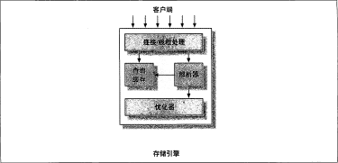

# Mysql的结构和历史
---
## 1.1 Mysql的逻辑架构

> 最上层的服务并不是MySQL所独有的, 大多数基于网络的客户端／服务器的工具或者 服务都有类似的架构。 比如连接处理、 授权认证、 安全等等。

> 第二层架构是MySQL比较有意思的部分。 大多数MySQL的核心服务功能都在这一层,包括 **查询解析、 分析、 优化、 缓存以及所有的内置函数(例如, 日期、 时间、 数学和加密函数)**, 所有跨存储引擎的功能都在这一层实现：**存储过程、 触发器、 视图等**。

> 第三层包含了存储引擎。 存储引擎负责MySQL中数据的存储和提取。 和GNU/Linux下的各种文件系统一样, 每个存储引擎都有它的优势和劣势。 服务器通过API与存储引擎进行通信。 这些接口屏蔽了不同存储引擎之间的差异,使得这些差异对上层的查询过程透明。 存储引擎API包含几十个底层函数, 用于执行诸如 “开始一个事务” 或者 “根据主键提取一行记录” 等操作。 但存储引擎不会去解析SQL(InnoDB是一个例外, 它会解析外键定义, 因为MySQL服务器本身没有实现,该功能．),不同存储引擎之间也不会直接通信, 而只是简单地晌应上层服务器的请求。

### 1.1.1 优化器的解释与执行
> MySQL会解析查询, 井创建内部数据结构(解析树), 然后对其进行各种优化, 包括重写查询、决定表的读取顺序, 以及选择合适的索引等。用户可以通过特殊的 **关键字提示(hint)优化器**,影响它的决策过程。 也可以请求优化器解释(explain)优化过程的各个因素, 使用户可以知道服务器是如何进行优化决策的, 井提供一个参考基准, 便于用户重构查询和schema、 修改相关配置, 使应用尽可能高效运行。

> 优化器并不关心表使用的是什么存储引擎, 但存储引擎对于优化查询是有影响的。优化器会请求存储引擎提供容量或某个具体操作的开销信息, 以及表数据的统计信息：等。 例如,某些存储引擎的某种 索引,可能对一些特定的查询有优化。

> 对于 SELECT语句, 在解析查询之前对于 SELECT语句, 在解析查询之前, 服务器会先检查查询缓存(Query Cache), 如果能够在其中找到对应 的查询, 服务器就不必再执行查询解析、 优化和执行的整个过程, 而是直接返回查询缓存中的结果集。

## 1.2 并发控制
> 无论何时, 只要有多个查询需要在同一时刻修改 数据,都会产生井发控制的问题。而解决这类问题的方法就是并发控制,主要介绍MySQL在两个层面的井发控制：服务器层与存储引擎层

### 1.2.1 读锁和写锁
> 在处理井发读或者写时,可以通过实现个由两种类型的锁组成的锁系统来解决问题。这两种类型的锁通常被称为 **共享锁(shared lock) 和排他锁(exclusive lock),也叫读锁(read lock)和写锁(write lock)**。

* **读锁**：读锁是共享的,或者说是相互不阻塞的。多个客户在同一时刻同时读取同一个资源,而互不干扰

* **写锁**：写锁则是排他的,一个写锁会阻塞其他的写锁和读锁,这是出于安全策略的考虑,只有这样,才能确保在给定的时间里,只有个用户能执行写入,并防止其他用户读取正在写人的同一资源,写锁也比读锁有更高的优先级,因此一个写锁请求可能会被插入到读锁队列的前面(写锁可以插入到锁队列中读锁的前面,反之读锁则不能插入到写锁的前面)。

### 1.2.2 锁粒度
> 一种提高共享资源并发性的方式就是让锁定对象更有选择性。尽量只锁定需要修改的部分数据,而不是所有的资源。更理想的方式是,只对会修改的数据片进行精确的锁定。任何时候,在给定的资拥上,锁定的数据量越少,则系统的并发程度越高,只要相互之间不发生冲突即可。所谓的 **锁策略,就是在锁的开销和数据的安全性之间寻求平衡,这种平衡当然也会影响到性能。**

* **表锁**：表锁是MySQL中最基本的锁策略,井且是开销最小的策略。表锁会锁定整张表,在某些情况下,表锁也会具有十分良好的性能,例如 alter table 之类的语句使用表锁,而忽略存储引擎的锁机制

* **行锁**：行级锁(rowlock)可以最大程度地支持井发处理(同时也带来了最大的锁开销)。众所周知,在 InnoDB和XtraDB,以及其他一些存储引擎中实现了行级锁。行级锁只在存储引擎层实现,而MySQL服务器层(如有必要,请回顾前文的逻辑架构图)没有实现。服务器层完全不了解存储引擎中的锁实现。

## 1.3 事务
> **事务就是一种原子性的sql查询,或者说是一个独立的工作单元**,如果数据库引擎能够成功地对数据库应用该组查询的全部语句, 那么就执行该组查询。 如果其中有任何条语句因为崩渍或其他原因无陆执行, 那么所有的语句都不会执行。 也就是说, 事务内的语句, 要么全部执行成功,要么全部执行失败。

> 除非系统通过严格的ACID测试, 否则空谈事务的概念是不够的。 ACID表示 **原子性 (atomicity)、一致性(consistency)、 隔离性(isolation)和持久性(durability)**。一个运行良好的事务处理系统,必须具备这些标准特征。

* **原子性**：一个事务必须被视为一个不可分割的最小工作单元,整个事务中的所有操作要么全部提交成功, 要么全部失败回滚,对于一个事务来说,不可能只执行其中的一部分操作,这就是事务的原子性。

* **一致性**：数据库总是从一个一致性的状态转换到另外一个一致性的状态。

* **隔离性**：通常来说, 一个事务所做的修改在最终提交以前,对其他事务是不可见的。

* **持久性**：一且事务提交,则其所做的修改就会永久保存到数据库中。此时即使系统崩溃,修改的数据也不会丢失

> 就像锁桂度的升级会增加系统开销一样,这种事务处理过程中额外的安全性, 也会需要数据库系统做更多的额外工作。一个实现了ACID的数据库,相比没有实现 ACID的数据库,通常会需要更强的CPU处理能力、更大的内存和更多的磁盘空间。

### 1.3.1 事务的隔离级别
> 隔离性其实比想象的要复杂。在 SQL标准中定义了四种隔离级别,每一种级别都规定了一个事务中所做的修改,哪些在事务内和事务间是可见的,哪些是不可见的。较低级别的隔离通常可以执行更高的井发,系统的开销也更低。

* **READ UNCOMMITTED (未提交读)**: 在READ UNCOMMITTED级别,事务中的修改,即使没有提交,对其他事务也都是可见的。事务可以读取未提交的数据,这也被称为脏读(Dirty Read)。

* **READ COMMITTED (提交读)**: 大多数数据库系统的默认隔离级别都是READ COMMITTED (但MySQL不是)。READ COMMITTED满足前面提到的隔离性的简单定义：一个事务开始时,只能“看见”已经提交的事务所傲的修改。换句话说,一个事务从开始直到提交之前,所傲的任何修改对其他事务都是不可见的。这个级别有时候也叫做不可重复读(nonrepeatable read),因为两次执行同样的查询,可能会得到不一样的结果

* **REPEATABLE READ (可重复读)**: REPEATABLE READ解决了脏读的问题。该级别保证了在同一个事务中多次读取同样 记录的结果是一致的。但是理论上,可重复读隔离级别还是无站解决另外一个幻读 (Phantom Read)的问题。所谓幻读,指的是当某个事务在读取某个范围内的记录时, 另外一个事务又在该范围内插入了新的记录,当之前的事务再次读取该范围的记录时,会产生幻行(Phantom Row)。

* **SERIALIZABLE (可串行化)**:SERIALIZABLE是最高的隔离级别。它通过强制事务串行执行,避免了前面说的幻读 的问题。简单来说,SERIALIZABLE会在读取的每一行数据上都加锁,所以可能导致大量的超时和锁争用的问题。

**隔离级别** | **脏读可能性** | **不可重复读可能性** | **幻读可能性** | **加锁读**
:---:|:---:|:---:|:---:|:---:
**READ UNCOMMITTED** | yes | yes | yes | no
**READ COMMITTED** | no | yes | yes | no
**REPEATABLE READ** | no | no | yes | no
**SERIALIZABLE** | no | no | no | yes

### 1.3.2 死锁
> 死锁是指两个或者多个事务在同一资掠上相互占用,并且请求锁定对方占用的资源,从而导致恶性循环的现象。当多个事务试图以不同的顺序锁定资源时,就可能会产生死锁。多个事务同时锁定同一个资源时,也会产生死锁。

```sql
-- 事务1
START TRANSACTION;
UPDATE StockPrice SET close = 45,50 WHERE stock_id = 4 and date = '2002-05-01';
UPDATE StockPrice SET close = 19.80 WHERE stock_id = 3 and date ＝ '2002-05-02';
COMMIT;

-- 事务2
START TRANSACTION;
UPDATE StockPrice SET high = 20.12 WHERE stock_id = 3 and date ＝ '2002-05-02';
UPDATE StockPrice SET high = 47,20 WHERE stock_id = 4 and date = '2002-05-01';
COMMIT
```
> 如果凑巧, 两个事务都执行了第一条sql语句,然后执行第二条sql语句),却发现该行已经被对方锁定, 然后两个事务都等待对方释放锁, 同时又持有对方需要的锁,则陷入死循环。 除非有外部因素介入才可能解除死锁。**InnoDB 目前处理死锁的方站是, 将持有最少行级排他锁的事务进行回攘(这是相对比较简单的死锁回滚算法)**。

### 1.3.3 事务日志

> **事务日志可以帮助提高事务的效率。使用事务日志,存储引擎在修改表的数据时只需要修改其内存拷贝,再把该修改行为记录到持久在硬盘上的事务日志中,而不用每次都将修改的数据本身持久到磁盘**。事务日志采用的是追加的方式,因此写日志的操作是磁盘上一小块顺序IO,而不像随机日志需要在硬盘的多个地方移动磁头,事务日志的方式相对来说要快得多。事务日志持久以后,内存中被修改的数据在后台可以慢慢地刷回到磁盘。目前大多数存储引擎都是这样实现的,我们通常称之为 **预写式日 Logging),修改数据需要写两次磁盘**

### 1.3.4 MySQL中的事务
#### 自动提交(AUTOCOMMIT)
> mysql 默认采用自动提交的模式,这意味着如果不是显示start transaction 或 commit,每个查询语句都是当做一个事务在执行.

```sql
SHOW VARIABLES LIKE 'AUTOCOMMIT'; --查看是否是自动提交模式(1或者ON表示启用,0或者OFF表示禁用)
SET AUTOCOMMIT = 0 -- 设置mysql不采用自动提交模式
```

> 当mysql不采用自动提交模式的时候,所有的操作都是在一个事务里面进行执行,直到执行COMMIT 或 ROLLBACK 操作结束当前事务,开启另一个事务,但是也不排除例外,比如 **ALTER TABLE,LOOK TABLES 会强制执行COMMIT 提交当前事务**

```sql
SET SESSION TRANSACTION ISOLATION LEVEL READ COMMITTED; -- MySQL能够识别所有的4个ANSI 隔离级别,InnoDB引擎也支持所有的隔离级别。
```

#### 隐式和显式锁定
> InnoDB采用的是两阶段锁定协议(two-phase locking protocol)。**在事务执行过程中,随时都可以执行锁定,锁只有在执行COMMIT或者ROLLBACK的时候才会释放,并且所有的锁是在同一时刻被释放。这种是隐式锁定**,InnoDB会根据隔离级别在需要的时候自动加锁。关键字提示(hint)优化器

> 显示锁定的读锁和写锁
``` sql
SELECT . . . LOCK IN SHARE MODE  --显式添加共享锁(读锁)
SELECT . . . FOR UPDAT  --显式添加排他锁(写锁)
```

## 1.4 多版本并发控制
> mysql和其他事务型数据库一样,基于并发的控制,都实现了 **多版本并发控制(MVCC)**,多版本并发控制可以说是行级锁的变种,但是在很多情况下避免了加锁的操作,因此开销更低

> **MVCC的实现,是通过保存数据在某个时间点的快照来实现的。也就是说,不管需要执行多长时间,每个事务看到的数据都是一致的。根据事务开始的时间不同,每个事务对同一张表,同一时刻看到的数据可能是不一样的。**

> 不同存储引擎的MVCC的实现是不同的, 典型的情况有 **乐观并发控制(optimistic) 和 悲观并发控制(essimistic)**

### 1.4.1 Innodb 存储引擎的多版本并发控制实现方式
> **InnoDB的MVCC,是通过在每行记录后面保存两个隐藏的列来实现的。这两个列,一个保存了行的创建时间,一个保存行的过期时间(或删除时间)。当然存储的并不是实 际的时间值,而是系统版本号(system version number)。每开始一个新的事务,系统版本号都会自动递增。事务开始时刻的系统版本号会作为事务的版本号,用来和查询到的每行记录的版本号进行比较**

1. **SELECT**: InnoDB会根据以下两个条件检查每行记录,只有符合以下两个条件的记录才会被作为结果返回。
  * InnoDB只查找版本早于当前事务版本的数据行(也就是,行的系统版本号小于或等于事务的系统版本号),这样可以确保事务读取的行,要么是在事务开始前已经存在的,要么是事务自身插入或者修改过的。
  * 行的删除版本要么未定义,要么大于当前事务版本号。这可以确保事务读取到的行,在事务开始之前未被删除。

2. **INSERT**: InnoDB为新插入的每一行保存当前系统版本号作为行版本号。
3. **DELETE**: InnoDB为删除的每一行保存当前系统版本号作为行删除标识
4. **UPDATE**: InnoDB为插入一行新记录,保存当前系统版本号作为行版本号,同时保存当前系统版本号到原来的行作为行删除标识。

> 利用两个版本号,使大多数操作都不需要加锁,但是需要更多的空间和mysql 需要维护这两个版本号,mysql的MVCC仅仅在提交读(READ COMMIT)和 可重复读上使用(REPEATABLE READ),因为未提交读(READ UNCOMMITED) 总是读取最新的行,而 加锁读(SERIALIZABLE)则是对所有读取的行都加锁,多版本并发控制对这两个级别并没有实际的意义

### 1.5 Mysql存储引擎
#### 1.5.1 InnoDB 存储引擎
> 在文件系统中, MySQL将每个数据库(也可以称之为schema)保存为数据目录下的－个子目录。 创建表时, MySQL会在数据库子目录下创建一个和表同名的.frm文件保存表的定义,**不同的存储引擎保存数据和索引的方式是不同的, 但表的定义则是在MySQL 服务层统一处理的。**,可以使用SH OW TAB LE STATUS命令(在MySQL 5.0以后的版本中, 也可以查询 INFORMATIO N_SCHE MA中对应的表)显示表的相关信息。

```properties
          Name: user # 表名
         Engine: MyISAM # 存储引擎
        Version: 10
     Row_format: Dynamic
           Rows: 3 # 行数(估计值)
 Avg_row_length: 132 # 平均每行的字节数
    Data_length: 396 #表数据的大小(以字节为单位)
Max_data_length: 281474976710655 #表数据的最大容量, 该值和存储引擎有关。
   Index_length: 4096 # 索引的大小(以字节为单位)。
      Data_free: 0 # 对于MyISAM表, 表示已分配但目前没有使用的空间。 这部分空间包括了之前删除的行, 以及后续可以被INSE盯利用到的空间。
 Auto_increment: NULL # 下一个A盯O INCREMENT的值。
    Create_time: 2019-12-19 17:31:10
    Update_time: 2019-12-20 10:29:23
     Check_time: NULL
      Collation: utf8_bin # 表的默认字符集和字符列排序规则。
       Checksum: NULL #如果启用, 保存的是整个表的实时校验和。
 Create_options:Comment: Users and global privileges
```
* Row_format：行的格式。 对于MyISAM表,可选的值为 **Dynamic、 Fixed或者Compressed**。 Dynamic的行长度是可变的, 一般包含可变长度的字段, 如VARC陆R或BLOB, Fixed的行长度则是固定的, 只包含固定长度的列, 如CHAR 和INTEGER。 Compressed的行则只在压缩表中存在
### 1.6 总结
>MySQL拥有分层的架构 。**上层是服务器层的服务和查询执行引擎,下层则是存储引擎。**
