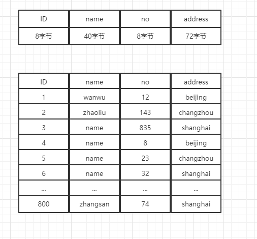
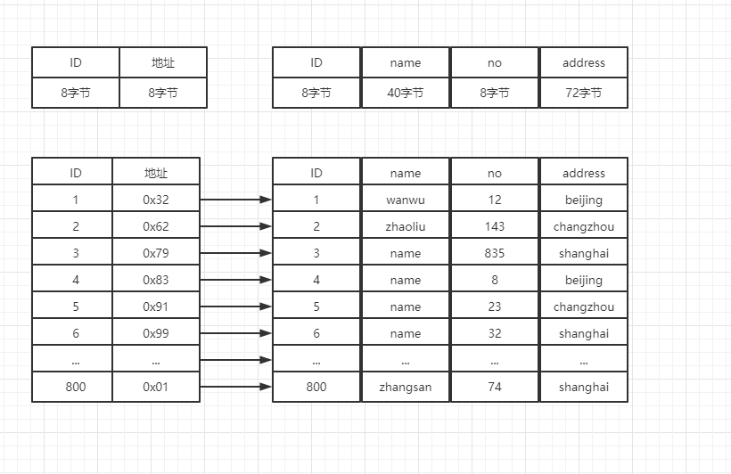
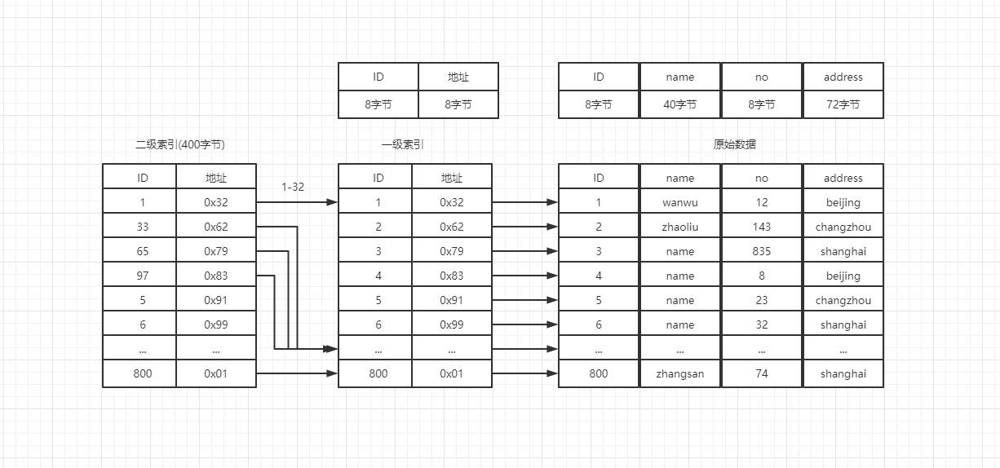
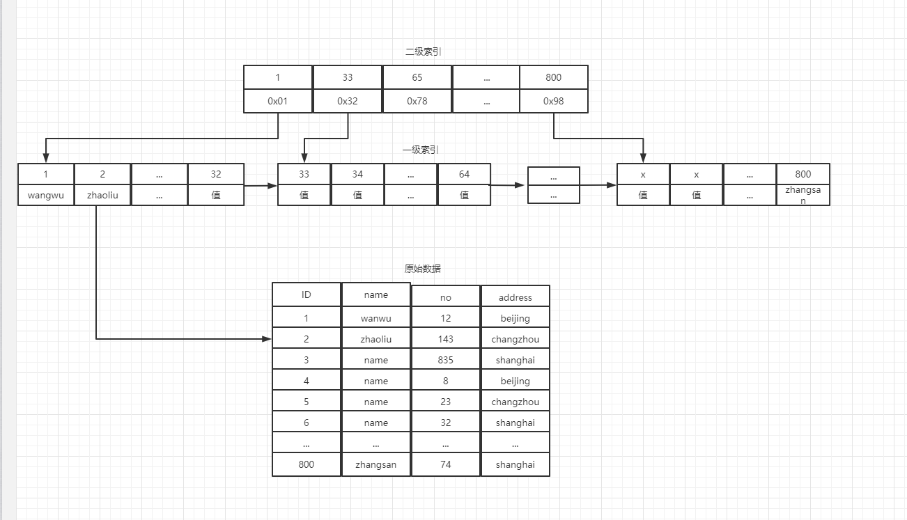
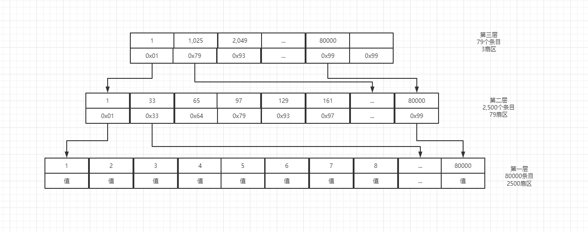

 
---
## 索引演化

### 为什么需要索引
> 假设此时有一张表,分别有id、name、no、address字段。根据字段类型和长度可以计算出一条记录占用128个字节,800条记录占用102,400字节(128*800)。按照每个扇区512个字节。大概需要占用200个扇区，即筛选数据需要进行200次IO

> 如果新添加异常索引表，索引表只存储ID和地址,那么一行数据占用16个字节,800条数据占用12800字节(16*800)。同样按照每个扇区512个字节。大概需要占用25个扇区，即筛选数据需要进行25次IO

### 二级索引
> 如果筛选的数据是第800条,即使使用索引表,也需要读取25个扇区,进行25次IO。假设此时8个索引记录作为一组,生成一张二级索引表,那么原本的25/8,就仅仅需要4个扇区,进行4次IO。  
> 如何确定多少条索引记录应该作为一组，即通过一个扇区(512字节)作为一个数据页。一条索引记录有16个字节,那么一个扇区可以存储32条索引记录(512/16)。原本的一级索引就仅仅需要25条记录,一级索引存储到磁盘上的时候就仅仅需要400个字节。使用一个扇区就够了。二级索引一次IO就可以读取所有的二级索引。原本需要进行25次IO，现在仅仅需要3次IO(第一次在读取二级索引,第二次读取一级索引,第三次读取原始数据)

> 一级索引存储的磁盘地址,二级索引存储的是具体的值。二级索引本身还会以链表的形式串联。**B树和B+树的区别:假设取得值是33。如果是B树,那么他指向得就不是二级索引得位置而是索引得值;但是如果是B+树即便在一级索引中查到了,还是需要根据一级索引的索引位置去读取二级索引。从二级索引中拿到真实数据。同时B+树还会将底层的数据以链表的形式串联起来**

> 假设数据扩大到80000条,那么二级索引本身还是需要2500个扇区((80000*16)/512)。一个数据页有32个条目(512/16)。由底层一级索引向上推算,第二层一个条目指向1024条数据。由此可以推算出第二层需要(80000/1024)78个扇区。依次类推，再向上推算一层，则最顶层仅仅需要3个扇区。

**mysql默认最小从磁盘读取16K,即32个扇区,因此一张表需要读取的IO次数更低**
