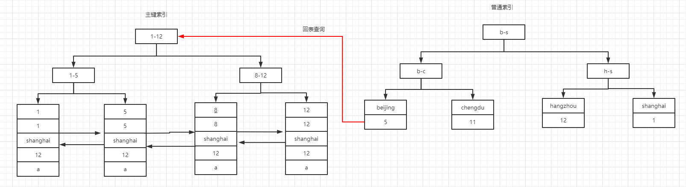

---

## 原始数据

## 数据的存储格式
> 数据我们看来是一个二维表，但是**在实际存储上是一个B+树,且B+树是根据主键(如果主键存在)进行构建的，表中的数据存储到B+树的底层叶子节点上，且仅存储一份**。新建的索引会根据索引列构建一个新的B+树。B+树的底层叶子节点存储的是ID。  
> 数据转B+树遵循以下原则:   
    1、如果一个主键被定义了,那么这个主键就作为聚集索引  
    2、如果主键没有定义，那么该表的第一个唯一非空索引作为聚集索引。  
    3、如果没有主键也没有合适的唯一索引，那么innodb内部会生成一个隐藏主键作为聚集索引,这个隐藏主键是一个6个字节的列，该列的值会随着数据的插入自增

## 普通索引
> 可以看出普通索引在该索引的B+树上查询到ID后,会根据ID再去主键索引进行查询。因此当普通索引筛选出的数据越多时,回表的次数越多。**因此主键索引的性能优于普通索引,原因在于回表**

在表上创建索引的时候,**能不建索引就不建索引。无用的索引一方面浪费空间(新建一个B+树),还会降低性能(在修改表数据的时候维护B+树)**  
**创建索引尽量在字段占用字节数小的列上建立索引,原因是: mysql一次读取16K,32个扇区,如果列的字节数过大,mysql一次读取的节点数量少,B+树的深度就会越深**

## 聚集索引和非聚集索引
聚集索引是在构建B+树的时候,值会直接存储在B+树的底层的叶子节点上。主键索引本身就是聚集索引  

**自增主键会把数据自动向后插入，避免了插入过程中的聚集索引排序问题。聚集索引的排序必然会带来大范围的数据的物理移动，这里面的磁盘IO性能损耗非常的大。而如果聚集索引上的值发生改变的话，那么也会触发物理磁盘上的移动，于是会出现page分裂，表碎片横生，索引不应该修改聚集索引**
