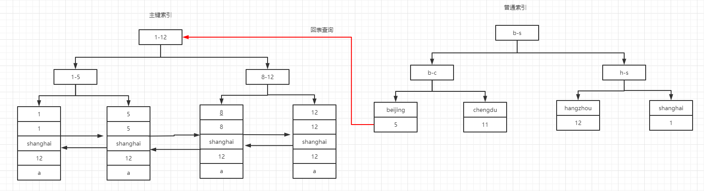
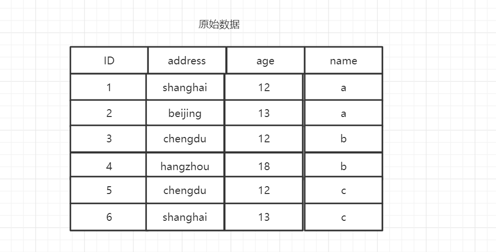
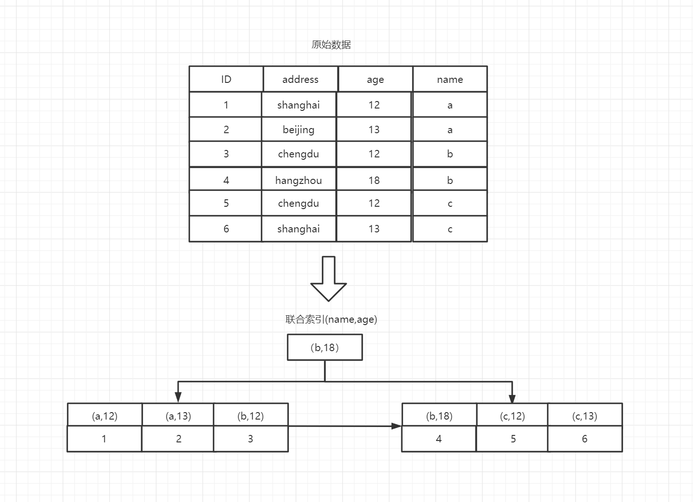
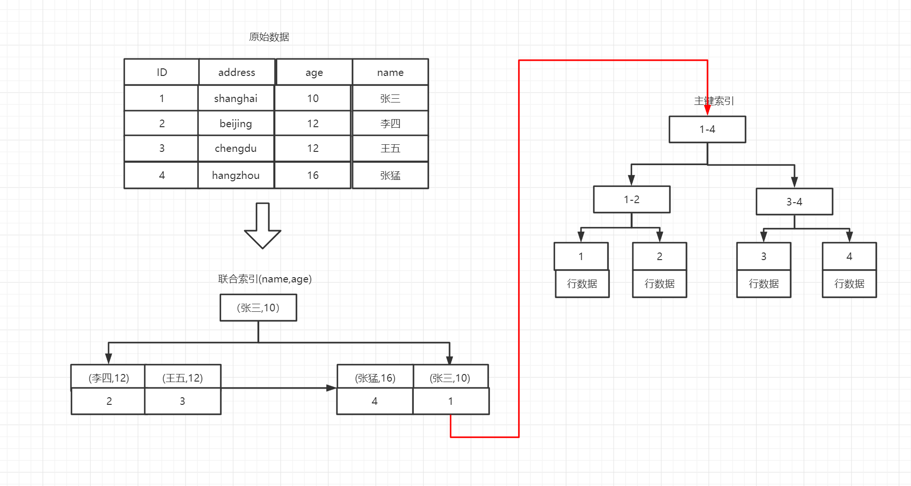

## 优化回表
``` sql
-- 回表,先从address索引上查询到ID,然后通过ID取到具体的记录
select * from user where address = "chengdu"

-- 不会回表,因为在address索引上的B+树底层叶子节点存储的就是ID,可以直接取到
select ID from user where address = "chengdu"
```



## 联合索引
### 原始数据


### 存储结构
``` sql
alter table user add index `idx_name_age`('name','age');

-- 不需要回表,在索引 idx_name_age 可以直接取到 id、age
select id,age from user where name = 'a';

-- 索引失效,由于创建索引第一列有序,第二列无序,因此联合索引的B+树相对于age列无效,因此索引失效.
select id,age from user where age = 12; 
```

> **创建联合索引会先比较第一列,然后比较第二列。因此第一列一定是有序的。第二列是无序的**



**最左前缀匹配原则: 优先以联合索引第一列匹配,直接跳过第一列使用第二列是联合索引无效。这是由联合索引的B+树性质决定的。**

## 索引下推ICP
> 索引下推(Index Condition pushdown) 简称ICP.mysql5.6版本的新特征  
> ICP针对的是普通索引,主键索引本身就能获取到数据,无需进行回表。  
> 如果能在二级索引完成过滤的条件,直接进行过滤.满足条件的在进行回表.ICP本身针对的是联合索引减少回表次数



### ICP
``` sql
-- 可以使用到索引下推
select * from user where name like '张%' and age = 10;
```


> **无ICP 查询**  
    1、通过联合索引查询到张猛和张三的主键  
    2、通过主键两次查询到完整数据  
    3、获取到完整的数据后进行过滤

> **ICP查询**  
    1、通过联合索引直接筛选出张三的主键  
    2、通过主键获取到张三的完整数据

> **无法使用ICP的条件**  
    1、ICP针对的是普通索引  
    2、引用了子查询的条件无法使用索引下推  
    3、使用了存储函数的条件也无法使用下推,存储引擎无法调用存储函数

### 判断是否使用索引下推
``` sql
explain select * from user where name like '张%' and age = 10;
-- Extra列展示**Using index condition**则表示使用到了索引下推
```