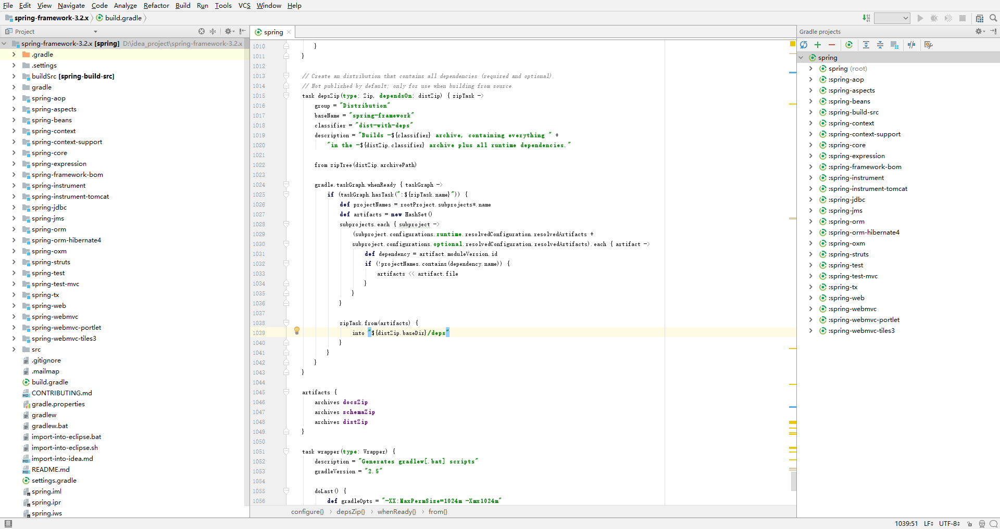

### 编译准备
gradle 2.14.1  
java 1.8.0_341  
spring 3.2.x  

配置JAVA_HOME到系统变量,配置%JAVA_HOME%\bin\ 到系统Path中  
配置GRADLE_HOME到系统变量,配置%GRADLE_HOME%\bin\ 到系统Path中

### 编译步骤
**1、修改 build.gradle 文件**

``` gradle
// 第一处修改,主要修改 repositories
buildscript {
	repositories {
			maven { url "https://maven.aliyun.com/repository/spring-plugin" }
	}
	dependencies {
		classpath("org.springframework.build.gradle:propdeps-plugin:0.0.7")
		classpath("io.spring.gradle:docbook-reference-plugin:0.3.1")
	}
}

// 第二处修改,主要修改 repositories
repositories {
    maven { url "https://maven.aliyun.com/repository/spring-plugin" }
}

dependencies {
    testCompile("junit:junit:${junitVersion}")
    testCompile("org.hamcrest:hamcrest-all:1.3")
    testCompile("org.mockito:mockito-core:1.9.5")
}
```

**执行 gradle idea**
执行gradle idea进行编译，出现 BUILD SUCCESS为编译成功。gradle cleanidea 为删除编译缓存
``` shell
D:\idea_project\spring-framework-3.2.x>gradle idea
:buildSrc:clean UP-TO-DATE
:buildSrc:compileJava UP-TO-DATE
:buildSrc:compileGroovy
:buildSrc:processResources
:buildSrc:classes
:buildSrc:jar
:buildSrc:assemble
:buildSrc:compileTestJava UP-TO-DATE
:buildSrc:compileTestGroovy UP-TO-DATE
:buildSrc:processTestResources UP-TO-DATE
:buildSrc:testClasses UP-TO-DATE
:buildSrc:test UP-TO-DATE
:buildSrc:check UP-TO-DATE
:buildSrc:build
:ideaModule
:ideaProject
:ideaWorkspace
:idea
:spring-aop:ideaModule
:spring-aop:idea
:spring-aspects:ideaModule SKIPPED
:spring-aspects:idea SKIPPED
:spring-beans:ideaModule
:spring-beans:idea
:spring-build-src:ideaModule
:spring-build-src:idea
:spring-context:ideaModule
:spring-context:idea
:spring-context-support:ideaModule
:spring-context-support:idea
:spring-core:ideaModule
:spring-core:idea
:spring-expression:ideaModule
:spring-expression:idea
:spring-framework-bom:ideaModule
:spring-framework-bom:idea
:spring-instrument:ideaModule
:spring-instrument:idea
:spring-instrument-tomcat:ideaModule
:spring-instrument-tomcat:idea
:spring-jdbc:ideaModule
:spring-jdbc:idea
:spring-jms:ideaModule
:spring-jms:idea
:spring-orm:ideaModule
:spring-orm:idea
:spring-orm-hibernate4:ideaModule
:spring-orm-hibernate4:idea
:spring-oxm:ideaModule
:spring-oxm:idea
:spring-struts:ideaModule
:spring-struts:idea
:spring-test:ideaModule
:spring-test:idea
:spring-test-mvc:ideaModule
:spring-test-mvc:idea
:spring-tx:ideaModule
:spring-tx:idea
:spring-web:ideaModule
:spring-web:idea
:spring-webmvc:ideaModule
:spring-webmvc:idea
:spring-webmvc-portlet:ideaModule
:spring-webmvc-portlet:idea
:spring-webmvc-tiles3:ideaModule
:spring-webmvc-tiles3:idea
BUILD SUCCESSFUL
```

**idea 导入项目**
使用idea 2017.3 导入gradle时需要注意右下角提示，删除spring-aspect，选择true，然后整个项目才能以gradle的形式加载到idea中，View->Tool Windows中才会显示Gradle。整个项目完整加载如下: 



需要执行 Spring-core->Task->other-> asmRepackJar 和 cglibRepackJar。否则整个项目编译不通过

**创建自定义模块测试模块**
右键-> new Module->Gradle 即可右键新建项目,引入bean的类型

``` gradle
dependencies {
    compile(project(":spring-beans"))
    testCompile group: 'junit', name: 'junit', version: '4.12'
}
```
java\hello\Student.java
``` java
package hello;

public class Student {
    private String name;
    private Integer age;

    public Student(String name, Integer age) {
        this.name = name;
        this.age = age;
    }

    @Override
    public String toString() {
        return "name: " + name + "," + "age: " + age;
    }
}
```

resources\hello.xml
``` xml
<?xml version="1.0" encoding="UTF-8"?>
<!DOCTYPE beans PUBLIC "-//SPRING//DTD BEAN 2.0//EN" "https://www.springframework.org/dtd/spring-beans-2.0.dtd">

<beans>
    <bean name="student" class="hello.Student">
        <constructor-arg index="0"  type="java.lang.String" value="张三"/>
        <constructor-arg index="1"  type="java.lang.Integer" value="18"/>
    </bean>
</beans>
```

java\hello\HelloWorld.java
``` java
package hello;

import org.springframework.beans.factory.BeanFactory;
import org.springframework.beans.factory.xml.XmlBeanFactory;
import org.springframework.core.io.ClassPathResource;

public class HelloWorld {

    public static void main(String[] args) {
        BeanFactory container = new XmlBeanFactory(new ClassPathResource("hello.xml"));
        Student student = (Student)container.getBean("student");
        System.out.print(student);
    }
}
```

打印下面的信息则表示整个spring源码可以正常执行。自定义测试模块创建完成
``` shell
十月 11, 2022 10:20:28 下午 org.springframework.beans.factory.xml.XmlBeanDefinitionReader loadBeanDefinitions
信息: Loading XML bean definitions from class path resource [hello.xml]
name: 张三,age: 18
```