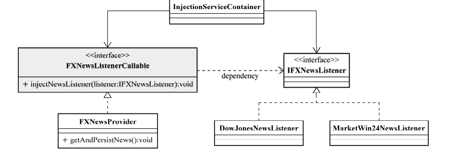

## ioc service provier的引入
> IoC是随着近年来轻量级容器（Lightweight Container)的兴起而逐渐被很多人提起的一个名词，它的全称为Inversion of Control，中文通常翻译为“控制反转”，它还有一个别名叫做依赖注入（DependencyInjection）。 

在没有IoC Service Provider的情况下，如果我们依赖于某个类或服务，最简单而有效的方式就是直接在类的构造函数中新建相应的依赖类。  

这种情况下，被注入对象会直接依赖于被依赖对象。但是，在IoC的场景中，二者之间通过IoC Service Provider来打交道，所有的被注入对象和依赖对象现在由IoC Service Provider统一管理。被注入对象需要什么，直接跟IoC Service Provider招呼一声，后者就会把相应的被依赖对象注入到被注入对象中，从而达到IoC Service Provider为被注入对象服务的目的。IoC Service Provider在这里就是通常的IoC容器所充当的角色。从被注入对象的角度看，与之前直接寻求依赖对象相比，依赖对象的取得方式发生了反转，控制也从被注入对象转到了IoC Service Provider那里


## IOC注入方式
### 构造方法注入
**IoC Service Provider会检查被注入对象的构造方法，取得它所需要的依赖对象列表，进而为其注入相应的对象。** 同一个对象是不可能被构造两次的，因此，被注入对象的构造乃至其整个生命周期，应该是由IoC Service Provider来管理的。

``` java
public class Student {
    private String name;
    private Integer age;
    public Student(String name, Integer age) {
        this.name = name;
        this.age = age;
    }
}
```

### setter方法注入
对于JavaBean对象来说，通常会通过setXXX()和getXXX()方法来访问对应属性。这些setXXX()方法统称为setter方法，getXXX()当然就称为getter方法。通过setter方法，可以更改相应的对象属性，通过getter方法，可以获得相应属性的状态。所以，**当前对象只要为其依赖对象所对应的属性添加setter方法，就可以通过setter方法将相应的依赖对象设置到被注入对象中。**

``` java
public class Student {
    private String name;
    private Integer age;

    public void setName(String name) {
        this.name = name;
    }
    public void setAge(Integer age) {
        this.age = age;
    }
}
```

### 接口注入

相对于前两种注入方式来说，接口注入没有那么简单明了。**被注入对象如果想要IoC Service Provider为其注入依赖对象，就必须实现某个接口。这个接口提供一个方法，用来为其注入依赖对象。IoC Service Provider最终通过这些接口来了解应该为被注入对象注入什么依赖对象**



### 注入方式的比较

接口注入: 从注入方式的使用上来说，接口注入是现在不甚提倡的一种方式，基本处于“退役状态”。因为它强制被注入对象实现不必要的接口，带有侵入性。而构造方法注入和setter方法注入则不需要如此。  

构造方法注入: 这种注入方式的优点就是，对象在构造完成之后，即已进入就绪状态，可以马上使用。缺点就是，当依赖对象比较多的时候，构造方法的参数列表会比较长。而通过反射构造对象的时候，对相同类型的参数的处理会比较困难，维护和使用上也比较麻烦。而且在Java中，构造方法无法被继承，无法设置默认值。对于非必须的依赖处理，可能需要引入多个构造方法，而参数数量的变动可能造成维护上的不便。  

setter方法注入: 因为方法可以命名，所以setter方法注入在描述性上要比构造方法注入好一些。 另外，setter方法可以被继承，允许设置默认值，而且有良好的IDE支持。缺点当然就是对象无法在构造完成后马上进入就绪状态。
