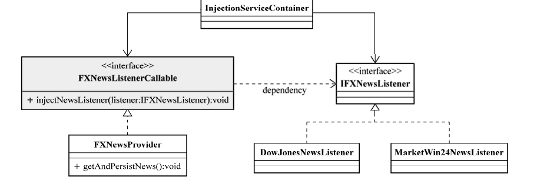

虽然业务对象可以通过IoC方式声明相应的依赖，但是最终仍然需要通过某种角色或者服务将这些相互依赖的对象绑定到一起，而IoC Service Provider就对应IoC场景中的这一角色。

**IoC Service Provider在这里是一个抽象出来的概念，它可以指代任何将IoC场景中的业务对象绑定到一起的实现方式。它可以是一段代码，也可以是一组相关的类，甚至可以是比较通用的IoC框架或者IoC容器实现。**

## IoC Service Provider 的职责
IoC Service Provider的职责相对来说比较简单，主要有两个：**业务对象的构建管理和业务对象间的依赖绑定。**

**业务对象的构建管理**。在IoC场景中，业务对象无需关心所依赖的对象如何构建如何取得，但这部分工作始终需要有人来做。所以，IoC Service Provider需要将对象的构建逻辑从客户端对象那里剥离出来，以免这部分逻辑污染业务对象的实现。  
**业务对象间的依赖绑定**。对于IoC Service Provider来说，这个职责是最艰巨也是最重要的，这是它的最终使命之所在。如果不能完成这个职责，那么，无论业务对象如何的“呼喊”，也不会得到依赖对象的任何响应（最常见的倒是会收到一个NullPointerException）。IoC Service Provider通过结合之前构建和管理的所有业务对象，以及各个业务对象间可以识别的依赖关系，将这些对象所依赖的对象注入绑定，从而保证每个业务对象在使用的时候，可以处于就绪状态。

## 管理对象间依赖关系
IoC Service Provider 能管理对象间依赖关系的前提是，它能掌握所管理和掌握的被注入对象和依赖对象之间的对应关系。这种关系必须通过某种方式描述出来，如描述性较强的xml文件、代码描述等。然后Ioc Service Provier解析描述信息，创建和注入对象。下图依赖关系为例:



### 编码方式
当前大部分的IoC容器都应该支持直接编码方式，比如PicoContainer①、Spring、Avalon等。在容器启动之前，我们就可以通过程序编码的方式将被注入对象和依赖对象注册到容器中，并明确它们相互之间的依赖注入关系

#### 直接编码方式
``` java
IoContainer container = ...;
container.register(FXNewsProvider.class,new FXNewsProvider());
container.register(IFXNewsListener.class,new DowJonesNewsListener());
...
FXNewsProvider newsProvider = (FXNewsProvider)container.get(FXNewsProvider.class);
newProvider.getAndPersistNews();        
```

#### 基于接口的直接编码方式
``` java
IoContainer container = ...;
container.register(FXNewsProvider.class,new FXNewsProvider());
container.register(IFXNewsListener.class,new DowJonesNewsListener());
...
// 通过bind方法将“被注入对象”（由IFXNewsListenerCallable接口添加标志）所依赖的对象，绑定为容器中注册过的IFXNewsListener类型的对象实例。
// 容器在返回FXNewsProvider对象实例之前，会根据这个绑定信息，
// 将IFXNewsListener注册到容器中的对象实例注入到“被注入对象”——FXNewsProvider中，并最终返回已经组装完毕的FXNewsProvider对象
container.bind(IFXNewsListenerCallable.class, container.get(IFXNewsListener.class));
...
FXNewsProvider newsProvider = (FXNewsProvider)container.get(FXNewsProvider.class);
newProvider.getAndPersistNews();
```
### xml方式
``` xml
<bean id="newsProvider" class="..FXNewsProvider">
    <property name="newsListener">
        <ref bean="djNewsListener"/>
    </property>
    <property name="newPersistener">
        <ref bean="djNewsPersister"/>
    </property>
</bean>
<bean id="djNewsListener" class="..impl.DowJonesNewsListener">
</bean>
<bean id="djNewsPersister" class="..impl.DowJonesNewsPersister">
</bean>
```
### 元数据方式

这种方式的代表实现是Google Guice，这是Bob Lee在Java 5的注解和Generic的基础上开发的一套IoC框架。我们可以直接在类中使用元数据信息来标注各个对象之间的依赖关系，然后由Guice框架根据这些注解所提供的信息将这些对象组装后，交给客户端对象使用
``` java
public class FXNewsProvider
{
    private IFXNewsListener newsListener;
    private IFXNewsPersister newPersistener;

    // 通过@Inject，我们指明需要IoC Service Provider通过构造方法注入方式，为FXNewsProvider注入其所依赖的对象。
    // 至于余下的依赖相关信息，在Guice中是由相应的Module来提供的，
    @Inject
    public FXNewsProvider(IFXNewsListener listener,IFXNewsPersister persister)
    {
        this.newsListener = listener;
        this.newPersistener = persister;
    } 
} 
```
``` java
public class NewsBindingModule extends AbstractModule
{
    @Override
    protected void configure() {
        bind(IFXNewsListener.class)
        .to(DowJonesNewsListener.class).in(Scopes.SINGLETON);
        bind(IFXNewsPersister.class)
        .to(DowJonesNewsPersister.class).in(Scopes.SINGLETON);
    }
}
```
``` java
// 使用容器
Injector injector = Guice.createInjector(new NewsBindingModule());
FXNewsProvider newsProvider = injector.getInstance(FXNewsProvider.class);
newsProvider.getAndPersistNews(); 
```
注解最终也要通过代码处理来确定最终的注入关系，从这点儿来说，注解方式可以算作编码方式的一种特殊情况。