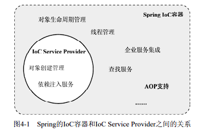
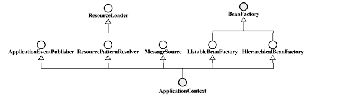

## BeanFactory 和 ApplicationContext
Spring ioc 是一个IoC Service Provider。但是Spring还在 IoC Service Provider之上提供了相应的AOP框架支持、企业级服务集成等服务。Spring的IoC容器和IoC Service Provider所提供的服务之间存在一定的交集。  
**在Spring代码架构层面来说，ioc service provider 的职责由 BeanFactory负责。对于扩展的由 ApplicationContext负责**



**BeanFactory。基础类型IoC容器，提供完整的IoC服务支持。**如果没有特殊指定，默认采用延迟初始化策略（lazy-load）。只有当客户端对象需要访问容器中的某个受管对象的时候，才对该受管对象进行初始化以及依赖注入操作。所以，相对来说，容器启动初期速度较快，所需要的资源有限。对于资源有限，并且功能要求不是很严格的场景，BeanFactory是比较合适的IoC容器选择。

**ApplicationContext。ApplicationContext在BeanFactory的基础上构建，是相对比较高级的容器现，除了拥有BeanFactory的所有支持，ApplicationContext还提供了其他高级特性，比如事件发布、国际化信息支持等，** 这些会在后面详述。ApplicationContext所管理的对象，在该类型容器启动之后，默认全部初始化并绑定完成。所以，相对于BeanFactory来说，ApplicationContext要求更多的系统资源，同时，因为在启动时就完成所有初始化，容器启动时间较之BeanFactory也会长一些。在那些系统资源充足，并且要求更多功能的场景中，ApplicationContext类型的容器是比较合适的选择。



**作为Spring提供的基本的IoC容器，BeanFactory可以完成作为IoC Service Provider的所有职责，包括业务对象的注册和对象间依赖关系的绑定。**

## BeanFactory对象注册和依赖绑定
BeanFactory作为一个IoC Service Provider，为了能够明确管理各个业务对象以及业务对象之间的依赖绑定关系，同样需要某种途径来记录和管理这些信息。目前Spring提供三种方式: 直接编码方式、外部配置文件方式(xml或properties)、注解方式

### 示例
``` java
public class CreateBeanByType {
    public static void main(String[] args) {

        DefaultListableBeanFactory beanFactory = new DefaultListableBeanFactory();

        // 直接定义
        AbstractBeanDefinition studentByDirectDefinition = new RootBeanDefinition(Student.class, true);
        beanFactory.registerBeanDefinition("studentByDirectDefinition", studentByDirectDefinition);


        // 通过构造方法注入
        AbstractBeanDefinition studentByConstructorArgs = new RootBeanDefinition(Student.class, true);

        ConstructorArgumentValues constructorArgs = new ConstructorArgumentValues();
        constructorArgs.addIndexedArgumentValue(0, "张三");
        constructorArgs.addIndexedArgumentValue(1, 33);

        studentByConstructorArgs.setConstructorArgumentValues(constructorArgs);
        beanFactory.registerBeanDefinition("studentByConstructorArgs", studentByConstructorArgs);

        // 通过setter方法注入
        AbstractBeanDefinition studentBySetter = new RootBeanDefinition(Student.class, true);

        MutablePropertyValues propertyValues = new MutablePropertyValues();
        propertyValues.addPropertyValue("name", "王五");
        propertyValues.addPropertyValue("age", 33);

        studentBySetter.setPropertyValues(propertyValues);
        beanFactory.registerBeanDefinition("studentBySetter",studentBySetter);

        //------- 获取bean

        // 输出 name: null,age: null
        System.out.println(((Student)beanFactory.getBean("studentByDirectDefinition")).toString());

        // 输出 name: 张三,age: 33
        System.out.println(((Student)beanFactory.getBean("studentByConstructorArgs")).toString());

        // 输出 name: 王五,age: 33
        System.out.println(((Student)beanFactory.getBean("studentBySetter")).toString());

    }
}
```
#### 源码解读参考
- [BeanFacotry顶层架构](/category/framework/spring_source/ioc/01_BeanFacotry顶层架构)
