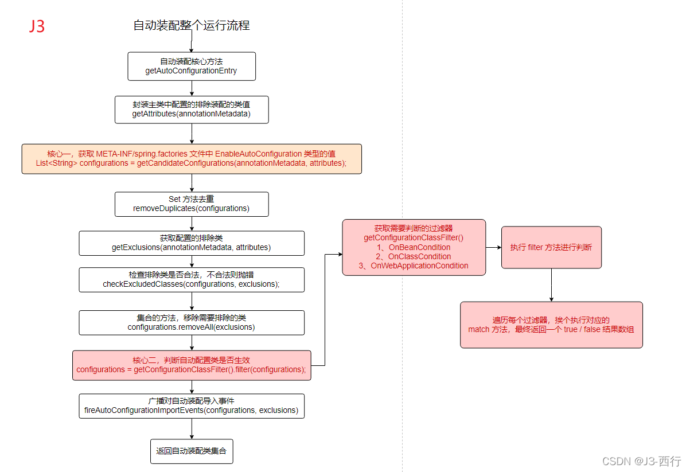

## spring spi 源码解析
本篇主要解决上篇两个问题:  
3、spring进行stater加载的起点是META-INF/spring.factories，那么应该有一个是能寻找到这些文件的，并且将这些文件放入的spring的容器中的  
4、spring在进行bean注入的时候，@ConditionalOnWebApplication @ConditonOnClass这些类代表着某种过滤规则，这些规则spring是如何处理的

## 原理解析
### 源头
spring的自动装配的源头其实就两个，一个是@SpringBootApplication和spring.factories。  
- spring.factories 作为定义bean的入口，当配置类被加载到容器中时，配置类上的注解从而就生效，进而带动了整个 starter 中的 Bean 都被容器所管理
- spring.factories 是被动的一方，而@SpringBootApplication则是主动的一方，他会去寻找 stater的spring.factories，从而去加载 spring.factories 中定义的bean
### @SpringBootApplication

``` java
@Target({ElementType.TYPE})
@Retention(RetentionPolicy.RUNTIME)
@Documented
@Inherited
@SpringBootConfiguration
@EnableAutoConfiguration
@ComponentScan(
    excludeFilters = {@Filter(
    type = FilterType.CUSTOM,
    classes = {TypeExcludeFilter.class}
), @Filter(
    type = FilterType.CUSTOM,
    classes = {AutoConfigurationExcludeFilter.class}
)}
)
public @interface SpringBootApplication {
    @AliasFor(
        annotation = EnableAutoConfiguration.class
    )
    Class<?>[] exclude() default {};

    @AliasFor(
        annotation = EnableAutoConfiguration.class
    )
    String[] excludeName() default {};

    @AliasFor(
        annotation = ComponentScan.class,
        attribute = "basePackages"
    )
    String[] scanBasePackages() default {};

    @AliasFor(
        annotation = ComponentScan.class,
        attribute = "basePackageClasses"
    )
    Class<?>[] scanBasePackageClasses() default {};

    @AliasFor(
        annotation = Configuration.class
    )
    boolean proxyBeanMethods() default true;
}
```
- @SpringBootConfiguration: 标注的类为SpringBoot的一个配置类
- @EnableAutoConfiguration: 自动配置注解
- @ComponentScan: 包扫描注解

注解属性主要是定义了排除一些不用装配的类，根据 Class 、name 等规则进行排除  
激活 @Component 扫描的 @ComponentScan  
很明显我们接下来要分析的重点是 @EnableAutoConfiguration 注解  

### @EnableAutoConfiguration
```java
@Target(ElementType.TYPE)
@Retention(RetentionPolicy.RUNTIME)
@Documented
@Inherited
@AutoConfigurationPackage
@Import(AutoConfigurationImportSelector.class)
public @interface EnableAutoConfiguration {

    // 用来覆盖配置开启 / 关闭自动配置的功能
    String ENABLED_OVERRIDE_PROPERTY = "spring.boot.enableautoconfiguration";

    // 根据类排除指定的自动配置
    Class<?>[] exclude() default {};

    // 根据类名排除指定的自动配置
    String[] excludeName() default {};
}
```
@AutoConfigurationPackage 将注解所在的类存储到packageNames集合中，可能是为了包扫描 
@Import(AutoConfigurationImportSelector.class) 向spring中导入配置类 AutoConfigurationImportSelector

### AutoConfigurationImportSelector


AutoConfigurationImportSelector 本身间接继承了两个基类
- Aware: Bean实例化的时候为其传入相关的环境对象，如 BeanFactory、Environment 、ResourceLoader 等
- ImportSelector 是真正执行筛选导入的接口

``` java
public interface ImportSelector {

    // 根据导入的Configuration类的注解元数据选择哪一个类需要被导入，返回的数组就是需要被导入的类名
    String[] selectImports(AnnotationMetadata importingClassMetadata);
    // 排除不需要导入的类
    @Nullable
    default Predicate<String> getExclusionFilter() {
        return null;
    }
}
```

### AutoConfigurationImportSelector
``` java
public class AutoConfigurationImportSelector implements DeferredImportSelector, BeanClassLoaderAware,
    ResourceLoaderAware, BeanFactoryAware, EnvironmentAware, Ordered {

    // 加载spring.factories
    @Override
	public String[] selectImports(AnnotationMetadata annotationMetadata) {
		if (!isEnabled(annotationMetadata)) {
			return NO_IMPORTS;
		}
		AutoConfigurationMetadata autoConfigurationMetadata = AutoConfigurationMetadataLoader
				.loadMetadata(this.beanClassLoader);
		AutoConfigurationEntry autoConfigurationEntry = getAutoConfigurationEntry(autoConfigurationMetadata,
				annotationMetadata);
		return StringUtils.toStringArray(autoConfigurationEntry.getConfigurations());
	}

    // getAutoConfigurationEntry(annotationMetadata) 方法就是我们要深入研究的点
    // 因为它返回的是所有需要自动配置的全限定类名，只有把这个返回给了 SpringBoot ，它才知道需要自动装配那些功能
	protected AutoConfigurationEntry getAutoConfigurationEntry(AutoConfigurationMetadata autoConfigurationMetadata,
			AnnotationMetadata annotationMetadata) {
		if (!isEnabled(annotationMetadata)) {
			return EMPTY_ENTRY;
		}
    
		AnnotationAttributes attributes = getAttributes(annotationMetadata);
        // 通过 SpringFactoriesLoader 类提供的方法加载类路径中 META-INF 目录下的 spring.factories 文件中针对 EnableAutoConfiguration 的注册配置类
		List<String> configurations = getCandidateConfigurations(annotationMetadata, attributes);

        // 对获得的注册配置类集合进行去重处理，防止多个项目引入同样的配置类
		configurations = removeDuplicates(configurations);

        // 获得注解中被 exclude 或 excludeName 所派出的类的集合
		Set<String> exclusions = getExclusions(annotationMetadata, attributes);

        // 检查被排除类是否可实例化，是否被自动注册配置所使用，不符合条件则抛出异常
		checkExcludedClasses(configurations, exclusions);

        // 从自动配置类集合中取出被排除的类
		configurations.removeAll(exclusions);

        // 检查配置类的注解是否符合 spring.factories 文件中 AutoConfigurationImportFilter 指定的注解检查条件
		configurations = filter(configurations, autoConfigurationMetadata);

        // 将赛选完成的配置类和排查的配置类构建为事件类，并传入监听器。监听器的配置在于 spring.factories 文件中，通过 AutoConfigurationImportListener
		fireAutoConfigurationImportEvents(configurations, exclusions);
		return new AutoConfigurationEntry(configurations, exclusions);
	}

    protected List<String> getCandidateConfigurations(AnnotationMetadata metadata, AnnotationAttributes attributes) {
        // 这里就是关键，使用SpringFactoriesLoader加载所有配置类，类似ServicesLoader
        // 加载配置文件，并且读取key为EnableAutoConfiguration的配置
		List<String> configurations = SpringFactoriesLoader.loadFactoryNames(getSpringFactoriesLoaderFactoryClass(),
				getBeanClassLoader());
		Assert.notEmpty(configurations, "No auto configuration classes found in META-INF/spring.factories. If you "
				+ "are using a custom packaging, make sure that file is correct.");
		return configurations;
	}
    protected Class<?> getSpringFactoriesLoaderFactoryClass() {
        return EnableAutoConfiguration.class;
    }

    public static List<String> loadFactoryNames(Class<?> factoryType, @Nullable ClassLoader classLoader) {

        // 真正实现spring.factories文件读取的地方
        String factoryTypeName = factoryType.getName();
        return loadSpringFactories(classLoader).getOrDefault(factoryTypeName, Collections.emptyList());
    }
    
    // 常规的文件解析
    private static Map<String, List<String>> loadSpringFactories(@Nullable ClassLoader classLoader) {
        try {
            // FACTORIES_RESOURCE_LOCATION的值为：META-INF/spring.factories
            // 这步就是意味中读取classpath下的META-INF/spring.factories文件
            Enumeration<URL> urls = (classLoader != null ?
                                    classLoader.getResources(FACTORIES_RESOURCE_LOCATION) :
                                    ClassLoader.getSystemResources(FACTORIES_RESOURCE_LOCATION));
            // 接下来就是读取出文件内容，封装成map的操作了
            result = new LinkedMultiValueMap<>();
            while (urls.hasMoreElements()) {
                URL url = urls.nextElement();
                UrlResource resource = new UrlResource(url);
                Properties properties = PropertiesLoaderUtils.loadProperties(resource);
                for (Map.Entry<?, ?> entry : properties.entrySet()) {
                    String factoryTypeName = ((String) entry.getKey()).trim();
                    for (String factoryImplementationName : StringUtils.commaDelimitedListToStringArray((String) entry.getValue())) {
                        result.add(factoryTypeName, factoryImplementationName.trim());
                    }
                }
            }
            cache.put(classLoader, result);
            return result;
        }
        catch (IOException ex) {
            throw new IllegalArgumentException("Unable to load factories from location [" +
                                            FACTORIES_RESOURCE_LOCATION + "]", ex);
        }
    }
}
```

- 判断是否需要自动装配
- 加载所有包下的 META-INF/spring.factories 文件中 EnableAutoConfiguration. Class 类型的值
- 获取需要排除的自动装配类集合
- 检查需要排除的自动装配类是否符合排除要求
- 对加载的自动装配类集合进行排除

### 过滤自动装配
``` java
configurations = getConfigurationClassFilter().filter(configurations);
```
这行代码分为两部分：1获取过滤器、2执行过滤器的过滤方法  
先来说说第一部分，getConfigurationClassFilter() 方法主要是获取 META-INF/spring.factories 文件中配置了 key 为 org.springframework.boot.autoconfigure.AutoConfigurationImportFilter 的值，并封装成 ConfigurationClassFilter 对象返回出去，源码如下

``` java
private ConfigurationClassFilter getConfigurationClassFilter() {
    if (this.configurationClassFilter == null) {
        // 加载文件中的过滤器
        List<AutoConfigurationImportFilter> filters = getAutoConfigurationImportFilters();
        for (AutoConfigurationImportFilter filter : filters) {
            // 给过滤器配置相应的环境属性值，可以认为是初始化过滤器的一些属性值
            invokeAwareMethods(filter);
        }
        // 封装过滤器配置对象
        this.configurationClassFilter = new ConfigurationClassFilter(this.beanClassLoader, filters);
    }
    return this.configurationClassFilter;
}
// 具体的加载 META-INF/spring.factories 中的 AutoConfigurationImportFilter 值
protected List<AutoConfigurationImportFilter> getAutoConfigurationImportFilters() {
    return SpringFactoriesLoader.loadFactories(AutoConfigurationImportFilter.class, this.beanClassLoader);
}
```

如图，SpringFactoriesLoader.loadFactories(AutoConfigurationImportFilter.class, this.beanClassLoader) 获取的是文件中这部分的值：

再来说说第二部分，在第一部分中获取了所有的过滤器之后给我们返回了 ConfigurationClassFilter 对象，然后在调用他的 filter 方法进行过滤的，那我们就来看看这个方法的源码。

``` java
List<String> filter(List<String> configurations) {
    long startTime = System.nanoTime();
    // 将所有加载的自动配置类封装成数组
    String[] candidates = StringUtils.toStringArray(configurations);
    boolean skipped = false;
    // 挨个遍历过滤器进行判断，自动装配是否生效
    for (AutoConfigurationImportFilter filter : this.filters) {
        // 这是判断生效逻辑，candidates 是自动装配类数组，this.autoConfigurationMetadata 这个是 META-INF/spring-autoconfigure-metadata.properties 文件中的值
        boolean[] match = filter.match(candidates, this.autoConfigurationMetadata);
        for (int i = 0; i < match.length; i++) {
            if (!match[i]) {
                // 将不生效的自动配置类替换为 null 值
                candidates[i] = null;
                // 这个是一个标志位，保证下面需要进行剔除
                skipped = true;
            }
        }
    }
    // 判断标志位，有改动，说明要往下走，如果没有改动那就全部生效，不进行剔除
    if (!skipped) {
        return configurations;
    }
    // 剔除操作
    List<String> result = new ArrayList<>(candidates.length);
    // 遍历所有的自动装配类数组
    for (String candidate : candidates) {
        // 将不为 null 的值返回出去
        if (candidate != null) {
            result.add(candidate);
        }
    }
    if (logger.isTraceEnabled()) {
        int numberFiltered = configurations.size() - result.size();
        logger.trace("Filtered " + numberFiltered + " auto configuration class in "
                     + TimeUnit.NANOSECONDS.toMillis(System.nanoTime() - startTime) + " ms");
    }
    // 最终需要自动装配类的集合
    return result;
}
```
这一段是判断自动装配类是否生效的核心代码，而主要的判断逻辑则是 match 方法。  
从代码我中我们可以看到调用的是 AutoConfigurationImportFilter 类的 match 方法，那我们来看看它的类继承结构图。


- AutoConfigurationImportFilter ：定义了 match 方法的函数式接口。
- FilteringSpringBootCondition ： match 方法的直接实现类。
- OnBeanCondition ：具体过滤器，其实 match 中会调用每个具体过滤器中的 getOutcomes 方法判断生效逻辑。
- OnClassCondition ：具体过滤器，其实 match 中会调用每个具体过滤器中的 getOutcomes 方法判断生效逻辑。
- OnWebApplicationCondition ：具体过滤器，其实 match 中会调用每个具体过滤器中的 getOutcomes 方法判断生效逻辑。

我们知道 match 是被 getConfigurationClassFilter 方法加载出来的具体过滤器进行调用的，再结合上面我介绍 AutoConfigurationImportFilter 类结构体可知，最终判断生效的逻辑出自过滤器中的 getOutcomes 方法。

因为每个过滤器都有对应的 getOutcomes 处理逻辑，所以就不贴这个方法的代码了，但万变不离其宗，所有的处理逻辑都是通过判断自动装配类 + ”.“ + OnBeanCondition 或 OnClassCondition 或 OnWebApplicationCondition 形成 key 去 this.  autoConfigurationMetadata 集合中找对应的值，如果没有找到则默认加载反之则将获取到的值通过加载器进行加载，加载成功则自动装配类生效反之则不生效过滤掉，最终会返回一个对应自动装配类集合的 true / false 数组。  

至此，我们的 match 方法就分析结束了，它最终返回的是和自动装配类集合对应的 true / false 集合，对应位置的值为 true 说明自动装配类集合中对应的自动装配类生效。  

### 事件封装和广播
getAutoConfigurationEntry 方法还有最后一行代码：fireAutoConfigurationImportEvents(configurations, exclusions) 
``` java
private void fireAutoConfigurationImportEvents(List<String> configurations, Set<String> exclusions) {
    // 加载 META-INF/spring.factories 文件中类型为 AutoConfigurationImportListener 的监听器，
    List<AutoConfigurationImportListener> listeners = getAutoConfigurationImportListeners();
    if (!listeners.isEmpty()) {
        // 封装自动装配导入事件，AutoConfigurationImportEvent
        AutoConfigurationImportEvent event = new AutoConfigurationImportEvent(this, configurations, exclusions);
        // 遍历监听器
        for (AutoConfigurationImportListener listener : listeners) {
            invokeAwareMethods(listener);
            // 广播事件，所有监听 AutoConfigurationImportEvent 事件的都会做出相关的反应
            listener.onAutoConfigurationImportEvent(event);
        }
    }
}
```
对于事件监听和广播不是我们分析的重点，而这里再加载完自动配置类之后就是做了一个事件广播。将生效的自动配置类和被排除的自动装配类封装成事件向外广播，当遇到对这件事感兴趣的监听器就会做出相关的反应。  
META-INF/spring.factories 文件中类型为 AutoConfigurationImportListener 的监听器如下：  


## 整体流程梳理
对于 SpringBoot 的自动装配我由浅入深的分析了其整个的运行流程，整体来说偏向简单没有晦涩难懂的代码。大家可以对着本篇讲解的步骤自己手动 Debug 几次相信掌握它不成问题，最后附上自动装配核心代码的处理逻辑流程图，便于整体理解。




[刨析 SpringBoot 自动装配原理，其实很简单](https://developer.aliyun.com/article/900441)

[看完就会的SpringBoot自动装配原理](https://segmentfault.com/a/1190000040510401)