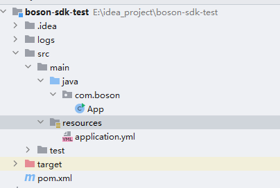
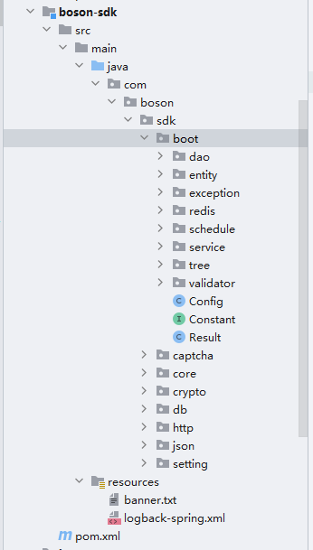

## 相同包名的依赖包

不使用spring spi的情况下，可以使用一种取巧的方法，即以jar包的方式进行集成依赖包的类到spring容器中，比如boson-sdk的实现方式

1、以正常的方式编写代码，抛弃启动类，并打成jar包  
2、利用springboot启动时的主类所在的包名在classpath中进行扫描。将jar包中的类正常加载到spring容器中

这种方式确实是不同于spring spi的实现机制
- spring spi 是根据spring.factories文件进行加载，从而带动整个jar包加载到spring容器中
- 相同包名的依赖包 则是利用依赖包内的包名和主类所在的包名一致完成加载

**由于这种方式在实现思路上就有缺陷，利用的是相同包名，如果包名不同则无法完成加载**