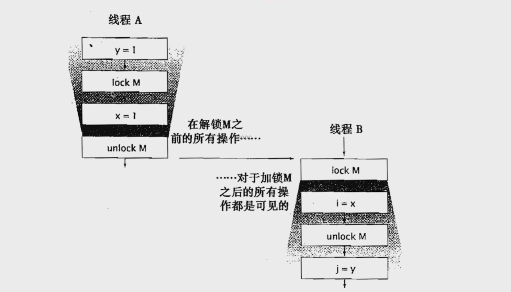
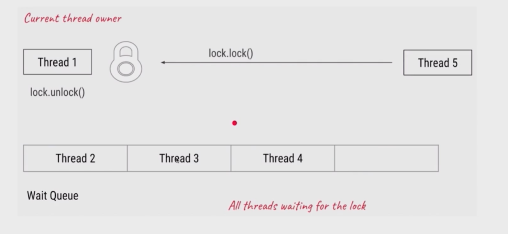
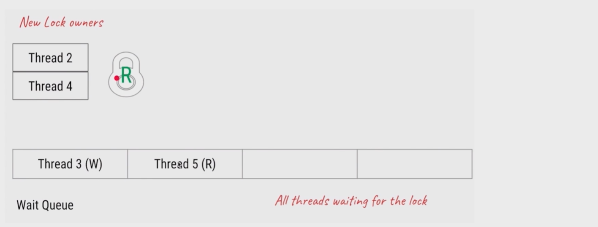
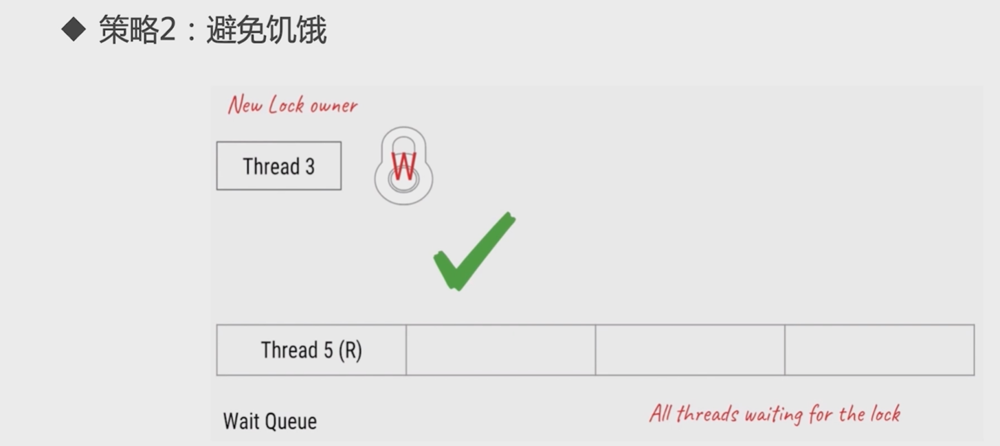

# 锁
---

> 1. lock接口
> 2. 锁的分类
> 3. 乐观锁和悲观锁
> 4. 可重入锁和非可重入锁，以ReentrantLoc为例
> 5. 公平锁和非公平锁
> 6. 共享锁和排他锁,以ReentrantReadWriteLock读写锁为例
> 7. 自旋锁和阻塞锁
> 8. 可中断的锁: 就是可以响应中断的锁
> 9. 锁优化

## Lock接口

> - 锁是一种工具，用于控制线程对共享资源的访问
> - Lock和Synchronized是最常见的锁，都可以达到线程安全的目的，但是在使用和功能上又有较大的不同,Lock并不是用来替代synchronized的，而是在 synchronized不合适或不满足条件的时候，来提供高级的功能
> - Lock接口最常见的实现类是ReentrantLock,通常情况下，Lock只允许一个线程来访问这个共享资源，不过有的时候，一些特殊的实现类也可以允许并发访问，比如ReadWriteLock中的ReadLock

### 为什么需要lock

> - synchronized的效率低：锁释放的情况少、试图获得锁时不能设定超时、不能中断一个正在试图获取锁的线程
> - synchronized不够灵活(读写锁更灵活),加锁和释放的时机单一，每个锁仅有单一的条件(某个对象)，可能时不够的
> - 无法知道是否成功获取到了锁

### lock 主要方法

- lock()
- tryLock()
- tryLock(long time,TimeUnit unit)
- lockInterruptibly()

#### lock()

> - lock()就是普通的获取锁，如果锁被其他线程获取，则进行等待
> - lock不会像synchronized一样在异常时自动释放锁
> - 因此最佳实践时，在finally中释放锁，以保证发生异常的时候锁一定被释放

```java
public class MustUnLock {
    // lock 不会释放锁
    private static Lock lock = new ReentrantLock();

    public static void main(String[] args) {
        lock.lock();
        try {
            System.out.println(Thread.currentThread() + "执行 ... ");
        } finally {
            lock.unlock();
        }
    }
}
```

**lock()方法不能被中断，这会带来很大的隐患，一旦陷入死锁，lock()方法就会永久等待**

#### tryLock()

> - tryLock()用来尝试获取锁，如果当前锁没有被其他锁占用，则表示获取成功，则返回true。否则返回false，代表获取锁失败
> - 相比于lock，这样的方法显然功能更加强大，我们可以根据是否获取到锁来决定后续程序的行为
> - 该方法会立即返回，即使拿不到锁也不会一直等待

#### tryLock(long time,TimeUnit unit)

> **超时放弃，最主要的作用时避免死锁**
> 在正常情况下，当两个线程互相获取对方持有的锁的时候，非常容易发生死锁。以synchronized为例。都持有己方的锁，获取对方的锁的时候就会发生死锁。

```java
public class TryLockDeadLock implements Runnable {
    int flag = 1;
    static Lock lock1 = new ReentrantLock();
    static Lock lock2 = new ReentrantLock();

    public static void main(String[] args) {
        TryLockDeadLock r1 = new TryLockDeadLock();
        TryLockDeadLock r2 = new TryLockDeadLock();

        r1.flag = 1;
        r2.flag = 2;

        Thread t1 = new Thread(r1);
        Thread t2 = new Thread(r2);

        t1.setName("THREAD-R1");
        t2.setName("THREAD-R2");

        t1.start();
        t2.start();
    }

    @Override
    public void run() {

        for (int i = 0; i < 100; i++) {
            if (flag == 1) {
                // 如果flag == 1，先获取锁1，然后获取锁2，释放锁2，释放锁1
                try {
                    if (lock1.tryLock(800, TimeUnit.MILLISECONDS)) {
                        try {
                            System.out.println(Thread.currentThread().getName() + ": 获取到锁 lock1");
                            Thread.sleep(new Random().nextInt(1000));

                            if (lock2.tryLock(800, TimeUnit.MILLISECONDS)) {
                                try {
                                    System.out.println(Thread.currentThread().getName() + ": 获取到锁 lock2");
                                    System.out.println(Thread.currentThread().getName() + ": 获取到了两把锁");
                                } finally {
                                    lock2.unlock();
                                    Thread.sleep(new Random().nextInt(1000));
                                    System.out.println(Thread.currentThread().getName() + ": 释放锁 lock2 ");
                                }
                            } else {
                                System.out.println(Thread.currentThread().getName() + ": 获取 lock2 失败，已重试");
                            }

                        } finally {
                            lock1.unlock();
                            System.out.println(Thread.currentThread().getName() + ": 释放锁 lock1 ");
                            Thread.sleep(new Random().nextInt(1000));
                        }
                    } else {
                        System.out.println(Thread.currentThread().getName() + ": 获取锁 lock1 失败，已重试");
                    }
                } catch (InterruptedException e) {
                    e.printStackTrace();
                }
            }

            if (flag == 2) {
                // 如果flag == 2，先获取锁2，然后获取锁1，释放锁1，释放锁2
                try {
                    if (lock2.tryLock(300, TimeUnit.MILLISECONDS)) {
                        try {
                            System.out.println(Thread.currentThread().getName() + ": 获取到锁 lock2");
                            Thread.sleep(new Random().nextInt(3000));


                            if (lock1.tryLock(300, TimeUnit.MILLISECONDS)) {
                                try {
                                    System.out.println(Thread.currentThread().getName() + ": 获取到锁 lock1");
                                    System.out.println(Thread.currentThread().getName() + ": 获取到了两把锁");
                                } finally {
                                    lock1.unlock();
                                    System.out.println(Thread.currentThread().getName() + ": 释放锁 lock1 ");
                                    Thread.sleep(new Random().nextInt(3000));
                                }
                            } else {
                                System.out.println(Thread.currentThread().getName() + ": 获取 lock1 失败，已重试");
                            }
                        } finally {
                            lock2.unlock();
                            System.out.println(Thread.currentThread().getName() + ": 释放锁 lock2 ");
                            Thread.sleep(new Random().nextInt(3000));
                        }
                    } else {
                        System.out.println(Thread.currentThread().getName() + ": 获取锁 lock2 失败，已重试");
                    }
                } catch (InterruptedException e) {
                    e.printStackTrace();
                }
            }
        }

    }
}
```

#### lockInterruptibly()

> 相当于 tryLock(long time,TimeUnit unit)超时时间设置为无限，在等锁的时候，线程可以被中断

```java
public class LockInterrupt implements Runnable {
    public static void main(String[] args) throws InterruptedException {
        LockInterrupt r1 = new LockInterrupt();
        LockInterrupt r2 = new LockInterrupt();

        Thread t1 = new Thread(r1);
        Thread t2 = new Thread(r2);

        t1.start();
        t2.start();

        Thread.sleep(5000);

        t1.interrupt();
        t2.interrupt();
    }

    static Lock lock = new ReentrantLock();

    @Override
    public void run() {
        try {
            lock.lockInterruptibly();

            try {
                System.out.println(Thread.currentThread().getName() + " 获取到了锁");
                Thread.sleep(50000);
            } catch (InterruptedException e) {
                System.out.println(Thread.currentThread().getName() + " 睡眠期间被中断了");
            } finally {
                lock.unlock();
                System.out.println(Thread.currentThread().getName() + " 释放了锁");
            }
        } catch (InterruptedException e) {
            System.out.println(Thread.currentThread().getName() + " 获取锁期间被中断了");
        }
    }
}

//Thread-1 获取到了锁
//Thread-0 获取锁期间被中断了
//Thread-1 睡眠期间被中断了
//Thread-1 释放了锁
```

#### unlock()

> 在获取到锁的时候，第一步必须要释放锁，然后再写业务逻辑，可以避免死锁

### lock的可见性

> lock 是具有可见性保障的，即happens-before原则(线程A获取锁到释放锁期间的所有操作，对线程B是可见的)
> 在程序运行过程中，所有的变更会先在寄存器或本地cache中完成，然后才会被拷贝到主存以跨越内存栅栏（本地或工作内存到主存之间的拷贝动作），此种跨越序列或顺序称为happens-before。



## 锁的分类

> 这些分类并不是互斥的，也就是多个类型可以并存：有可能一个锁同时属于两种类型,如，ReentrantLock即是互斥锁也是可重入锁


### 乐观锁(非互斥同步锁) 和 悲观锁(互斥同步锁)

#### 悲观锁的缺点

> 线程间的阻塞和唤醒带来的性能劣势
> 永久阻塞问题，如果持有锁的线程被永久阻塞了，比如遇到了无限循环、死锁等问题。那么等待该线程的释放锁的线程，将永远无法得到执行
> 优先级反转

#### 乐观锁和悲观锁的思想

> 悲观锁的思想是在修改共享数据之前必须要锁住资源。即资源只能被我独享，等我修改完成释放锁，其他线程才能进行操作

> 乐观锁的思想是在修改共享数据之前不锁资源，其他线程也可以进行修改。在更新的时候，对比我在修改期间的数据有没有被其他人修改过。如果没有修改过则表示只有我自己在操作。
> 但是如果数据和我一开始拿到的数据不一致，说明其他人进行了修改。会选择放弃、报错、重试的策略。
> 乐观锁一般采用cas算法实现。cas算法就是在一个原子操作内完成数据的比对和交换

#### 示例

- 悲观锁就是synchronized 和lock接口
- 乐观锁的典型 就是 原子类的并发容器

> **git就是典型的乐观锁。我们往仓库提交代码，如果仓库的版本大于本地的版本就失败，必须处理冲突。如果仓库的版本等于本地的版本，则顺利提交。**

> **数据库中的 select for update就是悲观锁， 用version进行控制就是乐观锁，**

#### version 乐观锁

```sql
-- 添加一个字段 lock_version
-- 先查询这个更新语句的version
select version
from table
-- 然后更新
update set num = 2,version=version+1
where version = 1 and id = 5
-- 如果version版本号相同，就直接进行更新，如果version版本号不一致，就更新出错没有更新上去，相当于丢弃。这就是乐观锁原理
```

#### 乐观锁和悲观锁的开销

- 悲观锁的原始开销要高于乐观锁，但是悲观锁的开销是固定的。临界区持有锁的时间越来越差，也不会对悲观锁的开销造成影响.
- 虽然乐观锁的开销要小于悲观锁，但是如果自旋时间很长，或者不停的重试，那么消耗的资源也会越来越多

#### 悲观锁和乐观锁的使用场景

- 悲观锁适用于并发写入很多的情况，适用于临界区持有锁时间比较长的情况，悲观锁可以避免大量无用的自旋等消耗
    - 临界区有IO操作
    - 临界区代码复杂或循环体很大
    - 临界区竞争非常激烈
- 乐观锁：适合并发写入少的情况，大部分都是读取的场景。不加锁的能让读取性能大幅度提升

### 可重入锁和非可重入锁

> 可重入锁是指现在在已经获取到锁后还能不能重新获取到锁。ReentrantLock和synchronize是可重入锁

#### 示例

```java
public class CinemaBookSeat {

    public static ReentrantLock lock = new ReentrantLock();

    private static void bookSeat() {
        lock.lock();
        try {
            System.out.println(Thread.currentThread().getName() + " 开始预定座位");
            Thread.sleep(500);
            System.out.println(Thread.currentThread().getName() + " 完成预定座位");
        } catch (InterruptedException e) {
            e.printStackTrace();
        } finally {
            lock.unlock();
        }
    }

    public static void main(String[] args) {
        new Thread(() -> {
            bookSeat();
        }).start();
        new Thread(() -> {
            bookSeat();
        }).start();
        new Thread(() -> {
            bookSeat();
        }).start();
        new Thread(() -> {
            bookSeat();
        }).start();
        new Thread(() -> {
            bookSeat();
        }).start();
    }
}

```

#### 可重入性质

> 可重入：线程在获取到锁A的时候，可以再次竞争获取锁A，这就是可重入锁。如果说线程获取到锁A,想要再次获取锁A，就必须释放锁A，这是不可重入锁
> 可重入锁又称为递归锁，指的是线程可以多次获取同一把锁

#### 可重入锁的好处

- 可重入锁可以避免死锁。以synchronize为例子。如果一个类中有两个方法被synchronize修改。在执行同步方法A的时候，想执行同步方法B。 这种情况下如果具备可重入性。避免发生死锁
- 提升封装性。避免一次加锁，一次解锁

```java
public class GetHoldCount {
    public static ReentrantLock lock = new ReentrantLock();

    public static void main(String[] args) {
        System.out.println(lock.getHoldCount());
        lock.lock();

        System.out.println(lock.getHoldCount());
        lock.lock();

        System.out.println(lock.getHoldCount());
        lock.lock();
        System.out.println(lock.getHoldCount());

        lock.unlock();

        System.out.println(lock.getHoldCount());
        lock.unlock();

        System.out.println(lock.getHoldCount());
        lock.unlock();

        System.out.println(lock.getHoldCount());
    }

}
```

```java
public class DealWithResource {
    public static ReentrantLock lock = new ReentrantLock();

    private static void dealWith() {
        lock.lock();
        try {
            System.out.println("已经执行");
            if (lock.getHoldCount() < 5) {
                dealWith();
            }
        } finally {
            lock.unlock();
        }
    }

    public static void main(String[] args) {
        dealWith();
    }
}

```

#### 可重入锁源码比对


#### 其他方法

- isHeldByCurrentThread() 锁是否被当前线程持有
- getQueueLength() 当前正在等待这把锁的队列有多长，一般用于调试

#### 公平锁和非公平锁

> 公平锁指的是按照线程的请求顺序，来分配锁;非公平指的是不完全按照请求顺序，在一定情况下可以插队
> **非公平锁是在一定的情况下进行插队，而不是盲目的插队**

#### 非公平锁的好处

> 非公平的锁是指在线程由阻塞状态被唤醒，这是有一定的空档期的。
> 在空档期期间，如果能够获取到锁并且很快的执行完成。就能有效的利用空档期，提高程序的吞吐量.
> ReentrantLock默认的公平策略就是非公平的.




#### 示例

```java
public class FairLock {

    public static void main(String[] args) throws InterruptedException {
        PrintQueue queue = new PrintQueue();
        Thread[] threadArr = new Thread[3];

        for (int i = 0; i < threadArr.length; i++) {
            threadArr[i] = new Thread(new Job(queue));
        }

        for (int i = 0; i < threadArr.length; i++) {
            threadArr[i].start();
            Thread.sleep(100);
        }

    }
}

class Job implements Runnable {
    private PrintQueue printQueue;

    public Job(PrintQueue printQueue) {
        this.printQueue = printQueue;
    }


    @Override
    public void run() {
        System.out.println(Thread.currentThread().getName() + " 开始打印");
        printQueue.printJob(new Object());
        System.out.println(Thread.currentThread().getName() + " 结束打印");
    }
}

class PrintQueue {
    public static ReentrantLock queueLock = new ReentrantLock(false);

    public void printJob(Object obj) {
        queueLock.lock();
        try {
            int time = new Random().nextInt(3) + 1;
            System.out.println(Thread.currentThread().getName() + " 打印需要时间: " + time);
            Thread.sleep(time * 1000);
        } catch (InterruptedException e) {
            e.printStackTrace();
        } finally {
            queueLock.unlock();
        }

        queueLock.lock();
        try {
            int time = new Random().nextInt(3) + 1;
            System.out.println(Thread.currentThread().getName() + " 打印需要时间: " + time);
            Thread.sleep(time * 1000);
        } catch (InterruptedException e) {
            e.printStackTrace();
        } finally {
            queueLock.unlock();
        }
    }
}
```

```conf
# 公平情况下
Thread-0 开始打印
Thread-0 打印需要时间: 1
Thread-1 开始打印
Thread-2 开始打印
Thread-1 打印需要时间: 1
Thread-2 打印需要时间: 1
Thread-0 打印需要时间: 3
Thread-0 结束打印
Thread-1 打印需要时间: 2
Thread-1 结束打印
Thread-2 打印需要时间: 1
Thread-2 结束打印

# 非公平情况下
Thread-0 开始打印
Thread-0 打印需要时间: 1
Thread-1 开始打印
Thread-2 开始打印
Thread-0 打印需要时间: 3
Thread-0 结束打印
Thread-1 打印需要时间: 1
Thread-1 打印需要时间: 2
Thread-1 结束打印
Thread-2 打印需要时间: 3
Thread-2 打印需要时间: 2
Thread-2 结束打印
```

> **tryLock()方法不遵守公平原则，当有线程在执行tryLock的时候，一旦有线程释放了锁，那么这个正在tryLock的线程就能获取到了锁，即使之前已经有其他线程在等待队列中了**

#### 公平锁和非公平锁的优缺点

锁|优点|缺点 -|-|- 公平锁|各个线程公平平等，每个线程在等待一段时间后，总有执行的机会|更慢，吞吐量小 非公平锁|更快，吞吐量更大|容易产生线程饥饿


### 共享锁和排他锁

> 排他锁又称为独占锁、独享锁，当一个线程持有排他锁的时候，当前线程可以进行查看和修改，其他线程是无法进行操作的。例如synchronized就是排他锁
> 共享锁又称为读锁，获取到共享锁之后，可以查看但是无法修改和删除数据。其他线程也可以获取到共享锁。同样只能查看但是无法修改数据

> 共享锁和排他锁典型就是读写锁ReentrantReadWriteLock，其中读锁是共享锁，写锁是独占锁

#### 读写锁的作用

> - 读写锁的作用是避免资源的浪费。假设使用ReentrantLock，虽然保证了读和写线程安全，但是在多个线程读的情况下，是没有线程安全问题的，没有必要进行堵塞。
> - 在读的地方使用读锁，在写的地方使用写锁，灵活控制。如果写锁的情况下，读是无阻塞的。提高程序的执行效率

#### 读写锁的规则

- 多线程只申请读锁，都可以申请到
- 如果有一个线程已经占用了读锁，则其他线程要申请写锁，则申请写锁的线程会一直等待读锁的释放.
- 如果有一个线程已经占用了写锁，则其他线程如果申请读锁或者是写锁，则申请读锁或写锁的线程会一直等待写锁释放

> **总而言之，要么是一个或多个线程同时有读锁，要么是一个线程有写锁，但是两者不会同时出现.要么多读，要么一写**

> **读写锁是一把锁，可以通过两种方式锁定：读锁定和写锁定。读写锁可以同时被一个或多个线程读锁定，也可以被单一线程写锁定。但是永远不能同时对这把锁进行读锁定和写锁定**

#### ReentrantReadWriteLock具体用法


```java
package lock.readwrite;

import java.util.concurrent.locks.ReentrantReadWriteLock;

/**
 * @program: currentency_tool_practice
 * @description:
 * @author: liweilong
 * @create: 2021-06-30 22:36
 **/
public class CinemaReadWrite {


    private static ReentrantReadWriteLock lock = new ReentrantReadWriteLock();
    private static ReentrantReadWriteLock.ReadLock readLock = lock.readLock();
    private static ReentrantReadWriteLock.WriteLock writeLock = lock.writeLock();

    public static void read() {
        readLock.lock();
        try {
            System.out.println(Thread.currentThread().getName() + " >>> 获取到读锁,正在读取");
            Thread.sleep(1000);
        } catch (InterruptedException e) {
            e.printStackTrace();
        } finally {
            System.out.println(Thread.currentThread().getName() + " >>> 释放读锁");
            readLock.unlock();
        }
    }

    public static void write() {
        writeLock.lock();
        try {
            System.out.println(Thread.currentThread().getName() + " >>> 获取到写锁,正在写入");
            Thread.sleep(1000);
        } catch (InterruptedException e) {
            e.printStackTrace();
        } finally {
            System.out.println(Thread.currentThread().getName() + " >>> 释放写锁");
            writeLock.unlock();
        }
    }

    public static void main(String[] args) {
        new Thread(() -> read(), "thread-1").start();
        new Thread(() -> read(), "thread-2").start();
        new Thread(() -> write(), "thread-3").start();
        new Thread(() -> write(), "thread-4").start();
    }

}
```

```shell
thread-1 >>> 获取到读锁,正在读取
thread-2 >>> 获取到读锁,正在读取
thread-1 >>> 释放读锁
thread-2 >>> 释放读锁
thread-3 >>> 获取到写锁,正在写入
thread-3 >>> 释放写锁
thread-4 >>> 获取到写锁,正在写入
thread-4 >>> 释放写锁
```

#### 读锁和写锁的交互方式

##### 读锁插队策略

> ReentrantReadWriteLock 可以通过构造函数来指定公平或非公平
> 在公平的情况下，所有的线程按照进入等待队列的顺序来执行。是不允许插队的

> 非公平: 假设线程一二正在读取，线程三想写入,在等待队列中等待。此时线程四五想要读取，那此时要不要进行插队？
> 插队，插队可以提高运行效率，因为读锁可以共享，并不存在线程安全的问题。


> 不插队，正常进入阻塞队列。**虽然不插队的效率低，可是能够避免写线程饥饿。当读锁可以插队的时候，假设有上千个读线程插队，并且能够衔接。写线程就会饥饿，得不到执行**




> ReentrantReadWriteLock 默认就是不插队

- 公平锁: 不允许插队
- 非公平锁：
    - 写锁随时可以插队
    - **读锁仅仅在等待队列头节点不是想获取写锁的时候可以插队**

##### 读写锁策略源码

```java
// 公平情况下仅仅校验队列中是否有线程，如果有就排队
static final class FairSync extends Sync {
    private static final long serialVersionUID = -2274990926593161451L;

    final boolean writerShouldBlock() {
        return hasQueuedPredecessors();
    }

    final boolean readerShouldBlock() {
        return hasQueuedPredecessors();
    }
}

// 非公共情况下读线程和写线程有不同的逻辑
static final class NonfairSync extends Sync {
    private static final long serialVersionUID = -8159625535654395037L;

    // 写线程永远可以插队
    final boolean writerShouldBlock() {
        return false; // writers can always barge
    }

    // 读线程需要
    final boolean readerShouldBlock() {
        /* As a heuristic to avoid indefinite writer starvation,
         * block if the thread that momentarily appears to be head
         * of queue, if one exists, is a waiting writer.  This is
         * only a probabilistic effect since a new reader will not
         * block if there is a waiting writer behind other enabled
         * readers that have not yet drained from the queue.
         */
        // 作为一种避免无限写入器缺乏的启发式方法，如果线程暂时看起来是队列头(如果存在线程)，
        // 则阻塞该线程是一个等待写入器。这只是一种概率效应，因为新读者不会
        // 如果在其他已启用且尚未从队列中耗尽的读取器后面有一个等待写入器，则阻塞。
        return apparentlyFirstQueuedIsExclusive();
    }
}
```

#### 读写锁插队演示

```java
// 读插队不成功
public class CinemaReadWrite {

    private static ReentrantReadWriteLock lock = new ReentrantReadWriteLock(false);
    private static ReentrantReadWriteLock.ReadLock readLock = lock.readLock();
    private static ReentrantReadWriteLock.WriteLock writeLock = lock.writeLock();

    public static void main(String[] args) {
        new Thread(() -> write(), "thread-1").start();
        new Thread(() -> read(), "thread-2").start();
        new Thread(() -> read(), "thread-3").start();
        new Thread(() -> write(), "thread-4").start();
        new Thread(() -> read(), "thread-5").start();

//    thread-1 >>> 获取到写锁,正在写入
//    thread-1 >>> 释放写锁
//    thread-2 >>> 获取到读锁,正在读取
//    thread-3 >>> 获取到读锁,正在读取
//    thread-2 >>> 释放读锁
//    thread-3 >>> 释放读锁
//    thread-4 >>> 获取到写锁,正在写入
//    thread-4 >>> 释放写锁
//    thread-5 >>> 获取到读锁,正在读取
//    thread-5 >>> 释放读锁
    }
}
```

##### 读写锁插队成功演示

```java
package lock.readwrite;

import java.util.concurrent.locks.ReentrantReadWriteLock;

/**
 * @program: currentency_tool_practice
 * @description:
 * @author: liweilong
 * @create: 2021-06-30 23:22
 **/
public class NoFairDemo {
    private static ReentrantReadWriteLock lock = new ReentrantReadWriteLock(false);
    private static ReentrantReadWriteLock.ReadLock readLock = lock.readLock();
    private static ReentrantReadWriteLock.WriteLock writeLock = lock.writeLock();

    public static void read() {
        System.out.println(Thread.currentThread().getName() + " >>> 尝试获取读锁");
        readLock.lock();
        try {
            System.out.println(Thread.currentThread().getName() + " >>> 获取到读锁,正在读取");
            Thread.sleep(20);
        } catch (InterruptedException e) {
            e.printStackTrace();
        } finally {
            System.out.println(Thread.currentThread().getName() + " >>> 释放读锁");
            readLock.unlock();
        }
    }

    public static void write() {
        System.out.println(Thread.currentThread().getName() + " >>> 尝试获取写锁");
        writeLock.lock();
        try {
            System.out.println(Thread.currentThread().getName() + " >>> 获取到写锁,正在写入");
            Thread.sleep(40);
        } catch (InterruptedException e) {
            e.printStackTrace();
        } finally {
            System.out.println(Thread.currentThread().getName() + " >>> 释放写锁");
            writeLock.unlock();
        }
    }

    public static void main(String[] args) {
        new Thread(() -> write(), "thread-1").start();
        new Thread(() -> read(), "thread-2").start();
        new Thread(() -> read(), "thread-3").start();
        new Thread(() -> write(), "thread-4").start();
        new Thread(() -> read(), "thread-5").start();

        new Thread(() -> {
            Thread[] threads = new Thread[1000];
            for (int i = 0; i < 1000; i++) {
                threads[i] = new Thread(() -> read(), "sub-thread-" + i);
            }
            for (int i = 0; i < 1000; i++) {
                threads[i].start();
            }
        }).start();
    }
}

```

##### 非公平情况

```shell
thread-1 >>> 尝试获取写锁
thread-1 >>> 获取到写锁,正在写入
thread-2 >>> 尝试获取读锁
thread-3 >>> 尝试获取读锁
thread-4 >>> 尝试获取写锁
thread-5 >>> 尝试获取读锁
sub-thread-0 >>> 尝试获取读锁
sub-thread-2 >>> 尝试获取读锁
...
thread-1 >>> 释放写锁
sub-thread-442 >>> 尝试获取读锁
sub-thread-443 >>> 尝试获取读锁
sub-thread-444 >>> 尝试获取读锁
sub-thread-445 >>> 尝试获取读锁
sub-thread-444 >>> 获取到读锁,正在读取 // 插队成功
sub-thread-350 >>> 尝试获取读锁
sub-thread-447 >>> 尝试获取读锁
sub-thread-445 >>> 获取到读锁,正在读取
...
sub-thread-365 >>> 尝试获取读锁
sub-thread-365 >>> 获取到读锁,正在读取
sub-thread-466 >>> 尝试获取读锁
sub-thread-466 >>> 获取到读锁,正在读取
thread-2 >>> 获取到读锁,正在读取
thread-3 >>> 获取到读锁,正在读取 // 当3获取到读锁，头节点是写锁的情况下，后面全是尝试获取读锁，无法真正获取都读锁
sub-thread-467 >>> 尝试获取读锁
```

##### 公平情况

```shell
thread-1 >>> 尝试获取写锁
thread-2 >>> 尝试获取读锁
thread-1 >>> 获取到写锁,正在写入
thread-3 >>> 尝试获取读锁
thread-4 >>> 尝试获取写锁
thread-5 >>> 尝试获取读锁
sub-thread-0 >>> 尝试获取读锁
sub-thread-1 >>> 尝试获取读锁
sub-thread-2 >>> 尝试获取读锁
...
thread-1 >>> 释放写锁
sub-thread-455 >>> 尝试获取读锁
sub-thread-456 >>> 尝试获取读锁
sub-thread-457 >>> 尝试获取读锁
sub-thread-458 >>> 尝试获取读锁
...
sub-thread-376 >>> 尝试获取读锁
sub-thread-476 >>> 尝试获取读锁
sub-thread-477 >>> 尝试获取读锁
sub-thread-478 >>> 尝试获取读锁
sub-thread-579 >>> 尝试获取读锁
thread-2 >>> 获取到读锁,正在读取 // 没有线程插队，即使头节点是读线程，也完全按照队列顺序执行
thread-3 >>> 获取到读锁,正在读取
sub-thread-480 >>> 尝试获取读锁
sub-thread-481 >>> 尝试获取读锁
... 
```

#### 读写锁的降级

> **在某些情况下，可能前期是需要持有写锁，后期仅仅需要持有读锁就可以了。读写锁是支持降级的**

#### 读锁升级写锁(失败)

```java
/**
 * @program: currentency_tool_practice
 * @description:
 * @author: liweilong
 * @create: 2021-06-30 23:47
 **/
public class Upgrading {

    private static ReentrantReadWriteLock lock = new ReentrantReadWriteLock();
    private static ReentrantReadWriteLock.ReadLock readLock = lock.readLock();
    private static ReentrantReadWriteLock.WriteLock writeLock = lock.writeLock();

    /**
     * @Description: 读锁升级写锁
     * @Param: []
     * @return: void
     * @Author: liweilong
     * @Date: 2021/7/1
     */
    public static void readUpWrite() {
        readLock.lock();
        try {
            System.out.println(Thread.currentThread().getName() + " >>> 获取到读锁,正在读取");
            Thread.sleep(1000);
            writeLock.lock();
            System.out.printf(Thread.currentThread().getName() + ">>> 获取到写锁，升级成功");
        } catch (InterruptedException e) {
            e.printStackTrace();
        } finally {
            System.out.println(Thread.currentThread().getName() + " >>> 释放读锁");
            readLock.unlock();
        }
    }

    /**
     * @Description: 读锁降级写锁
     * @Param: []
     * @return: void
     * @Author: liweilong
     * @Date: 2021/7/1
     */
    public static void writeDownRead() {
        writeLock.lock();
        try {
            System.out.println(Thread.currentThread().getName() + " >>> 获取到写锁,正在写入");
            Thread.sleep(1000);
            readLock.lock();
            System.out.println(Thread.currentThread().getName() + ">>> 在不释放写锁的情况下，获取到读锁降级成功");
        } catch (InterruptedException e) {
            e.printStackTrace();
        } finally {
            readLock.unlock();
            System.out.println(Thread.currentThread().getName() + " >>> 释放写锁");
            writeLock.unlock();
        }
    }

    public static void main(String[] args) throws InterruptedException {
        System.out.println(">>> 写锁是可以成功降级的");
        Thread thread1 = new Thread(() -> writeDownRead(), "Thread-1");
        thread1.start();
        thread1.join();
        System.out.println(">>>>>>>>>>>>>>>>>>>>>>>>>>>>>>>>>>>>>>>>>>>>>>");

        System.out.println(">>> 读锁是不可以升级写锁的");
        Thread thread2 = new Thread(() -> readUpWrite(), "Thread-2");
        thread2.start();
    }

}
```

```shell
>>> 写锁是可以成功降级的
Thread-1 >>> 获取到写锁,正在写入
Thread-1>>> 在不释放写锁的情况下，获取到读锁降级成功
Thread-1 >>> 释放写锁
>>>>>>>>>>>>>>>>>>>>>>>>>>>>>>>>>>>>>>>>>>>>>>
>>> 读锁是不可以升级写锁的
Thread-2 >>> 获取到读锁,正在读取
```

> **读锁不能升级到写锁的原因是: 假设线程A，线程B都想升级写锁，但是同时都是读锁。由于读写锁要求一个线程只能在同一时刻持有写锁或读锁。那么线程A和B都希望对方释放锁，就会产生死锁**

#### 共享锁和排他锁总结

> ReentrantReadWriteLock实现了ReadWriteLock接口,最主要的两个方法:readLock() 和 writeLock()用来获取读锁和写锁

> 锁申请和释放策略
> - 多个线程只申请读锁都可以申请到
> - 如果一个线程已经占用了读锁，其他线程想要申请写锁，则申请写锁的线程会一直等待释放读锁
> - 如果有一个线程已经占用写锁，其他线程想要申请写锁或读锁，则申请的线程会一直等待释放写锁
> - **要么一个或多个线程同时持有读锁，要么是一个线程持有写锁，但是两者不会同时出现**

> **锁的插队策略：为了防止饥饿，读锁不能插队**

> **锁的升级策略：只能降级，不能升级**

> **ReentrantLock适用于一般场合，ReentrantReadWriteLock适用于读多写少的情况，合理适用可以提高并发策略**

### 自旋锁和阻塞锁

#### 自旋锁

> 阻塞或唤醒一个java线程由需要操作系统切换cpu状态来完成，这种状态转换需要耗费处理器时间。如果同步代码块中的内容过于简单，**状态转换消耗的时间有可能比用户代码执行的时间还要长**。
> 在很多场景中，同步资源锁定的时间很短，为了这一小段时间去切换线程，线程挂起和恢复现场所花费的时间会让系统的得不偿失。

> **而为了让当前线程稍等一下，我们需要让当前线程进行自旋，如果在自旋完成后前面锁定同步资源的线程已经释放了锁，那么当前线程就可以不在阻塞而是直接获取同步资源，从而避免切换线程的开销。这就是自旋锁**

#### 阻塞锁

> 阻塞锁和自旋锁相反，阻塞锁如果遇到拿到锁的情况，会把线程阻塞，等待被唤醒.

#### 自旋锁的缺点

- 如果锁被占用的时间过长，那么自旋的线程只会白白浪费处理器资源
- 在自旋的过程中，一直消耗cpu资源，所以自旋锁的起始开销低于悲观锁，但是随着自旋时间的增长，开销也是线性增长的.

#### 自旋锁的实现原理(AtomicInteger)

```java
public class AtomicInteger extends Number implements java.io.Serializable {
    private static final Unsafe unsafe = Unsafe.getUnsafe();

    public final int incrementAndGet() {
        return unsafe.getAndAddInt(this, valueOffset, 1) + 1;
    }
}

public final class Unsafe {
    public final int getAndAddInt(Object var1, long var2, int var4) {
        int var5;
        do {
            var5 = this.getIntVolatile(var1, var2);
        } while (!this.compareAndSwapInt(var1, var2, var5, var5 + var4));

        return var5;
    }
}
```

> 自旋锁实现的原理是CAS(在一个原子操作内完成数据的比对和交换),AtomicInteger中调用unsafe进行自增操作的源码中的do-while循环就是一个自旋操作.
> 如果修改过程中遇到其他线程竞争导致修改失败，就在while内死循环，直至修改成功.

#### 实现简易自旋锁

```java

/**
 * @program: currentency_tool_practice
 * @description:
 * @author: liweilong
 * @create: 2021-07-01 22:27
 **/
public class SpinLock {

    AtomicReference<Thread> sign = new AtomicReference<>();

    private void lock() {
        Thread current = Thread.currentThread();
        while (!sign.compareAndSet(null, current)) {
            System.out.println(Thread.currentThread().getName() + ">>> 尝试获取锁中...");
        }
    }

    private void unlock() {
        Thread current = Thread.currentThread();
        sign.compareAndSet(current, null);
    }

    public static void main(String[] args) {

        SpinLock spinLock = new SpinLock();
        Runnable runnable = () -> {
            System.out.println(Thread.currentThread().getName() + ">>> 开始获取自旋锁");
            spinLock.lock();
            System.out.println(Thread.currentThread().getName() + ">>> 已经获取到自旋锁");
            try {
                Thread.sleep(300);
            } catch (InterruptedException e) {
                e.printStackTrace();
            } finally {
                System.out.println(Thread.currentThread().getName() + ">>> 释放自旋锁");
                spinLock.unlock();
            }
        };

        new Thread(runnable, "Thread-1").start();
        new Thread(runnable, "Thread-2").start();
    }
}

```

```shell

Thread-1>>> 开始获取自旋锁
Thread-2>>> 开始获取自旋锁
Thread-1>>> 已经获取到自旋锁
Thread-2>>> 尝试获取锁中...
...
Thread-2>>> 尝试获取锁中...
Thread-2>>> 尝试获取锁中...
Thread-1>>> 释放自旋锁
Thread-2>>> 尝试获取锁中...
Thread-2>>> 已经获取到自旋锁
Thread-2>>> 释放自旋锁
```

### 可中断锁

> 在java中synchronized就是不可中断的锁，而lock是可中断的锁，因为tryLock(time)和lockInterruptibly都能响应中断.
> 如果某一个线程A正在执行锁中的代码，而另一个线程B正在等待获取该锁，可能由于等待时间过长，线程B不想等待了，想处理其他事情。**能够响应中断的锁就是可中断锁**

### 锁的优化

#### jvm对锁的优化

- 自旋锁和自适应。自旋锁在某些情况下可以提高代码的效率。自适应是指JVM能够根据上下文条件判断自旋次数和是否直接转入阻塞
- 锁消除，如果所有同步的东西都在方法内部，在这种情况下，JVM会分析出，然后将锁消除
- 锁粗化，如果一系列对象都是对锁进行加锁和解锁，这种情况下，JVM会将一系列转为一个加锁和解锁

#### 编写注意点

- 缩小同步代码块，只锁住需要锁住的代码
- 尽量不要锁住方法
- 减少请求锁的次数，比如说在某一场景下，多个线程的计算结果需要输出到数据库，可以将数据进行收集，然后由一个统一的线程进行处理
- 避免人为制造共享数据，比如hashMap的size方法，就是维护一个计数器。如果没有计数器，就需要遍历获取。当一个线程持有锁遍历的时候，其他线程只能等待
- 锁中尽量不要再包含锁，避免死锁
- 选择合适的锁，读多写少适用读写锁，并发度不高的时候可以使用原子类

### 锁的分类和介绍
- 偏向锁/轻量级锁/重量级锁
- 可重入锁/非可重入锁
- 共享锁/独占锁
- 公平锁/非公平锁
- 悲观锁/乐观锁
- 自旋锁/非自旋锁
- 可中断锁/不可中断锁
  偏向锁/轻量级锁/重量级锁


> 第一种分类是偏向锁/轻量级锁/重量级锁，这三种锁特指 synchronized 锁的状态，通过在对象头中的 mark word 来表明锁的状态。

> **偏向锁**  
> 如果自始至终，对于这把锁都不存在竞争，那么其实就没必要上锁，只需要打个标记就行了，这就是偏向锁的思想。  
> 一个对象被初始化后，还没有任何线程来获取它的锁时，那么它就是可偏向的，当有第一个线程来访问它并尝试获取锁的时候，它就将这个线程记录下来，以后如果尝试获取锁的线程正是偏向锁的拥有者，就可以直接获得锁，开销很小，性能最好。  

> **轻量级锁**  
> JVM 开发者发现在很多情况下，synchronized 中的代码是被多个线程交替执行的，而不是同时执行的，也就是说并不存在实际的竞争，或者是只有短时间的锁竞争，  
> 用 CAS 就可以解决，这种情况下，用完全互斥的重量级锁是没必要的。轻量级锁是指当锁原来是偏向锁的时候，被另一个线程访问，说明存在竞争，那么偏向锁就会升级为轻量级锁，线程会通过自旋的形式尝试获取锁，而不会陷入阻塞。


> **重量级锁**  
> 重量级锁是互斥锁，它是利用操作系统的同步机制实现的，所以开销相对比较大。当多个线程直接有实际竞争，且锁竞争时间长的时候，轻量级锁不能满足需求，锁就会膨胀为重量级锁。重量级锁会让其他申请却拿不到锁的线程进入阻塞状态。  
> 你可以发现锁升级的路径：无锁→偏向锁→轻量级锁→重量级锁。  
> 综上所述，偏向锁性能最好，可以避免执行 CAS 操作。而轻量级锁利用自旋和 CAS 避免了重量级锁带来的线程阻塞和唤醒，性能中等。重量级锁则会把获取不到锁的线程阻塞，性能最差。


> **可重入锁/非可重入锁**  
> 第 2 个分类是可重入锁和非可重入锁。  
> 可重入锁指的是线程当前已经持有这把锁了，能在不释放这把锁的情况下，再次获取这把锁。  
> 同理，不可重入锁指的是虽然线程当前持有了这把锁，但是如果想再次获取这把锁，也必须要先释放锁后才能再次尝试获取.  
> 对于可重入锁而言，最典型的就是 ReentrantLock 了，正如它的名字一样，reentrant 的意思就是可重入，它也是 Lock 接口最主要的一个实现类。


> **共享锁/独占锁**  
> 第 3 种分类标准是共享锁和独占锁。  
> 共享锁指的是我们同一把锁可以被多个线程同时获得，而独占锁指的就是，这把锁只能同时被一个线程获得。我们的读写锁，就最好地诠释了共享锁和独占锁的理念。  
> 读写锁中的读锁，是共享锁，而写锁是独占锁。读锁可以被同时读，可以同时被多个线程持有，而写锁最多只能同时被一个线程持有。

> **公平锁/非公平锁**  
> 第 4 种分类是公平锁和非公平锁。公平锁的公平的含义在于如果线程现在拿不到这把锁，那么线程就都会进入等待，开始排队，在等待队列里等待时间长的线程会优先拿到这把锁，有先来先得的意思。  
> 而非公平锁就不那么"完美"了，它会在一定情况下，忽略掉已经在排队的线程，发生插队现象。


>**悲观锁/乐观锁**  
> 第 5 种分类是悲观锁，以及与它对应的乐观锁。  
> 悲观锁的概念是在获取资源之前，必须先拿到锁，以便达到“独占”的状态，当前线程在操作资源的时候，其他线程由于不能拿到锁，所以其他线程不能来影响我。而乐观锁恰恰相反，它并不要求在获取资源前拿到锁，也不会锁住资源；  
> 相反，乐观锁利用 CAS 理念，在不独占资源的情况下，完成了对资源的修改。

> **自旋锁/非自旋锁**  
> 第 6 种分类是自旋锁与非自旋锁。  
> 自旋锁的理念是如果线程现在拿不到锁，并不直接陷入阻塞或者释放 CPU 资源，而是开始利用循环，不停地尝试获取锁，这个循环过程被形象地比喻为“自旋”，就像是线程在“自我旋转”。  
> 相反，非自旋锁的理念就是没有自旋的过程，如果拿不到锁就直接放弃，或者进行其他的处理逻辑，例如去排队、陷入阻塞等。

> **可中断锁/不可中断锁**  
> 第 7 种分类是可中断锁和不可中断锁。  在 Java 中，synchronized 关键字修饰的锁代表的是不可中断锁，一旦线程申请了锁，就没有回头路了，只能等到拿到锁以后才能进行其他的逻辑处理。  
> 而我们的 ReentrantLock 是一种典型的可中断锁，例如使用 lockInterruptibly 方法在获取锁的过程中，突然不想获取了，那么也可以在中断之后去做其他的事情，不需要一直傻等到获取到锁才离开。

### 非公平锁存在的意义
> 首先，我们来看下什么是公平锁和非公平锁，公平锁指的是按照线程请求的顺序，来分配锁；而非公平锁指的是不完全按照请求的顺序，在一定情况下，可以允许插队。但需要注意这里的非公平并不是指完全的随机，不是说线程可以任意插队，而是仅仅“在合适的时机”插队。  

> 那么什么时候是合适的时机呢？假设当前线程在请求获取锁的时候，恰巧前一个持有锁的线程释放了这把锁，那么当前申请锁的线程就可以不顾已经等待的线程而选择立刻插队。但是如果当前线程请求的时候，前一个线程并没有在那一时刻释放锁，那么当前线程还是一样会进入等待队列。  

> 为了能够更好的理解公平锁和非公平锁，我们举一个生活中的例子，假设我们还在学校读书，去食堂排队买饭，我排在队列的第二个，我前面还有一位同学，但此时我脑子里想的不是午饭，而是上午的一道数学题并陷入深思，所以当前面的同学打完饭之后轮到我时我走神了，并也没注意到现在轮到我了，此时前面的同学突然又回来插队，说“不好意思，阿姨麻烦给我加个鸡腿”，像这样的行为就可以类比我们的公平锁和非公平锁。  

> 看到这里，你可能不解，为什么要设置非公平策略呢，而且非公平还是 ReentrantLock的默认策略，如果我们不加以设置的话默认就是非公平的，难道我的这些排队的时间都白白浪费了吗，为什么别人比我有优先权呢？毕竟公平是一种很好的行为，而非公平是一种不好的行为。  

> 让我们考虑一种情况，假设线程 A 持有一把锁，线程 B 请求这把锁，由于线程 A 已经持有这把锁了，所以线程 B 会陷入等待，在等待的时候线程 B 会被挂起，也就是进入阻塞状态，那么当线程 A 释放锁的时候，本该轮到线程 B 苏醒获取锁，但如果此时突然有一个线程 C 插队请求这把锁，那么根据非公平的策略，会把这把锁给线程 C，这是因为唤醒线程 B 是需要很大开销的，很有可能在唤醒之前，线程 C 已经拿到了这把锁并且执行完任务释放了这把锁。相比于等待唤醒线程 B 的漫长过程，插队的行为会让线程 C 本身跳过陷入阻塞的过程，如果在锁代码中执行的内容不多的话，线程 C 就可以很快完成任务，并且在线程 B 被完全唤醒之前，就把这个锁交出去，这样是一个双赢的局面，对于线程 C 而言，不需要等待提高了它的效率，而对于线程 B 而言，它获得锁的时间并没有推迟，因为等它被唤醒的时候，线程 C 早就释放锁了，因为线程 C 的执行速度相比于线程 B 的唤醒速度，是很快的，所以 Java 设计者设计非公平锁，是为了提高整体的运行效率。 
