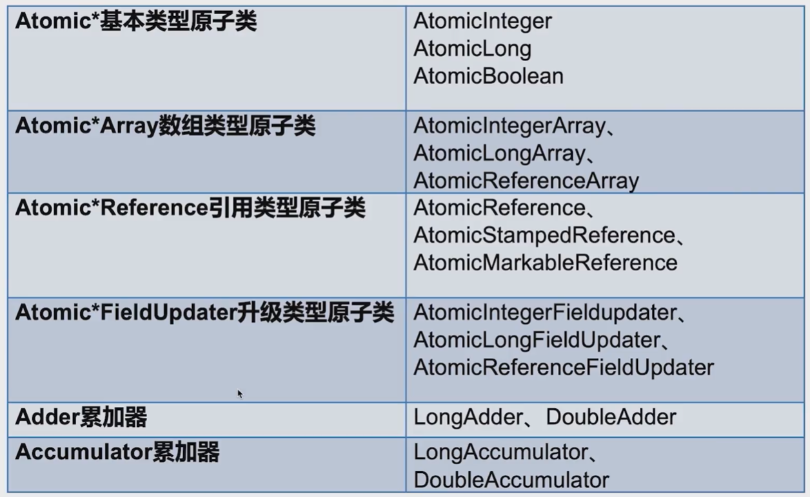

# 原子类
--- 
> 原子性: 一个操作是不可中断的，即使是多线程的情况下也可以保证

## 原子类存在的必要性

> 原子类的作用和锁类似，是为了保证并发情况下的线程安全，不过原子类相对于锁有一定的优势  
> **粒度更细：原子变量可以把竞争的范围缩小到变量级别，这样我们可以获得到更细粒度的情况了，通常锁的粒度都要大于原子变量的粒度。**  
> **效率更高: 通常使用原子类的效率会高于使用锁的效率，除了高度竞争的情况**

## 原子类纵览



## AtomicInteger

### 常用方法

- public final int get() // 获取当前值
- public final int getAndSet(int newValue) // 获取当前值，并设置新值
- public final int getAndIncrement() // 获取当前值，并自增
- public final int getAndDecrement() // 获取当前值，并自减
- public final int getAndAdd(int delta) // 获取当前值，并加上预期值
- boolean compareAndSet(int expect,int update) // 如果当前的数值等于预期值，则以原子类将该值设置为输入值

```java
package lock.atomicDemo;

import java.util.concurrent.atomic.AtomicInteger;

/**
 * @program: currentency_tool_practice
 * @description:
 * @author: liweilong
 * @create: 2021-07-01 23:28
 **/
public class AtomicIntegerDemo implements Runnable {

    private static AtomicInteger atomicInteger = new AtomicInteger(0);
    private static volatile int basicInteger = 0;

    public void atomicAdd() {
        atomicInteger.incrementAndGet();
    }

    public void basicAdd() {
        basicInteger++;
    }


    public static void main(String[] args) throws InterruptedException {
        AtomicIntegerDemo r = new AtomicIntegerDemo();
        Thread t1 = new Thread(r);
        Thread t2 = new Thread(r);

        t1.start();
        t2.start();

        t1.join();
        t2.join();

        System.out.println("原子整数计算结果: " + atomicInteger.get());
        System.out.println("普通整数计算结果: " + basicInteger);

//        原子整数计算结果: 40000
//        普通整数计算结果: 36330
    }

    @Override
    public void run() {
        for (int i = 0; i < 20000; i++) {
            atomicAdd();
            basicAdd();
        }
    }
}

```

## AtomicArray

```java
package lock.atomicDemo;

import java.util.concurrent.atomic.AtomicIntegerArray;

/**
 * @program: currentency_tool_practice
 * @description:
 * @author: liweilong
 * @create: 2021-07-01 23:40
 **/
public class AtomicArrayDemo {

    private static AtomicIntegerArray array = new AtomicIntegerArray(1000);

    public static void main(String[] args) {
        Thread[] addArray = new Thread[100];
        Thread[] subtracArray = new Thread[100];

        Add add = new Add(array);
        Subtract subtract = new Subtract(array);

        for (int i = 0; i < 100; i++) {
            addArray[i] = new Thread(add);
            subtracArray[i] = new Thread(subtract);

            addArray[i].start();
            subtracArray[i].start();
        }

        for (int i = 0; i < 100; i++) {
            try {
                addArray[i].join();
                subtracArray[i].join();
            } catch (InterruptedException e) {
                e.printStackTrace();
            }
        }

        for (int i = 0; i < array.length(); i++) {
            System.out.println(array.get(i));
        }
        System.out.println("运行结束");

    }
}

class Subtract implements Runnable {

    private AtomicIntegerArray array;

    public Subtract(AtomicIntegerArray array) {
        this.array = array;
    }

    @Override
    public void run() {
        for (int i = 0; i < array.length(); i++) {
            array.getAndDecrement(i);
        }
    }
}

class Add implements Runnable {

    private AtomicIntegerArray array;

    public Add(AtomicIntegerArray array) {
        this.array = array;
    }

    @Override
    public void run() {
        for (int i = 0; i < array.length(); i++) {
            array.getAndIncrement(i);
        }
    }
}
```
### 普通数组
```java
package lock.atomicDemo;

/**
 * @program: currentency_tool_practice
 * @description:
 * @author: liweilong
 * @create: 2021-07-01 23:40
 **/
public class AtomicArrayDemo {

    private static Integer[] array = new Integer[1000];

    public static void main(String[] args) {
        Thread[] addArray = new Thread[100];
        Thread[] subtracArray = new Thread[100];

        for (int i = 0; i < array.length; i++) {
            array[i] = 0;
        }
        Add add = new Add(array);
        Subtract subtract = new Subtract(array);

        for (int i = 0; i < 100; i++) {
            addArray[i] = new Thread(add);
            subtracArray[i] = new Thread(subtract);

            addArray[i].start();
            subtracArray[i].start();
        }

        for (int i = 0; i < 100; i++) {
            try {
                addArray[i].join();
                subtracArray[i].join();
            } catch (InterruptedException e) {
                e.printStackTrace();
            }
        }

        Integer errorCount = 0;
        for (int i = 0; i < array.length; i++) {
            if (0 != array[i]) {
                errorCount++;
            }
        }
        System.out.println("运行结束,错误数量: " + errorCount);
//        运行结束,错误数量: 48
//        运行结束,错误数量: 46
//        运行结束,错误数量: 107
    }
}

class Subtract implements Runnable {

    private Integer[] array;

    public Subtract(Integer[] array) {
        this.array = array;
    }

    @Override
    public void run() {
        for (int i = 0; i < array.length; i++) {
            array[i] -= 1;
        }
    }
}

class Add implements Runnable {

    private Integer[] array;

    public Add(Integer[] array) {
        this.array = array;
    }

    @Override
    public void run() {
        for (int i = 0; i < array.length; i++) {
            array[i] += 1;
        }
    }
}
```


