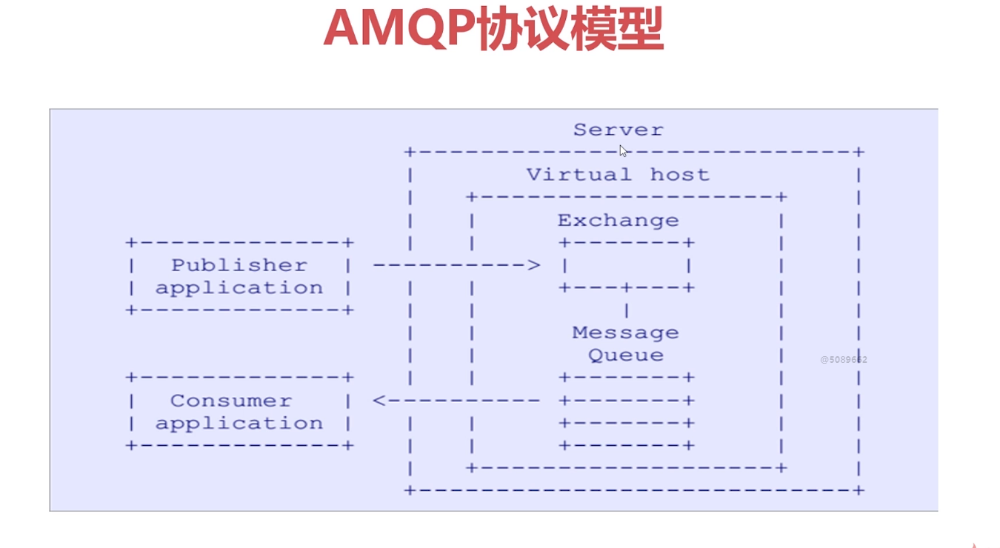
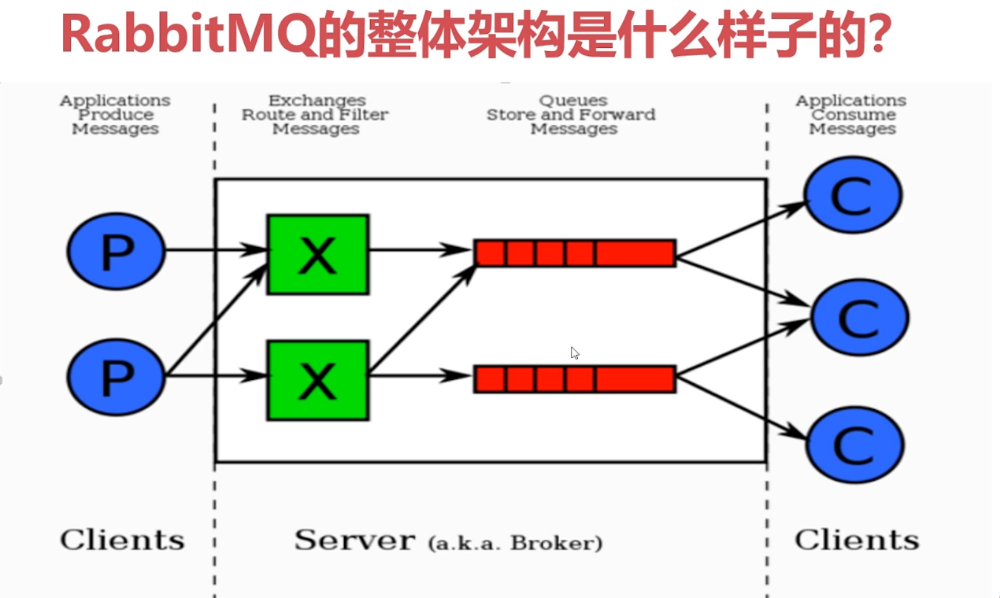
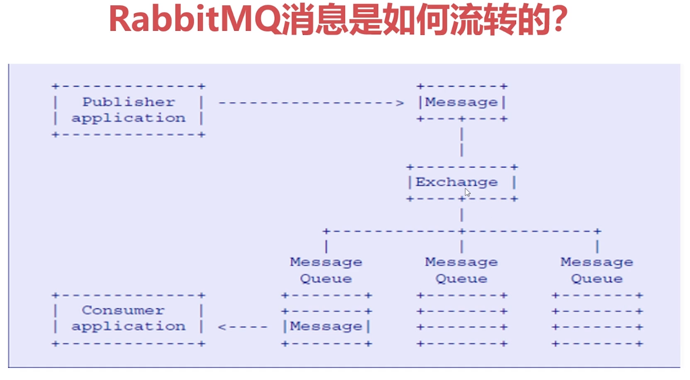
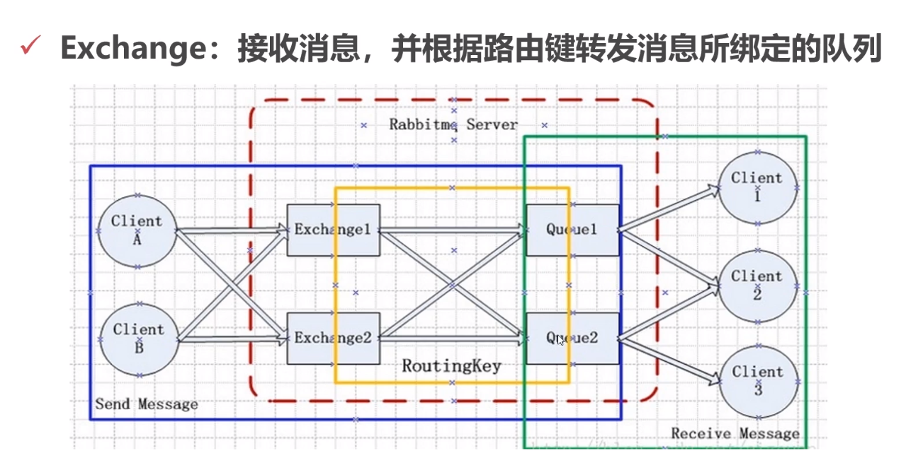
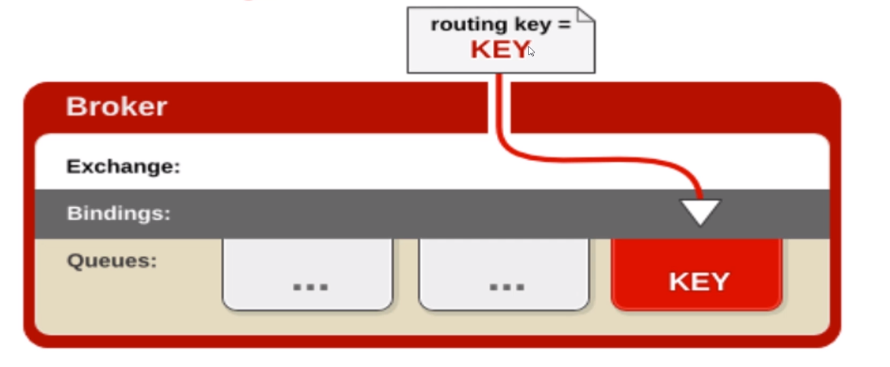
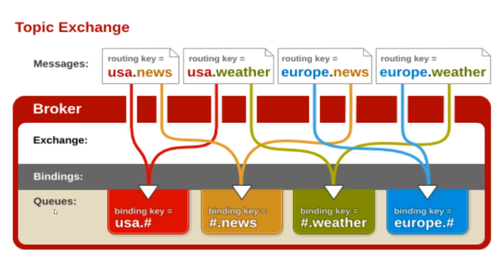
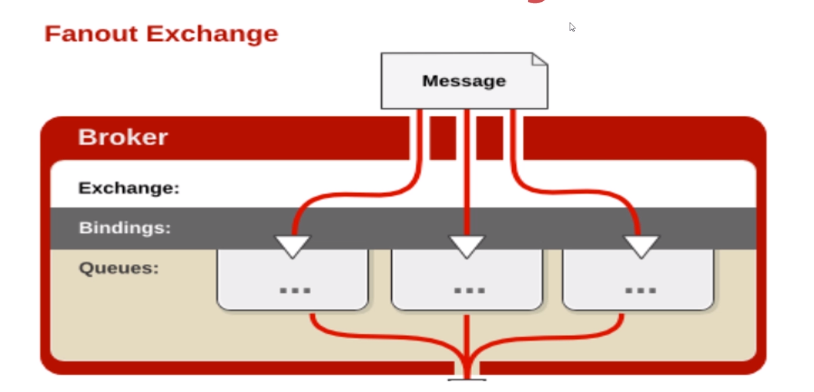

# RabbitMQ 核心概念
--- 
## RabbitMQ 入门
> Rabbit MQ 是一个开源的消息代理和队列服务器，用来通过普通的协议，	在完全不同的应用间共享数据，RabbitMQ是使用Erlang编写的，并且RabbitMQ是基于AMQP协议的。

### RabbitMQ 优点
* 开源，性能优秀，稳定性保障
* 提供可靠性消息投递模式，返回模式
* 与Spring AMQP 完美的整合，API丰富
* 集群模式非常丰富，表达式配置，HA模式，镜像队列模式
* 保证数据不丢失的前提下做到高可靠性，可用性
###  RabbitMQ 高性能的原因
Erlang 语言的在数据交换方面高性能
### AMQP
#### AMQP 
> AMQP :是具有现代特征的二进制协议，是一个提供统一消息服务的应用层标准高级消息队列协议，是应用层协议的开放标准，为面向消息的中间件设计

#### AMQP 协议模型


#### AMQP 核心概念
* **Server**：又称为 Borker，接受客户端连接，实现 AMQP 实体服务
* **Connection** ： 连接，应用程序与Broker的网络连接
* **Channel**：网络信道，几乎所有的操作都是在Channel中进行的，Channel是进行消息读写的通道，客户端可以建立多个Channel，没个Channel都表示一个会话
* **Message**：消息，服务器和应用程序之间传送的数据，由Properties和Body组成，Properties对消息进行修饰，比如消息的优先级和延迟等高级特性，Body则是消息的具体内容
* **Virtual host（逻辑概念）** ：虚拟地址，用于进行逻辑隔离，最上层的消息路由。一个Virtual host 中可以有若干个 Exchange和Queue，同一个Virtual host 里面不能有相同名称的Exchange 和 Queue
* **Exchange**：交换机，接收消息，根据路由键转发消息到绑定的队列
* **binding**：Exchange 和 Queue 之间的虚拟连接，binding 中可以包含routing key
* **Routing key**：一个路由规则，虚拟机可以用它来确定如何路由一个特定的消息
* **Queue**：也称之为 Message Queue，消息队列，保存消息并将他们转发给消费者

### RabbitMQ 的整体架构


> 生产者 将消息发送到 Exchange，由Exchange 路由和过滤 消息到 Queue，消费者 监听 Queue 获取消息进行 消费，在整个流程中，生产者 仅仅将消息发送到 Exchange不需要关心 Exchange 路由到那个Queue，而消费者 仅仅需要监听 Queue 不需要关心 消息来自那个 Exchange，具体的消息的分配逻辑 放在了Server中，实现解耦


> 生产者将消息投递到 RabbitMQ中的Exchange ，Exchange 根据 routing key将消息路由到具体的Queue，由消费者监听队列，获取消息进行消费。因此发送消息的时候需要指定两个关键的属性，指定Exchange和指定Routingkey

### RabbitMQ 命令行常用命令
命令 | 作用
- | -
基本操作 | -
rabbitmqctl stop_app | 关闭应用
rabbitmqctl start_app | 开启应用
rabbitmqctl status | 节点状态
rabbitmqctl add_user username password | 添加用户
rabbitmqctl list_users | 列出用户列表
rabbitmqctl delete_user username | 删除用户
rabbitmqctl clear_permissions -p vhostpath username | 清除用户权限
rabbitmqctl list_user_permissions | 列出用户权限
rabbitmqctl change_password username newpassword | 修改密码
rabbitmqctl set_permissions -p vhostpath username ".*" ".*" ".*" | 设置用户权限
虚拟主机 | -
rabbitmqctl add_vhost vhostpath | 创建虚拟主机
rabbitmqctl list_vhosts | 列出所有的虚拟主机
rabbitmqctl list_permissions -p vhostpath | 列出虚拟主机上所有的权限
rabbitmqctl delete_vhost vhostpath | 删除虚拟主机
队列  | -
rabbitmqctl list_queues | 查看所有的队列信息
rabbitmqctl -p vhostpath purge_queue blue | 清除队列里的信息
高级 | -
rabbitmqctl reset | 移除所有的数据，要在rabbitmqctl stop_app 之后使用
rabbitmqctl join_cluster <clusternode> [--ram] | 组成集群命令
rabbitmqctl cluster_status | 查看 集群状态
rabbitmqctl change_cluster_node_type disc ( ram) | 修改集群节点的存储形式
rabbitmqctl forget_cluster_node [--offline] | 忘记节点 （摘除节点）
rabbitmqctl rename_cluster_node_oldnode1 newnode1 [oldnode2] [newnode2...] | 修改节点名称

### 生产者 和 消费者模型构建
* ConnectionFactory ：获取连接工厂
* Connection ： 一个连接
* Channel ： 数据通信信道，可发送和接收消息
* Queue：具体的消息存储队列
* Producer & Consumer 生产者 和 消费者

``` java
public class Procuder {
    public static void main(String[] args) throws IOException, TimeoutException {

        // TODO 创建一个 ConnectionFactory
        ConnectionFactory connectionFactory = new ConnectionFactory();

        connectionFactory.setHost("47.105.177.85");
        connectionFactory.setPort(5672);
        connectionFactory.setVirtualHost("/");

        // TODO 通过 ConnectionFactory 创建链接
        Connection connection = connectionFactory.newConnection();

        // TODO 通过 Connection 创建 Channel
        Channel channel = connection.createChannel();

        // TODO 通过 Channel 发送消息
        for (int i = 0; i < 5; i++) {
            String body = i + " hello RabbitMQ";
            /**
             * 生产者发送消息的时候，必须指定 Exchange，如果不指定Exchange ，则是默认的 exchange（AMQP DEFAULT）,
             * 而 routingKey 则查看MQ上有没有相同名称的队列 路由到 相同名称的 Queue
             */
            channel.basicPublish("", "test001", null, body.getBytes());
        }
        // TODO 关闭相关的连接
        channel.close();
        connection.close();
    }
}
```
消费者
``` java
public class Consumer {

    public static void main(String[] args) throws IOException, TimeoutException, InterruptedException {
        // 1 TODO 创建一个 ConnectionFactory
        ConnectionFactory connectionFactory = new ConnectionFactory();

        connectionFactory.setHost("47.105.177.85");
        connectionFactory.setPort(5672);
        connectionFactory.setVirtualHost("/");

        // 2 TODO 通过 ConnectionFactory 创建链接
        Connection connection = connectionFactory.newConnection();

        // 3 TODO 通过 Connection 创建 Channel
        Channel channel = connection.createChannel();
        String queueName = "test001";

        // 4 TODO 声明队列
        channel.queueDeclare(queueName,true,false,false,null);

        // 5 TODO 创建消费者
        QueueingConsumer queueingConsumer = new QueueingConsumer(channel);

        // 6 TODO 设置Channel
        channel.basicConsume(queueName,true,queueingConsumer);

        // 7 TODO 获取消息


        while(true)
        {
            QueueingConsumer.Delivery delivery = queueingConsumer.nextDelivery();
            String body = new String(delivery.getBody());
            System.out.println(body);
            //Envelope envelope = delivery.getEnvelope();
            //long deliveryTag = envelope.getDeliveryTag();
        }
    }
}

```


### Exchange 交换机



#### 交换机常见属性
- Name 交换机名称
- Type 交换机类型 direct,topic,fanout,headers
- Durability 交换机是否需要持久化,true为持久化
- Auto delete 当最后一个绑定到Exchange上的队列删除之后，自动删除该Exchange
- Internal 当前交换机是否用于Rabbitmq内部使用，默认为false
- Arguments 扩展参数，用于扩展AMQP协议自制化使用

##### 直连 Direct Exchange
> 所有发送到Direct Exchange 的消息都会被转发到RouteKey中指定的Queue,直连的方式比较固定要求发送方的routeKey必须和exchange中绑定的queueName一致

> Direct模式可以使用RabbitMQ自带的Exchange: default Exchange,所以不需要将Exchange进行任何绑定(binding)操作，消息传递时，RouteKey必须完全匹配才会被队列接受，否则该消息就会被抛弃



``` java
public class Consumer {
    public static void main(String[] args) throws IOException, TimeoutException, InterruptedException {
        ConnectionFactory connectionFactory = new ConnectionFactory();

        connectionFactory.setHost("192.168.2.213");
        connectionFactory.setPort(5672);
        connectionFactory.setUsername("admin");
        connectionFactory.setPassword("admin");
        connectionFactory.setVirtualHost("/");
        // 是否设置自动重连
        connectionFactory.setAutomaticRecoveryEnabled(true);
        // 重连时间设置
        connectionFactory.setNetworkRecoveryInterval(3000);

        Connection connection = connectionFactory.newConnection();
        Channel channel = connection.createChannel();

        String exchangeName = "test_direct_exchange";
        String exchangeType = "direct";
        String queueName = "test_direct_queue";
        String routeKey = "test.direct";

        // 声明交换机
        channel.exchangeDeclare(exchangeName,exchangeType,true,false,false,null);
        //声明 队列
        channel.queueDeclare(queueName,false,false,false,null);
        // 绑定
        channel.queueBind(queueName,exchangeName,routeKey);

        QueueingConsumer queueingConsumer = new QueueingConsumer(channel);
        channel.basicConsume(queueName,true,queueingConsumer);
        while(true)
        {
            QueueingConsumer.Delivery delivery = queueingConsumer.nextDelivery();
            System.out.println("接收到消息："+new String(delivery.getBody()));

        }


    }
}

public class Procuder {
    public static void main(String[] args) throws IOException, TimeoutException {
        ConnectionFactory connectionFactory = new ConnectionFactory();

        connectionFactory.setHost("192.168.2.213");
        connectionFactory.setPort(5672);
        connectionFactory.setUsername("admin");
        connectionFactory.setPassword("admin");
        connectionFactory.setVirtualHost("/");

        Connection connection = connectionFactory.newConnection();
        Channel channel = connection.createChannel();

        String exchangeName = "test_direct_exchange";
        String routeKey = "test.direct";

        String msg = new String("测试Direct(直连)方式的exchange");
        channel.basicPublish(exchangeName,routeKey,null,msg.getBytes());

        channel.close();
        connection.close(); 
    }
}

```

##### 模糊匹配 Topic Exchange
> 所有发送到Topic Exchange的消息被转发到所有关心RouteKey中指定Topic的Queue上

> Exchange 需要将RouteKey和某Topic 进行模糊匹配，此时队列需要绑定一个Topic

> 模糊匹配可以使用通配符
> - \# 匹配一个或多个词语
> - \* 匹配不多不少一个词
> - log.# 能够匹配到 log.info.oa
> - log.* 只会匹配到 log.erro



``` java

public class Consumer {
    public static void main(String[] args) throws IOException, TimeoutException, InterruptedException {
        ConnectionFactory connectionFactory = new ConnectionFactory();

        connectionFactory.setHost("192.168.2.213");
        connectionFactory.setPort(5672);
        connectionFactory.setUsername("admin");
        connectionFactory.setPassword("admin");
        connectionFactory.setVirtualHost("/");

        Connection connection = connectionFactory.newConnection();
        Channel channel = connection.createChannel();

        String exchangeName = "test_topic_exchange";
        String exchangeType = "topic";
        String queueName = "test_topic_queue";
        String routeKey = "user.#";

        channel.exchangeDeclare(exchangeName,exchangeType,true,false,false,null);
        channel.queueDeclare(queueName,false,false,false,null);
        channel.queueBind(queueName,exchangeName,routeKey,null);

        QueueingConsumer queueingConsumer = new QueueingConsumer(channel);
        channel.basicConsume(queueName,true,queueingConsumer);

        while(true)
        {
            QueueingConsumer.Delivery delivery = queueingConsumer.nextDelivery();
            System.out.println("接收到消息:"+new String(delivery.getBody()));
        }
    }
}

public class Procuder {
    public static void main(String[] args) throws IOException, TimeoutException {
        ConnectionFactory connectionFactory = new ConnectionFactory();

        connectionFactory.setHost("192.168.2.213");
        connectionFactory.setPort(5672);
        connectionFactory.setUsername("admin");
        connectionFactory.setPassword("admin");
        connectionFactory.setVirtualHost("/");

        Connection connection = connectionFactory.newConnection();
        Channel channel = connection.createChannel();

        String exchangeName = "test_topic_exchange";
        String routeKey1 = "user.save";
        String routeKey2 = "user.update";
        String routeKey3 = "user.delete.abc";
        String msg = new String("测试Topic(模糊匹配)方式的exchange");
        channel.basicPublish(exchangeName,routeKey1,null,msg.getBytes());
        channel.basicPublish(exchangeName,routeKey2,null,msg.getBytes());
        channel.basicPublish(exchangeName,routeKey3,null,msg.getBytes());

        channel.close();
        connection.close();
    }
}

```

##### fanout Exchange
> Fanout Exchange 不处理路由键，只是简单的将队列绑定到交换机上，

> 发送到交换机的消息都会转发到与该交换机绑定的所有队列上

> Fanout Exchange 是效率最好的，因为没有处理routeKey



``` java
public class Consumer {
    public static void main(String[] args) throws IOException, TimeoutException, InterruptedException {
        ConnectionFactory connectionFactory = new ConnectionFactory();

        connectionFactory.setHost("192.168.2.213");
        connectionFactory.setPort(5672);
        connectionFactory.setUsername("admin");
        connectionFactory.setPassword("admin");
        connectionFactory.setVirtualHost("/");
        // 是否设置自动重连
        connectionFactory.setAutomaticRecoveryEnabled(true);
        // 重连时间设置
        connectionFactory.setNetworkRecoveryInterval(3000);

        Connection connection = connectionFactory.newConnection();
        Channel channel = connection.createChannel();

        String exchangeName = "test_fanout_exchange";
        String exchangeType = "fanout";
        String queueName = "test_fanout_queue";
        String routeKey = "";

        channel.exchangeDeclare(exchangeName,exchangeType,true,false,false,null);
        channel.queueDeclare(queueName,false,false,false,null);
        channel.queueBind(queueName,exchangeName,routeKey,null);

        QueueingConsumer queueingConsumer = new QueueingConsumer(channel);
        channel.basicConsume(queueName,true,queueingConsumer);

        while(true)
        {
            QueueingConsumer.Delivery delivery = queueingConsumer.nextDelivery();
            System.out.println("接受消息:"+new String(delivery.getBody()));
        }
    }
}

public class Procuder {
    public static void main(String[] args) throws IOException, TimeoutException {
        ConnectionFactory connectionFactory = new ConnectionFactory();

        connectionFactory.setHost("192.168.2.213");
        connectionFactory.setPort(5672);
        connectionFactory.setUsername("admin");
        connectionFactory.setPassword("admin");
        connectionFactory.setVirtualHost("/");
        // 是否设置自动重连
        connectionFactory.setAutomaticRecoveryEnabled(true);
        // 重连时间设置
        connectionFactory.setNetworkRecoveryInterval(3000);

        Connection connection = connectionFactory.newConnection();
        Channel channel = connection.createChannel();

        String exchangeName = "test_fanout_exchange";
        String routeKey = "";
        String msg = new String("测试Fanout方式的exchange");
        channel.basicPublish(exchangeName,routeKey,null,msg.getBytes());

        channel.close();
        connection.close();
    }
}
```

### Binding 绑定
> Exchange 和 Exchange Queue之间的连接关系

> Binding中可以包含RoutingKey 或者参数

### 消息队列
> 消息队列 实际存储数据

> Durability 是否持久化,Durable表示持久化，Transient表示非持久化

> Auto delete:如选yes,代表当最后一个监听被移除之后，该Queue会自动被删除


### Message
> 服务器和应用程序之间的数据

> 本质上就是一段数据，由Properties和payload(body)组成

> 常用属性：delivery mode(送达模式)，headers(自定义属性)

> 其他属性：content_type,content_encoding,priority(优先级),correlation_id(唯一id),reply_to,expiration,message_id,timestamp,type,user_id,app_id

``` java
public class Consumer {
    public static void main(String[] args) throws IOException, TimeoutException, InterruptedException {
        ConnectionFactory connectionFactory = new ConnectionFactory();

        connectionFactory.setHost("192.168.2.213");
        connectionFactory.setPort(5672);
        connectionFactory.setUsername("admin");
        connectionFactory.setPassword("admin");
        connectionFactory.setVirtualHost("/");

        Connection connection = connectionFactory.newConnection();
        Channel channel = connection.createChannel();

        String queueName= "test001";
        channel.queueDeclare(queueName,true,false,false,null);

        QueueingConsumer queueingConsumer = new QueueingConsumer(channel);
        channel.basicConsume(queueName,true,queueingConsumer);

        while(true)
        {
            QueueingConsumer.Delivery delivery = queueingConsumer.nextDelivery();
            Map<String, Object> headers = delivery.getProperties().getHeaders();
            System.out.println(headers.get("my1"));
        }
    }
}
public class Procuder {

    public static void main(String[] args) throws IOException, TimeoutException {
        ConnectionFactory connectionFactory = new ConnectionFactory();

        connectionFactory.setHost("192.168.2.213");
        connectionFactory.setPort(5672);
        connectionFactory.setUsername("admin");
        connectionFactory.setPassword("admin");
        connectionFactory.setVirtualHost("/");

        Connection connection = connectionFactory.newConnection();
        Channel channel = connection.createChannel();

        // 额外属性
        HashMap<String, Object> headers = new HashMap<>();
        headers.put("my1","111");
        headers.put("my2","2222");

        // 消息
        AMQP.BasicProperties basicProperties = new AMQP.BasicProperties().builder()
                .deliveryMode(1) // 1表示不持久化，2持久化
                .contentEncoding("utf-8") //字符集
                .expiration("10000") //过期时间
                .headers(headers) //额外属性
                .build();

        for (int i=0;i<5;i++)
        {
            channel.basicPublish("","test001",basicProperties,"hello rabbitmq".getBytes());
        }

        channel.close();
        connection.close();
    }
}

```

### Virtual Host-虚拟机
> 虚拟地址，用于逻辑隔离，做上层的消息路由

> 一个Virtual Host 可以有若干个exchange和queue，但是不能存在相同名称的 exchange，queue

