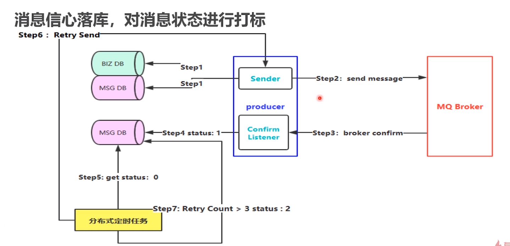
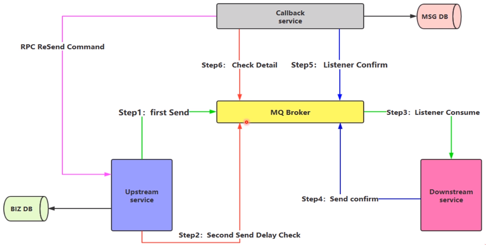
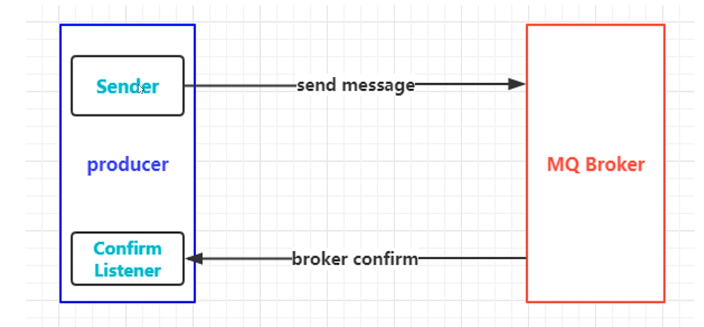
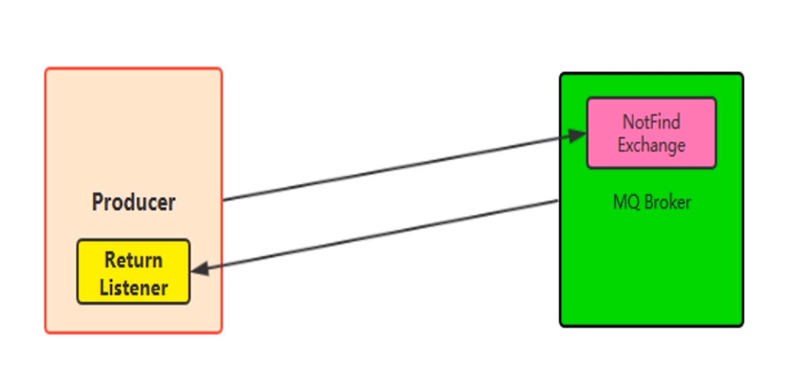

# RabbitMQ 高级特性
---

## 消息如何保证100%投递成功
> 什么是生产端的可靠性投递？
> - 保证消息的成功发出
> - 保障MQ节点成功接受
> - 发送端到MQ节点(broker)确认应答
> - 完善的消息进行补偿机制

### 解决方案
- 消息落库，对消息状态进行打标
- 消息的延迟投递，做二次确认，回调检查

#### 消息落库


#### 延时投递



## 幂等性
> 除开网络错误以及请求超时的问题，请求同一个接口多次和单次，对资源所造成的影响是一致的。

### 消费端-幂等性保障
> 在海量订单的业务高峰期的时候，如何避免消费端的重复消费消息？
> 服务端实现幂等性就意味着，我们的消息永远不会被消费多次，只会被消费一次，在并发的情况下收到了多条一样的消息

### 幂等性操作
- 唯一ID 加上指纹码机制，利用数据库主键去重
- 利用Redis的原子性实现

#### 唯一ID+指纹码
> 在执行业务逻辑之前，select count(1) from table where id = 唯一ID+指纹码，先查询看看是否处理过，如果没有处理过则处理，如果处理过则返回

- 好处: 实现简单
- 坏处: 在高并发的场景下由数据库的写入性能瓶颈，关于这个性能瓶颈，可以跟进ID进行分库分表操作，进行算法路由

#### redis 原子性
- 数据是否需要入库？如何数据库和缓存做到原子性？
- 不入库的话，存到缓存中怎么设置定时同步策略？缓存数据怎么保障？


### Confirm消息确认


#### 实现步骤
- 在channel上开启确认模式，channel.confirmSelect()
- 在channel上添加监听，addConfirmListener，监听成功或是失败的返回结果，根据具体的结果对消息进行重新发送或记录日志等后续处理

``` java

public class Consumer {
    public static void main(String[] args) throws IOException, TimeoutException, InterruptedException {
        ConnectionFactory connectionFactory = new ConnectionFactory();
        connectionFactory.setHost("192.168.2.213");
        connectionFactory.setPort(5672);
        connectionFactory.setUsername("admin");
        connectionFactory.setPassword("admin");

        Connection connection = connectionFactory.newConnection();

        Channel channel = connection.createChannel();

        String exchangeName = "test_confirm_exchange";
        String queueName = "test_confirm_queue";
        String routeKey = "confrim.*";

        channel.exchangeDeclare(exchangeName,"topic",true);
        channel.queueDeclare(queueName,true,false,false,null);
        channel.queueBind(queueName,exchangeName,routeKey);

        QueueingConsumer queueingConsumer = new QueueingConsumer(channel);
        channel.basicConsume(queueName,true,queueingConsumer);

        while(true)
        {
            QueueingConsumer.Delivery delivery = queueingConsumer.nextDelivery();
            System.out.println("接收到的消息："+ new String(delivery.getBody()));
        }
    }
}


public class Procuder {
    public static void main(String[] args) throws IOException, TimeoutException {
        ConnectionFactory connectionFactory = new ConnectionFactory();
        connectionFactory.setHost("192.168.2.213");
        connectionFactory.setPort(5672);
        connectionFactory.setUsername("admin");
        connectionFactory.setPassword("admin");

        Connection connection = connectionFactory.newConnection();

        Channel channel = connection.createChannel();
        //指定消息的投递模式：消息确认模式
        channel.confirmSelect();

        String exchangeName = "test_confirm_exchange";
        String routeKey = "confrim.save";

        channel.basicPublish(exchangeName,routeKey,null,"Hello confirm Message".getBytes());

        // 添加确认监听
        channel.addConfirmListener(new ConfirmListener() {
            //发送成功
            @Override
            public void handleAck(long deliveryTag, boolean multiple) throws IOException {
                System.out.println("------------- ack ---------------");
            }

            //发送失败
            @Override
            public void handleNack(long deliveryTag, boolean multiple) throws IOException {
                System.out.println("------------- no ack ---------------");
            }
        });

    }
}

```

### Return 返回消息
> return listener 用于处理一些不可路由的消息

> 我们的消息生产者，通过指定的一个Exchange和RouteKey，把消息送达到某一个队列中，然后我们的消费者监听队列，进行消息的处理操作

> 但是在某些情况下，我们在发送消息的时候，当前的exchange不存在或者是指定的路由key路由不到，这个时候如果我们需要监听这种不可达的消息，就要使用Return Listener

> 在基础API上有一个关键的配置项，Mandatory,如果为true，则监听器会监听路由不到的消息，然后进行后续处理，如果为false，那么broker端会自动删除消息



``` java
public class Consumer {
    public static void main(String[] args) throws IOException, TimeoutException, InterruptedException {
        ConnectionFactory connectionFactory = new ConnectionFactory();
        connectionFactory.setHost("192.168.2.213");
        connectionFactory.setPort(5672);
        connectionFactory.setUsername("admin");
        connectionFactory.setPassword("admin");

        Connection connection = connectionFactory.newConnection();
        Channel channel = connection.createChannel();

        String exchangeName = "test_return_exchange";
        String routeKey = "return.*";
        String queueName = "test_return_queue";
        channel.exchangeDeclare(exchangeName,"topic",true,false,false,null);
        channel.queueDeclare(queueName,false,false,false,null);
        channel.queueBind(queueName,exchangeName,routeKey);

        QueueingConsumer queueingConsumer = new QueueingConsumer(channel);
        channel.basicConsume(queueName,true,queueingConsumer);

        while(true)
        {
            QueueingConsumer.Delivery delivery = queueingConsumer.nextDelivery();
            System.out.println("接收消息:"+new String(delivery.getBody()));
        }
    }
}


public class Producer {
    public static void main(String[] args) throws IOException, TimeoutException {
        ConnectionFactory connectionFactory = new ConnectionFactory();
        connectionFactory.setHost("192.168.2.213");
        connectionFactory.setPort(5672);
        connectionFactory.setUsername("admin");
        connectionFactory.setPassword("admin");

        Connection connection = connectionFactory.newConnection();
        Channel channel = connection.createChannel();

        String exchangeName = "test_return_exchange";
        String routeKey = "return.save";
        String routeKey2 = "abc.save";

        String msg = "hello return message";
        channel.basicPublish(exchangeName,routeKey,true,null,msg.getBytes());
        channel.basicPublish(exchangeName,routeKey2,true,null,msg.getBytes());

        channel.addReturnListener(new ReturnListener() {
            @Override
            public void handleReturn(int replyCode, String replyText, String exchange, String routingKey, AMQP.BasicProperties properties, byte[] body) throws IOException {
                System.out.println(String.format("replyCode:%s,replyText:%s,exchange:%s,routingKey:%s,body:%s",replyCode,replyText,exchange,routeKey,new String(body)));
            }
        });
    }
}

```

### 自定义消费者
``` java
public class Consumer {
    public static void main(String[] args) throws IOException, TimeoutException, InterruptedException {
        ConnectionFactory connectionFactory = new ConnectionFactory();
        connectionFactory.setHost("192.168.2.213");
        connectionFactory.setPort(5672);
        connectionFactory.setUsername("admin");
        connectionFactory.setPassword("admin");

        Connection connection = connectionFactory.newConnection();
        Channel channel = connection.createChannel();

        String exchangeName = "test_consumer_exchange";
        String routeKey = "consumer.*";
        String queueName = "test_consumer_queue";
        channel.exchangeDeclare(exchangeName,"topic",true,false,false,null);
        channel.queueDeclare(queueName,false,false,false,null);
        channel.queueBind(queueName,exchangeName,routeKey);

        QueueingConsumer queueingConsumer = new QueueingConsumer(channel);
        channel.basicConsume(queueName,true,new MyConsumer(channel));


        /*
        * ------------ consumer message ------------------
        consumerTag = amq.ctag-81AulexjUOAYdO-0A7Ycxg
        envelope = Envelope(deliveryTag=1, redeliver=false, exchange=test_consumer_exchange, routingKey=consumer.test)
        properties = #contentHeader<basic>(content-type=null, content-encoding=null, headers=null, delivery-mode=null, priority=null, correlation-id=null, reply-to=null, expiration=null, message-id=null, timestamp=null, type=null, user-id=null, app-id=null, cluster-id=null)
        body = hello consumer message
        *
        *
        * */
    }
}

```

``` java

public class MyConsumer extends DefaultConsumer {

	private Channel channel;
    /**
     * Constructs a new instance and records its association to the passed-in channel.
     *
     * @param channel the channel to which this consumer is attached
     */
    public MyConsumer(Channel channel) {
        super(channel);
        this.channel = channel;
    }

    @Override
    public void handleDelivery(String consumerTag, Envelope envelope, AMQP.BasicProperties properties, byte[] body) throws IOException {

        System.out.println("------------ consumer message ------------------ ");

        System.out.println("consumerTag = "+consumerTag);
        System.out.println("envelope = "+envelope);
        System.out.println("properties = "+properties);
        System.out.println("body = "+ new String(body));
    }
}

```

``` java

public class Producer {
    public static void main(String[] args) throws IOException, TimeoutException {
        ConnectionFactory connectionFactory = new ConnectionFactory();
        connectionFactory.setHost("192.168.2.213");
        connectionFactory.setPort(5672);
        connectionFactory.setUsername("admin");
        connectionFactory.setPassword("admin");

        Connection connection = connectionFactory.newConnection();
        Channel channel = connection.createChannel();

        String exchangeName = "test_consumer_exchange";
        String routeKey = "consumer.test";

        String msg = "hello consumer message";

        for (int i=0;i<5;i++)
        {
            channel.basicPublish(exchangeName,routeKey,true,null,msg.getBytes());
        }
        channel.close();
        connection.close();
    }
}

```

### 消费端限流
> 假设一个场景，首先，我们的RabbitMq服务器由上万条未处理消息，我们随便打开一个消费者客户端会出现以下的情况

> 巨量的数据全部推送过来，我们的单个客户都安无法同时处理这么多的数据

> rabbitMQ提供了一种QOS服务质量保证功能,即在非自动确认消息的前提下，如果一定数据的消息(通过基于consume或channel设置Qos的值)未被确认前，不进行消费新的消息

> void BasicQos(unit prefetchSize,ushort perfetchCount,boolean global)

- perfetchSize: 0
- perfetchCount:会告诉RabbitMQ不要同时给一个消费者推送多于N个消息，一旦由N个消息还没有被ack，该consumer将bolck掉，直到由消息ack
-global:true/false,是否将上面设置应用于channel，简单点来说，就是上面限制的是channel级别还是consumer级别

> prefetchSize和global这两项，rabbitmq没有实现。perfetch_count在no_ask=false的情况下生效，即在自动应答的情况下这两个值是不生效的

``` java
public class Consumer {
    public static void main(String[] args) throws IOException, TimeoutException, InterruptedException {
        ConnectionFactory connectionFactory = new ConnectionFactory();
        connectionFactory.setHost("192.168.2.213");
        connectionFactory.setPort(5672);
        connectionFactory.setUsername("admin");
        connectionFactory.setPassword("admin");

        Connection connection = connectionFactory.newConnection();
        Channel channel = connection.createChannel();

        String exchangeName = "test_qos_exchange";
        String routeKey = "qos.*";
        String queueName = "test_qos_queue";
        channel.exchangeDeclare(exchangeName,"topic",true,false,false,null);
        channel.queueDeclare(queueName,false,false,false,null);
        channel.queueBind(queueName,exchangeName,routeKey);

        // 限流,autoAck一定是false，在自动ack的情况下，限流不生效
        channel.basicConsume(queueName,false,new MyConsumer(channel));
        // 设置具体的限流参数
        channel.basicQos(0,1,false);
    }
}

```

``` java

public class MyConsumer extends DefaultConsumer {

    private Channel channel;
    /**
     * Constructs a new instance and records its association to the passed-in channel.
     *
     * @param channel the channel to which this consumer is attached
     */
    public MyConsumer(Channel channel) {
        super(channel);
        this.channel = channel;
    }

    @Override
    public void handleDelivery(String consumerTag, Envelope envelope, AMQP.BasicProperties properties, byte[] body) throws IOException {
        System.out.println("------------ consumer message ------------------ ");

        System.out.println("consumerTag = "+consumerTag);
        System.out.println("envelope = "+envelope);
        System.out.println("properties = "+properties);
        System.out.println("body = "+ new String(body));

        //手动ack
        channel.basicAck(envelope.getDeliveryTag(),false);
    }
}

```

``` java

public class Producer {
    public static void main(String[] args) throws IOException, TimeoutException {
        ConnectionFactory connectionFactory = new ConnectionFactory();
        connectionFactory.setHost("192.168.2.213");
        connectionFactory.setPort(5672);
        connectionFactory.setUsername("admin");
        connectionFactory.setPassword("admin");

        Connection connection = connectionFactory.newConnection();
        Channel channel = connection.createChannel();

        String exchangeName = "test_qos_exchange";
        String routeKey = "qos.save";

        String msg = "hello limit message";
        for(int i=0;i<5;i++)
        {
            channel.basicPublish(exchangeName,routeKey,true,null,msg.getBytes());
        }

        channel.close();
        connection.close();
    }
}

```

### 消费端ACK与重回队列
#### 消费端手工ack 和 nack
> 消费端进行消费的时候，由于业务异常我们可以进行日志的记录，以及后续的补偿操作

> 由于服务器宕机等严重问题，我们需要手工进行ACK保障消费端消费成功

#### 重回队列
> 消费端重回队列是为了对没有处理成功的消息，把消息重新投递给broker

> 一般我们在实际应用中，都会关闭重回队列，也就是设置false

``` java
public class Consumer {
    public static void main(String[] args) throws IOException, TimeoutException {
        ConnectionFactory connectionFactory = new ConnectionFactory();
        connectionFactory.setHost("192.168.2.213");
        connectionFactory.setPort(5672);
        connectionFactory.setUsername("admin");
        connectionFactory.setPassword("admin");

        Connection connection = connectionFactory.newConnection();
        Channel channel = connection.createChannel();

        String exchangeName = "test_ack_exchange";
        String routeKey = "ack.*";
        String queueName = "test_ack_queue";
        channel.exchangeDeclare(exchangeName,"topic",true,false,false,null);
        channel.queueDeclare(queueName,false,false,false,null);
        channel.queueBind(queueName,exchangeName,routeKey);

        // 手工签收一定要关闭autoAck
        channel.basicConsume(queueName,false,new AckConsumer(channel));
    }
}

```

``` java
public class AckConsumer extends DefaultConsumer {

    private Channel channel;

    public AckConsumer(Channel channel) {
        super(channel);
        this.channel = channel;
    }

    @Override
    public void handleDelivery(String consumerTag, Envelope envelope, AMQP.BasicProperties properties, byte[] body) throws IOException {
        System.out.println("----------consume message------------------");
        System.out.println("body = "+new String(body));

        try {
            Thread.sleep(2000);
        } catch (InterruptedException e) {
            e.printStackTrace();
        }
        Integer number = (Integer) properties.getHeaders().get("number");
        if(number == 0)
            channel.basicNack(envelope.getDeliveryTag(),false,true);
        else
            channel.basicAck(envelope.getDeliveryTag(),false);
    }
}

```

``` java
public class Producer {
    public static void main(String[] args) throws IOException, TimeoutException {
        ConnectionFactory connectionFactory = new ConnectionFactory();
        connectionFactory.setHost("192.168.2.213");
        connectionFactory.setPort(5672);
        connectionFactory.setUsername("admin");
        connectionFactory.setPassword("admin");

        Connection connection = connectionFactory.newConnection();
        Channel channel = connection.createChannel();

        String exchangeName = "test_ack_exchange";
        String routeKey = "ack.save";


        for(int i=0;i<5;i++)
        {
            String msg = "hello ack message,number=" +i;
            HashMap<String, Object> headers = new HashMap<>();
            headers.put("number",i);
            AMQP.BasicProperties properties = new AMQP.BasicProperties.Builder()
                    .headers(headers)
                    .build();
            channel.basicPublish(exchangeName,routeKey,true,properties,msg.getBytes());
        }

        channel.close();
        connection.close();
    }
}
```

### TTL
> TTL 是 Time to live的缩写，也就是生存时间

> rabbitMQ 支持消息的过期时间，在消息发送时可以进行指定

> rabbitMQ 支持队列的过期时间，从消息入队列开始计算，只要超过了队列的超时时间配置，那么消息就会自动清除

### 死信队列 DLX
> 利用DLX，当消息在一个队列中变成死信(dead message)之后，它能够被publish到另一个Exchange,这个Exchange就是DLX

> 消息变成死信的情况
> - 消息被拒绝(basic.reject/basic.nack),并且requeue=false，即不重回队列
> - 消息TTL过期
> - 队列达到最大长度

> DLX是一个正常的Exchange，和一般的Exchange没有什么区别，他能在任何队列上被指定，实际上就是设置某个队列的属性

> 当这个队列中有死信的时候，rabbitMQ就会自动将这个消息重新发布到设置的Exchange上，进而被路由到另一个队列

> 我们可以声明交换机dlx.exchange,队列dlx.queue,路由\#这些都是正常声明的，但是我们需要在队列上添加一个参数,x-dead-letter-exchange,dlx.exchange

> 这样消息在过期，requeue，队列达到最大长度的时候，消息都可以直接路由到死信队列中

``` java

public class Consumer {
    public static void main(String[] args) throws IOException, TimeoutException {
        ConnectionFactory connectionFactory = new ConnectionFactory();
        connectionFactory.setHost("192.168.2.213");
        connectionFactory.setPort(5672);
        connectionFactory.setUsername("admin");
        connectionFactory.setPassword("admin");

        Connection connection = connectionFactory.newConnection();
        Channel channel = connection.createChannel();

        String exchangeName = "test_dlx_exchange";
        String routeKey = "dlx.*";
        String queueName = "test_dlx_queue";
        channel.exchangeDeclare(exchangeName,"topic",true,false,false,null);
        // 声明队列的时候需要添加参数 x-dead-letter-exchange,设置死信队列
        HashMap<String, Object> arguments = new HashMap<>();
        arguments.put("x-dead-letter-exchange","dlx.exchange");
        channel.queueDeclare(queueName,false,false,false,arguments);
        channel.queueBind(queueName,exchangeName,routeKey);

        // 声明死信队列
        channel.exchangeDeclare("dlx.exchange","topic",true,false,null);
        channel.queueDeclare("dlx.queue",true,false,false,null);
        channel.queueBind("dlx.queue","dlx.exchange","#");
        
        channel.close();
        connection.close();
    }
}


public class Producer {
    public static void main(String[] args) throws IOException, TimeoutException {
        ConnectionFactory connectionFactory = new ConnectionFactory();
        connectionFactory.setHost("192.168.2.213");
        connectionFactory.setPort(5672);
        connectionFactory.setUsername("admin");
        connectionFactory.setPassword("admin");

        Connection connection = connectionFactory.newConnection();
        Channel channel = connection.createChannel();

        String exchangeName = "test_dlx_exchange";
        String routeKey = "dlx.save";


        for(int i=0;i<5;i++)
        {
            String msg = "hello dlx message,number=" +i;
            AMQP.BasicProperties properties = new AMQP.BasicProperties().builder()
                    .expiration("5000")
                    .build();
            channel.basicPublish(exchangeName,routeKey,true,properties,msg.getBytes());
        }
        channel.close();
        connection.close();
    }
}
```

