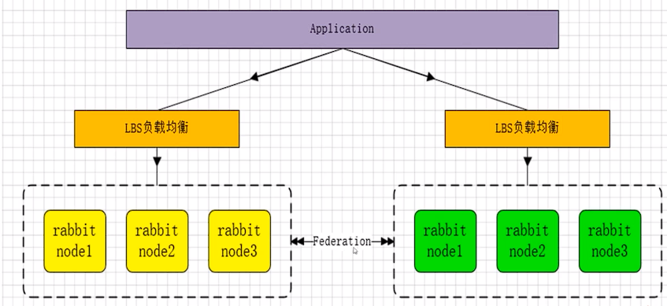

## 主备模式
> 实现RabbitMQ的高可用集群，一般用于并发和数据量不高的情况下，这种模式简单好用。主备模式也被称之为Warren模式，又称之为兔子窝模式。主节点提供读写，备份节点不能用于读写，主节点如果挂掉了，从节点提供服务。和activatemq利用zookeeper做主备一样


### 关联mysql
- 数据库主主：两台都是主数据库，同时对外提供读写操作。客户端访问任意一台。数据存在双向同步
- 数据库主从：一台是主数据库，同时对外提供读写操作。一台是 从数据库，对外提供读的操作。数据从主库同步到从库。
- 数据库主备：一台是主数据库，同时对外提供读写操作。一台是 备库，只作为备份作用，不对外提供读写，主机挂了它就取而代之。数据从主库同步到备库。


### HaProxy配置
``` conf
HaProxy 配置:
listen rabbitmq_cluster
bind 0.0.O.O:5672 
mode tcp # 配置tcp模式
balance roundrobin # 配置简单轮询
server bhz76 192.168.11.76:5672 chec inter 5000 rise 2 fall 2 # 主节点
server bhz77 192.168.11.77:5672 backup check inter 5000 rise 2 fall 2 # 备份节点
```
> 备注：rabbitmq集群节点配置#inter每隔五秒对mq集群做健康检查，2次正确证明服务器可用，2次失败证明服务器不可用，并且配置主备机制


## 远程模式
> 远程模式可以实现双活的一种模式，简称Shovel模式，所谓Shovel僦是我们可以把消息进行不同数据中心的复制工作，我们可以跨地域的让俩个mq集群互联

``` conf 
1、启用插件
rabbitmq-plugins enable amqp_client
rabbitmq-plugins enable rabbitmq_shovel

2、创建rabbitmq.config文件, touch /etc/rabbitmq/rabbitmq.conf

3、添加配置

4、源服务器和目的地服务器使用相同的rabbitmq.config文件
```


## 镜像模式
> 镜像模式：集群模式非常经典的就是Mirro像模式，保证100％数据不丢失，在实际工作中也是用的最多的。并且实现集群非常的简单，一般互联网大厂都会构建这种像集群模式

> Mirro髖像队列，目的是为了保证rabbitmq数据的高可靠性解决方案，主要就是实现数据的同步，一般来讲是2一3个节点实现数据同步,对于100％数据可靠性解决方案一般是3节点。


## 多活模式
> 这种模式也是实现异地数据复制的主流模式，因为Shovel模式配置比较复杂，所以一般来说实现异地集群都是使用这种双活或者多活模型来取实现的。这种模型需要依赖rabbitmq的federation插件，可以实现持续的可靠的AMQP数据通信，多活模式在实际配置与应用非常的简单

> RabbitMQ部署架构采用双中心模式（多中心），那么在两套（或多套）数据中心中各部署一套RabbitMQ集群，各中心的RabbitMQ服务除了需要为业务提供正常的消息服务外，中心之间还需要实现部分队列消息共享。多活集群架构如下．



> Federation插件是一个不需要构建Cluster,而在Brokers之间传输消息的高性能插件，Federation插件可以在Brokers或者Cluster之间传输消息，连接的双方可以使用不同的users和virtualhosts,双方也可以使用版本不同的RabbitMQ和ErlangoFederation插件使用AMQP协议通讯，可以接受不连续的传输


> FederationExchanges,可以看成Downstream从Upstream主动拉取消息，但并不是拉取所有消息，必须是在Upownstream上已经明确定义Bindings关系的Exchange,也就是有实际的物理Queue来接收消息，才会从Upstream拉取消息到Downstream。使用AMQP协议实施代理间通信Downstream会将绑定关系组合在一起，绑定/解除绑定命令将发送到Upstream交换机。因此，FederationExchange只接收具有订阅的消息，本处贴出官方图来说明，

## 部署
参考 book/RabbitMQ消息服务用户手册.md

### springboot使用主备集群
``` yml
 rabbitmq:
    addresses: 127.0.0.1:6605,127.0.0.1:6606,127.0.0.1:6705 
    #指定client连接到的server的地址，多个以逗号分隔(优先取addresses，然后再取host)
    # 集群配置 addresses之间用逗号隔开,addresses: ip:port,ip:port
    requested-heartbeat: #指定心跳超时，单位秒，0为不指定；默认60s
```
> **使用SpringBoot直接操作集群需要注意一个问题，那就是主节点宕机后，才会切换到从节点，并且是按照一个宕机才会去连接下一个,容易导致一个节点压力过大的问题**

> **使用haproxy操作的时候就不会存在这个问题，所以建议使用haproxy或者keepalived模式，让springboot只操作一个端口，由haproxy进行负载均衡**

## 延迟队列
### 使用步骤

- 1、安装 rabbitmq_delayed_message_exchange插件(如果是集群环境则每个节点都要安装、启动)，安装完成可以使用rabbitmq_plugins list 查看
- 2、启用 rabbitmq_delayed_message_exchange, rabbitmq_pluginss enable rabbitmq_delayed_message_exchange
- 3、启动完成 exchange 多了一个tyep x-delayed-message。还需要在arguments中指定x-delayed-type 类型，例如topic
- 4、正常指定队列绑定到延迟队列
- 5、发送消息的时候需要在headers中指定x-delay,单位是毫秒。

