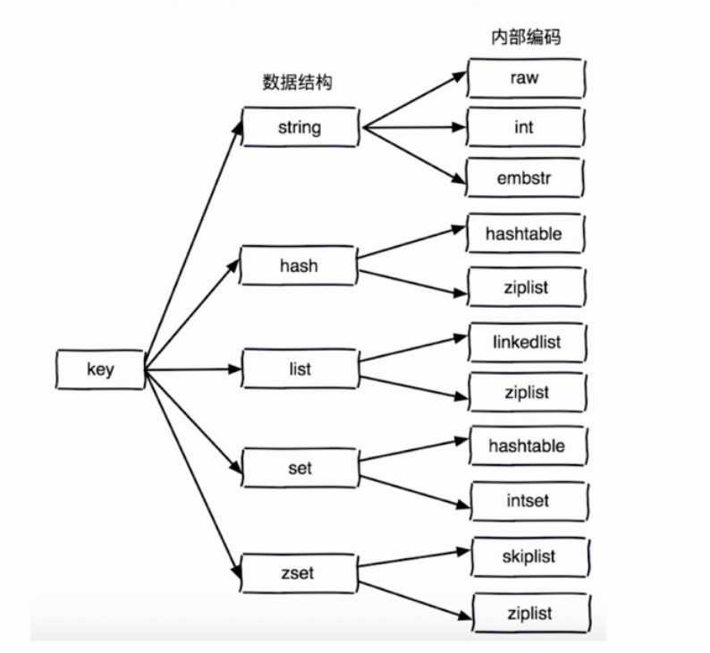
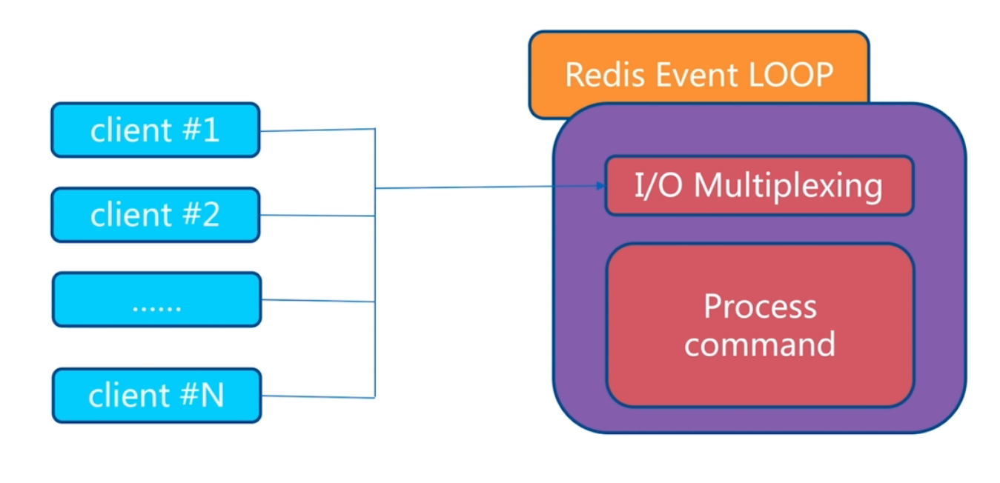

# API的使用和理解
---
## 通用命令
命令|作用|演示
-|-|-
keys| 遍历所有的key,不在生产环境使用，一般用于热备份从节点（keys [pattern]）| keys\* / keys he\* / keys he[h-l]* / keys ph?
dbsize| 计算key的总数
exsits key| 判断某个key是否存在,存在返回1,不存在返回0
del key [key...]| 删除指定的key-value，成功删除返回1,不存在返回0
expire key seconds| 给key设置seconds过期时间
ttl key| 查看key的过期时间，返回-1表示key存在并且没有过期时间，返回-2表示已经被删除
persist key| 去掉key的过期时间
type key| 返回key的类型,返回类型有5种，string，hash，list，set，zset，none

### 时间复杂度
命令| 时间复杂度
-|-
keys|_O(n)_
dbsize|_O(1)_
del|_O(1)_
exsits|_O(1)_
expire|_O(1)_
type|_O(1)_

## 数据结构和内部编码

## 单线程架构
> redis 在一个瞬间只会执行一条命令，而不会执行两条命令

* redis单线程
	* 所有数据存放到内存中
	* 非堵塞IO
	* 避免线程切换和竞态消耗

* redis注意点
	* 一次只执行一条命令
	* 拒绝长(慢)命令
		* keys、flushall、flushdb、show lua script、multi / exec、operate big value(collation)
	* 其实不是单线程
		* Redis 在 fsync file descriptor、close file descriptor 时候会 fork 出子线程进行处理

## string
> redis 是key-value类型的数据库，而value可是多种类型字符串，数字，二进制，json，xml...，但是**字符串类型的value的存储容量不能大于512M**,字符串类型的使用场景：缓存，计数器，分布式锁...

### string 相关API
命令|作用|时间复杂度
-|-|-
get key| 获取key对应的value | _O(1)_
mget kye1 key2 ...| 批量获取key，原子操作|_O(n)_
mset key1 value1 key2 value2 | 批量设置key-value|_O(n)_
set key value | 设置key value| _O(1)_
setnx key value| key不存在，才设置| _O(1)_
set key value xx| key存在，才设置| _O(1)_
del key | 删除key | _O(1)_
incr key| key自增1,如果key不存在则get key返回1 | _O(1)_
decr key| key自减1,如果key不存在则get key返回-1  | _O(1)_
incrby key k|  key自增k,如果key不存在则get key返回k | _O(1)_
incrybyfloat key value| 增加key对应的浮点数|_O(1)_
getrange key start end| 获取字符串指定下标所有值| _O(1)_
setrange key index value| 设置指定下标所有对应的值| _O(1)_
decrby| key自减k,如果key不存在则get key返回-k | _O(1)_
getset key newvalue| set key newvalue,返回旧value| _O(1)_
append key value|将value 追加到旧的value|  _O(1)_
strlen key| 返回字符串的长度(utf8,中文两个字节)| _O(1)_

### 具体场景
> 记录页面访问量(incr userid:pageview)
> 分布式id(incr id)

## hash
> hash不同于string，hash主要由key，field，value组成。可以看成map的map，key和(field，value)组成map，而其中field，value又组成map，field是不能相同的，value是可以相同的

### hash 相关API
命令|作用|时间复杂度
-|-|-
hget key field| 获取hash key对应的field的value| _O(1)_
hset key field value|设置hash key 对应的field的value | _O(1)_
hdel key field |删除 hash key 对应的field的value | _O(1)_
hexists key field| 判断 hash key是否有 field| _O(1)_
hlen key | 获取hash key field的数量| _O(1)_
hmget key field1 field2 ...| 批量获取hash key的field对应的value| _O(n)_
hmset key field1 value1 field2 value2 ...| 批量设置 hash key的field对应的值| _O(n)_
hgetall key| 返回hash key 所有的field和value| _O(n)_
hvals key| 返回 hash key 所有的value| _O(n)_
hkeys key| 返回hash key 所有的 field| _O(n)_
hsetnx key field value | 设置hash key对应field的value，如果field已经存在，则设置失败| _O(1)_
hincrby key field intCount | hash key对应的field的value自增intCount| _O(1)_
hincrbyfloat key field floatCount|  hash key对应的field的value自增floatCount| _O(1)_

> hgetall是 _O(n)_ 级别的时间复杂度，由于redis是多线程，因此，需要小心使用。
> hash 结构的使用对于ttl不好控制，需要自己从代码层面进行维护

## list
### list 相关API
命令|作用|时间复杂度
-|-|-
rpush key value1 value2 ...|从列表右边插入n个值| _O(n)_
lpush key value1 value2 ...|从列表左边插入n个值| _O(n)_
linsert key before|after value newValue在list指定值的前(后)插入newValue | _O(n)_
lpop key | 从左侧弹出一个item|_O(1)_
rpop key | 从右侧弹出一个item|_O(1)_
lrem key count value(count=0)| 删除所有value相等的项|_O(1)_
lrem key count value(count>0)| 从左到右删除最多count个value相等的项|_O(n)_
lrem key count value(count<0)| 从右到左删除最多Math.abs(count)个value相等的项|_O(n)_
ltrim key start end |按照索引范围修剪列表|_O(n)_
lrange key start end(包含end) | 获取列表指定所有范围内的item|_O(n)_
lindex key index | 获取列表指定索引的item|_O(n)_
llen key | 获取列表的长度|_O(1)_
lset key index newValue | 设置列表指定索引值为newValue|_O(n)_
blpop key timeout| lpop的阻塞版本,timeout是阻塞时间,timeout=0表示用不阻塞|_O(1)_
brpop key timeout| rpop的阻塞版本,timeout是阻塞时间,timeout=0表示用不阻塞|_O(1)_

### list 实用
* lpush + lpop = stack
* lpush + rpop = queue
* lpush + ltrim = capped collection
* lpush + brpop = message queue

## set
> set是无序列的，无重复的，支持集合间的操作 交集，并集，差集
### set 相关API
命令|作用|时间复杂度
-|-|-
sadd key element | 向集合内添加element(如果集合内存在element，则添加失败)| _O(1)_
srem key element | 将集合中的element移除 | _O(1)_
scard key | 计算集合的大小| 
sismember key element | 判断集合中是否存在元素element|
srandmember key count| 随机取出集合中count个的元素|
spop key| 从集合中随机弹出一个元素|
smembers key | 取出集合中所有元素|
sinter key1 key2| 取出集合内的交集| 
sdiff key1 key2| 取出集合内的差集|
sunion key1 key2| 取出集合内的并集|
sinter,sdiff,sunion + store destkey| 将交集，差集，并集 存放到集合 destkey中|

### set 实用
* sadd = tagging
* spop/srandmember = random item
* sadd+ sinter = social graph

> smembers 是返回集合中的所有元素，要小心集合元素过多造成阻塞，可以使用scan代替

## zset
> zset中引入score作为集合间元素排序的指标
### zset 和 set
set|zset
-|-
无重复元素|无重复元素
无序|有序
element| element+score

### zset 和 list
list|zset
-|-
有重复元素|无重复元素
有序|有序
element| element+score

### zset 相关API
命令|作用|时间复杂度
-|-|-
zadd key score element(可以是多对,score可以重复，element不可以重复)|添加score element| _O(logN)_
zrem key element(可以多个)| 删除元素| _O(1)_
zscore key element | 获取元素的分数| _O(1)_
zincrby key element | 增加或减少元素的分数| _O(1)_
zcard key | 返回有序集合中元素的个数| _O(1)_
zrank key element|返回集合中element的排名| _O(1)_
zrange key start end (withscores)| 返回指定范围内的升序元素[分值]|_O(log(N)+m)_
zrangebyscore key minScore maxScore (withscores)|返回指定分数范围内的升序元素[分值]|_O(log(N)+m)_
zcount key minScore maxScore| 返回有序集合内在指定分数范围内的个数|_O(log(N)+m)_
zremrangebyrank key start end| 删除指定排名内的升序元素|_O(log(N)+m)_ 
zremrangebyscore key minScore maxScore| 删除指定分数内的升序元素|_O(log(N)+m)_ 
zrevrank |返回集合中element的倒序排名| _O(1)_
zrevrange key minScore maxScore (withscores)| 返回指定范围内的降序元素[分值]|_O(log(N)+m)_
zrevrangebyscore key minScore maxScore (withscores)|返回指定分数范围内的降序元素[分值]|_O(log(N)+m)_
zinterstore key1 key2| 两个有序集合交集计算
zunionstore key1 key2| 两个有序集合并集计算