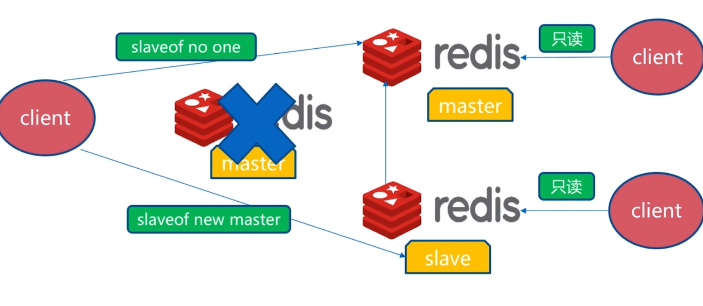
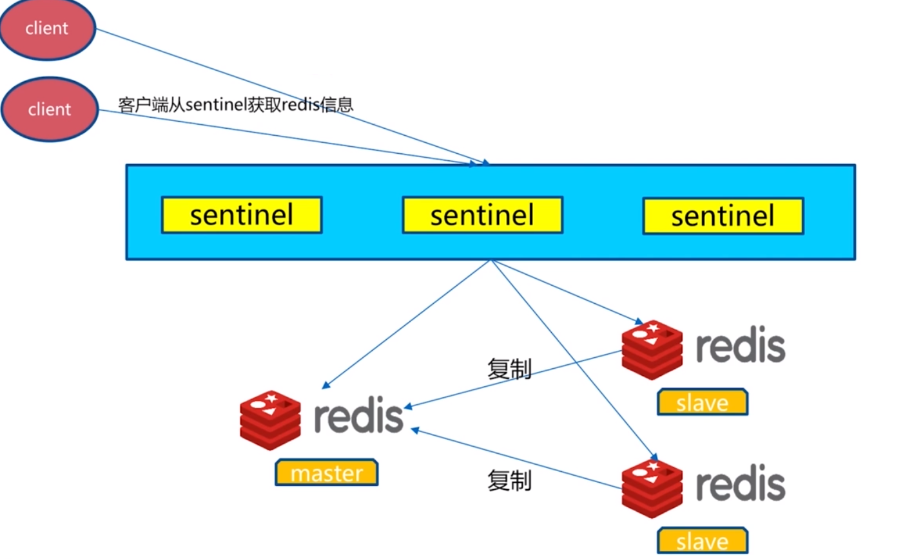
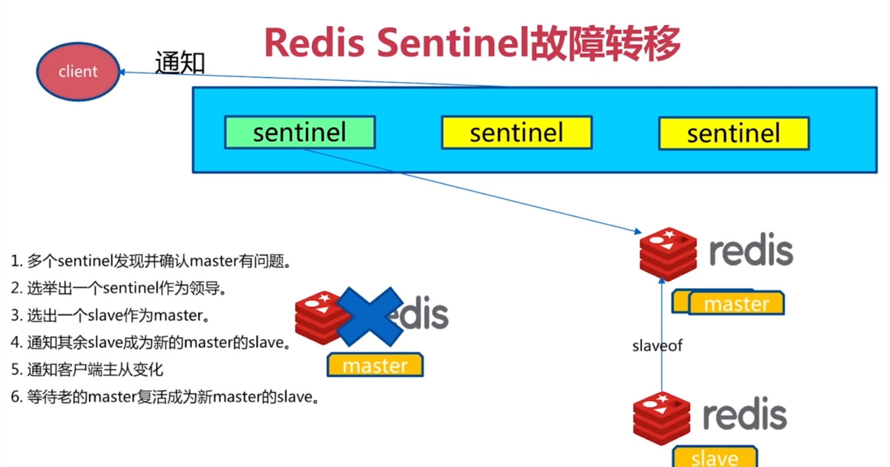
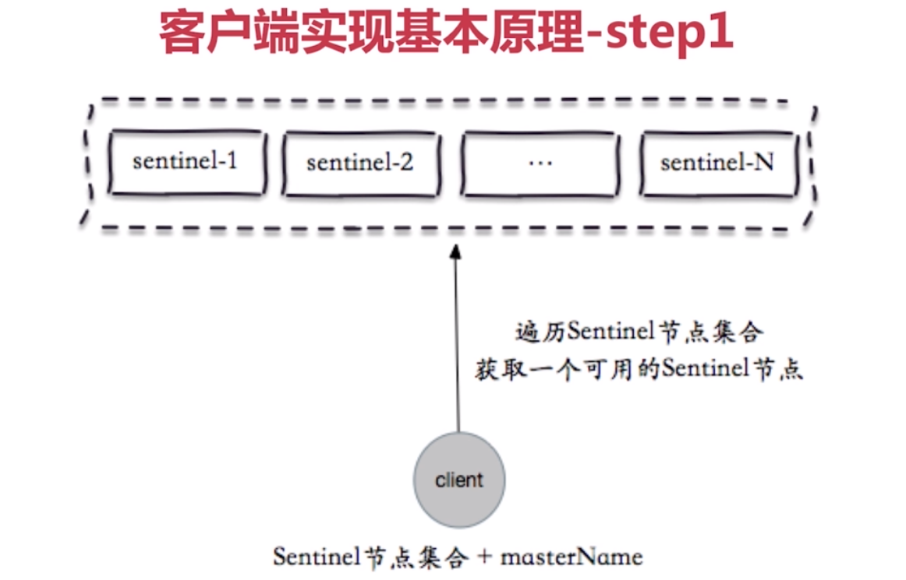
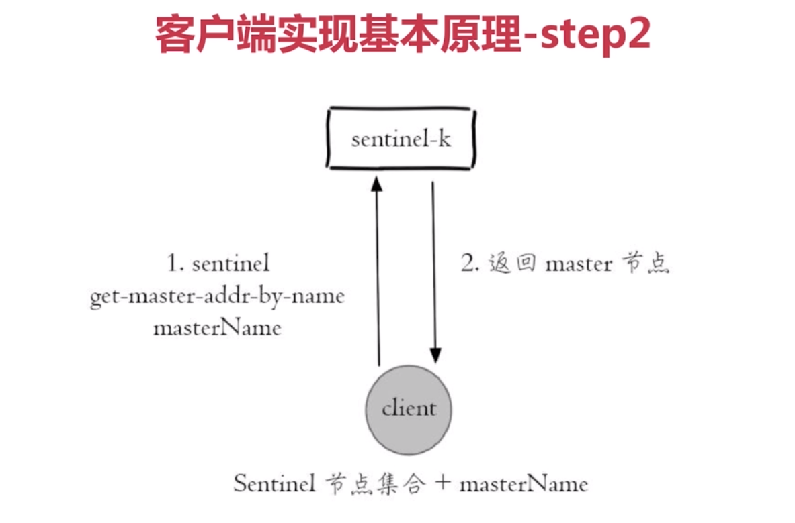
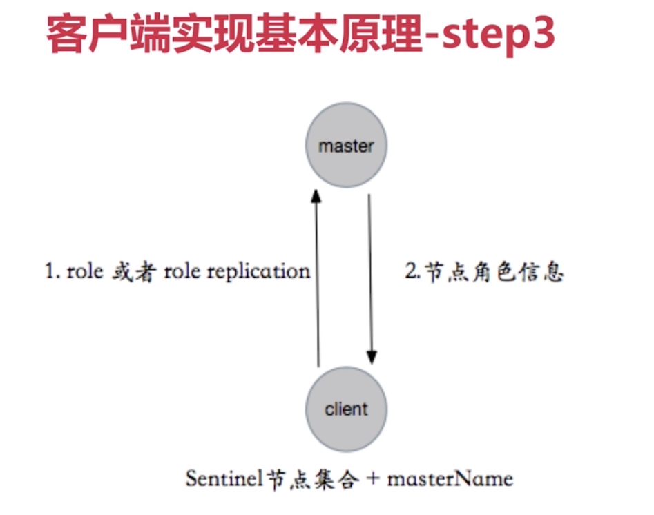
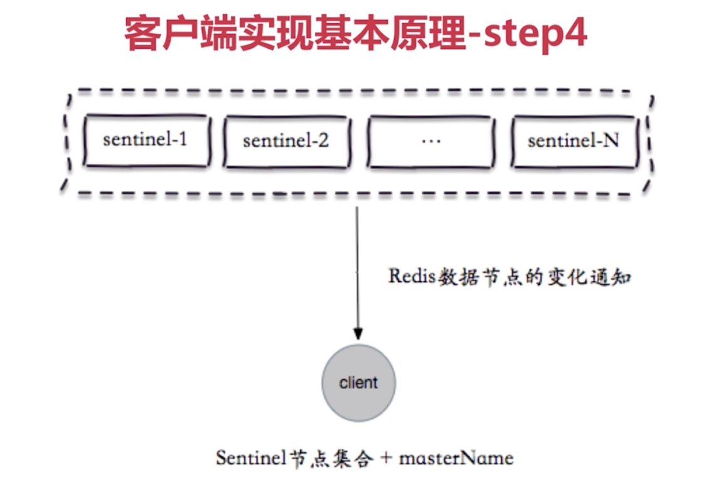
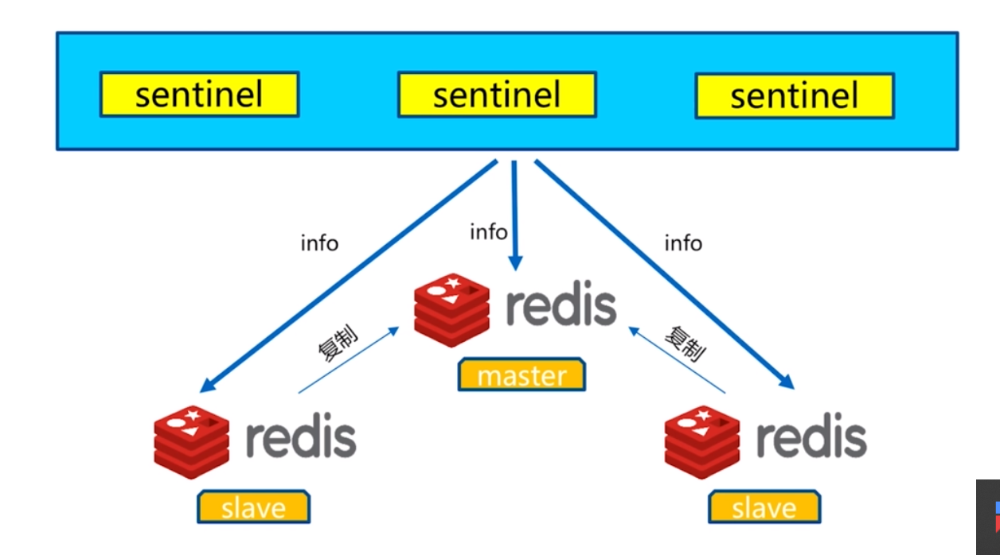
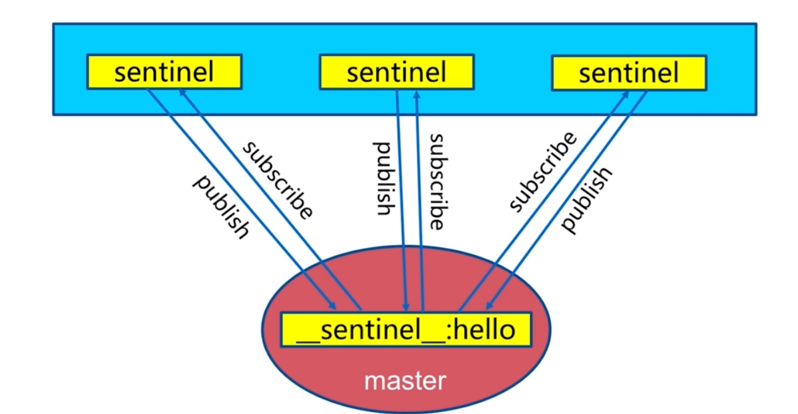
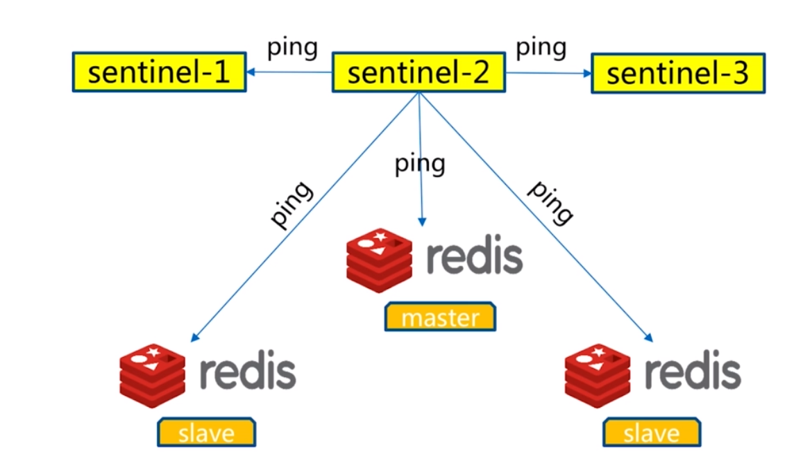

# redis sentinel
---
## 主从复制的缺点
> 对于主从复制来说，主要是为了主节点数据备份和分流，但是当主节点宕机的时候，手动slaveof no one，slaveof new master会存在几个问题，如何监控主节点状态?如何通知应用reids master切换?以及在切换过程中如何保证事务的实现



## redis sentinel 架构
> 当用redis做主从复制时，假如master宕机了，Redis本身(包括它的很多客户端)都没有实现自动进行主备切换，<br/>
而sentinel本身也是一个独立运行的进程，它能监控master,slave，发现master宕机后能进行自懂切换。



## sentinel 故障转移


## sentinel 安装和配置
1. 配置开启主节点
2. 配置开启sentinel监控节点(sentinel是特殊的节点，sentinel主要作用是监控节点和故障转移)
 
### 配置主从节点并启动
```txt
# 主节点 7000
port 7000
daemonize yes
pidfile /var/run/redis-7000.pid
logfile "/opt/redis-3.0.7/log/7000.log"
dbfilename 7000.rdb
dir "/opt/redis-3.0.7/data"
bind 192.168.2.213

# 从节点 70001
port 7001
daemonize yes
pidfile "/var/run/redis-7001.pid"
logfile "/opt/redis-3.0.7/log/7001.log"
dbfilename "7001.rdb"
dir "/opt/redis-3.0.7/data"
bind 192.168.2.213


# 从节点 70002
port 7002
daemonize yes
pidfile "/var/run/redis-7002.pid"
logfile "/opt/redis-3.0.7/log/7002.log"
dbfilename "7002.rdb"
dir "/opt/redis-3.0.7/data"
slaveof 192.168.2.213 7001
bind 192.168.2.213

# 启动主从节点
redis-server redis-7000.conf
redis-server redis-7001.conf
redis-server redis-7002.conf
```

### 配置snetinel并启动
```txt
# sentinel 26379
port 26379
logfile "/opt/redis-3.0.7/log/26379.log"
dir "/opt/redis-3.0.7/data"
daemonize yes
bind 192.168.2.213
sentinel monitor mymaster 192.168.2.213 7000 2   
sentinel down-after-milliseconds mymaster 5000  
sentinel parallel-syncs mymaster 1  
sentinel failover-timeout mymaster 15000

# sentinel 26380
port 26380
logfile "/opt/redis-3.0.7/log/26380.log"
dir "/opt/redis-3.0.7/data"
daemonize yes
bind 192.168.2.213
sentinel monitor mymaster 192.168.2.213 7000 2   
sentinel down-after-milliseconds mymaster 5000  
sentinel parallel-syncs mymaster 1  
sentinel failover-timeout mymaster 15000

# sentinel 26381
port 26381
logfile "/opt/redis-3.0.7/log/26381.log"
dir "/opt/redis-3.0.7/data"
daemonize yes
bind 192.168.2.213
sentinel monitor mymaster 192.168.2.213 7000 2   
sentinel down-after-milliseconds mymaster 5000  
sentinel parallel-syncs mymaster 1  
sentinel failover-timeout mymaster 15000

# 启动sentinel
redis-sentinel sentinel-26379.conf 
redis-sentinel sentinel-26380.conf
redis-sentinel sentinel-26381.conf 

# 启动之后sentinel之间能够相互感知到
# info sentinel
sentinel_masters:1
sentinel_tilt:0
sentinel_running_scripts:0
sentinel_scripts_queue_length:0
sentinel_simulate_failure_flags:0
master0:name=mymaster,status=ok,address=192.168.2.213:7000,slaves=2,sentinels=3

# sentinel conf文件发生变化
sentinel myid ca3f7bb1f2d12689c39bf916de2037de3e5219ad
sentinel monitor mymaster 192.168.2.213 7000 2
sentinel config-epoch mymaster 0
sentinel leader-epoch mymaster 0
# Generated by CONFIG REWRITE 这里是redis自动感知到的信息，并写入conf文件
sentinel known-slave mymaster 192.168.2.213 7002
sentinel known-slave mymaster 192.168.2.213 7001
sentinel known-sentinel mymaster 192.168.2.213 26381 77c70fc88e45265f4f2c889f0fce64235f546740
sentinel known-sentinel mymaster 192.168.2.213 26380 c987a00e091409bc08592c137d5166af51073372
sentinel current-epoch 0
```

## java客户端






### 演示实例
```java
public class RedisSentinelTest {

    private static Logger logger = LoggerFactory.getLogger(RedisSentinelTest.class);

    public static void main(String[] args) {

        JedisPoolConfig config = new JedisPoolConfig();
        config.setMaxTotal(10);
        config.setMaxWaitMillis(1000);

        String masterName = "mymaster";
        HashSet<String> sentinelSet = new HashSet<String>();
        sentinelSet.add("192.168.2.204:26379");
        sentinelSet.add("192.168.2.204:26380");
        sentinelSet.add("192.168.2.204:26381");

        JedisSentinelPool jedisSentinelPool = new JedisSentinelPool(masterName, sentinelSet,config);
        Jedis jedis = null;
        try {
            jedis = jedisSentinelPool.getResource();
            String sentinel = jedis.info();
            jedis.set("hello","world");
            logger.info(jedis.get("world"));
        }
        catch (Exception e)
        {
            e.printStackTrace();
        }
        finally {
            if(jedis != null)
                jedis.close();
        }
    }
}

```
```txt

20:30:02.094 [main] INFO  RedisSentinelTest2 - k-838 value is v-838
20:30:03.145 [main] INFO  RedisSentinelTest2 - k-280 value is v-280
...
20:30:04.199 [main] ERROR RedisSentinelTest2 - Unexpected end of stream.
redis.clients.jedis.exceptions.JedisConnectionException: Unexpected end of stream.
    at redis.clients.jedis.util.RedisInputStream.ensureFill(RedisInputStream.java:202) ~[jedis-3.1.0.jar:na]
    at redis.clients.jedis.util.RedisInputStream.readByte(RedisInputStream.java:43) ~[jedis-3.1.0.jar:na]
    at redis.clients.jedis.Protocol.process(Protocol.java:155) ~[jedis-3.1.0.jar:na]
    at redis.clients.jedis.Protocol.read(Protocol.java:220) ~[jedis-3.1.0.jar:na]
    at redis.clients.jedis.Connection.readProtocolWithCheckingBroken(Connection.java:318) ~[jedis-3.1.0.jar:na]
    at redis.clients.jedis.Connection.getStatusCodeReply(Connection.java:236) ~[jedis-3.1.0.jar:na]
    at redis.clients.jedis.Jedis.set(Jedis.java:150) ~[jedis-3.1.0.jar:na]
    at RedisSentinelTest2.main(RedisSentinelTest2.java:35) ~[classes/:na]
...
20:30:10.458 [MasterListener-mymaster-[192.168.2.213:26380]] DEBUG r.clients.jedis.JedisSentinelPool - Sentinel 192.168.2.213:26380 published: mymaster 192.168.2.213 7000 192.168.2.213 7001.
20:30:10.458 [MasterListener-mymaster-[192.168.2.213:26379]] DEBUG r.clients.jedis.JedisSentinelPool - Sentinel 192.168.2.213:26379 published: mymaster 192.168.2.213 7000 192.168.2.213 7001.
20:30:10.459 [MasterListener-mymaster-[192.168.2.213:26379]] INFO  r.clients.jedis.JedisSentinelPool - Created JedisPool to master at 192.168.2.213:7001
20:30:11.523 [MasterListener-mymaster-[192.168.2.213:26381]] DEBUG r.clients.jedis.JedisSentinelPool - Sentinel 192.168.2.213:26381 published: mymaster 192.168.2.213 7000 192.168.2.213 7001.
...
20:30:16.383 [main] INFO  RedisSentinelTest2 - k-968 value is v-968
20:30:17.439 [main] INFO  RedisSentinelTest2 - k-437 value is v-437

```

### 服务端日志分析
```txt
# 新主节点日志摘录
* MASTER MODE enabled (user request from 'id=8 addr=192.168.2.213:34103 fd=10 name=sentinel-9df3a676-cmd age=531 idle=0 flags=x db=0 sub=0 psub=0 multi=3 qbuf=0 qbuf-free=32768 obl=36 oll=0 omem=0 events=rw cmd=exec')
# CONFIG REWRITE executed with success.
* Slave 192.168.2.213:7002 asks for synchronization
* Full resync requested by slave 192.168.2.213:7002
* Starting BGSAVE for SYNC with target: disk
* Background saving started by pid 1773
* DB saved on disk
* RDB: 4 MB of memory used by copy-on-write
* Background saving terminated with success
* Synchronization with slave 192.168.2.213:7002 succeeded


# sentinel领导者日志摘录
# +sdown master mymaster 192.168.2.213 7000
# +odown master mymaster 192.168.2.213 7000 #quorum 3/2
# +new-epoch 1
# +try-failover master mymaster 192.168.2.213 7000
# +vote-for-leader 9df3a6768e2f49466b6450cfe1b3c466693149a0 1 尝试做领导者
# 192.168.2.213:26379 voted for 9df3a6768e2f49466b6450cfe1b3c466693149a0 1 投票
# 192.168.2.213:26380 voted for 9df3a6768e2f49466b6450cfe1b3c466693149a0 1 投票
# +elected-leader master mymaster 192.168.2.213 7000
# +failover-state-select-slave master mymaster 192.168.2.213 7000
# +selected-slave slave 192.168.2.213:7001 192.168.2.213 7001 @ mymaster 192.168.2.213 7000
* +failover-state-send-slaveof-noone slave 192.168.2.213:7001 192.168.2.213 7001 @ mymaster 192.168.2.213 7000
* +failover-state-wait-promotion slave 192.168.2.213:7001 192.168.2.213 7001 @ mymaster 192.168.2.213 7000
# +promoted-slave slave 192.168.2.213:7001 192.168.2.213 7001 @ mymaster 192.168.2.213 7000 让70001成为主节点
# +failover-state-reconf-slaves master mymaster 192.168.2.213 7000
* +slave-reconf-sent slave 192.168.2.213:7002 192.168.2.213 7002 @ mymaster 192.168.2.213 7000 
* +slave-reconf-inprog slave 192.168.2.213:7002 192.168.2.213 7002 @ mymaster 192.168.2.213 7000
* +slave-reconf-done slave 192.168.2.213:7002 192.168.2.213 7002 @ mymaster 192.168.2.213 7000
# -odown master mymaster 192.168.2.213 7000
# +failover-end master mymaster 192.168.2.213 7000
# +switch-master mymaster 192.168.2.213 7000 192.168.2.213 7001 切换主节点到7001
* +slave slave 192.168.2.213:7002 192.168.2.213 7002 @ mymaster 192.168.2.213 7001
```
## 故障转移的具体步骤
### sentinel 中的三个定时任务
> sentinel完成对master-slave的监控和恢复主要依赖三个定时任务来完成的
- 每10秒每个sentinel对master，slave执行info，是为了发现slave节点，确认主从关系

- 每两秒每个sentinel通过master节点的channel节点交换信息(pub/sub),其主要是通过内部_sentinel_:hello进行交互

- 每1秒每个sentinel节点会对其他sentinel和redis执行ping，心跳检测为后面的故障判断


### 主观下线和客观下线
down-after-milliseconds
主观下线：每个 sentinel 点对Redis节点故障的"偏见"
客观下线：所有 sentinel 节点对 Redis 节点故障"达成共识"(超过 quorum 个数),做客观下线为故障转移做基础

```txt
sentinel monitor <masterName> <ip> <port> <quorum>   
sentinel down-after-milliseconds <masterName> <timeout>  
```

### 领导者选举
>只需要一个sentinel节点即可完成故障转移,所以所有的sentinel需要选举领导者完成故障转移的操作<br/>
通过sentinel is-master-down-by-addr命令都希望成为leader

- 每个做主观下线的sentinel向其他sentinel节点发送的命令,要求将它设置为 leader
- 收到命令的sentinel节点如果没有同意过其他sentinel节点发送的命令,那么将同意该请求,否则拒绝
- 如果该sentinel节点发现自己的票数已经超过sentinel集合半数且超过quorum,那么它将成为leader
- 如果此过程有多个sentinel节点成为了leader,那么将等待一段时间重新进行选举,这个过程使用了raft算法

### 故障转移
- 从slave中选出一个"合适的"节点作为new master
    - 选择slave-priority节点优先级最高的slave,如果存在则返回，不存在则继续
    - 选择复制offset最大的slave,如果存在则返回，不存在则继续
    - 选择run_id最小的节点
- 对上面的slave执行slaveof no one命令,让其成为master节点
- 向其它slave发送命令,让它们成为new master的slave,复制规则和parallel-sync参数有关
- 更新old master为slave,并保持对它的"关注",当其恢复后命令它去复制new master

## 常见问题
### 节点运维
> master slave sentinel的上线和下线<br/>
> 节点下线 <br/>
> 下线情况:机器过保等,机器性能不足(CPU、内存、硬盘、网络),节点自身故障<br/>
> 主节点下线的时候需要手动进行故障转移,sentinel failover masterName<br/>
> 从节点下线的时候要判断是永久下线还是临时下线,例如是否做清理工作，但是要考虑读写分离的情况<br/>
> 节点上线<br/>
> 主节点通过sentinel failover 进行替换<br/>
> 从节点 slaveof即可,sentinel可以自动感知<br/>
> sentinel可以参考其他sentinel节点启动即可，sentinel之间会感知<br/>

### 高可用读写分离
```java
private HostAndPort initSentinels(Set<String> sentinels, final String masterName) {

    HostAndPort master = null;
    boolean sentinelAvailable = false;

    log.info("Trying to find master from available Sentinels...");
    //遍历所有的sentinel
    for (String sentinel : sentinels) {
      final HostAndPort hap = HostAndPort.parseString(sentinel);

      log.debug("Connecting to Sentinel {}", hap);

      Jedis jedis = null;
      try {
        jedis = new Jedis(hap);

        //获取masterName具体的地址
        List<String> masterAddr = jedis.sentinelGetMasterAddrByName(masterName);

        // connected to sentinel...
        sentinelAvailable = true;

        if (masterAddr == null || masterAddr.size() != 2) {
          log.warn("Can not get master addr, master name: {}. Sentinel: {}", masterName, hap);
          continue;
        }

        master = toHostAndPort(masterAddr);
        log.debug("Found Redis master at {}", master);
        break;
      } catch (JedisException e) {
        // resolves #1036, it should handle JedisException there's another chance
        // of raising JedisDataException
        log.warn(
          "Cannot get master address from sentinel running @ {}. Reason: {}. Trying next one.", hap,
          e.toString());
      } finally {
        if (jedis != null) {
          jedis.close();
        }
      }
    }

    if (master == null) {
      if (sentinelAvailable) {
        // can connect to sentinel, but master name seems to not
        // monitored
        throw new JedisException("Can connect to sentinel, but " + masterName
            + " seems to be not monitored...");
      } else {
        throw new JedisConnectionException("All sentinels down, cannot determine where is "
            + masterName + " master is running...");
      }
    }

    log.info("Redis master running at " + master + ", starting Sentinel listeners...");

    for (String sentinel : sentinels) {
      final HostAndPort hap = HostAndPort.parseString(sentinel);
      MasterListener masterListener = new MasterListener(masterName, hap.getHost(), hap.getPort());
      // whether MasterListener threads are alive or not, process can be stopped
      masterListener.setDaemon(true);
      masterListeners.add(masterListener);
      masterListener.start();
    }

    return master;
}
// MasterListener另外起一个线程去订阅redis channel，确保第一时间能够感知到主节点切换
@Override
public void run() {

  running.set(true);

  while (running.get()) {

    j = new Jedis(host, port);

    try {
      // double check that it is not being shutdown
      if (!running.get()) {
        break;
      }
      
      /*
       * Added code for active refresh
       */
      List<String> masterAddr = j.sentinelGetMasterAddrByName(masterName);  
      if (masterAddr == null || masterAddr.size() != 2) {
        log.warn("Can not get master addr, master name: {}. Sentinel: {}：{}.",masterName,host,port);
      }else{
          initPool(toHostAndPort(masterAddr)); 
      }

      j.subscribe(new JedisPubSub() {
        @Override
        public void onMessage(String channel, String message) {
          log.debug("Sentinel {}:{} published: {}.", host, port, message);

          String[] switchMasterMsg = message.split(" ");

          if (switchMasterMsg.length > 3) {

            if (masterName.equals(switchMasterMsg[0])) {
                //发现master切换，重新初始化连接池
              initPool(toHostAndPort(Arrays.asList(switchMasterMsg[3], switchMasterMsg[4])));
            } else {
              log.debug(
                "Ignoring message on +switch-master for master name {}, our master name is {}",
                switchMasterMsg[0], masterName);
            }

          } else {
            log.error(
              "Invalid message received on Sentinel {}:{} on channel +switch-master: {}", host,
              port, message);
          }
        }
      }, "+switch-master");

    } catch (JedisException e) {

      if (running.get()) {
        log.error("Lost connection to Sentinel at {}:{}. Sleeping 5000ms and retrying.", host,
          port, e);
        try {
          Thread.sleep(subscribeRetryWaitTimeMillis);
        } catch (InterruptedException e1) {
          log.error("Sleep interrupted: ", e1);
        }
      } else {
        log.debug("Unsubscribing from Sentinel at {}:{}", host, port);
      }
    } finally {
      j.close();
    }
  }
}
```

## redis sentinel 总结
- Redis sentinel 是 Redis 高可用实现方案：故障发现、故障自动转移、配置中心、客户端通知
- sentinel 从 Redis 2.8版本开始才正式可用，老版本不可用
- 尽可能将 sentinel 部署在不同的物理机上
- sentinel 大于等于 3且为奇数
- sentinel 与普通数据节点没区别
- 客户端初始化时连接的是 sentinel 节点集合，不再是具体的 redis 节点，sentinel 只是配置中心不是代理
- sentinel 通过 3个定时任务实现 sentinel 对 master、slave、sentinel 的监控
- sentinel 做故障判定时分为主观下线和客观下线
- 看懂sentinel 故障转移日志对理解 sentinel 机制及问题排查非常有帮助
- sentinel 实现读写分离高可用可以依赖 sentinel的消息订阅，获取 redis 数据节点的状态变化

