# redis 内存优化
---

## 内存消耗
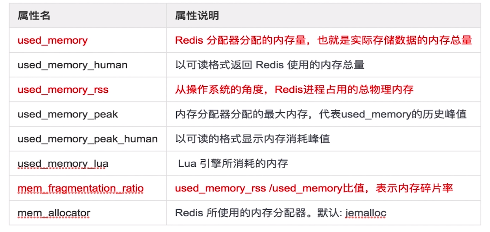

```shell
sibyl@sibyl:~/conf$ redis-cli -h 192.168.2.213 -p 7000 info memory
# Memory
used_memory:1225224
used_memory_human:1.17M
used_memory_rss:8237056
used_memory_peak:1226168
used_memory_peak_human:1.17M
used_memory_lua:36864
mem_fragmentation_ratio:6.72
mem_allocator:jemalloc-3.6.0
```

### 内存划分
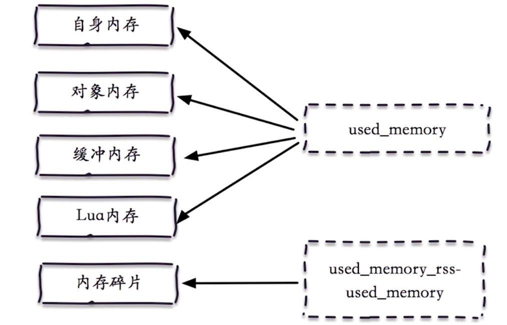

### 内存消耗
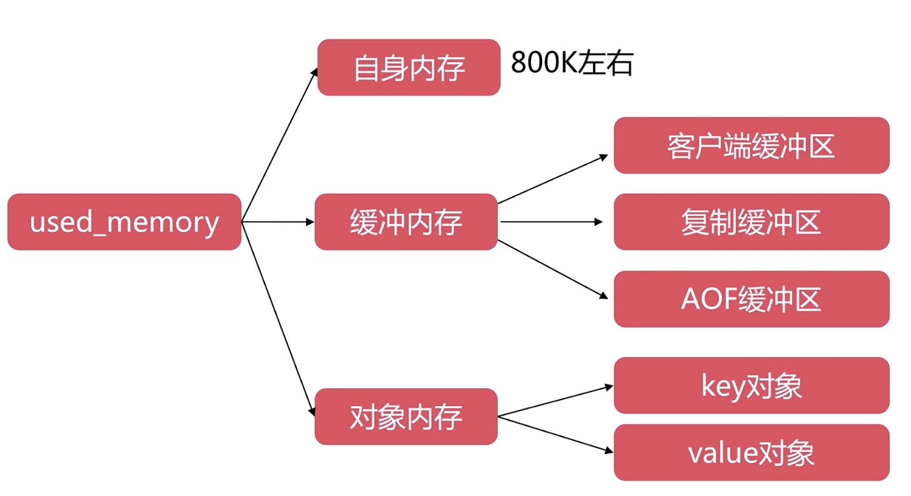

## 客户端缓冲区
### 输入缓冲区
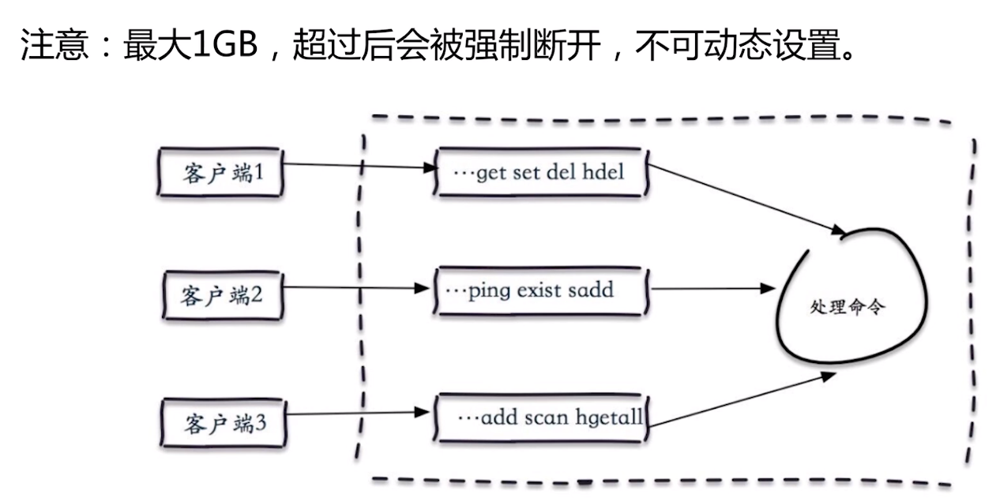
### 输出缓冲区
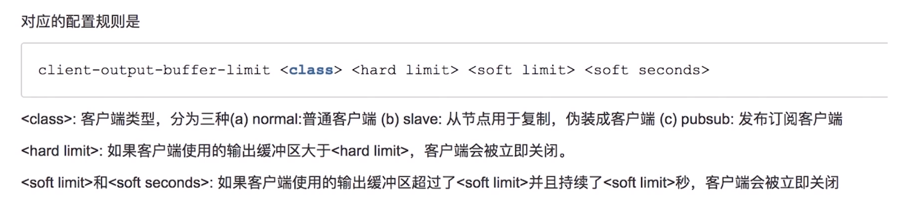

#### 普通客户端缓冲区
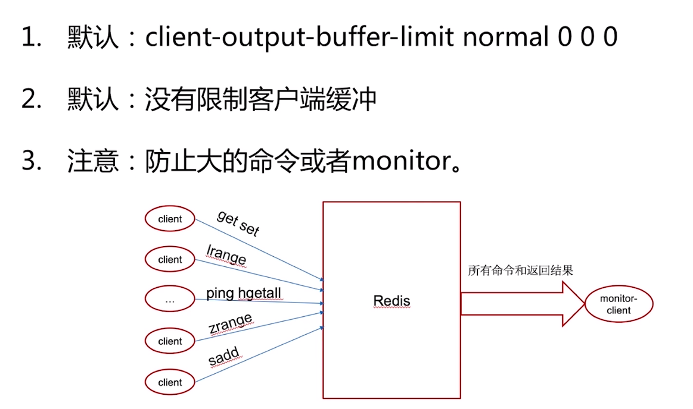
#### slave客户端缓冲区
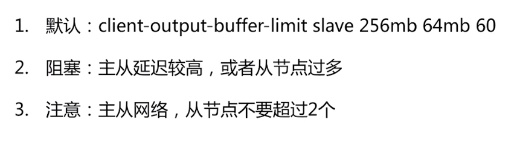
#### pubsub客户端缓冲区
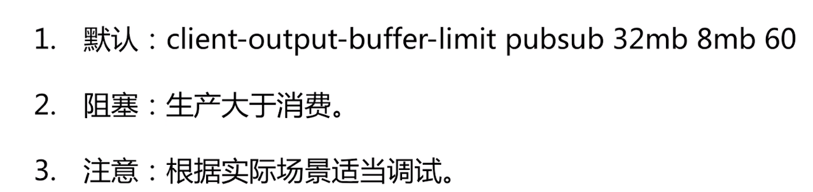
#### 复制缓冲区
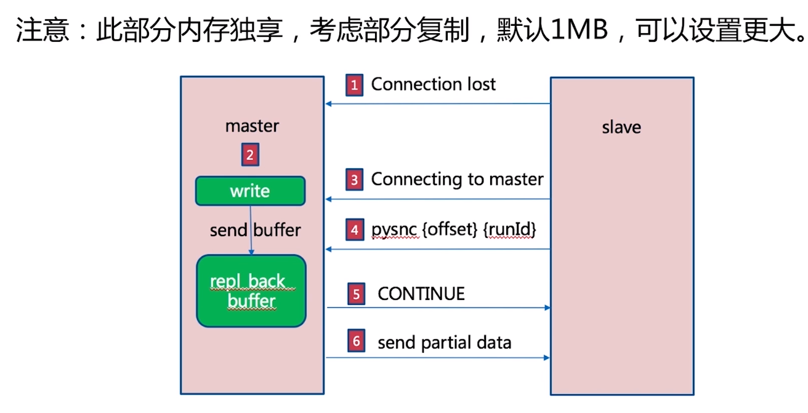
##### AOF缓冲区
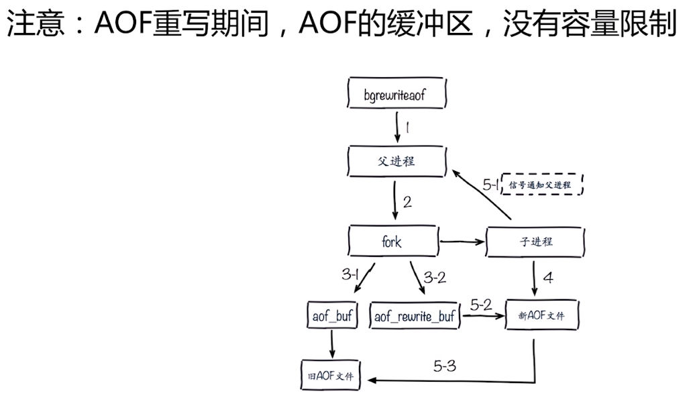

## 对象内存
- key不要过长，量大不容忽视
- value:ziplist,intset等优化方式

### 内存碎片
- 必然存在：jemalloc
- 优化方式
	- 避免频繁更新操作:append,setrange等
	- 安全重启:redis sentinel,redis cluster

### 子进程内存消耗
- 必然存在：fork(bgsave,bgrewriteaof)
- 优化方式：
	- 去掉THP特性，2.6.38新增特性
	- 观察写入量: copy on write
	- overcommit_memory = 1

## 内存上限
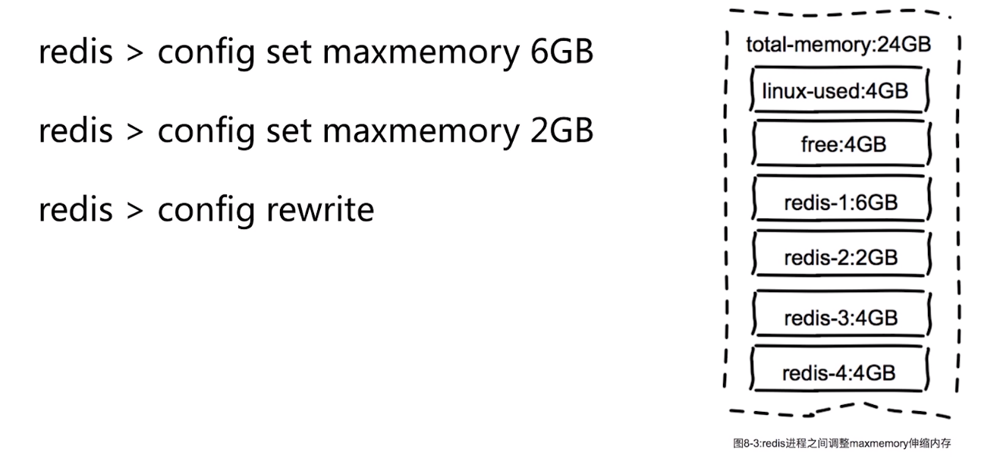

## 内存回收策略
### 删除过期键
- 惰性删除，访问key-> expired dict -> del key
- 定时删除, 每1秒运行10次，采样删除
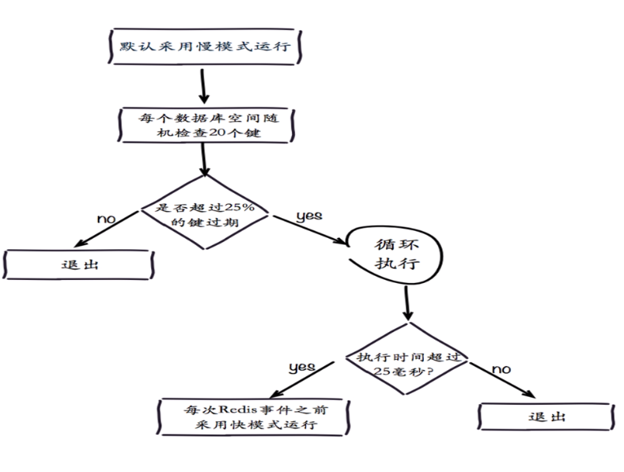

### 内存溢出策略
- Noeviction，默认删除，不会删除任何数据，拒绝所有写入操作并返回错误信息,"OOM commond not allowed when used memory",此时redis只相应读操作
- Volatile-LRU,根据LRU算法删除设置了超时属性的键，直到腾出足够空间为止，如果没有可删除的键对象，回退到noeviction策略
- AllowKey-LRU,根据LRU算法删除键，不管数据有没有设置超时属性，直到腾出足够的空间为止
- AllowKey-random，随机删除所有键，直到腾出足够的空间为止
- Volatile-random，随机删除过期键，直到腾出足够的空间为止
- Volatile-ttl,根据键值对象的ttl，删除最近将要过期的键，如果没有，回退到noevication策略
