# redis 开发规范
--- 
## key 设计
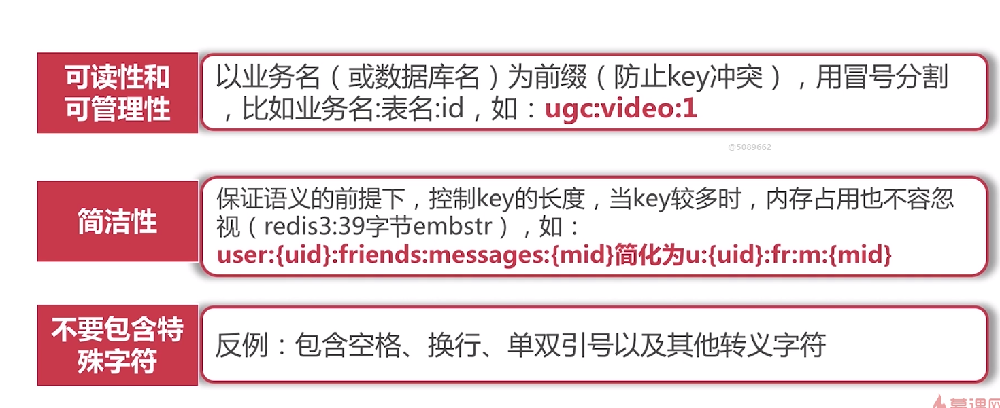

## value 设计
- 拒绝bigkey
- 选择合适的数据结构
- 过期设计

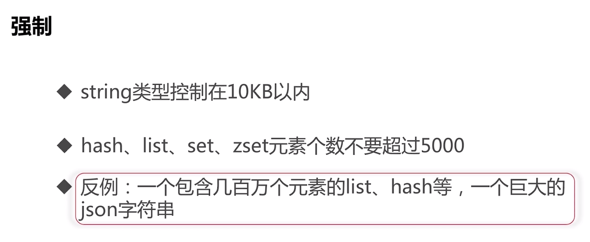
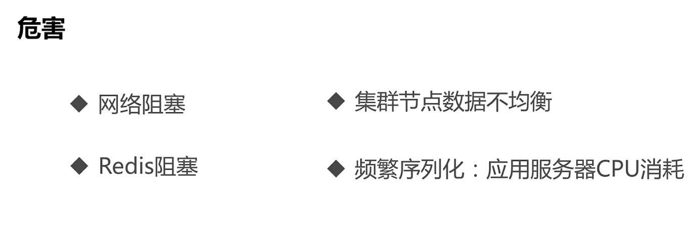
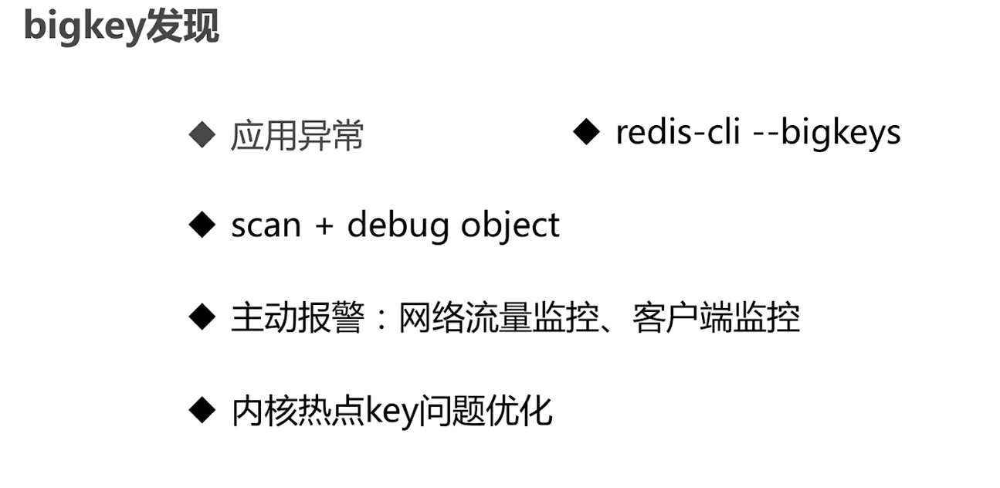

### bigkey 发现
- 应用方异常
- redis-cli --bigkeys
- scan + debug object
- 主动报警：网络流量监控，客户端监控
- 内核热点key问题优化以及工具

#### redis -cli --bigkeys
```shell
sibyl@sibyl:~/conf$ redis-cli -h 192.168.2.213 -p 7000 --bigkeys

# Scanning the entire keyspace to find biggest keys as well as
# average sizes per key type.  You can use -i 0.1 to sleep 0.1 sec
# per 100 SCAN commands (not usually needed).

[00.00%] Biggest string found so far 'key:1:' with 19472 bytes
[00.00%] Biggest string found so far 'key:8:' with 19479 bytes
[00.00%] Biggest string found so far 'key:17:' with 19481 bytes

-------- summary -------

Sampled 20 keys in the keyspace!
Total key length in bytes is 130 (avg len 6.50)

Biggest string found 'key:17:' has 19481 bytes

20 strings with 389002 bytes (100.00% of keys, avg size 19450.10)
0 lists with 0 items (00.00% of keys, avg size 0.00)
0 sets with 0 members (00.00% of keys, avg size 0.00)
0 hashs with 0 fields (00.00% of keys, avg size 0.00)
0 zsets with 0 members (00.00% of keys, avg size 0.00)
```

### bigkey 删除
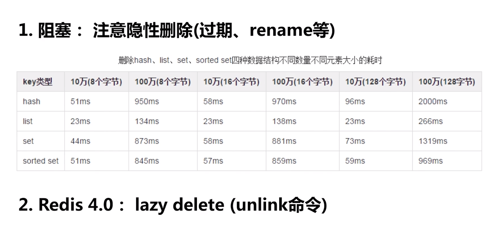
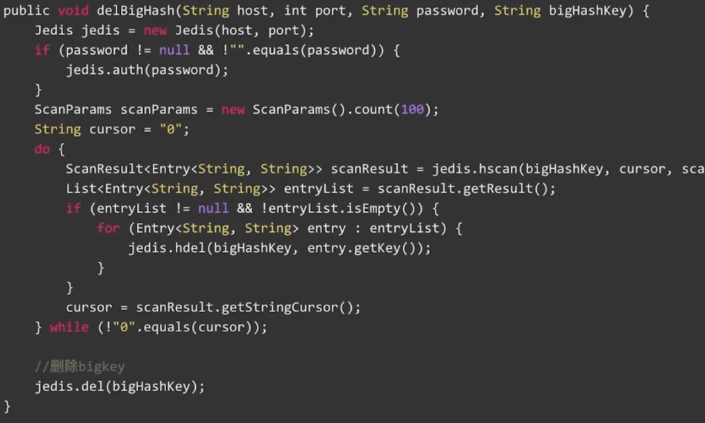

## 选择合适的数据结构
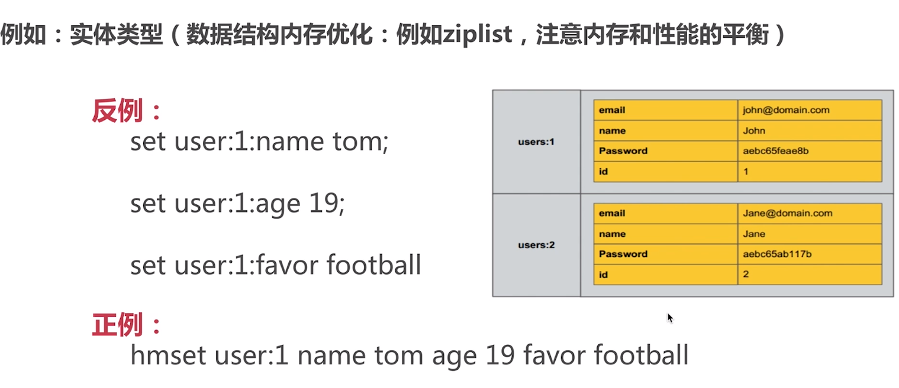

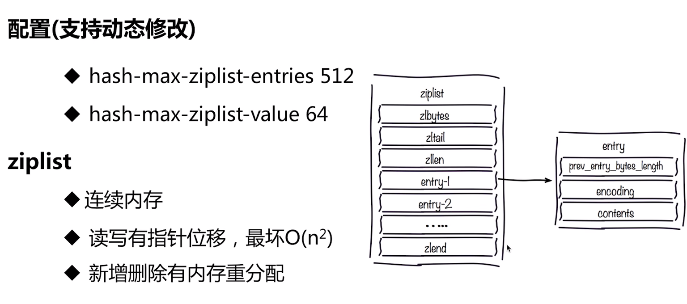
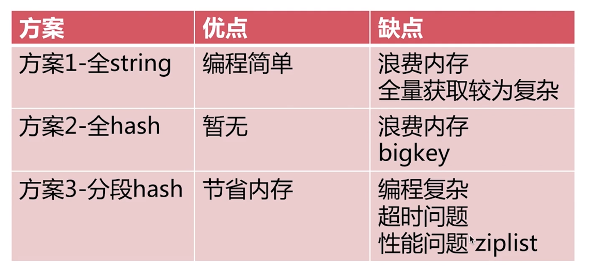

## 键值生命周期
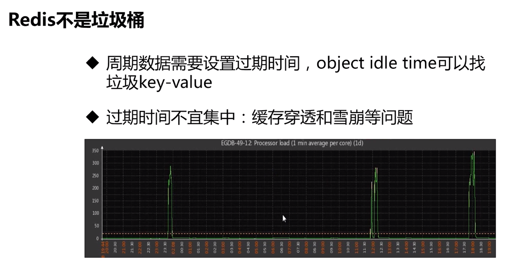

## 命令优化技巧
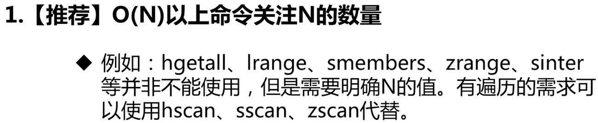
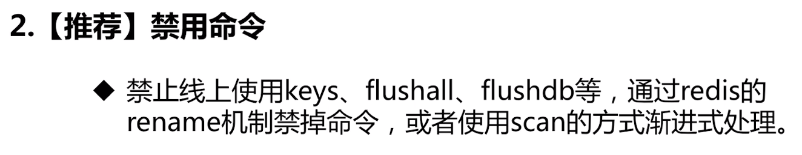
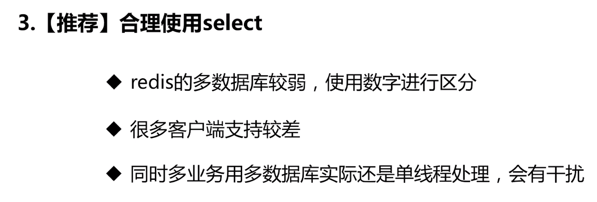
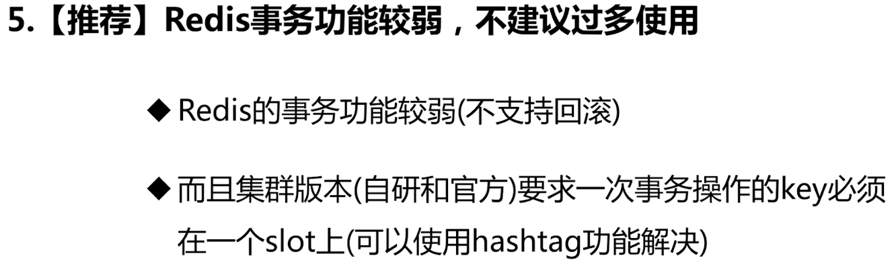
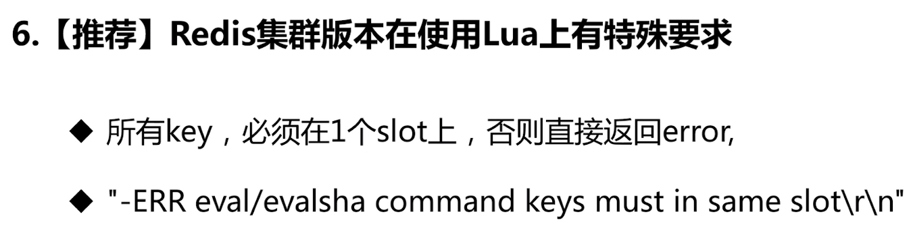
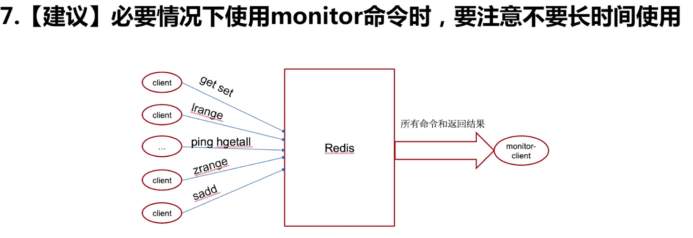

## java客户端优化
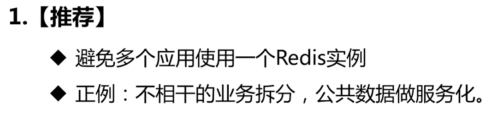
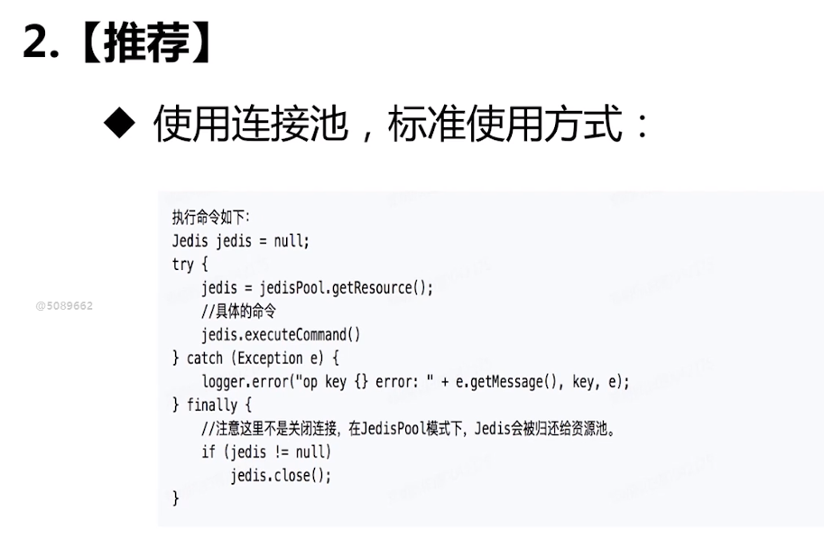

## 连接池参数优化
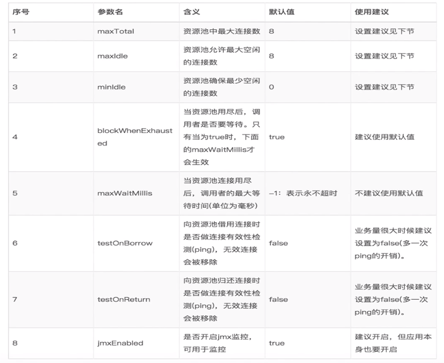
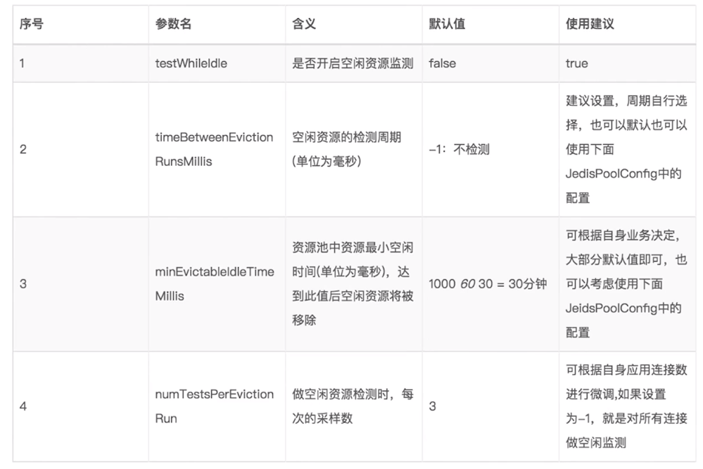

### 预估最大连接池
> maxTotal怎么设置？maxIdle接近maxTotal即可

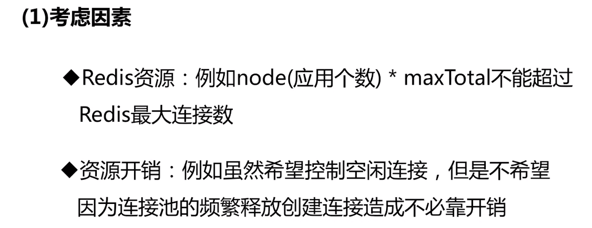
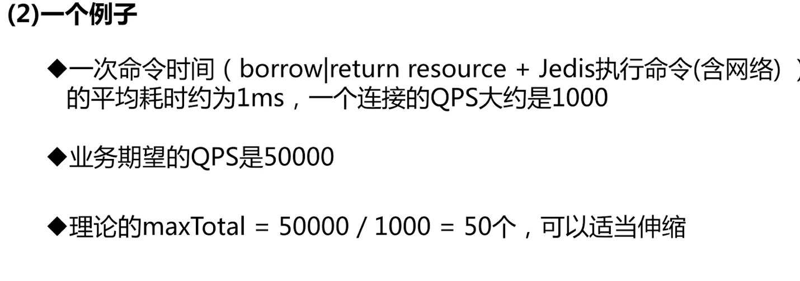
