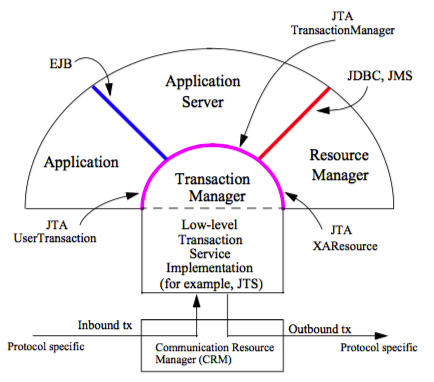

## JDBC事务
JDBC事务，就是在Java中用来控制数据库事务的。JDBC的一切行为包括事务是基于一个Connection的，在JDBC中是通过Connection对象进行事务管理。在JDBC中，常用的和事务相关的方法是： setAutoCommit、commit、rollback等。  
关于JDBC的事务，相对来说比较简单，主要就是通过JDBC API来控制数据库的事务执行。

```java
public static void main(String args[]) {
    Connection connection = xx;
    try {

    } catch (Exception e) {
        connection.rollback();
    }
    connection.commit();
}
```
JDBC为使用Java进行数据库的事务操作提供了最基本的支持。通过JDBC事务，我们可以将多个SQL语句放到同一个事务中，保证其ACID特性。JDBC事务的主要优点就是API比较简单，可以实现最基本的事务操作，性能也相对较好。

但是，JDBC事务有一个局限：**由于jdbc事务本身是基于java链接的，因此jdbc事务不能跨库和跨数据库连接,所以在涉及多个数据库操作时，jdbc事务就无能为力了**


## DB和MQ的事务消息
### 概念
**最大努力一次提交(Best Efforts 1PC)Best Efforts 1PC模式相当通用，但在开发人员必须注意的某些情况下可能会失败。这是一种非XA模式**，涉及大量资源的同步单阶段提交。因为不使用2PC，所以它永远不会像 XA 交易那样安全，但如果参与者意识到妥协，它通常就足够了。许多大容量、高吞吐量的事务处理系统都是以这种方式设置的，以提高性能。  
**基本思想是在事务中尽可能晚地延迟所有资源的提交，以便唯一可能出错的是基础设施故障(而不是业务处理错误)**。依赖Best Efforts 1PC的系统认为基础架构故障很少见，因此它们可以承担风险以换取更高的吞吐量。如果业务处理服务也被设计成幂等的，那么在实践中几乎不会出错。

**消息事务在数据库事务之前启动，并且它们以相反的顺序结束（提交或回滚）**
### 发送消息
- 开始消息事务
- 发送消息
- 启动数据库事务
- 更新数据库
- 提交数据库事务
- 提交消息事务

### 接收消息
成功的情况下的顺序可能和本文开头的顺序是一样的：
- 开始消息事务
- 接收消息
- 启动数据库事务
- 更新数据库
- 提交数据库事务
- 提交消息事务

关键在于最后两个步骤很重要：它们必须按此顺序放在最后。排序很重要的原因是技术上的，但顺序本身是由业务需求决定的。该订单告诉您，在这种情况下，其中一个交易资源是特殊的；它包含有关如何在另一方上开展工作的说明。这是一个业务排序：系统无法自动判断它是哪条路（尽管如果消息和数据库是两种资源，那么它通常是按这个顺序）。排序很重要的原因与失败案例有关。最常见的失败案例（到目前为止）是业务处理失败（错误数据、编程错误等）。在这种情况下，两个事务都可以很容易地被操纵以响应异常和回滚。

触发回滚的精确机制并不重要；有几个可用。重要的一点是提交或回滚以与资源中的业务顺序相反的顺序发生。在示例应用程序中，消息传递事务必须最后提交，因为业务流程的指令包含在该资源中。这很重要，因为（罕见的）失败案例是第一次提交成功而第二次提交失败。因为按照设计，此时所有业务处理都已经完成，所以这种部分失败的唯一原因是消息传递中间件的基础结构问题。

请注意，如果数据库资源的提交失败，那么最终效果仍然是回滚。因此，**唯一的非原子故障模式是第一个事务提交，第二个事务回滚。更一般地，如果n事务中有资源，则有n-1这种故障模式使一些资源在回滚后处于不一致（已提交）状态。在消息数据库用例中，这种故障模式的结果是消息被回滚并在另一个事务中返回，即使它已经被成功处理。因此，您可以安全地假设可能发生的最糟糕的事情是可以传递重复的消息**。在更一般的情况下，由于事务中较早的资源被认为可能携带有关如何对较晚的资源进行处理的信息，因此故障模式的最终结果通常可以称为重复消息。

有些人冒着重复消息很少发生的风险，以至于他们不会费心去预测它们。但是，为了对业务数据的正确性和一致性更有信心，您需要在业务逻辑中了解它们。如果业务处理意识到重复的消息可能到达，它所要做的（通常需要一些额外的成本，但不像2PC那样多）是检查它之前是否处理过该数据，如果已经处理过则什么也不做。这种专门化有时称为幂等业务服务模式。

[](https://www.javaworld.com/article/2077963/open-source-tools/distributed-transactions-in-spring--with-and-without-xa.html)

### 基于TransactionAwareConnectionFactoryProxy 实现active mq
``` java
public class ActivateMqConfig {
    @Bean
    public ConnectionFactoryconnectionFactory() {
        ConnectionFactory cf = new ActiveMQConnectionFactory("tcp://127.0.0.1:");
        // jms包下的，不是jca包下的
        TransactionAwareConnectionFactoryProxy proxy = new TransactionAwareConnectionFactoryProxy();
        proxy.setTargetConnectionFactory(cf);
        proxy.setSynchedLocalTransactionAllowed(true);
        return proxy;
    }

    @Bean
    public ImsTemplate jmsTemplate(ConnectionFactory connectionFactory) {
        JmsTemplate imsTemplate = new JmsTemplate(connectionFactory);
        jmsTemplate.setSessionTransacted():
    }
}
```

### 基于ChainedTransactionManager 实现rabbitmq
> 由于rabbitmq实现的AMQP协议，不是实现的jms协议，因此无法使用 TransactionAwareConnectionFactoryProxy 来实现1pc，只能通过 ChainedTransactionManager 来实现1pc

``` java
@Configuration
public class RabbitMQConfig {
    // 配置rabbit admin
    @Bean
    public RabbitAdmin rabbitAdmin(ConnectionFactory connectionFactory) {
        RabbitAdmin rabbitAdmin = new RabbitAdmin(connectionFactory);
        rabbitAdmin.setAutoStartup(true);
        return rabbitAdmin;
    }
}

```
``` java
@Configuration
public class ChainTxConfig {
    // db事务，并且优先使用db事务
    @Primary
    @Bean("dbTransactionManager")
    public DataSourceTransactionManager dataSourceTransactionManager(DataSource dataSource) {
        return new DataSourceTransactionManager(dataSource);
    }

    // 开启rabbit mq事务提交
    @Bean("rabbitTransactionManager")
    public RabbitTransactionManager rabbitTransactionManager(ConnectionFactory connectionFactory) {
        return new RabbitTransactionManager(connectionFactory);
    }

    // rabbitmq 和 db 的链式事务
    @Bean("rabbitAndDbTransactionManager")
    public PlatformTransactionManager chainedTransactionManager(
            ConnectionFactory connectionFactory,
            DataSourceTransactionManager dataSourceTransactionManager) {
        return new ChainedTransactionManager(rabbitTransactionManager(connectionFactory), dataSourceTransactionManager);
    }
}

```

``` log
2022-12-05 23:01:18.021 TRACE 5044 --- [nio-8005-exec-7] .s.t.s.TransactionSynchronizationManager : Initializing transaction synchronization
2022-12-05 23:01:18.021 TRACE 5044 --- [nio-8005-exec-7] .s.t.s.TransactionSynchronizationManager : Clearing transaction synchronization
// 开启rabbitmq的事务
2022-12-05 23:01:18.021 DEBUG 5044 --- [nio-8005-exec-7] o.s.a.r.t.RabbitTransactionManager       : Creating new transaction with name [com.lwl.mqdb.service.MqDbServiceImpl.sendMessageAndInsertDb]: PROPAGATION_REQUIRED,ISOLATION_DEFAULT; 'rabbitAndDbTransactionManager'
2022-12-05 23:01:18.021 DEBUG 5044 --- [nio-8005-exec-7] o.s.a.r.t.RabbitTransactionManager       : Created AMQP transaction on channel [Cached Rabbit Channel: AMQChannel(amqp://admin@192.168.111.15:5672/,1), conn: Proxy@4e8575a6 Shared Rabbit Connection: SimpleConnection@389734ec [delegate=amqp://admin@192.168.111.15:5672/, localPort= 51690]]
2022-12-05 23:01:18.021 TRACE 5044 --- [nio-8005-exec-7] .s.t.s.TransactionSynchronizationManager : Bound value [org.springframework.amqp.rabbit.connection.RabbitResourceHolder@17a24a2f] for key [CachingConnectionFactory [channelCacheSize=25, host=DESKTOP-N94QDPP, port=5672, active=true connectionFactory]] to thread [http-nio-8005-exec-7]
2022-12-05 23:01:18.021 TRACE 5044 --- [nio-8005-exec-7] .s.t.s.TransactionSynchronizationManager : Initializing transaction synchronization
2022-12-05 23:01:18.021 TRACE 5044 --- [nio-8005-exec-7] .s.t.s.TransactionSynchronizationManager : Clearing transaction synchronization
// 开启数据库事务
2022-12-05 23:01:18.021 DEBUG 5044 --- [nio-8005-exec-7] o.s.j.d.DataSourceTransactionManager     : Creating new transaction with name [com.lwl.mqdb.service.MqDbServiceImpl.sendMessageAndInsertDb]: PROPAGATION_REQUIRED,ISOLATION_DEFAULT; 'rabbitAndDbTransactionManager'
2022-12-05 23:01:18.022 DEBUG 5044 --- [nio-8005-exec-7] o.s.j.d.DataSourceTransactionManager     : Acquired Connection [HikariProxyConnection@426092203 wrapping com.mysql.jdbc.JDBC4Connection@533189f4] for JDBC transaction
2022-12-05 23:01:18.022 DEBUG 5044 --- [nio-8005-exec-7] o.s.j.d.DataSourceTransactionManager     : Switching JDBC Connection [HikariProxyConnection@426092203 wrapping com.mysql.jdbc.JDBC4Connection@533189f4] to manual commit
2022-12-05 23:01:18.023 TRACE 5044 --- [nio-8005-exec-7] .s.t.s.TransactionSynchronizationManager : Bound value [org.springframework.jdbc.datasource.ConnectionHolder@1d5a215f] for key [HikariDataSource (HikariPool-1)] to thread [http-nio-8005-exec-7]
2022-12-05 23:01:18.023 TRACE 5044 --- [nio-8005-exec-7] .s.t.s.TransactionSynchronizationManager : Initializing transaction synchronization
2022-12-05 23:01:18.023 TRACE 5044 --- [nio-8005-exec-7] o.s.t.i.TransactionInterceptor           : Getting transaction for [com.lwl.mqdb.service.MqDbServiceImpl.sendMessageAndInsertDb]
Creating a new SqlSession
Registering transaction synchronization for SqlSession [org.apache.ibatis.session.defaults.DefaultSqlSession@5858ac90]
2022-12-05 23:01:18.023 TRACE 5044 --- [nio-8005-exec-7] .s.t.s.TransactionSynchronizationManager : Bound value [org.mybatis.spring.SqlSessionHolder@5d2e6686] for key [org.apache.ibatis.session.defaults.DefaultSqlSessionFactory@640de630] to thread [http-nio-8005-exec-7]
2022-12-05 23:01:18.024 TRACE 5044 --- [nio-8005-exec-7] .s.t.s.TransactionSynchronizationManager : Retrieved value [org.springframework.jdbc.datasource.ConnectionHolder@1d5a215f] for key [HikariDataSource (HikariPool-1)] bound to thread [http-nio-8005-exec-7]
2022-12-05 23:01:18.024 TRACE 5044 --- [nio-8005-exec-7] .s.t.s.TransactionSynchronizationManager : Retrieved value [org.springframework.jdbc.datasource.ConnectionHolder@1d5a215f] for key [HikariDataSource (HikariPool-1)] bound to thread [http-nio-8005-exec-7]
JDBC Connection [HikariProxyConnection@426092203 wrapping com.mysql.jdbc.JDBC4Connection@533189f4] will be managed by Spring
2022-12-05 23:01:18.024 TRACE 5044 --- [nio-8005-exec-7] .s.t.s.TransactionSynchronizationManager : Retrieved value [org.springframework.jdbc.datasource.ConnectionHolder@1d5a215f] for key [HikariDataSource (HikariPool-1)] bound to thread [http-nio-8005-exec-7]
==>  Preparing: INSERT INTO mq_db_info ( name, age, create_date ) VALUES ( ?, ?, ? )
==> Parameters: all(String), 111(Integer), 2022-10-11 00:00:00.0(Timestamp)
<==    Updates: 1
2022-12-05 23:01:18.025 TRACE 5044 --- [nio-8005-exec-7] .s.t.s.TransactionSynchronizationManager : Retrieved value [org.mybatis.spring.SqlSessionHolder@5d2e6686] for key [org.apache.ibatis.session.defaults.DefaultSqlSessionFactory@640de630] bound to thread [http-nio-8005-exec-7]
2022-12-05 23:01:18.025 TRACE 5044 --- [nio-8005-exec-7] .s.t.s.TransactionSynchronizationManager : Retrieved value [org.mybatis.spring.SqlSessionHolder@5d2e6686] for key [org.apache.ibatis.session.defaults.DefaultSqlSessionFactory@640de630] bound to thread [http-nio-8005-exec-7]
Releasing transactional SqlSession [org.apache.ibatis.session.defaults.DefaultSqlSession@5858ac90]
2022-12-05 23:01:18.025 DEBUG 5044 --- [nio-8005-exec-7] o.s.amqp.rabbit.core.RabbitTemplate      : Executing callback RabbitTemplate$$Lambda$695/2013674971 on RabbitMQ Channel: Cached Rabbit Channel: AMQChannel(amqp://admin@192.168.111.15:5672/,2), conn: Proxy@4e8575a6 Shared Rabbit Connection: SimpleConnection@389734ec [delegate=amqp://admin@192.168.111.15:5672/, localPort= 51690]
2022-12-05 23:01:18.025 DEBUG 5044 --- [nio-8005-exec-7] o.s.amqp.rabbit.core.RabbitTemplate      : Publishing message [(Body:'[B@387753df(byte[6])' MessageProperties [headers={}, contentType=application/octet-stream, contentLength=0, deliveryMode=PERSISTENT, priority=0, deliveryTag=0])] on exchange [mq_db_exchange], routingKey = [mq_db]
2022-12-05 23:01:18.025 TRACE 5044 --- [nio-8005-exec-7] o.s.t.i.TransactionInterceptor           : Completing transaction for [com.lwl.mqdb.service.MqDbServiceImpl.sendMessageAndInsertDb]
2022-12-05 23:01:18.025 TRACE 5044 --- [nio-8005-exec-7] o.s.j.d.DataSourceTransactionManager     : Triggering beforeCommit synchronization
Transaction synchronization committing SqlSession [org.apache.ibatis.session.defaults.DefaultSqlSession@5858ac90]
2022-12-05 23:01:18.025 TRACE 5044 --- [nio-8005-exec-7] o.s.j.d.DataSourceTransactionManager     : Triggering beforeCompletion synchronization
Transaction synchronization deregistering SqlSession [org.apache.ibatis.session.defaults.DefaultSqlSession@5858ac90]
2022-12-05 23:01:18.025 TRACE 5044 --- [nio-8005-exec-7] .s.t.s.TransactionSynchronizationManager : Removed value [org.mybatis.spring.SqlSessionHolder@5d2e6686] for key [org.apache.ibatis.session.defaults.DefaultSqlSessionFactory@640de630] from thread [http-nio-8005-exec-7]
Transaction synchronization closing SqlSession [org.apache.ibatis.session.defaults.DefaultSqlSession@5858ac90]
2022-12-05 23:01:18.025 TRACE 5044 --- [nio-8005-exec-7] .s.t.s.TransactionSynchronizationManager : Retrieved value [org.springframework.jdbc.datasource.ConnectionHolder@1d5a215f] for key [HikariDataSource (HikariPool-1)] bound to thread [http-nio-8005-exec-7]
2022-12-05 23:01:18.026 DEBUG 5044 --- [nio-8005-exec-7] o.s.j.d.DataSourceTransactionManager     : Initiating transaction commit
// 提交 数据库的事务 
2022-12-05 23:01:18.026 DEBUG 5044 --- [nio-8005-exec-7] o.s.j.d.DataSourceTransactionManager     : Committing JDBC transaction on Connection [HikariProxyConnection@426092203 wrapping com.mysql.jdbc.JDBC4Connection@533189f4]
2022-12-05 23:01:18.031 TRACE 5044 --- [nio-8005-exec-7] o.s.j.d.DataSourceTransactionManager     : Triggering afterCommit synchronization
2022-12-05 23:01:18.032 TRACE 5044 --- [nio-8005-exec-7] .s.t.s.TransactionSynchronizationManager : Clearing transaction synchronization
2022-12-05 23:01:18.032 TRACE 5044 --- [nio-8005-exec-7] o.s.j.d.DataSourceTransactionManager     : Triggering afterCompletion synchronization
2022-12-05 23:01:18.032 TRACE 5044 --- [nio-8005-exec-7] .s.t.s.TransactionSynchronizationManager : Removed value [org.springframework.jdbc.datasource.ConnectionHolder@1d5a215f] for key [HikariDataSource (HikariPool-1)] from thread [http-nio-8005-exec-7]
2022-12-05 23:01:18.032 DEBUG 5044 --- [nio-8005-exec-7] o.s.j.d.DataSourceTransactionManager     : Releasing JDBC Connection [HikariProxyConnection@426092203 wrapping com.mysql.jdbc.JDBC4Connection@533189f4] after transaction
2022-12-05 23:01:18.032 DEBUG 5044 --- [nio-8005-exec-7] o.s.j.d.DataSourceTransactionManager     : Resuming suspended transaction after completion of inner transaction
2022-12-05 23:01:18.032 TRACE 5044 --- [nio-8005-exec-7] .s.t.s.TransactionSynchronizationManager : Initializing transaction synchronization
// 提交 rabbitmq的事务
2022-12-05 23:01:18.033 DEBUG 5044 --- [nio-8005-exec-7] o.s.a.r.t.RabbitTransactionManager       : Initiating transaction commit
2022-12-05 23:01:18.034 TRACE 5044 --- [nio-8005-exec-7] .s.t.s.TransactionSynchronizationManager : Clearing transaction synchronization
2022-12-05 23:01:18.034 TRACE 5044 --- [nio-8005-exec-7] .s.t.s.TransactionSynchronizationManager : Removed value [org.springframework.amqp.rabbit.connection.RabbitResourceHolder@17a24a2f] for key [CachingConnectionFactory [channelCacheSize=25, host=DESKTOP-N94QDPP, port=5672, active=true connectionFactory]] from thread [http-nio-8005-exec-7]
2022-12-05 23:01:18.034 DEBUG 5044 --- [nio-8005-exec-7] o.s.a.r.t.RabbitTransactionManager       : Resuming suspended transaction after completion of inner transaction
2022-12-05 23:01:18.034 TRACE 5044 --- [nio-8005-exec-7] .s.t.s.TransactionSynchronizationManager : Initializing transaction synchronization
```

## DB和DB的链式事务
DB和DB的Best Efforts 1PC在spring中提供的实现就是链式事务管理器。  
**ChainedTransactionManager只是同时开启两个事务，自动的对两个事务，顺序开启，倒序提交或回滚。它对多个数据源写数据，并不是一个原子操作，不能像XA那样保证对数据操作的完整性，一致性。通过底层源码可以看出是使用  List<PlatformTransactionManager>来维护事务列表。**
在异常的情况下,会以声明阶段相反的顺序发生回滚。**如果第一个事务已经提交，第二个事务没有提交，则整个事务没有办法回滚**。并且ChainedTransactionManager已经在spring新版本中标记为废弃。建议使用JTA强性事务。

### 配置
#### yml
``` yml
spring:
  ds-one:
    driver-class-name: com.mysql.jdbc.Driver
    username: root
    password: 123
    url: jdbc:mysql://192.168.111.10:3306/test_tx
  ds-two:
    driver-class-name: com.mysql.jdbc.Driver
    username: root
    password: 123
    url: jdbc:mysql://192.168.111.11:3306/test_tx
```

#### DbConfiguration
``` java

// MapperScan 注解是指定包下面的mapper使用那个数据源
@Configuration
@MapperScan(basePackages = {"com.lwl.chaintx.mapper.dsone"}, sqlSessionFactoryRef = "dsOneSqlSessionFactory")
@MapperScan(basePackages = {"com.lwl.chaintx.mapper.dstwo"}, sqlSessionFactoryRef = "dsTwoSqlSessionFactory")
public class DbConfiguration {

    // 数据源dsOne
    @Bean
    @Primary
    @ConfigurationProperties(prefix = "spring.ds-one")
    public DataSourceProperties dsOneProperties() {
        return new DataSourceProperties();
    }

    @Bean
    @Primary
    public DataSource dsOneDataSource() {
        return dsOneProperties()
                .initializeDataSourceBuilder()
                .type(HikariDataSource.class).build();
    }

    // 数据源dsTwo
    @Bean
    @ConfigurationProperties(prefix = "spring.ds-two")
    public DataSourceProperties dsTwoProperties() {
        return new DataSourceProperties();
    }

    @Bean
    public DataSource dsTwoDataSource() {
        return dsTwoProperties()
                .initializeDataSourceBuilder()
                .type(HikariDataSource.class).build();
    }


    // 用于使用的是mybatis，因此通过数据dsOne构建MybatisSqlSessionFactoryBean
    // 如果是jdbc则直接构建jdbcTemplate
    @Bean
    public SqlSessionFactory dsOneSqlSessionFactory() throws Exception {
        MybatisSqlSessionFactoryBean factoryBean = new MybatisSqlSessionFactoryBean();
        factoryBean.setDataSource(dsOneDataSource());
        factoryBean.setMapperLocations(new PathMatchingResourcePatternResolver().getResources("classpath*:mapper/*.xml"));
        return factoryBean.getObject();
    }

    @Bean
    public SqlSessionTemplate dsOneSqlSessionTemplate() throws Exception {
        SqlSessionTemplate template = new SqlSessionTemplate(dsOneSqlSessionFactory());
        return template;
    }

    // dsTwo构建MybatisSqlSessionFactoryBean
    @Bean
    public SqlSessionFactory dsTwoSqlSessionFactory() throws Exception {
        MybatisSqlSessionFactoryBean factoryBean = new MybatisSqlSessionFactoryBean();
        factoryBean.setDataSource(dsTwoDataSource());
        factoryBean.setMapperLocations(new PathMatchingResourcePatternResolver().getResources("classpath*:mapper/*.xml"));
        return factoryBean.getObject();
    }

    @Bean
    public SqlSessionTemplate dsTwoSqlSessionTemplate() throws Exception {
        SqlSessionTemplate template = new SqlSessionTemplate(dsTwoSqlSessionFactory());
        return template;
    }
}
```

### 无事务管理器
在不配置事务管理器的情况下，存在数据源dsOne,dsTwo。其中dsOne为@Primary。添加@Transactional事务由spring所管理
- 只存在数据源dsOne，@Transactional注解生效,执行失败则回滚
- 只存在数据源dsTwo，@Transactional注解失效,执行失败无法回滚
- 存在数据源dsOne,dsTwo，@Transactional注解失效,执行失败dsOne回滚,dsTwo无法回滚
根据以上情况可以看出，在没有配置事务管理器的情况下，@Primary注解的数据源事务生效，其他数据源事务无效

#### 数据源dsOne,dsTwo回滚日志
@Primary对同一个接口，可能会有几种不同的实现类，而默认只会采取其中一种的情况下。从日志  Rolling back JDBC transaction on Connection 中可以看出回滚的数据库连接是dsOne，而这个连接是@Primary的连接。将@Primary放到dsTwo的时候,同样从日志中可以看出回滚的是dsTwo。

``` log
2022-12-02 00:48:41.456 DEBUG 14576 --- [nio-8004-exec-1] o.s.j.d.DataSourceTransactionManager     : Creating new transaction with name [com.lwl.chaintx.service.ChainTxInfoServiceImpl.insertDbTwoError]: PROPAGATION_REQUIRED,ISOLATION_DEFAULT
2022-12-02 00:48:41.457  INFO 14576 --- [nio-8004-exec-1] com.zaxxer.hikari.HikariDataSource       : HikariPool-1 - Starting...
2022-12-02 00:48:48.436  INFO 14576 --- [nio-8004-exec-1] com.zaxxer.hikari.pool.PoolBase          : HikariPool-1 - Driver does not support get/set network timeout for connections. (com.mysql.jdbc.JDBC4Connection.getNetworkTimeout()I)
2022-12-02 00:48:48.440  INFO 14576 --- [nio-8004-exec-1] com.zaxxer.hikari.HikariDataSource       : HikariPool-1 - Start completed.
2022-12-02 00:48:48.443 DEBUG 14576 --- [nio-8004-exec-1] o.s.j.d.DataSourceTransactionManager     : Acquired Connection [HikariProxyConnection@1155242370 wrapping com.mysql.jdbc.JDBC4Connection@544dfcd3] for JDBC transaction
2022-12-02 00:48:48.445 DEBUG 14576 --- [nio-8004-exec-1] o.s.j.d.DataSourceTransactionManager     : Switching JDBC Connection [HikariProxyConnection@1155242370 wrapping com.mysql.jdbc.JDBC4Connection@544dfcd3] to manual commit
2022-12-02 00:48:48.446 TRACE 14576 --- [nio-8004-exec-1] .s.t.s.TransactionSynchronizationManager : Bound value [org.springframework.jdbc.datasource.ConnectionHolder@4c3162d8] for key [HikariDataSource (HikariPool-1)] to thread [http-nio-8004-exec-1]
2022-12-02 00:48:48.446 TRACE 14576 --- [nio-8004-exec-1] .s.t.s.TransactionSynchronizationManager : Initializing transaction synchronization
2022-12-02 00:48:48.446 TRACE 14576 --- [nio-8004-exec-1] o.s.t.i.TransactionInterceptor           : Getting transaction for [com.lwl.chaintx.service.ChainTxInfoServiceImpl.insertDbTwoError]
dsOne ======================================================================================
Creating a new SqlSession
Registering transaction synchronization for SqlSession [org.apache.ibatis.session.defaults.DefaultSqlSession@36a176e3]
2022-12-02 00:48:48.462 TRACE 14576 --- [nio-8004-exec-1] .s.t.s.TransactionSynchronizationManager : Bound value [org.mybatis.spring.SqlSessionHolder@764b39a8] for key [org.apache.ibatis.session.defaults.DefaultSqlSessionFactory@a66ebbc] to thread [http-nio-8004-exec-1]
2022-12-02 00:48:48.482 TRACE 14576 --- [nio-8004-exec-1] .s.t.s.TransactionSynchronizationManager : Retrieved value [org.springframework.jdbc.datasource.ConnectionHolder@4c3162d8] for key [HikariDataSource (HikariPool-1)] bound to thread [http-nio-8004-exec-1]
2022-12-02 00:48:48.482 TRACE 14576 --- [nio-8004-exec-1] .s.t.s.TransactionSynchronizationManager : Retrieved value [org.springframework.jdbc.datasource.ConnectionHolder@4c3162d8] for key [HikariDataSource (HikariPool-1)] bound to thread [http-nio-8004-exec-1]
JDBC Connection [HikariProxyConnection@1155242370 wrapping com.mysql.jdbc.JDBC4Connection@544dfcd3] will be managed by Spring
2022-12-02 00:48:48.486 TRACE 14576 --- [nio-8004-exec-1] .s.t.s.TransactionSynchronizationManager : Retrieved value [org.springframework.jdbc.datasource.ConnectionHolder@4c3162d8] for key [HikariDataSource (HikariPool-1)] bound to thread [http-nio-8004-exec-1]
2022-12-02 00:48:48.486 DEBUG 14576 --- [nio-8004-exec-1] c.l.c.m.d.DsOneChainTxInfoMapper.insert  : ==>  Preparing: INSERT INTO chain_tx_info ( name, age, create_date ) VALUES ( ?, ?, ? )
2022-12-02 00:48:48.502 DEBUG 14576 --- [nio-8004-exec-1] c.l.c.m.d.DsOneChainTxInfoMapper.insert  : ==> Parameters: 11 error_dsOne(String), 11(Integer), 2022-02-02 00:00:00.0(Timestamp)
2022-12-02 00:48:48.504 DEBUG 14576 --- [nio-8004-exec-1] c.l.c.m.d.DsOneChainTxInfoMapper.insert  : <==    Updates: 1
2022-12-02 00:48:48.509 TRACE 14576 --- [nio-8004-exec-1] .s.t.s.TransactionSynchronizationManager : Retrieved value [org.mybatis.spring.SqlSessionHolder@764b39a8] for key [org.apache.ibatis.session.defaults.DefaultSqlSessionFactory@a66ebbc] bound to thread [http-nio-8004-exec-1]
2022-12-02 00:48:48.509 TRACE 14576 --- [nio-8004-exec-1] .s.t.s.TransactionSynchronizationManager : Retrieved value [org.mybatis.spring.SqlSessionHolder@764b39a8] for key [org.apache.ibatis.session.defaults.DefaultSqlSessionFactory@a66ebbc] bound to thread [http-nio-8004-exec-1]
Releasing transactional SqlSession [org.apache.ibatis.session.defaults.DefaultSqlSession@36a176e3]
dsTwo ======================================================================================
Creating a new SqlSession
Registering transaction synchronization for SqlSession [org.apache.ibatis.session.defaults.DefaultSqlSession@6ca1deee]
2022-12-02 00:48:48.510 TRACE 14576 --- [nio-8004-exec-1] .s.t.s.TransactionSynchronizationManager : Bound value [org.mybatis.spring.SqlSessionHolder@3b389b6e] for key [org.apache.ibatis.session.defaults.DefaultSqlSessionFactory@7adb9f37] to thread [http-nio-8004-exec-1]
2022-12-02 00:48:48.510 DEBUG 14576 --- [nio-8004-exec-1] o.s.jdbc.datasource.DataSourceUtils      : Fetching JDBC Connection from DataSource
2022-12-02 00:48:48.510  INFO 14576 --- [nio-8004-exec-1] com.zaxxer.hikari.HikariDataSource       : HikariPool-2 - Starting...
2022-12-02 00:48:56.342  INFO 14576 --- [nio-8004-exec-1] com.zaxxer.hikari.pool.PoolBase          : HikariPool-2 - Driver does not support get/set network timeout for connections. (com.mysql.jdbc.JDBC4Connection.getNetworkTimeout()I)
2022-12-02 00:48:56.343  INFO 14576 --- [nio-8004-exec-1] com.zaxxer.hikari.HikariDataSource       : HikariPool-2 - Start completed.
2022-12-02 00:48:56.344 TRACE 14576 --- [nio-8004-exec-1] .s.t.s.TransactionSynchronizationManager : Bound value [org.springframework.jdbc.datasource.ConnectionHolder@3ab3225e] for key [HikariDataSource (HikariPool-2)] to thread [http-nio-8004-exec-1]
2022-12-02 00:48:56.344 TRACE 14576 --- [nio-8004-exec-1] .s.t.s.TransactionSynchronizationManager : Retrieved value [org.springframework.jdbc.datasource.ConnectionHolder@3ab3225e] for key [HikariDataSource (HikariPool-2)] bound to thread [http-nio-8004-exec-1]
JDBC Connection [HikariProxyConnection@1380915368 wrapping com.mysql.jdbc.JDBC4Connection@244f159e] will be managed by Spring
2022-12-02 00:48:56.345 TRACE 14576 --- [nio-8004-exec-1] .s.t.s.TransactionSynchronizationManager : Retrieved value [org.springframework.jdbc.datasource.ConnectionHolder@3ab3225e] for key [HikariDataSource (HikariPool-2)] bound to thread [http-nio-8004-exec-1]
2022-12-02 00:48:56.345 DEBUG 14576 --- [nio-8004-exec-1] c.l.c.m.d.DsTwoChainTxInfoMapper.insert  : ==>  Preparing: INSERT INTO chain_tx_info ( name, age, create_date ) VALUES ( ?, ?, ? )
2022-12-02 00:48:56.345 DEBUG 14576 --- [nio-8004-exec-1] c.l.c.m.d.DsTwoChainTxInfoMapper.insert  : ==> Parameters: 11 error_dsTwo(String), 11(Integer), 2022-02-02 00:00:00.0(Timestamp)
2022-12-02 00:48:56.350 DEBUG 14576 --- [nio-8004-exec-1] c.l.c.m.d.DsTwoChainTxInfoMapper.insert  : <==    Updates: 1
2022-12-02 00:48:56.351 TRACE 14576 --- [nio-8004-exec-1] .s.t.s.TransactionSynchronizationManager : Retrieved value [org.mybatis.spring.SqlSessionHolder@3b389b6e] for key [org.apache.ibatis.session.defaults.DefaultSqlSessionFactory@7adb9f37] bound to thread [http-nio-8004-exec-1]
2022-12-02 00:48:56.351 TRACE 14576 --- [nio-8004-exec-1] .s.t.s.TransactionSynchronizationManager : Retrieved value [org.mybatis.spring.SqlSessionHolder@3b389b6e] for key [org.apache.ibatis.session.defaults.DefaultSqlSessionFactory@7adb9f37] bound to thread [http-nio-8004-exec-1]
Releasing transactional SqlSession [org.apache.ibatis.session.defaults.DefaultSqlSession@6ca1deee]
throw exception ======================================================================================
2022-12-02 00:48:56.351 TRACE 14576 --- [nio-8004-exec-1] o.s.t.i.TransactionInterceptor           : Completing transaction for [com.lwl.chaintx.service.ChainTxInfoServiceImpl.insertDbTwoError] after exception: java.lang.RuntimeException
2022-12-02 00:48:56.351 TRACE 14576 --- [nio-8004-exec-1] o.s.t.i.RuleBasedTransactionAttribute    : Applying rules to determine whether transaction should rollback on java.lang.RuntimeException
2022-12-02 00:48:56.351 TRACE 14576 --- [nio-8004-exec-1] o.s.t.i.RuleBasedTransactionAttribute    : Winning rollback rule is: null
2022-12-02 00:48:56.351 TRACE 14576 --- [nio-8004-exec-1] o.s.t.i.RuleBasedTransactionAttribute    : No relevant rollback rule found: applying default rules
2022-12-02 00:48:56.351 TRACE 14576 --- [nio-8004-exec-1] o.s.j.d.DataSourceTransactionManager     : Triggering beforeCompletion synchronization
Transaction synchronization deregistering SqlSession [org.apache.ibatis.session.defaults.DefaultSqlSession@36a176e3]
2022-12-02 00:48:56.351 TRACE 14576 --- [nio-8004-exec-1] .s.t.s.TransactionSynchronizationManager : Removed value [org.mybatis.spring.SqlSessionHolder@764b39a8] for key [org.apache.ibatis.session.defaults.DefaultSqlSessionFactory@a66ebbc] from thread [http-nio-8004-exec-1]
Transaction synchronization closing SqlSession [org.apache.ibatis.session.defaults.DefaultSqlSession@36a176e3]
2022-12-02 00:48:56.352 TRACE 14576 --- [nio-8004-exec-1] .s.t.s.TransactionSynchronizationManager : Retrieved value [org.springframework.jdbc.datasource.ConnectionHolder@4c3162d8] for key [HikariDataSource (HikariPool-1)] bound to thread [http-nio-8004-exec-1]
Transaction synchronization deregistering SqlSession [org.apache.ibatis.session.defaults.DefaultSqlSession@6ca1deee]
2022-12-02 00:48:56.352 TRACE 14576 --- [nio-8004-exec-1] .s.t.s.TransactionSynchronizationManager : Removed value [org.mybatis.spring.SqlSessionHolder@3b389b6e] for key [org.apache.ibatis.session.defaults.DefaultSqlSessionFactory@7adb9f37] from thread [http-nio-8004-exec-1]
Transaction synchronization closing SqlSession [org.apache.ibatis.session.defaults.DefaultSqlSession@6ca1deee]
2022-12-02 00:48:56.352 TRACE 14576 --- [nio-8004-exec-1] .s.t.s.TransactionSynchronizationManager : Retrieved value [org.springframework.jdbc.datasource.ConnectionHolder@3ab3225e] for key [HikariDataSource (HikariPool-2)] bound to thread [http-nio-8004-exec-1]
2022-12-02 00:48:56.352 TRACE 14576 --- [nio-8004-exec-1] .s.t.s.TransactionSynchronizationManager : Removed value [org.springframework.jdbc.datasource.ConnectionHolder@3ab3225e] for key [HikariDataSource (HikariPool-2)] from thread [http-nio-8004-exec-1]
2022-12-02 00:48:56.353 DEBUG 14576 --- [nio-8004-exec-1] o.s.j.d.DataSourceTransactionManager     : Initiating transaction rollback
2022-12-02 00:48:56.353 DEBUG 14576 --- [nio-8004-exec-1] o.s.j.d.DataSourceTransactionManager     : Rolling back JDBC transaction on Connection [HikariProxyConnection@1155242370 wrapping com.mysql.jdbc.JDBC4Connection@544dfcd3]
2022-12-02 00:48:56.357 TRACE 14576 --- [nio-8004-exec-1] .s.t.s.TransactionSynchronizationManager : Clearing transaction synchronization
2022-12-02 00:48:56.357 TRACE 14576 --- [nio-8004-exec-1] o.s.j.d.DataSourceTransactionManager     : Triggering afterCompletion synchronization
2022-12-02 00:48:56.357 TRACE 14576 --- [nio-8004-exec-1] .s.t.s.TransactionSynchronizationManager : Removed value [org.springframework.jdbc.datasource.ConnectionHolder@4c3162d8] for key [HikariDataSource (HikariPool-1)] from thread [http-nio-8004-exec-1]
2022-12-02 00:48:56.358 DEBUG 14576 --- [nio-8004-exec-1] o.s.j.d.DataSourceTransactionManager     : Releasing JDBC Connection [HikariProxyConnection@1155242370 wrapping com.mysql.jdbc.JDBC4Connection@544dfcd3] after transaction
2022-12-02 00:48:56.358 ERROR 14576 --- [nio-8004-exec-1] c.l.chaintx.controller.ChainController   : insertDbTwoError executor error: null
```

### 事务管理器
#### 单数据源事务管理器
在每个数据源单独配置事务管理器的情况下，@Transactional 需要指定对应数据源使用的事务管理器. @Transactional(rollbackFor = Exception.class,transactionManager = "dsOneTransactionManager")
- 只存在数据源dsOne，@Transactional注解生效,执行正常
- 只存在数据源dsTwo，@Transactional注解失效,执行正常
- 存在数据源dsOne,dsTwo，@Transactional注解失效，指定的transactionManager生效，其他无效


``` java
@Configuration
@MapperScan(basePackages = {"com.lwl.chaintx.mapper.dsone"}, sqlSessionFactoryRef = "dsOneSqlSessionFactory")
@MapperScan(basePackages = {"com.lwl.chaintx.mapper.dstwo"}, sqlSessionFactoryRef = "dsTwoSqlSessionFactory")
public class DbConfiguration {
    // 数据源dsOne的事务管理器
    @Bean(name = "dsOneTransactionManager")
    public DataSourceTransactionManager dsOneTransactionManager() {
        return new DataSourceTransactionManager(dsOneDataSource());
    }

    // 数据源dsTwo的事务管理器
    @Bean(name = "dsTwoTransactionManager")
    public DataSourceTransactionManager dsTwoTransactionManager() {
        return new DataSourceTransactionManager(dsTwoDataSource());
    }
}
```

#### 链式事务管理器
``` java
@Configuration
@MapperScan(basePackages = {"com.lwl.chaintx.mapper.dsone"}, sqlSessionFactoryRef = "dsOneSqlSessionFactory")
@MapperScan(basePackages = {"com.lwl.chaintx.mapper.dstwo"}, sqlSessionFactoryRef = "dsTwoSqlSessionFactory")
public class DbConfiguration {

    @Bean
    public PlatformTransactionManager chainedTransactionManager() {
        return new ChainedTransactionManager(dsOneTransactionManager(), dsTwoTransactionManager());
    }
}
```
``` log
2022-12-04 14:49:53.908 TRACE 20088 --- [nio-8004-exec-4] .s.t.s.TransactionSynchronizationManager : Initializing transaction synchronization
2022-12-04 14:49:53.908 TRACE 20088 --- [nio-8004-exec-4] .s.t.s.TransactionSynchronizationManager : Clearing transaction synchronization
2022-12-04 14:49:53.908 DEBUG 20088 --- [nio-8004-exec-4] o.s.j.d.DataSourceTransactionManager     : Creating new transaction with name [com.lwl.chaintx.service.ChainTxInfoServiceImpl.insertAllDbError]: PROPAGATION_REQUIRED,ISOLATION_DEFAULT; 'chainedTransactionManager',-java.lang.Exception
2022-12-04 14:49:53.909 DEBUG 20088 --- [nio-8004-exec-4] o.s.j.d.DataSourceTransactionManager     : Acquired Connection [HikariProxyConnection@1892315266 wrapping com.mysql.jdbc.JDBC4Connection@3cbc801a] for JDBC transaction
2022-12-04 14:49:53.909 DEBUG 20088 --- [nio-8004-exec-4] o.s.j.d.DataSourceTransactionManager     : Switching JDBC Connection [HikariProxyConnection@1892315266 wrapping com.mysql.jdbc.JDBC4Connection@3cbc801a] to manual commit
2022-12-04 14:49:53.910 TRACE 20088 --- [nio-8004-exec-4] .s.t.s.TransactionSynchronizationManager : Bound value [org.springframework.jdbc.datasource.ConnectionHolder@7e0d90eb] for key [HikariDataSource (HikariPool-1)] to thread [http-nio-8004-exec-4]
2022-12-04 14:49:53.910 TRACE 20088 --- [nio-8004-exec-4] .s.t.s.TransactionSynchronizationManager : Initializing transaction synchronization
2022-12-04 14:49:53.910 TRACE 20088 --- [nio-8004-exec-4] .s.t.s.TransactionSynchronizationManager : Clearing transaction synchronization
2022-12-04 14:49:53.910 DEBUG 20088 --- [nio-8004-exec-4] o.s.j.d.DataSourceTransactionManager     : Creating new transaction with name [com.lwl.chaintx.service.ChainTxInfoServiceImpl.insertAllDbError]: PROPAGATION_REQUIRED,ISOLATION_DEFAULT; 'chainedTransactionManager',-java.lang.Exception
2022-12-04 14:49:53.911 DEBUG 20088 --- [nio-8004-exec-4] o.s.j.d.DataSourceTransactionManager     : Acquired Connection [HikariProxyConnection@2050104306 wrapping com.mysql.jdbc.JDBC4Connection@2c2a0b20] for JDBC transaction
2022-12-04 14:49:53.911 DEBUG 20088 --- [nio-8004-exec-4] o.s.j.d.DataSourceTransactionManager     : Switching JDBC Connection [HikariProxyConnection@2050104306 wrapping com.mysql.jdbc.JDBC4Connection@2c2a0b20] to manual commit
2022-12-04 14:49:53.911 TRACE 20088 --- [nio-8004-exec-4] .s.t.s.TransactionSynchronizationManager : Bound value [org.springframework.jdbc.datasource.ConnectionHolder@3f309ad0] for key [HikariDataSource (HikariPool-2)] to thread [http-nio-8004-exec-4]
2022-12-04 14:49:53.912 TRACE 20088 --- [nio-8004-exec-4] .s.t.s.TransactionSynchronizationManager : Initializing transaction synchronization
2022-12-04 14:49:53.912 TRACE 20088 --- [nio-8004-exec-4] o.s.t.i.TransactionInterceptor           : Getting transaction for [com.lwl.chaintx.service.ChainTxInfoServiceImpl.insertAllDbError]
dsOne ======================================================================================
Creating a new SqlSession
Registering transaction synchronization for SqlSession [org.apache.ibatis.session.defaults.DefaultSqlSession@1cddb3d4]
2022-12-04 14:49:53.912 TRACE 20088 --- [nio-8004-exec-4] .s.t.s.TransactionSynchronizationManager : Bound value [org.mybatis.spring.SqlSessionHolder@e45e26c] for key [org.apache.ibatis.session.defaults.DefaultSqlSessionFactory@4d583982] to thread [http-nio-8004-exec-4]
2022-12-04 14:49:53.912 TRACE 20088 --- [nio-8004-exec-4] .s.t.s.TransactionSynchronizationManager : Retrieved value [org.springframework.jdbc.datasource.ConnectionHolder@7e0d90eb] for key [HikariDataSource (HikariPool-1)] bound to thread [http-nio-8004-exec-4]
2022-12-04 14:49:53.912 TRACE 20088 --- [nio-8004-exec-4] .s.t.s.TransactionSynchronizationManager : Retrieved value [org.springframework.jdbc.datasource.ConnectionHolder@7e0d90eb] for key [HikariDataSource (HikariPool-1)] bound to thread [http-nio-8004-exec-4]
JDBC Connection [HikariProxyConnection@1892315266 wrapping com.mysql.jdbc.JDBC4Connection@3cbc801a] will be managed by Spring
2022-12-04 14:49:53.912 TRACE 20088 --- [nio-8004-exec-4] .s.t.s.TransactionSynchronizationManager : Retrieved value [org.springframework.jdbc.datasource.ConnectionHolder@7e0d90eb] for key [HikariDataSource (HikariPool-1)] bound to thread [http-nio-8004-exec-4]
2022-12-04 14:49:53.912 DEBUG 20088 --- [nio-8004-exec-4] c.l.c.m.d.DsOneChainTxInfoMapper.insert  : ==>  Preparing: INSERT INTO chain_tx_info ( name, age, create_date ) VALUES ( ?, ?, ? )
2022-12-04 14:49:53.913 DEBUG 20088 --- [nio-8004-exec-4] c.l.c.m.d.DsOneChainTxInfoMapper.insert  : ==> Parameters: all_dsOne(String), 111(Integer), 2022-10-11 00:00:00.0(Timestamp)
2022-12-04 14:49:53.914 DEBUG 20088 --- [nio-8004-exec-4] c.l.c.m.d.DsOneChainTxInfoMapper.insert  : <==    Updates: 1
2022-12-04 14:49:53.914 TRACE 20088 --- [nio-8004-exec-4] .s.t.s.TransactionSynchronizationManager : Retrieved value [org.mybatis.spring.SqlSessionHolder@e45e26c] for key [org.apache.ibatis.session.defaults.DefaultSqlSessionFactory@4d583982] bound to thread [http-nio-8004-exec-4]
2022-12-04 14:49:53.914 TRACE 20088 --- [nio-8004-exec-4] .s.t.s.TransactionSynchronizationManager : Retrieved value [org.mybatis.spring.SqlSessionHolder@e45e26c] for key [org.apache.ibatis.session.defaults.DefaultSqlSessionFactory@4d583982] bound to thread [http-nio-8004-exec-4]
Releasing transactional SqlSession [org.apache.ibatis.session.defaults.DefaultSqlSession@1cddb3d4]
dsTwo ======================================================================================
Creating a new SqlSession
Registering transaction synchronization for SqlSession [org.apache.ibatis.session.defaults.DefaultSqlSession@2e2d2ebb]
2022-12-04 14:49:53.914 TRACE 20088 --- [nio-8004-exec-4] .s.t.s.TransactionSynchronizationManager : Bound value [org.mybatis.spring.SqlSessionHolder@fdaef90] for key [org.apache.ibatis.session.defaults.DefaultSqlSessionFactory@49597764] to thread [http-nio-8004-exec-4]
2022-12-04 14:49:53.915 TRACE 20088 --- [nio-8004-exec-4] .s.t.s.TransactionSynchronizationManager : Retrieved value [org.springframework.jdbc.datasource.ConnectionHolder@3f309ad0] for key [HikariDataSource (HikariPool-2)] bound to thread [http-nio-8004-exec-4]
2022-12-04 14:49:53.915 TRACE 20088 --- [nio-8004-exec-4] .s.t.s.TransactionSynchronizationManager : Retrieved value [org.springframework.jdbc.datasource.ConnectionHolder@3f309ad0] for key [HikariDataSource (HikariPool-2)] bound to thread [http-nio-8004-exec-4]
JDBC Connection [HikariProxyConnection@2050104306 wrapping com.mysql.jdbc.JDBC4Connection@2c2a0b20] will be managed by Spring
2022-12-04 14:49:53.915 TRACE 20088 --- [nio-8004-exec-4] .s.t.s.TransactionSynchronizationManager : Retrieved value [org.springframework.jdbc.datasource.ConnectionHolder@3f309ad0] for key [HikariDataSource (HikariPool-2)] bound to thread [http-nio-8004-exec-4]
2022-12-04 14:49:53.915 DEBUG 20088 --- [nio-8004-exec-4] c.l.c.m.d.DsTwoChainTxInfoMapper.insert  : ==>  Preparing: INSERT INTO chain_tx_info ( name, age, create_date ) VALUES ( ?, ?, ? )
2022-12-04 14:49:53.915 DEBUG 20088 --- [nio-8004-exec-4] c.l.c.m.d.DsTwoChainTxInfoMapper.insert  : ==> Parameters: all_dsTwo(String), 111(Integer), 2022-10-11 00:00:00.0(Timestamp)
2022-12-04 14:49:53.916 DEBUG 20088 --- [nio-8004-exec-4] c.l.c.m.d.DsTwoChainTxInfoMapper.insert  : <==    Updates: 1
2022-12-04 14:49:53.917 TRACE 20088 --- [nio-8004-exec-4] .s.t.s.TransactionSynchronizationManager : Retrieved value [org.mybatis.spring.SqlSessionHolder@fdaef90] for key [org.apache.ibatis.session.defaults.DefaultSqlSessionFactory@49597764] bound to thread [http-nio-8004-exec-4]
2022-12-04 14:49:53.917 TRACE 20088 --- [nio-8004-exec-4] .s.t.s.TransactionSynchronizationManager : Retrieved value [org.mybatis.spring.SqlSessionHolder@fdaef90] for key [org.apache.ibatis.session.defaults.DefaultSqlSessionFactory@49597764] bound to thread [http-nio-8004-exec-4]
Releasing transactional SqlSession [org.apache.ibatis.session.defaults.DefaultSqlSession@2e2d2ebb]
throw exception ======================================================================================
2022-12-04 14:49:53.917 TRACE 20088 --- [nio-8004-exec-4] o.s.t.i.TransactionInterceptor           : Completing transaction for [com.lwl.chaintx.service.ChainTxInfoServiceImpl.insertAllDbError] after exception: java.lang.RuntimeException
2022-12-04 14:49:53.917 TRACE 20088 --- [nio-8004-exec-4] o.s.t.i.RuleBasedTransactionAttribute    : Applying rules to determine whether transaction should rollback on java.lang.RuntimeException
2022-12-04 14:49:53.917 TRACE 20088 --- [nio-8004-exec-4] o.s.t.i.RuleBasedTransactionAttribute    : Winning rollback rule is: RollbackRuleAttribute with pattern [java.lang.Exception]
2022-12-04 14:49:53.917 TRACE 20088 --- [nio-8004-exec-4] o.s.j.d.DataSourceTransactionManager     : Triggering beforeCompletion synchronization
Transaction synchronization deregistering SqlSession [org.apache.ibatis.session.defaults.DefaultSqlSession@1cddb3d4]
2022-12-04 14:49:53.917 TRACE 20088 --- [nio-8004-exec-4] .s.t.s.TransactionSynchronizationManager : Removed value [org.mybatis.spring.SqlSessionHolder@e45e26c] for key [org.apache.ibatis.session.defaults.DefaultSqlSessionFactory@4d583982] from thread [http-nio-8004-exec-4]
Transaction synchronization closing SqlSession [org.apache.ibatis.session.defaults.DefaultSqlSession@1cddb3d4]
2022-12-04 14:49:53.917 TRACE 20088 --- [nio-8004-exec-4] .s.t.s.TransactionSynchronizationManager : Retrieved value [org.springframework.jdbc.datasource.ConnectionHolder@7e0d90eb] for key [HikariDataSource (HikariPool-1)] bound to thread [http-nio-8004-exec-4]
Transaction synchronization deregistering SqlSession [org.apache.ibatis.session.defaults.DefaultSqlSession@2e2d2ebb]
2022-12-04 14:49:53.917 TRACE 20088 --- [nio-8004-exec-4] .s.t.s.TransactionSynchronizationManager : Removed value [org.mybatis.spring.SqlSessionHolder@fdaef90] for key [org.apache.ibatis.session.defaults.DefaultSqlSessionFactory@49597764] from thread [http-nio-8004-exec-4]
Transaction synchronization closing SqlSession [org.apache.ibatis.session.defaults.DefaultSqlSession@2e2d2ebb]
2022-12-04 14:49:53.917 TRACE 20088 --- [nio-8004-exec-4] .s.t.s.TransactionSynchronizationManager : Retrieved value [org.springframework.jdbc.datasource.ConnectionHolder@3f309ad0] for key [HikariDataSource (HikariPool-2)] bound to thread [http-nio-8004-exec-4]
2022-12-04 14:49:53.917 DEBUG 20088 --- [nio-8004-exec-4] o.s.j.d.DataSourceTransactionManager     : Initiating transaction rollback
// 回滚事务
2022-12-04 14:49:53.917 DEBUG 20088 --- [nio-8004-exec-4] o.s.j.d.DataSourceTransactionManager     : Rolling back JDBC transaction on Connection [HikariProxyConnection@2050104306 wrapping com.mysql.jdbc.JDBC4Connection@2c2a0b20]
2022-12-04 14:49:53.923 TRACE 20088 --- [nio-8004-exec-4] .s.t.s.TransactionSynchronizationManager : Clearing transaction synchronization
2022-12-04 14:49:53.923 TRACE 20088 --- [nio-8004-exec-4] o.s.j.d.DataSourceTransactionManager     : Triggering afterCompletion synchronization
2022-12-04 14:49:53.923 TRACE 20088 --- [nio-8004-exec-4] .s.t.s.TransactionSynchronizationManager : Removed value [org.springframework.jdbc.datasource.ConnectionHolder@3f309ad0] for key [HikariDataSource (HikariPool-2)] from thread [http-nio-8004-exec-4]
2022-12-04 14:49:53.924 DEBUG 20088 --- [nio-8004-exec-4] o.s.j.d.DataSourceTransactionManager     : Releasing JDBC Connection [HikariProxyConnection@2050104306 wrapping com.mysql.jdbc.JDBC4Connection@2c2a0b20] after transaction
2022-12-04 14:49:53.924 DEBUG 20088 --- [nio-8004-exec-4] o.s.j.d.DataSourceTransactionManager     : Resuming suspended transaction after completion of inner transaction
2022-12-04 14:49:53.924 TRACE 20088 --- [nio-8004-exec-4] .s.t.s.TransactionSynchronizationManager : Initializing transaction synchronization
2022-12-04 14:49:53.924 TRACE 20088 --- [nio-8004-exec-4] o.s.j.d.DataSourceTransactionManager     : Triggering beforeCompletion synchronization
2022-12-04 14:49:53.924 DEBUG 20088 --- [nio-8004-exec-4] o.s.j.d.DataSourceTransactionManager     : Initiating transaction rollback
// 回滚事务
2022-12-04 14:49:53.924 DEBUG 20088 --- [nio-8004-exec-4] o.s.j.d.DataSourceTransactionManager     : Rolling back JDBC transaction on Connection [HikariProxyConnection@1892315266 wrapping com.mysql.jdbc.JDBC4Connection@3cbc801a]
2022-12-04 14:49:53.930 TRACE 20088 --- [nio-8004-exec-4] .s.t.s.TransactionSynchronizationManager : Clearing transaction synchronization
2022-12-04 14:49:53.930 TRACE 20088 --- [nio-8004-exec-4] o.s.j.d.DataSourceTransactionManager     : Triggering afterCompletion synchronization
2022-12-04 14:49:53.930 TRACE 20088 --- [nio-8004-exec-4] .s.t.s.TransactionSynchronizationManager : Removed value [org.springframework.jdbc.datasource.ConnectionHolder@7e0d90eb] for key [HikariDataSource (HikariPool-1)] from thread [http-nio-8004-exec-4]
2022-12-04 14:49:53.931 DEBUG 20088 --- [nio-8004-exec-4] o.s.j.d.DataSourceTransactionManager     : Releasing JDBC Connection [HikariProxyConnection@1892315266 wrapping com.mysql.jdbc.JDBC4Connection@3cbc801a] after transaction
2022-12-04 14:49:53.931 DEBUG 20088 --- [nio-8004-exec-4] o.s.j.d.DataSourceTransactionManager     : Resuming suspended transaction after completion of inner transaction
2022-12-04 14:49:53.931 TRACE 20088 --- [nio-8004-exec-4] .s.t.s.TransactionSynchronizationManager : Initializing transaction synchronization
2022-12-04 14:49:53.931 ERROR 20088 --- [nio-8004-exec-4] c.l.chaintx.controller.ChainController   : insertAllDbError executor error: null

```

#### 链式事务管理器的执行顺序
``` java
public class ChainedTransactionManager implements PlatformTransactionManager {
    // 维护的顺序消息列表
    private final List<PlatformTransactionManager> transactionManagers;

    public MultiTransactionStatus getTransaction(@Nullable TransactionDefinition definition) throws TransactionException {
        MultiTransactionStatus mts = new MultiTransactionStatus((PlatformTransactionManager)this.transactionManagers.get(0));
        if (definition == null) {
            return mts;
        } else {
            try {
                Iterator var3 = this.transactionManagers.iterator();
                // 顺序开启事务
                while(var3.hasNext()) {
                    PlatformTransactionManager transactionManager = (PlatformTransactionManager)var3.next();
                    mts.registerTransactionManager(definition, transactionManager);
                }

                return mts;
            } catch (Exception var9) {
            }
        }
    }
    public void commit(TransactionStatus status) throws TransactionException {
        // 倒序 commit
        Iterator var6 = this.reverse(this.transactionManagers).iterator();
        while(var6.hasNext()) {
        }
    }
    public void rollback(TransactionStatus status) throws TransactionException {
        // 倒序rollback 
        Iterator var5 = this.reverse(this.transactionManagers).iterator();
        while(var5.hasNext()) {
        }
    }
}
```
## DB和DB的JTA事务
### JTA规范
XA是分布式事务规范，采用两阶段提交的方案（pre，commit）。某种程度上，可以认为JTA规范是XA规范的Java版，其把XA规范中规定的DTP模型交互接口抽象成Java接口中的方法，并规定每个方法要实现什么样的功能。
#### JTA事务模型


包括五个参与者：  
**TM(transaction manager)**: 事务管理器提供支持事务界定、事务资源管理、同步和事务上下文传播所需的服务和管理功能。  
**AS(application server)**: 应用服务器提供了支持应用程序运行时环境所需的基础设施，其中包括事务状态管理。此类应用程序服务器的一个例子就是EJB服务器。jboss、weblogic、websphere等都是支持JTA规范的。注意：tomcat不支持JTA规范，所以只能使用第三方的TM库，如JOTM和Atomikos。将TM直接整合进应用中，不再依赖于AS。  
**RM(resource manager)**：资源管理器为应用程序提供对资源的访问。RM通过实现事务资源接口来参与分布式事务。这个事务资源接口是给TM用于沟通事务关联、事务完成和恢复工作的。例如关系数据库服务器。  
**AP(application program)**：一个基于组件的事务型应用程序，通过声明性事务属性设置提供事务管理支持。  
**CRM(communication resource manager)**：通信资源管理器支持事务上下文传播和对传入和传出请求的事务服务的访问。  

#### JTA 接口
- XAResource：XA资源管理器接口，RM提供给TM调用。XAResource接口是基于X/Open CAE规范(分布式事务处理:XA规范)的行业标准XA接口的Java映射。  
- Xid：Xid接口是X/Open事务标识Xid结构的Java映射。此接口指定三个方法:，分别获取：全局事务的格式化ID、全局事务ID和分支限定符。TM和RM使用Xid接口。此接口对AP和AS都不可见。  
- Status:定义事务状态。共指定10个状态
- Synchronization：同步接口。事务同步允许AS在事务完成之前和之后从TM获得通知。
- Transaction：事务定义接口。每个全局事务都与一个事务对象关联。
- TransactionManager：事务管理器。管理事务的全生命周期。
- TransactionSynchronizationRegistry：事务同步注册器。用于系统级AS组件(如持久化管理器)。这提供了注册具有特殊排序语义的同步对象、将资源对象与当前事务关联、获取当前事务的事务上下文、获取当前事务状态以及将当前事务标记为回滚的能力。
- UserTransaction：事务客户端，封装了用户可直接操作事务的接口。


这些接口都不需要开发者去实现。XAResource、Xid由数据库厂商实现。TransactionManager、UserTransaction等操作事务相关的接口由AS厂商实现(例如web服务就是jboss、weblogic，或者第三方事务类库jotm、Atomikos)。  
用户只需要使用UserTransaction的实现类来操控事务的创建、提交、回滚即可


### atomikos和2pc

``` java

@Configuration
@MapperScan(basePackages = {"com.lwl.atomikos.mapper.dsone"}, sqlSessionFactoryRef = "dsOneSqlSessionFactory")
@MapperScan(basePackages = {"com.lwl.atomikos.mapper.dstwo"}, sqlSessionFactoryRef = "dsTwoSqlSessionFactory")
public class DbConfiguration {

    // 数据源dsOne
    @Bean
    @Primary
    @ConfigurationProperties(prefix = "spring.datasource.druid.ds-one")
    public DataSourceProperties dsOneProperties() {
        return new DataSourceProperties();
    }

    @Bean
    @Primary
    public DataSource dsOneDataSource() {

        // 数据源配置信息
        DataSourceProperties dsOneProperties = dsOneProperties();

        // druid连接池数据源
        DruidXADataSource  dataSource = new DruidXADataSource();
        dataSource.setDriverClassName(dsOneProperties.getDriverClassName());
        dataSource.setUrl(dsOneProperties.getUrl());
        dataSource.setUsername(dsOneProperties.getUsername());
        dataSource.setPassword(dsOneProperties.getPassword());

        // 包装atomikos数据源
        AtomikosDataSourceBean atomikosDataSourceBean = new AtomikosDataSourceBean();
        atomikosDataSourceBean.setUniqueResourceName("ds-one");
        atomikosDataSourceBean.setXaDataSource(dataSource);
        return atomikosDataSourceBean;
    }

    // 数据源dsTwo
    @Bean
    @ConfigurationProperties(prefix = "spring.datasource.druid.ds-two")
    public DataSourceProperties dsTwoProperties() {
        return new DataSourceProperties();
    }

    @Bean
    public DataSource dsTwoDataSource() {
        // 数据源配置信息
        DataSourceProperties dsTwoProperties = dsTwoProperties();

        // druid连接池数据源
        DruidXADataSource  dataSource = new DruidXADataSource();
        dataSource.setDriverClassName(dsTwoProperties.getDriverClassName());
        dataSource.setUrl(dsTwoProperties.getUrl());
        dataSource.setUsername(dsTwoProperties.getUsername());
        dataSource.setPassword(dsTwoProperties.getPassword());

        // 包装atomikos数据源
        AtomikosDataSourceBean atomikosDataSourceBean = new AtomikosDataSourceBean();
        atomikosDataSourceBean.setUniqueResourceName("ds-two");
        atomikosDataSourceBean.setXaDataSource(dataSource);
        return atomikosDataSourceBean;
    }


    // 用于使用的是mybatis，因此通过数据dsOne构建MybatisSqlSessionFactoryBean
    // 如果是jdbc则直接构建jdbcTemplate
    @Bean
    public SqlSessionFactory dsOneSqlSessionFactory() throws Exception {
        MybatisSqlSessionFactoryBean factoryBean = new MybatisSqlSessionFactoryBean();
        factoryBean.setDataSource(dsOneDataSource());
        factoryBean.setMapperLocations(new PathMatchingResourcePatternResolver().getResources("classpath*:mapper/*.xml"));
        return factoryBean.getObject();
    }

    @Bean
    public SqlSessionTemplate dsOneSqlSessionTemplate() throws Exception {
        SqlSessionTemplate template = new SqlSessionTemplate(dsOneSqlSessionFactory());
        return template;
    }

    // dsTwo构建MybatisSqlSessionFactoryBean
    @Bean
    public SqlSessionFactory dsTwoSqlSessionFactory() throws Exception {
        MybatisSqlSessionFactoryBean factoryBean = new MybatisSqlSessionFactoryBean();
        factoryBean.setDataSource(dsTwoDataSource());
        factoryBean.setMapperLocations(new PathMatchingResourcePatternResolver().getResources("classpath*:mapper/*.xml"));
        return factoryBean.getObject();
    }

    @Bean
    public SqlSessionTemplate dsTwoSqlSessionTemplate() throws Exception {
        SqlSessionTemplate template = new SqlSessionTemplate(dsTwoSqlSessionFactory());
        return template;
    }
}
```

``` java
@Configuration
public class AtomikosConfig {

    @Bean(name = "atomikosTransactionManager")
    public TransactionManager atomikosTransactionManager() {
        UserTransactionManager userTransactionManager = new UserTransactionManager();
        userTransactionManager.setForceShutdown(false);
        return userTransactionManager;
    }

    @Bean(name = "userTransaction")
    public UserTransaction userTransaction() throws Throwable {
        UserTransactionImp userTransactionImp = new UserTransactionImp();
        userTransactionImp.setTransactionTimeout(10000);
        return userTransactionImp;
    }

    @Bean(name = "transactionManager")
    @DependsOn({"userTransaction", "atomikosTransactionManager"})
    @Primary
    public PlatformTransactionManager transactionManager() throws Throwable {
        UserTransaction userTransaction = userTransaction();
        TransactionManager atomikosTransactionManager = atomikosTransactionManager();
        return new JtaTransactionManager(userTransaction, atomikosTransactionManager);
    }
}

```

``` java
@Service
public class AtomikosServiceImpl implements AtomikosService {

    @Override
    @Transactional(rollbackFor = RuntimeException.class)
    public void insertAll() {
        UserEntity user = new UserEntity();
        user.setUsername("ds-one-" + UUID.randomUUID().toString());
        user.setAddress("测试-one");
        user.setCreateDate(new Date());
        atomikosDsoneMapper.insert(user);

        UserEntity userTwo = new UserEntity();
        userTwo.setUsername("ds-two-" + UUID.randomUUID().toString());
        userTwo.setAddress("测试-two");
        userTwo.setCreateDate(new Date());
        atomikosDstwoMapper.insert(userTwo);

        int i = Math.abs(new Random().nextInt(10));
        if (i % 2 == 0) {
            throw new RuntimeException("抛出异常");
        }
    }
}
```
#### 成功日志分析
``` log
2022-12-08 14:39:36.106 DEBUG 16972 --- [nio-8011-exec-3] c.a.i.i.CompositeTransactionManagerImp   : createCompositeTransaction ( 10000 ): created new ROOT transaction with id 172.25.224.1.tm167048157610500002
Creating a new SqlSession
Registering transaction synchronization for SqlSession [org.apache.ibatis.session.defaults.DefaultSqlSession@76071908]
2022-12-08 14:39:36.107 DEBUG 16972 --- [nio-8011-exec-3] c.atomikos.jdbc.AbstractDataSourceBean   : AtomikosDataSoureBean 'ds-one': getConnection()...
2022-12-08 14:39:36.107  INFO 16972 --- [nio-8011-exec-3] c.atomikos.jdbc.AbstractDataSourceBean   : AtomikosDataSoureBean 'ds-one': init...
2022-12-08 14:39:36.107 DEBUG 16972 --- [nio-8011-exec-3] c.atomikos.jdbc.AtomikosConnectionProxy  : atomikos connection proxy for com.mysql.cj.jdbc.ConnectionImpl@21d7a7fd: calling getAutoCommit...
2022-12-08 14:39:36.107 DEBUG 16972 --- [nio-8011-exec-3] c.atomikos.jdbc.AtomikosConnectionProxy  : atomikos connection proxy for com.mysql.cj.jdbc.ConnectionImpl@21d7a7fd: calling toString...
JDBC Connection [com.mysql.cj.jdbc.ConnectionImpl@21d7a7fd] will be managed by Spring
2022-12-08 14:39:36.107 DEBUG 16972 --- [nio-8011-exec-3] c.a.icatch.imp.CompositeTransactionImp   : addParticipant ( XAResourceTransaction: 3137322E32352E3232342E312E746D313637303438313537363130353030303032:3137322E32352E3232342E312E746D33 ) for transaction 172.25.224.1.tm167048157610500002
2022-12-08 14:39:36.108 DEBUG 16972 --- [nio-8011-exec-3] c.a.datasource.xa.XAResourceTransaction  : XAResource.start ( 3137322E32352E3232342E312E746D313637303438313537363130353030303032:3137322E32352E3232342E312E746D33 , XAResource.TMNOFLAGS ) on resource ds-one represented by XAResource instance com.mysql.cj.jdbc.MysqlXAConnection@6a3055da
2022-12-08 14:39:36.111 DEBUG 16972 --- [nio-8011-exec-3] c.a.icatch.imp.CompositeTransactionImp   : registerSynchronization ( com.atomikos.jdbc.AtomikosConnectionProxy$JdbcRequeueSynchronization@3d9d34ba ) for transaction 172.25.224.1.tm167048157610500002
2022-12-08 14:39:36.111 DEBUG 16972 --- [nio-8011-exec-3] c.atomikos.jdbc.AtomikosConnectionProxy  : atomikos connection proxy for com.mysql.cj.jdbc.ConnectionImpl@21d7a7fd: calling prepareStatement(INSERT INTO test_atomikos  ( id,
username,
address,
create_date )  VALUES  ( ?,
?,
?,
? ))...
Releasing transactional SqlSession [org.apache.ibatis.session.defaults.DefaultSqlSession@76071908]
Creating a new SqlSession
Registering transaction synchronization for SqlSession [org.apache.ibatis.session.defaults.DefaultSqlSession@50cfc8d3]
2022-12-08 14:39:36.115 DEBUG 16972 --- [nio-8011-exec-3] c.atomikos.jdbc.AbstractDataSourceBean   : AtomikosDataSoureBean 'ds-two': getConnection()...
2022-12-08 14:39:36.116  INFO 16972 --- [nio-8011-exec-3] c.atomikos.jdbc.AbstractDataSourceBean   : AtomikosDataSoureBean 'ds-two': init...
2022-12-08 14:39:36.116 DEBUG 16972 --- [nio-8011-exec-3] c.atomikos.jdbc.AtomikosConnectionProxy  : atomikos connection proxy for com.mysql.cj.jdbc.ConnectionImpl@b16876c: calling getAutoCommit...
2022-12-08 14:39:36.116 DEBUG 16972 --- [nio-8011-exec-3] c.atomikos.jdbc.AtomikosConnectionProxy  : atomikos connection proxy for com.mysql.cj.jdbc.ConnectionImpl@b16876c: calling toString...
JDBC Connection [com.mysql.cj.jdbc.ConnectionImpl@b16876c] will be managed by Spring
2022-12-08 14:39:36.116 DEBUG 16972 --- [nio-8011-exec-3] c.a.icatch.imp.CompositeTransactionImp   : addParticipant ( XAResourceTransaction: 3137322E32352E3232342E312E746D313637303438313537363130353030303032:3137322E32352E3232342E312E746D34 ) for transaction 172.25.224.1.tm167048157610500002
2022-12-08 14:39:36.116 DEBUG 16972 --- [nio-8011-exec-3] c.a.datasource.xa.XAResourceTransaction  : XAResource.start ( 3137322E32352E3232342E312E746D313637303438313537363130353030303032:3137322E32352E3232342E312E746D34 , XAResource.TMNOFLAGS ) on resource ds-two represented by XAResource instance com.mysql.cj.jdbc.MysqlXAConnection@38b16286
2022-12-08 14:39:36.118 DEBUG 16972 --- [nio-8011-exec-3] c.a.icatch.imp.CompositeTransactionImp   : registerSynchronization ( com.atomikos.jdbc.AtomikosConnectionProxy$JdbcRequeueSynchronization@3d9d34ba ) for transaction 172.25.224.1.tm167048157610500002
2022-12-08 14:39:36.118 DEBUG 16972 --- [nio-8011-exec-3] c.atomikos.jdbc.AtomikosConnectionProxy  : atomikos connection proxy for com.mysql.cj.jdbc.ConnectionImpl@b16876c: calling prepareStatement(INSERT INTO test_atomikos  ( id,
username,
address,
create_date )  VALUES  ( ?,
?,
?,
? ))...
Releasing transactional SqlSession [org.apache.ibatis.session.defaults.DefaultSqlSession@50cfc8d3]
Transaction synchronization committing SqlSession [org.apache.ibatis.session.defaults.DefaultSqlSession@76071908]
Transaction synchronization committing SqlSession [org.apache.ibatis.session.defaults.DefaultSqlSession@50cfc8d3]
Transaction synchronization deregistering SqlSession [org.apache.ibatis.session.defaults.DefaultSqlSession@76071908]
Transaction synchronization closing SqlSession [org.apache.ibatis.session.defaults.DefaultSqlSession@76071908]
Transaction synchronization deregistering SqlSession [org.apache.ibatis.session.defaults.DefaultSqlSession@50cfc8d3]
Transaction synchronization closing SqlSession [org.apache.ibatis.session.defaults.DefaultSqlSession@50cfc8d3]
2022-12-08 14:39:36.123 DEBUG 16972 --- [nio-8011-exec-3] c.atomikos.jdbc.AtomikosConnectionProxy  : atomikos connection proxy for com.mysql.cj.jdbc.ConnectionImpl@21d7a7fd: close()...
2022-12-08 14:39:36.123 DEBUG 16972 --- [nio-8011-exec-3] c.a.datasource.xa.XAResourceTransaction  : XAResource.end ( 3137322E32352E3232342E312E746D313637303438313537363130353030303032:3137322E32352E3232342E312E746D33 , XAResource.TMSUCCESS ) on resource ds-one represented by XAResource instance com.mysql.cj.jdbc.MysqlXAConnection@6a3055da
2022-12-08 14:39:36.124 DEBUG 16972 --- [nio-8011-exec-3] c.atomikos.jdbc.AtomikosConnectionProxy  : atomikos connection proxy for com.mysql.cj.jdbc.ConnectionImpl@b16876c: close()...
2022-12-08 14:39:36.125 DEBUG 16972 --- [nio-8011-exec-3] c.a.datasource.xa.XAResourceTransaction  : XAResource.end ( 3137322E32352E3232342E312E746D313637303438313537363130353030303032:3137322E32352E3232342E312E746D34 , XAResource.TMSUCCESS ) on resource ds-two represented by XAResource instance com.mysql.cj.jdbc.MysqlXAConnection@38b16286
2022-12-08 14:39:36.126 DEBUG 16972 --- [nio-8011-exec-3] c.a.icatch.imp.CompositeTransactionImp   : commit() done (by application) of transaction 172.25.224.1.tm167048157610500002
2022-12-08 14:39:36.129 DEBUG 16972 --- [nio-8011-exec-3] c.a.datasource.xa.XAResourceTransaction  : XAResource.prepare ( 3137322E32352E3232342E312E746D313637303438313537363130353030303032:3137322E32352E3232342E312E746D33 ) returning OK on resource ds-one represented by XAResource instance com.mysql.cj.jdbc.MysqlXAConnection@6a3055da
2022-12-08 14:39:36.132 DEBUG 16972 --- [nio-8011-exec-3] c.a.datasource.xa.XAResourceTransaction  : XAResource.prepare ( 3137322E32352E3232342E312E746D313637303438313537363130353030303032:3137322E32352E3232342E312E746D34 ) returning OK on resource ds-two represented by XAResource instance com.mysql.cj.jdbc.MysqlXAConnection@38b16286
2022-12-08 14:39:36.133 DEBUG 16972 --- [nio-8011-exec-3] c.a.datasource.xa.XAResourceTransaction  : XAResource.commit ( 3137322E32352E3232342E312E746D313637303438313537363130353030303032:3137322E32352E3232342E312E746D33 , false ) on resource ds-one represented by XAResource instance com.mysql.cj.jdbc.MysqlXAConnection@6a3055da
2022-12-08 14:39:36.135 DEBUG 16972 --- [nio-8011-exec-3] c.a.datasource.xa.XAResourceTransaction  : XAResource.commit ( 3137322E32352E3232342E312E746D313637303438313537363130353030303032:3137322E32352E3232342E312E746D34 , false ) on resource ds-two represented by XAResource instance com.mysql.cj.jdbc.MysqlXAConnection@38b16286
```

整体流程如下:
- 协调者创建一个事务 atomikos的分布式事务,全局事务ID为172.25.224.1.tm167048327204900004
- 添加A数据源的XAResource ,并开启 XAResource的XAResourceTransaction
- 将A数据源的本地事务加入全局事务中
- A数据源 执行SQL
- 添加B数据源的XAResource ,并开启 XAResource的XAResourceTransaction
- 将B数据源的本地事务加入全局事务中
- B数据源 执行SQL
- 关闭A数据源的XA事务
- 关闭B数据源的XA事务
- 协调者 prepare A数据源的XAResourceTransaction 成功
- 协调者 prepare B数据源的XAResourceTransaction 成功
- 协调者 commit A数据源的 XAResourceTransaction 
- 协调者 commit A数据源的 XAResourceTransaction 


#### 失败日志分析
``` log
2022-12-08 15:07:52.049 DEBUG 16972 --- [nio-8011-exec-6] c.a.i.i.CompositeTransactionManagerImp   : createCompositeTransaction ( 10000 ): created new ROOT transaction with id 172.25.224.1.tm167048327204900004
Creating a new SqlSession
Registering transaction synchronization for SqlSession [org.apache.ibatis.session.defaults.DefaultSqlSession@7372aa48]
2022-12-08 15:07:52.049 DEBUG 16972 --- [nio-8011-exec-6] c.atomikos.jdbc.AbstractDataSourceBean   : AtomikosDataSoureBean 'ds-one': getConnection()...
2022-12-08 15:07:52.049  INFO 16972 --- [nio-8011-exec-6] c.atomikos.jdbc.AbstractDataSourceBean   : AtomikosDataSoureBean 'ds-one': init...
2022-12-08 15:07:52.049 DEBUG 16972 --- [nio-8011-exec-6] c.atomikos.jdbc.AtomikosConnectionProxy  : atomikos connection proxy for com.mysql.cj.jdbc.ConnectionImpl@21d7a7fd: calling getAutoCommit...
2022-12-08 15:07:52.049 DEBUG 16972 --- [nio-8011-exec-6] c.atomikos.jdbc.AtomikosConnectionProxy  : atomikos connection proxy for com.mysql.cj.jdbc.ConnectionImpl@21d7a7fd: calling toString...
JDBC Connection [com.mysql.cj.jdbc.ConnectionImpl@21d7a7fd] will be managed by Spring
2022-12-08 15:07:52.050 DEBUG 16972 --- [nio-8011-exec-6] c.a.icatch.imp.CompositeTransactionImp   : addParticipant ( XAResourceTransaction: 3137322E32352E3232342E312E746D313637303438333237323034393030303034:3137322E32352E3232342E312E746D37 ) for transaction 172.25.224.1.tm167048327204900004
2022-12-08 15:07:52.050 DEBUG 16972 --- [nio-8011-exec-6] c.a.datasource.xa.XAResourceTransaction  : XAResource.start ( 3137322E32352E3232342E312E746D313637303438333237323034393030303034:3137322E32352E3232342E312E746D37 , XAResource.TMNOFLAGS ) on resource ds-one represented by XAResource instance com.mysql.cj.jdbc.MysqlXAConnection@6a3055da
2022-12-08 15:07:52.052 DEBUG 16972 --- [nio-8011-exec-6] c.a.icatch.imp.CompositeTransactionImp   : registerSynchronization ( com.atomikos.jdbc.AtomikosConnectionProxy$JdbcRequeueSynchronization@afcbcdd4 ) for transaction 172.25.224.1.tm167048327204900004
2022-12-08 15:07:52.052 DEBUG 16972 --- [nio-8011-exec-6] c.atomikos.jdbc.AtomikosConnectionProxy  : atomikos connection proxy for com.mysql.cj.jdbc.ConnectionImpl@21d7a7fd: calling prepareStatement(INSERT INTO test_atomikos  ( id,
username,
address,
create_date )  VALUES  ( ?,
?,
?,
? ))...
Releasing transactional SqlSession [org.apache.ibatis.session.defaults.DefaultSqlSession@7372aa48]
Creating a new SqlSession
Registering transaction synchronization for SqlSession [org.apache.ibatis.session.defaults.DefaultSqlSession@2a0ae075]
2022-12-08 15:07:52.057 DEBUG 16972 --- [nio-8011-exec-6] c.atomikos.jdbc.AbstractDataSourceBean   : AtomikosDataSoureBean 'ds-two': getConnection()...
2022-12-08 15:07:52.057  INFO 16972 --- [nio-8011-exec-6] c.atomikos.jdbc.AbstractDataSourceBean   : AtomikosDataSoureBean 'ds-two': init...
2022-12-08 15:07:52.058 DEBUG 16972 --- [nio-8011-exec-6] c.atomikos.jdbc.AtomikosConnectionProxy  : atomikos connection proxy for com.mysql.cj.jdbc.ConnectionImpl@b16876c: calling getAutoCommit...
2022-12-08 15:07:52.058 DEBUG 16972 --- [nio-8011-exec-6] c.atomikos.jdbc.AtomikosConnectionProxy  : atomikos connection proxy for com.mysql.cj.jdbc.ConnectionImpl@b16876c: calling toString...
JDBC Connection [com.mysql.cj.jdbc.ConnectionImpl@b16876c] will be managed by Spring
2022-12-08 15:07:52.058 DEBUG 16972 --- [nio-8011-exec-6] c.a.icatch.imp.CompositeTransactionImp   : addParticipant ( XAResourceTransaction: 3137322E32352E3232342E312E746D313637303438333237323034393030303034:3137322E32352E3232342E312E746D38 ) for transaction 172.25.224.1.tm167048327204900004
2022-12-08 15:07:52.058 DEBUG 16972 --- [nio-8011-exec-6] c.a.datasource.xa.XAResourceTransaction  : XAResource.start ( 3137322E32352E3232342E312E746D313637303438333237323034393030303034:3137322E32352E3232342E312E746D38 , XAResource.TMNOFLAGS ) on resource ds-two represented by XAResource instance com.mysql.cj.jdbc.MysqlXAConnection@38b16286
2022-12-08 15:07:52.060 DEBUG 16972 --- [nio-8011-exec-6] c.a.icatch.imp.CompositeTransactionImp   : registerSynchronization ( com.atomikos.jdbc.AtomikosConnectionProxy$JdbcRequeueSynchronization@afcbcdd4 ) for transaction 172.25.224.1.tm167048327204900004
2022-12-08 15:07:52.060 DEBUG 16972 --- [nio-8011-exec-6] c.atomikos.jdbc.AtomikosConnectionProxy  : atomikos connection proxy for com.mysql.cj.jdbc.ConnectionImpl@b16876c: calling prepareStatement(INSERT INTO test_atomikos  ( id,
username,
address,
create_date )  VALUES  ( ?,
?,
?,
? ))...
Releasing transactional SqlSession [org.apache.ibatis.session.defaults.DefaultSqlSession@2a0ae075]
2022-12-08 15:07:56.172 ERROR 16972 --- [nio-8011-exec-6] c.l.a.service.AtomikosServiceImpl        : 抛出异常了
Transaction synchronization deregistering SqlSession [org.apache.ibatis.session.defaults.DefaultSqlSession@7372aa48]
Transaction synchronization closing SqlSession [org.apache.ibatis.session.defaults.DefaultSqlSession@7372aa48]
Transaction synchronization deregistering SqlSession [org.apache.ibatis.session.defaults.DefaultSqlSession@2a0ae075]
Transaction synchronization closing SqlSession [org.apache.ibatis.session.defaults.DefaultSqlSession@2a0ae075]
2022-12-08 15:07:56.176 DEBUG 16972 --- [nio-8011-exec-6] c.atomikos.jdbc.AtomikosConnectionProxy  : atomikos connection proxy for com.mysql.cj.jdbc.ConnectionImpl@21d7a7fd: close()...
2022-12-08 15:07:56.176 DEBUG 16972 --- [nio-8011-exec-6] c.a.datasource.xa.XAResourceTransaction  : XAResource.end ( 3137322E32352E3232342E312E746D313637303438333237323034393030303034:3137322E32352E3232342E312E746D37 , XAResource.TMSUCCESS ) on resource ds-one represented by XAResource instance com.mysql.cj.jdbc.MysqlXAConnection@6a3055da
2022-12-08 15:07:56.177 DEBUG 16972 --- [nio-8011-exec-6] c.atomikos.jdbc.AtomikosConnectionProxy  : atomikos connection proxy for com.mysql.cj.jdbc.ConnectionImpl@b16876c: close()...
2022-12-08 15:07:56.178 DEBUG 16972 --- [nio-8011-exec-6] c.a.datasource.xa.XAResourceTransaction  : XAResource.end ( 3137322E32352E3232342E312E746D313637303438333237323034393030303034:3137322E32352E3232342E312E746D38 , XAResource.TMSUCCESS ) on resource ds-two represented by XAResource instance com.mysql.cj.jdbc.MysqlXAConnection@38b16286
2022-12-08 15:07:56.181 DEBUG 16972 --- [nio-8011-exec-6] c.a.datasource.xa.XAResourceTransaction  : XAResource.rollback ( 3137322E32352E3232342E312E746D313637303438333237323034393030303034:3137322E32352E3232342E312E746D37 ) on resource ds-one represented by XAResource instance com.mysql.cj.jdbc.MysqlXAConnection@6a3055da
2022-12-08 15:07:56.195 DEBUG 16972 --- [nio-8011-exec-6] c.a.datasource.xa.XAResourceTransaction  : XAResource.rollback ( 3137322E32352E3232342E312E746D313637303438333237323034393030303034:3137322E32352E3232342E312E746D38 ) on resource ds-two represented by XAResource instance com.mysql.cj.jdbc.MysqlXAConnection@38b16286
2022-12-08 15:07:56.199 DEBUG 16972 --- [nio-8011-exec-6] c.a.icatch.imp.CompositeTransactionImp   : rollback() done of transaction 172.25.224.1.tm167048327204900004
2022-12-08 15:07:56.200 DEBUG 16972 --- [nio-8011-exec-6] c.a.icatch.imp.CompositeTransactionImp   : rollback() done of transaction 172.25.224.1.tm167048327204900004
2022-12-08 15:07:56.209 ERROR 16972 --- [nio-8011-exec-6] o.a.c.c.C.[.[.[/].[dispatcherServlet]    : Servlet.service() for servlet [dispatcherServlet] in context with path [] threw exception [Request processing failed; nested exception is java.lang.RuntimeException: 抛出异常] with root cause
```

整体流程如下:
- 协调者创建一个事务 atomikos的分布式事务,全局事务ID为172.25.224.1.tm167048327204900004
- 添加A数据源的XAResource ,并开启 XAResource的XAResourceTransaction
- 将A数据源的本地事务加入全局事务中
- A数据源 执行SQL
- 添加B数据源的XAResource ,并开启 XAResource的XAResourceTransaction
- 将B数据源的本地事务加入全局事务中
- B数据源 执行SQL
- **抛出异常**
- 关闭A数据源的XA事务
- 关闭B数据源的XA事务
- 协调者 rollback A数据源的 XAResourceTransaction 
- 协调者 rollback A数据源的 XAResourceTransaction 

**2PC机制完整的周期是,begin -> 业务逻辑 -> prepare -> commit,但是在全局事务决定回滚时，直接逐个发送rollback请求即可，不分阶段。两外2PC依赖于RM提供底层支持(一般是兼容XA)**

#### 2PC 特点
**XA协议比较简单，目前很多商业数据库实现XA协议，使用分布式事务的成本也比较低。但是，XA也有致命的缺点，那就是性能不理想，特别是在交易下单链路，往往并发量很高，XA无法满足高并发场景。XA目前在商业数据库支持的比较理想，在mysql数据库中支持的不太理想，mysql的XA实现，没有记录prepare阶段日志，主备切换回导致主库与备库数据不一致。许多nosql也没有支持XA，这让XA的应用场景变得非常狭隘。在prepare阶段需要等待所有参与子事务的反馈，因此可能造成数据库资源锁定时间过长，不适合并发高以及子事务生命周长较长的业务场景。两阶段提交这种解决方案属于牺牲了一部分可用性来换取的一致性。**
