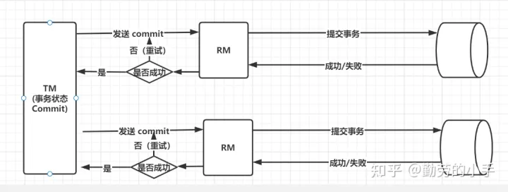
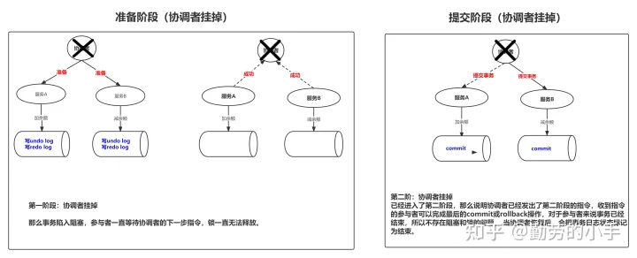

## XA事务模型
XA 首先定义了两种角色，全局的事务管理器（Transaction Manager） 和 局部资源管理器（resource Manager）。这里全局事务管理器就是来协调各个节点统一操作的角色，通常我们也称为事务协调者。局部资源管理器也就是参与事务执行的进程，通常我们也称为事务参与者。 事务的执行过程由协调者统一来决策，其它节点只需要按照协调者的指令来完成具体的事务操作即可。而协调者在协商各个事务节点的过程中、什么情况下决定集体提交事务，什么情况下又决定集体回滚事务，这里取决于XA事务模型里使用了哪种协商协议（2PC、3PC)。

## 2PC(两阶段提交协议)
**2PC 协议的核心思路是协调者通过和参与者通过两个阶段的协商达到最终操作的一致性，首先第一阶段的目的是确认各个参与者可否具备执行事务的条件。然后根据第一阶段各个参与者响应的结果，制定出第二阶段的事务策略。如果第一阶段有任意一个参与者不具备事务执行条件，那么第二阶段的决策就是统一回滚，只有在所有参与者都具备事务执行的条件下，才进行整体事务的提交**

### 准备阶段
首先协调者向所有参与者发起Prepare指令， 参与者收到指令后首先检查是否具备事务执行条件，在具备条件后，参与者开始对事务相关的数据进行加锁、然后再生成事务相关日志(redo log、undo log)，最后参与者会根据这两个操作的执行情况来向协调者响应成功或失败。

### 提交阶段
当协调者收到所有参与者的响应结果后，协调者会根据结果来做出最终决策，如果所有参与者都响应成功，那么协调者会决定提交事务，并且记录全局事务信息（事务信息、状态为commit），然后向所有参与者发送commit指令，参与者收到commit指令后会对上一阶段生成的事务数据进行最后的提交。

当有任意一个参与者响应失败（或者超时），协调者会决定回滚事务，并且记录全局事务状态（事务信息、状态为abort），然后向所有参与者发送abort指令，当参与者收到abort指令后，会进行事务回滚，清除上一个阶段生成的redo log 和undo log。

## 两阶段提交异常
### 参与者挂掉
如果在第一阶段，协调者发送Prepare指令给所有的参与者后，参与者挂掉了，那么此时协调者因为迟迟收不到参与者的消息而导致超时，所以协调者在超时之后会统一发送abort指令进行事务回滚。

如果在第二阶段，协调者发送commit或者abort指令给所有参与者后，参与者挂掉了，那么协调者会在超时之后进行消息重发，直到参与者恢复后收到到commit或者abort ，向协调者返回成功。

### 协调者挂掉
协调者在第一阶段发送Prepare指令后挂掉，那么此时参与者此时会一直得不到协调者下一步的指令，那么此时参与者会一直陷入阻塞状态，资源也会一直被锁住，直到协调者恢复之后向参与者发出下一步的指令。

协调者在第二阶段挂掉，那么此时协调者已向所有者发出最后阶段的指令了，所以收到指令的参与者会完成最后的commit或rollback操作，对于参与者来说事务已经结束，所以不存在阻塞和锁的问题， 当协调者恢复后，会把事务日志状态标记为结束。

### 网络丢包
在第一阶段，协调者发送给参与者的消息丢失了，那么此时参与者会因为没有收到消息不会执行任何动作，所以也不会响应协调者任何消息，此时协调者会因为没有收到参与者的响应而超时，所以协调者会决定决定回滚事务，向所有参与者发送abort指令。

在第二阶段，无论是协调者发送给参与者消息丢失、还是参与者响应协调者消息丢失，都会导致协调者超时，所以这种时候协调者会进行重试，直到所有参与者都响应成功。

### 数据不一致
我们发现在一般的的场景里，出现了问题2PC好像都能解决 ，但我们去抽丝剥茧的挖细节的时，就会发现2PC在某些场景会出现数据不一致的情况。

比如说，协调者在第二阶段向部分参与者发送了commit指令后挂了，那么此时收到了commit指令的参与者会进行事务提交，然后未收到消息的参与者还是等着协调者的指令，所以这个时候会产生数据的不一致，此时必须要等协调者恢复之后重新发送指令，参与者才能达到最终的一致状态。

还有如果在第二阶段网络发生问题导致部分消息丢失，有些参与者收到了commit指令，有些参与者还没有收到commit指令，结果收到了指令的参与者提交了事务，没收到消息的参与者还在等指令，它不知道该进行回滚还是提交，这个时候同样也会产生数据不一致的问题。

## 2PC遗留问题
- **性能问题**: 从事务开始到事务最终提交或回滚，这期间所有参与者的资源一致处于锁定状态，所以注定2PC的性能不会太高。
- **数据不一致风险**: 从上面我们分析知道，极端情况下不管是由于协调者故障，还是网络分区都会有导致数据不一致的风险。
- **协调者故障导致的事务阻塞问题**: 在两阶段提交协议里，我们会发现协调者是一个至关重要角色，参与者无论任何时候出问题，都会在因为协调者没收到参与者的消息而超时，协调者超时之后任然能做出下一步的决策，但是协调者问题后，流程就没办法继续了，此时参与者因为没有收到协调者下一步指令不知道是该进行commit还是rollback（这里也许有人会有疑问，既然协调者可以超时，那参与者为什么不可以超时呢，这个问题放到3PC解答），所有的参与者必须等待协调者恢复之后才能做出下一步的动作。

**2PC 核心是通过两个阶段的协商达到最终操作的一致性， 第一阶段的目的是确认各个参与者可否具备执行事务的条件。根据第一阶段的结果然后第二阶段再决定整体事务是进行提交还是回滚。  **   
**2PC大部分情况都能协商各个参与者达成一致，但是在极端情况下（协调者挂了、网络分区），还是会产生数据不一致问题，除此之外协调者单点故障会造成事务阻塞，然后2PC整个事务过程是会锁定资源的，所有性能也不高。 **
