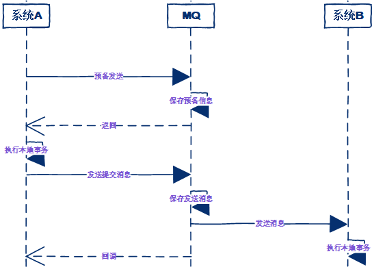

事务消息作为一种异步确保型事务， 将两个事务分支通过MQ进行异步解耦，事务消息的设计流程同样借鉴了两阶段提交理论。

- 事务发起方首先发送prepare消息到MQ。
- 在发送prepare消息成功后执行本地事务。
- 根据本地事务执行结果返回commit或者是rollback。
- 如果消息是rollback，MQ将删除该prepare消息不进行下发，如果是commit消息，MQ将会把这个消息发送给consumer端。
- 如果执行本地事务过程中，执行端挂掉，或者超时，MQ将会不停的询问其同组的其它producer来获取状态。
- Consumer端的消费成功机制有MQ保证。

基于消息中间件的两阶段提交往往用在高并发场景下，将一个分布式事务拆成一个消息事务（A系统的本地操作+发消息）+B系统的本地操作，其中B系统的操作由消息驱动，只要消息事务成功，那么A操作一定成功，消息也一定发出来了，这时候B会收到消息去执行本地操作，如果本地操作失败，消息会重投，直到B操作成功，这样就变相地实现了A与B的分布式事务

特点：第三方的MQ是支持事务消息的，比如RocketMQ，但是市面上一些主流的MQ都是不支持事务消息的，比如 RabbitMQ 和 Kafka 都不支持。

## spring中落地
消息驱动的前提是事务消息，关于事务消息这一点，spring提供了链式事务，我们可以将数据库事务和rabbimt的事务组成一个链式事务。即最大努力一次提交。由于best effective 1pc在极端的情况下会出现重复消息的情况，因此消费端需要做幂等性处理。生产者事务消息+消费者幂等性和事务消息/ack，这样使生产者和消费者尽最大可能保证最终一致性。初次之外在业务流程实现设计之初，就需要考虑两个问题：异常情况处理、mq如何保证高可用、性能问题
- **异常处理分为两类异常：1、业务异常，即业务中允许出现的异常，这类异常是业务流程的一部分。2、非业务异常，即代码异常，这类异常的处理是重点，比如说出现代码异常，整个事务是否需要回滚，是否需要人工介入之类的**  
- **mq如何保证高可用：消息驱动的分布式事务其依据的核心是mq的有序消费，mq的高可用是重中之重。因此在设计之初就应该考虑，选择镜像还是其他什么模式**  
- **性能问题： 消费端使用事务消息还是ack确认机制。事务消息的性能相较于ack要差很多，但事务消息的使用成本很低，因此需要进行合适的权衡**

## 参考
[浅析分布式事务](https://developer.aliyun.com/article/1025104)