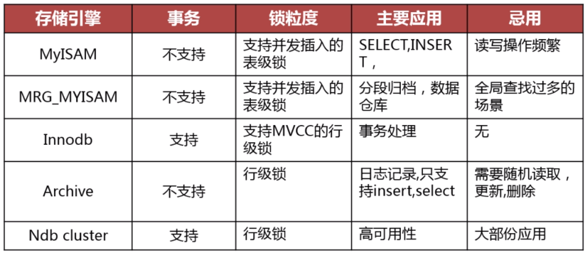

# 数据库结构优化
---
> 良好的数据库逻辑设计和物理设计是数据库获得高性能的基础。

- 尽量减少数据冗余。 （相同的数据在多个地方存在或者某个列的数据可以由其他列计算得到）
- 尽量避免数据维护中出现更新、插入和删除异常
	- 插入异常:某个主键字段是非空的，但是在插入数据的时候把这个字段空了。导致数据不能插入。
    - 更新异常:更新某个字段的值，结果导致多行都要更新。
    - 删除异常:删除某个字段导致其他信息丢失
- 节约数据存储空间
- 提高查询效率 

## 数据库设计步骤
- 需求分析：全面了解产品设计的存储需求
- 逻辑设计：设计数据库的逻辑存储结构
- 物理设计：根据所使用的数据库特点进行表结构设计
- 维护优化：根据实际情况对索引，存储结构等进行优化

## 数据库设计三范式
- 数据库设计的第一范式
   - 数据库表中的所有字段都只具有单一属性
   - 单一属性的列是由数据类型所构成的
   - 设计出来的表都是简单的二维表
- 数据库设计的第二范式:
   - 满足第一范式的情况下, 要求一个表中只具有一个业务主键,也就是说符合第二范式的表中不能存在非主键列对只对部分主键的依赖关系,复合主键.
- 数据库设计的第三范式:
   - 满足第二范式的情况下, 指每一个非主属性既不部分依赖于也不传递依赖于业务主键,也就是在第二范式的基础上消除了非主属性对主键的传递依赖.

## 反范式化设计
> 反范式化是针对范式化而言的。  反范式化就是为了性能和读取效率的考虑而适当的对数据库设计范式的要求进行违反，允许存在少量的数据冗余，换句话来说反范式化就是使用空间来换取时间。

## 范式化和反范式化比较
### 范式化设计的优缺点:
- 优点:
  - 可以尽量的减少数据冗余,数据表更新快体积小
  - 范式化的更新操作比反范式化更快
  - 范式化的表通常比反范式化更小
- 缺点:
  - 对于查询需要对多个表进行关联
  - 更难进行索引优化

### 反范式化设计的优缺点:
- 优点:
   - 可以减少表的关联
   - 可以更好的进行索引优化
- 缺点:
   - 存在数据冗余及数据维护异常
   - 对数据的修改需要更多的成本

## 物理设计
- 定义数据库，表，字段的命名规范
	- 数据，表，以及字段要尽可能的遵循可读性原则
	- 数据，表，以及字段要尽可能的遵循表意性原则
	- 数据，表，以及字段要尽可能的遵循长名原则

### 存储引擎选择

### 字段类型选择
> 当一个字段可以选择多个数据类型，优先考虑数字类型，其次是日期或二进制类型，最后是字符类型。 优先选择占用空间小的数据类型

#### 整数选择

#### 实数选择

#### char varchar选择
- VARCHAR类型存储特点:
	- varchar用于存储变长字符串,只占用必要的存储空间
	- 列的最大长度小于255则只占用一个额外字节用于记录字符串长度
	- 列的最大长度小于255则占用两个额外字节用于记录字符串长度
- VARCHAR长度的选择问题:
	- 使用最小的符合需求的长度
	- varchar(5)和varchar(20)存储'MySQL'字符串性能不同, 虽然都是小于255, 占用的字节是一样的,但是分配的内存是根据长度. varchar(20)分配内存相对较多, 性能也就相对比varchar(5) 差一些.
- VARCHAR的适用场景:
	- 字符串列的最大长度比平均长度大很多
	- 字符串列很少被更新
	- 使用了多字节字符集存储字符串

- CHAR类型的存储特点:
	- CHAR类型是定长的
	- 字符串存储在CHAR类型的列中会删除末尾的空格
	- CHAR类型的最大宽度为255
- CHAR类型的使用场景:
	-CHAR类型适合存储所长度近似的值
	-CHAR类型适合存储短字符串
	-CHAR类型适合存储经常更新的字符串列

#### 日期时间
##### datetime类型
> DATATIME类型以YYYY\-MM\-DD HH\: MM \:SS\[.fraction\]格式存储日期时间 datetime = YYYY-MM-DD HH \:MM \:SS,可以保留到微妙, 需指定datetime(6) = YYYY-MM-DD HH \:MM \:SS.fraction; 
DATATIME类型与时区无关, 占用8个字节的存储空间, 时间范围: 1000-01-01 00 \:00 \:00 到 9999-12-31 23 \:59 \:59

##### timestamp类型
> 存储了由格林尼治时间1970年1月1日到当前时间的秒数, 以YYYY-MM-DD HH \:MM \:SS.[.fraction]的格式显示,占用4个字节 
时间范围1970-01-01 到2038-01-19;
timestamp类型显示依赖于所指定的时区,在行的数据修改时可以自动修改timestamp列的值.

##### date类型和time类型
- 占用的字节数比使用字符串,datetime,int 存储要少, 使用date类型只需要3个字节;
- 使用date类型还可以利用日期时间函数进行日期之间的计算;
- date类型适用于保存1000-01-01到9999-12-31之间的日期;
- time类型用于存储时间数据, 格式为HH \:MM \:SS

#### 存储日期时间注意
- 不要使用字符串类型来存储日期时间数据
	- 日期时间类型通常比字符串占用的存储空间小,日期时间类型在进项查找过滤时可以利用日期来进行对比.
	- 日期时间类型还有丰富的处理函数,可以方便的对时期类型进行日期计算
-使用int 存储日期时间不如使用timStamp类型

### 选择主键
- 主键应该尽可能的小：因为在Innodb表中，所有非主键的索引都要附加主键的信息，如果主键过大，会降低索引的查询效率
- 主键应该是顺序增长的：可以顺序插入数据，避免了随机IO的产生，如果不是顺序增长，则每次插入数据后可能会带来重新的排序增加额外的IO消耗；
- Innodb的主键和业务主键可以不同：如果业务主键具备以上两个特点，则业务主键可以作为Innodb的主键，如果业务主键不具备以上两个特点，则可以选择自增id作为Innodb的主键，并且为业务主键添加唯一索引以保证业务主键的唯一性。