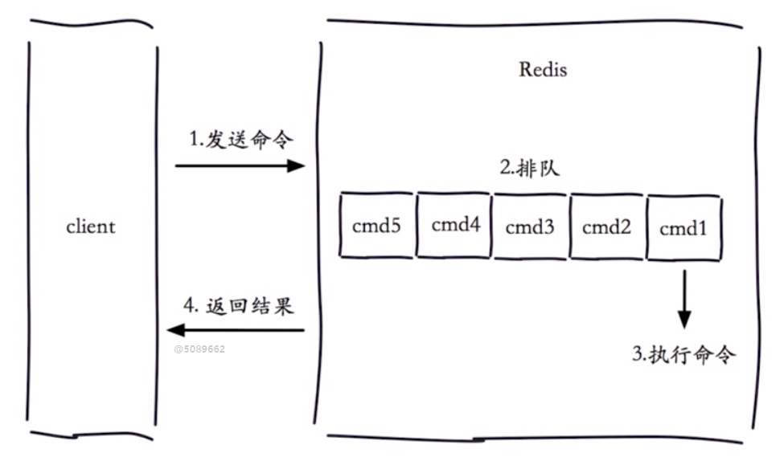
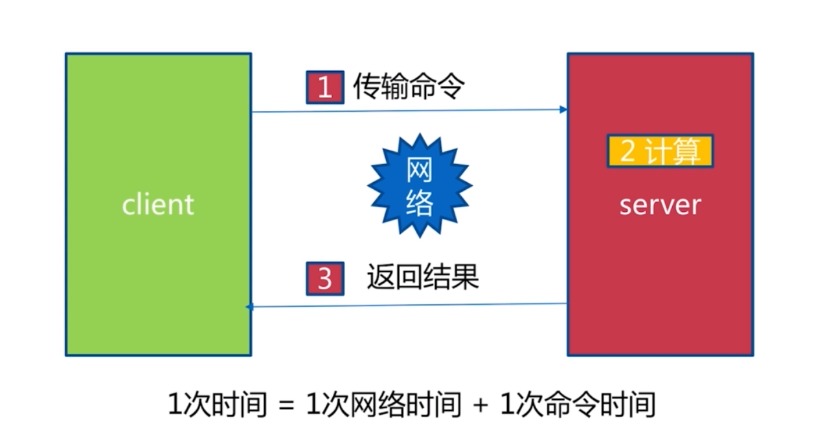
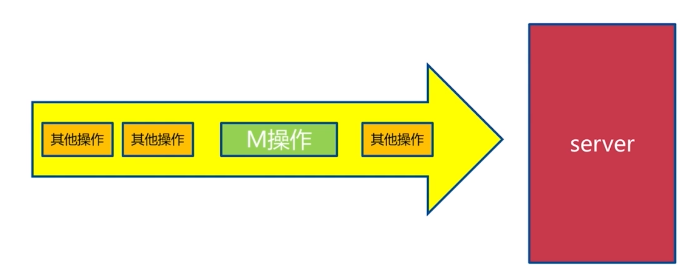
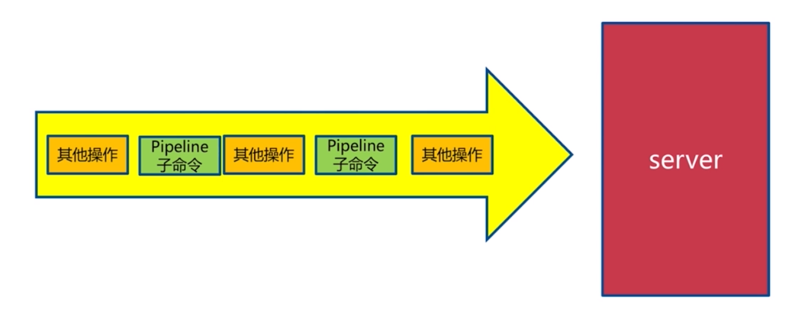
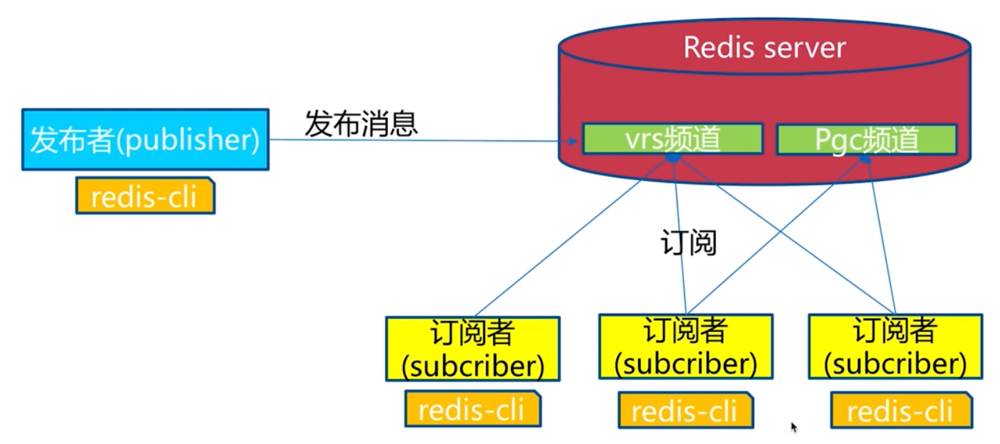
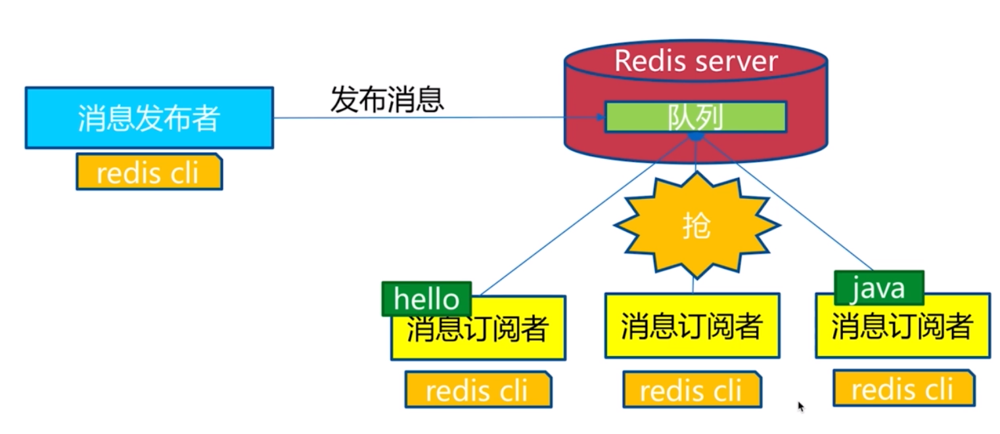

# 瑞士军刀redis
---
## 慢查询


- 慢查询发生在第三阶段，执行命令本身的时候
- 客户端超时不一定满查询，但是慢查询是客户端超时的一个因素

### 慢查询两个配置
#### slowlog-max-len
> slowlog-max-len表示慢查询最大的条数，当slowlog超过设定的最大值后，会将最早的slowlog删除，是一个先进先出的队列，默认是128
#### slowlog-log-slower-than
> slowlog-log-slower-than表示slowlog的划定界限，只有query执行时间大于slowlog-log-slower-than的才会定义成慢查询，才会被slowlog进行记录。slowlog-log-slower-than设置的单位是微妙，默认是10000微妙，也就是10ms

### 慢查询命令
命令|含义
-|-
slowlog get [n]|获取慢查询队列
slowlog len| 获取慢查询队列长度
slowlog reset| 清空慢查询队列

### 使用建议
- slowlog-max-len 不要设置过大，默认值10ms，通常设置是1ms
- slowlog-log-slower-than 不要设置的过小，通常在1000左右
- 定期持久化慢查询，方便排查历史问题

## pipeline
> 一次网络通信模型


> 批量网络通信模型


> 流水线模型


### pipeline对比
>redis的执行时间是非常快的，pipeline主要是为了解决在网络环境复杂的情况下，解决网络时间

命令|N个命令操作|1次pipeline(n个命令)
-|-|-
时间|n次网络+n次命令|1次网络+n次命令
数据量|1条命令|n条命令

### pipeline对比演示
```java
public class pipelineTest {
    public static void main(String[] args) {
        Jedis jedis = new Jedis();
        long start = System.currentTimeMillis();
        for (int i=0;i<10000;i++)
        {
            jedis.hset("hashkey-"+i,"field-"+i,"value-"+i);
        }
        long end = System.currentTimeMillis();
        System.out.println("普通执行时间："+(end-start)); //362

        long start1 = System.currentTimeMillis();
        for(int i=0;i<100;i++)
        {
            Pipeline pipelined = jedis.pipelined();
            for(int j=i*100;j<(i+1)*100;j++)
            {
                pipelined.hset("hashkey-"+j,"field-"+j,"value-"+j);
            }
            pipelined.syncAndReturnAll();
        }
        long end1 = System.currentTimeMillis();
        System.out.println("pipeline执行时间："+(end1-start1)); //54
    }
}
```
### pipeline对比原生m操作



> **原生m操作是具有原子性的，而pipeline不具有原子性，但是pipeline的返回结果是具有顺序的**

### 使用建议
- 注意每次pipeline的携带数据量
- pipeline每次只能作用在一个redis节点上
- m操作具有原子性，而pipeline操作不具有原子性

## 发布订阅
> 发布订阅模型类似于生产者和消费者模型，发布订阅分为三个角色发布者(publisher),订阅者(subscriber),频道(channel),**发布订阅模型无法做到消息堆积,例如一个新的订阅者订阅一个频道，无法获取到之前的消息**



### 发布订阅API
命令|演示|含义
-|-|-
publish| publish channel message|发布消息到某个频道 
subscribe|subscribe [channel]| 订阅一个或多个频道的消息
unsubscribe|unsubscribe [channel]|取消订阅一个或多个频道的消息
psubscribe|psubscribe [pattern...]|订阅一个或多个符合给定模式的频道
punsubscribe|punsubscribe [pattern...]|取消订阅一个或多个符合给定模式的频道
pubsub|pubsub channels|列出至少有一个订阅者的频道
pubsub|pubsub numsub [channel...]|列出给定频道的订阅者数量 

### 消息队列
> redis并没有提供消息队列功能，不过可以使用lpush + brpop来模拟消息队列，brpop主要的作用是阻塞队列，消息队列和发布订阅的最大不同是，发布订阅是只要订阅了该频道就可以获取到消息，而消息队列是只有一个消息订阅者可以获取到消息


### 发布订阅演示
```shell
# client1
127.0.0.1:6379> publish ch1 "message from ch1"
(integer) 1

# client2
127.0.0.1:6379> publish ch2 "message from ch2"
(integer) 1

# client3
127.0.0.1:6379> subscribe ch1 ch2
Reading messages... (press Ctrl-C to quit)
1) "subscribe"
2) "ch1"
3) (integer) 1
1) "subscribe"
2) "ch2"
3) (integer) 2
1) "message"
2) "ch1"
3) "message from ch1"
1) "message"
2) "ch2"
3) "message from ch2"
```


## bitamp
> redis的字符串类型存储的是二进制数据，一个字节由8个二进制位组成


### bitmap相关API
命令|示例|含义
-|-|-
setbit|setbit key offset value|给位图指定索引设置值(在被位图设置偏移量的时候，不要再很短的位图上突然设置很大的偏移量)
getbit|getbit key offset| 获取位图指定索引的值
bitcount|bitcount key [start end]|获取位图指定范围(start-end字节为单位，如果不指定就是获取所有)位值为1的个数
bitop|bitop op destkey key [key...]|将多个bitmap的and(交集)，or(并集)，not(非)，xor(异或)操作结果保存到destkey中
bitpos|bitpos key targetBit [start] \\[end]|计算位图指定范围(start,end单位为字节，如果不指定就是获取全部)第一个偏移量对应的值等于targetBit的位置

### bitmap独立用户统计
>1亿用户，5千万独立用户

数据类型|每个userId占用的空间|需要存储的用户量|全部内存量
-|-|-|-
set|32位| 50,000,000|32位x50,000,000=200M
bitmap|1位|100,000,000|1位x100,000,000=12.5M

>1亿用户，10万独立用户

数据类型|每个userId占用的空间|需要存储的用户量|全部内存量
-|-|-|-
set|32位(假设userId用的是整型，实际上很多网站用的是长整型)|1,000,000|32位x1,000,000=4MB
bitmap|1位|100,000,000|1位x100,000,000=12.5M

### 使用建议
- bitmap本质上是字符串，最大容量为512M
- 注意setbit的偏移量,有可能耗时过大
- 要在合理的场景使用位图，比如在上述例子中，bitmap并不优于set

## HyperLogLog
> HyperLogLog本质上还是字符串,基于HyperLogLog算法，主要作用是极少空间完成独立数量的统计

### HyperLogLog API
命令|示例|含义
-|-|-
pfadd|pfadd key element [element...]|相hyperloglog中添加元素
pfcount|pfcount key [key..]| 计算hyperloglog的独立总数
pfmerge|pfmerge destkey sourcekey [sourcekey...]|合并多个hyperloglog

```shell
127.0.0.1:6379> pfadd k1 v1 v2 v3
(integer) 1
127.0.0.1:6379> pfcount k1
(integer) 3
127.0.0.1:6379> pfadd k2 v3 v4 v5
(integer) 0
127.0.0.1:6379> pfcount k2
(integer) 3
127.0.0.1:6379> pfmerge k3 k1 k2
OK
127.0.0.1:6379> pfcount k3
(integer) 5
```
> prmerge合并之后新的HYLL过大,k1为27bytes,k2为27bytes,k3为12.02KB

```java
public static void main(String[] args) {
    JedisPool jedisPool = new JedisPool();
    Jedis resource = jedisPool.getResource();

    String[] arr = new String[1000000];
    for(int i=0;i<1000000;i++)
    {
        arr[i] = "uuid"+i;
    }
    resource.pfadd("test_hyll",arr);
    System.out.println(resource.pfcount("test_hyll")); // 999032
}
```
### HyperLogLog的局限性
- HyperLogLog的统计值并不一定准确，官方给出的错误率为0.81%
- 无法取出单条数据

## GEO
> GEO功能在Redis3.2版本提供，支持存储地理位置信息用来实现诸如附近位置、摇一摇这类依赖于地理位置信息的功能.geo的数据类型为zset.


## GEO API
命令|演示|含义
-|-|-
geoadd|geoadd key longitude latitude member[longitude latitude member...]|增加地理位置信息
geopos|geopos key member[member...]|获取地理位置信息
geodist|geodist key member1 member2[unit]|获取两个地理位置之间的距离(unit,m,km,mi英里,ft尺)
zrem| zrem key member|geo本质上是使用的zset，如果需要删除城市可以使用zset的命令进行删除

```shell
127.0.0.1:6379> geoadd cities 116.28 39.55 beijing
(integer) 1
127.0.0.1:6379> geoadd cities 117.12 39.05 tianjin
(integer) 1
127.0.0.1:6379> geopos cities beijing
1) 1) "116.28000229597092"
   2) "39.550000724547083"
127.0.0.1:6379> geopos cities tianjin
1) 1) "117.12000042200089"
   2) "39.049999093934723"
127.0.0.1:6379> geodist cities tianjin beijing km
"91.2138"
```

### georadius
- 语法：georadius key longitude latitude radius m|km|gt|mi [WITHCOORD] \[WITHDIST] [WITHHASH] \[ASC|DESC] [COUNT count]
- 功能：以给定的经纬度为中心，返回键包含的位置元素当中，与中心的距离不超过给定最大距离的而所有位置元素。
- 选项：
	- WITHDIST：在返回位置元素的同时，将位置元素与中心之间的距离也一并返回。
	- WITHCOORD：将位置元素的经度和纬度也一并返回。
	- WITHHASH：以52位有符号整数的形式，返回位置元素经过原始geohash编码的有序集合分值。这个选项主要用于底层应用或者调试，实际中的作用并不大。
	- ASC：根据中心的位置，按照从近到远的方式返回位置元素
	- DESC:根据中心的位置，按照从远到近的方式返回位置元素

### georadiusbymember
- 语法：georadiusbymemeber key member radius m|km|ft|mi [WITHCOORD] \[WITHDIST] [WITHHASH] \[ASC|DESC] [COUNT count]
- 功能：这个命令和georadius命令一样,不同的是中心点是由给定的位置元素决定的
- 返回值：一个数组，数组中的每个项表示一个范围之内的位置元素

```shell
127.0.0.1:6379> georadiusbymember cities beijing 150 km
1) "beijing"
2) "tianjin"
```