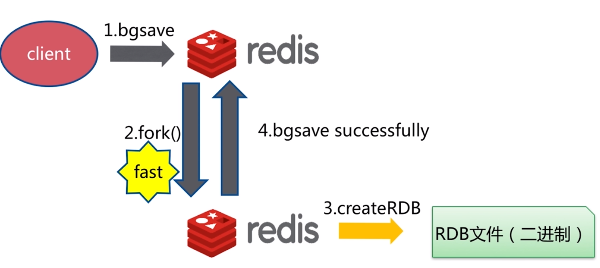
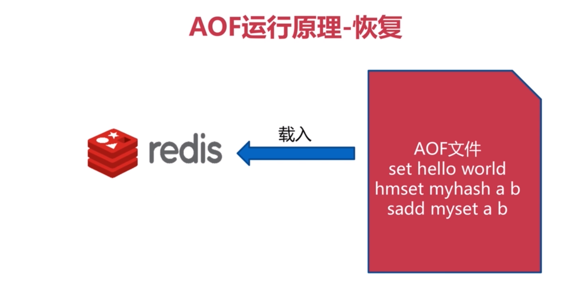
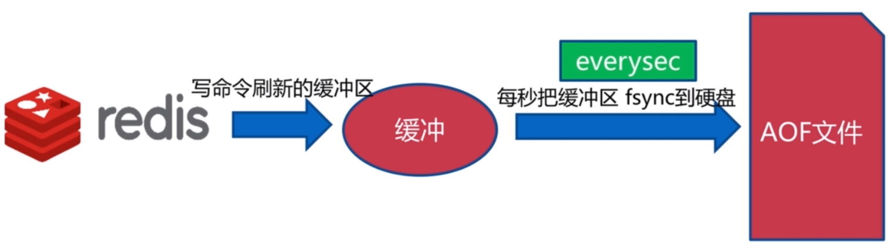
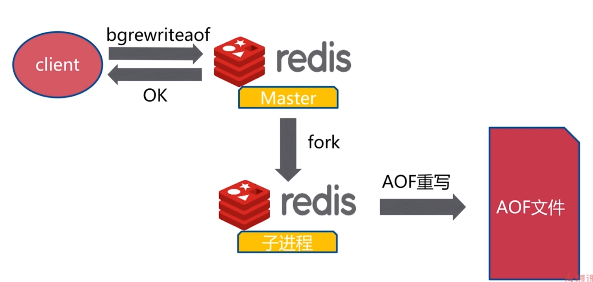

# redis持久化
---
> redis将所有数据保存到内存中，对数据的更新将异步的保存到硬盘上。主流的数据持久化的方式有两种，一种是快照，将某个时间节点的数据进行备份，如Mysql dump，redis rdb.另外一种是通过日志的方式记录操作，然后根据日志进行恢复Mysql Binlog，Hbase HLog，redis aof

## RDB
> RDB 是 Redis 默认的持久化方案。在指定的时间间隔内，执行指定次数的写操作，则会将内存中的数据写入到磁盘中。即在指定目录下生成一个dump.rdb文件。Redis重启会通过加载dump.rdb文件恢复数据。**RDB本质上是一种复制媒介**


### RDB的触发机制
#### 手动触发
> **save**,该命令会阻塞当前Redis服务器，执行save命令期间，Redis不能处理其他命令，直到RDB过程完成为止<br/>
显然该命令对于内存比较大的实例会造成长时间阻塞，这是致命的缺陷，为了解决此问题，Redis提供了第二种方式。


> **bgsave**,执行该命令时，Redis会在后台异步进行快照操作，快照同时还可以响应客户端请求。<br/>
具体操作是Redis进程执行fork操作创建子进程，RDB持久化过程由子进程负责，完成后自动结束。阻塞只发生在fork阶段，一般时间很短。



##### save 和 bgsave对比
命令|save|bgsave
-|-|-
IO类型|同步|异步
阻塞|是|是(阻塞发生在fork()阶段)
复杂度|O(n)|O(n)
优点|不会额外消耗内存|不阻塞客户端命令
缺点|阻塞客户端命令|需要fork,消耗内存

#### 自动触发
> 在redis.conf配置文件中的SNAPSHOTTING下


```txt
################################ SNAPSHOTTING  ################################
...
# 配置触发 Redis的 RDB 持久化条件，也就是什么时候将内存中的数据保存到硬盘。比如"save m n"。表示m秒内数据集存在n次修改时，自动触发bgsave
# 当然如果你只是用Redis的缓存功能，不需要持久化，那么你可以注释掉所有的 save 行来停用保存功能。可以直接一个空字符串来实现停用：save ""
save 900 1
save 300 10
save 60 10000

# 默认值为yes。当启用了RDB且最后一次后台保存数据失败，Redis是否停止接收数据。
# 这会让用户意识到数据没有正确持久化到磁盘上，否则没有人会注意到灾难（disaster）发生了。如果Redis重启了，那么又可以重新开始接收数据了
stop-writes-on-bgsave-error yes

# 默认值是yes。对于存储到磁盘中的快照，可以设置是否进行压缩存储。
# 如果是的话，redis会采用LZF算法进行压缩。如果你不想消耗CPU来进行压缩的话，可以设置为关闭此功能，但是存储在磁盘上的快照会比较大。
rdbcompression yes

# 默认值是yes。在存储快照后，我们还可以让redis使用CRC64算法来进行数据校验，但是这样做会增加大约10%的性能消耗
# 如果希望获取到最大的性能提升，可以关闭此功能。
rdbchecksum yes

# 设置快照的文件名，默认是 dump.rdb
dbfilename dump.rdb

# 设置快照文件的存放路径，这个配置项一定是个目录，而不能是文件名。默认是和当前配置文件保存在同一目录。
dir ./
...
```

```txt
# 推荐配置
dbfilename dump-${port}.rdb
dir /bigdiskpath
stop-writes-on-bgsave-error yes
rdbcompression yes
rdbchecksum yes
```
##### 不容忽略的方式
- 全量复制：主从复制的时候，主会自动生成rdb文件
- debug reload：会触发rdb文件的生成
- shutdown：redis-cli在执行shutdown的时候,默认情况下是shutdown save,会触发生成rdb文件

### RDB总结
- rdb是redis内存到硬盘的快照，用于持久化
- save 通常会阻塞redis
- bgsave不会阻塞redis，但是会fork新的进程
- save自动配置满足任何一项都会自动执行
- 有些触发机制不容忽视

### RDB的优点和缺点
- 优点：
	- 适合大规模的数据恢复
	- 如果业务对数据完整性和一致性要求不高，RDB是很好的选择。
- 缺点：
	- 不可控容易丢失数据，因为RDB可能在最后一次备份时宕机了。
	- 备份时占用内存，因为Redis在备份时会独立创建一个子进程，将数据写入到一个临时文件(此时内存中的数据是原来的两倍哦），最后再将临时文件替换之前的备份文件。

## AOF
> Redis 默认不开启。它的出现是为了弥补**RDB的不足(数据的不一致性)**，所以它采用日志的形式来记录每个写操作，并追加到文件中。<br/>
Redis 重启的会根据日志文件的内容将写指令从前到后执行一次以完成数据的恢复工作。




### AOF的三种策略
#### always
> 同步持久化，每次发生数据变化会立刻写入到磁盘中。性能较差当数据完整性比较好(慢，安全)


#### everysec
> 出厂默认推荐，每秒异步记录一次(默认值),如果出现故障，可能会丢失1秒的数据



#### no
> 操作系统决定什么时候将数据写入硬盘，不由用户考虑


#### 三种策略比较
命令|always|everysec|no
-|-|-|-
优点|不丢失数据|每秒一次fsync|不用管
缺点|IO开销较大，一般的sata盘只有几百TPS|如果出现故障，可能会丢失1秒的数据|不可控

### AOF重写
> AOF的工作原理是将写操作追加到文件中，文件的冗余内容会越来越多。所以Redis提供了重写机制。AOF重写主要是为了解决AOF文件容量过大和后期恢复数据过慢

#### bgrewriteaof
> bgrewriteaof 类似于rdb中bgsave，仍然是利用fork出子进程，然后去完成aof重写的过程



#### AOF重写流程


#### AOF重写配置
配置名|含义|默认值
-|-|-
auto-aof-rewrite-min-size|AOF重写需要的尺寸|64mb
auto-aof-rewrite-percentage|AOF文件增长率|100

统计名|含义
-|-
aof-current-size|AOF当前尺寸(单位:字节)
aof-base-size|AOF上次启动和重写的尺寸(单位:字节)

> AOF自动重写满足条件<br/>
> aof_current_size > auto-aof-rewrite-min-size<br/>
> (aof_current_size - aof_base_size) * 100 / aof_base_size > auto-aof-rewrite-percentage

```shell
# 开启AOF持久化方式
appendonly yes

# AOF持久化文件名
appendfilename appendonly-${port}.aof

# 每秒把缓冲区的数据同步到磁盘
appendfsync everysec

# 数据持久化文件存储目录
dir /bigdiskpath

# 是否在执行重写时不同步数据到AOF文件
# 这里的 yes，就是执行重写时不同步数据到AOF文件
no-appendfsync-on-rewrite yes

# 触发AOF文件执行重写的最小尺寸
auto-aof-rewrite-min-size 64mb

# 触发AOF文件执行重写的增长率
auto-aof-rewrite-percentage 100

# AOF存在错误的时候是否忽略错误
aof-load-truncated yes

```

#### AOF优缺点
##### AOF优点
> - 使用AOF 会让你的Redis更加耐久: 你可以使用不同的fsync策略：无fsync，每秒fsync，每次写的时候fsync。使用默认的每秒fsync策略，Redis的性能依然很好(fsync是由后台线程进行处理的，主线程会尽力处理客户端请求)，一旦出现故障，你最多丢失1秒的数据<br/>
> - AOF文件是一个只进行追加的日志文件，所以不需要写入seek，即使由于某些原因(磁盘空间已满，写的过程中宕机等等)未执行完整的写入命令，你也也可使用redis-check-aof工具修复这些问题。<br/>
> - Redis 可以在 AOF 文件体积变得过大时，自动地在后台对 AOF 进行重写： 重写后的新 AOF 文件包含了恢复当前数据集所需的最小命令集合。 整个重写操作是绝对安全的，因为 Redis 在创建新 AOF 文件的过程中，会继续将命令追加到现有的 AOF 文件里面，即使重写过程中发生停机，现有的 AOF 文件也不会丢失。 而一旦新 AOF 文件创建完毕，Redis 就会从旧 AOF 文件切换到新 AOF 文件，并开始对新 AOF 文件进行追加操作<br/>
> - AOF 文件有序地保存了对数据库执行的所有写入操作， 这些写入操作以 Redis 协议的格式保存， 因此 AOF 文件的内容非常容易被人读懂， 对文件进行分析（parse）也很轻松。 导出（export） AOF 文件也非常简单： 举个例子， 如果你不小心执行了 FLUSHALL 命令， 但只要 AOF 文件未被重写， 那么只要停止服务器， 移除 AOF 文件末尾的 FLUSHALL 命令， 并重启 Redis ， 就可以将数据集恢复到 FLUSHALL 执行之前的状态

##### AOF缺点
> - 于相同的数据集来说，AOF 文件的体积通常要大于 RDB 文件的体积。
> - 根据所使用的 fsync 策略,AOF的速度可能会慢于RDB,在一般情况下， 每秒 fsync 的性能依然非常高,而关闭fsync可以让AOF的速度和RDB一样快,即使在高负荷之下也是如此。 不过在处理巨大的写入载入时,RDB可以提供更有保证的最大延迟时间（latency）

## AOF和RDB的选择
命令|RDB|AOF
-|-|-
优先级|低|高
体积|小|大
恢复速度|快|慢
数据安全|丢数据|根据策略决定
轻重|重|轻

> 总结:如果你非常关心你的数据,但仍然可以承受数分钟以内的数据丢失，那么你可以只使用 RDB 持久化。<br>
有很多用户都只使用 AOF 持久化,但并不推荐这种方式:因为定时生成RDB快照（snapshot）非常便于进行数据库备份， 并且RDB恢复数据集的速度也要比AOF恢复的速度要快。