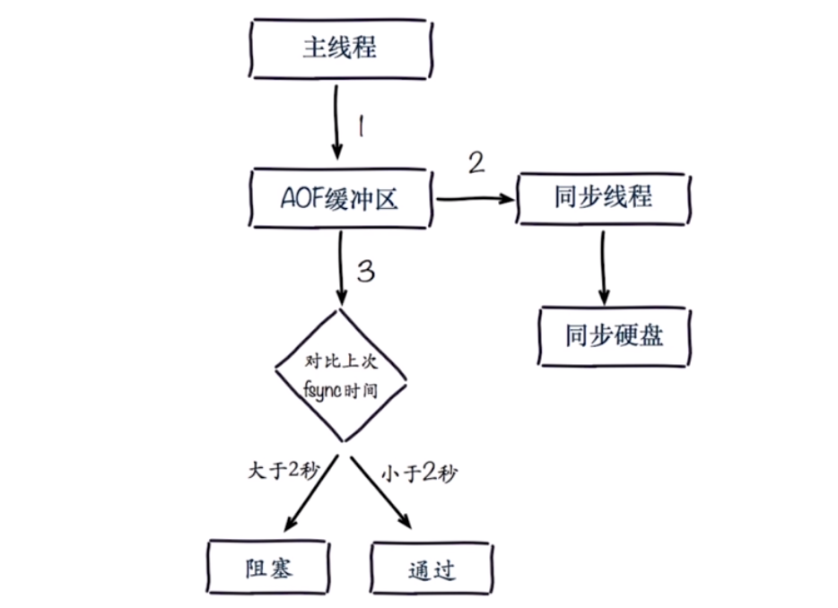
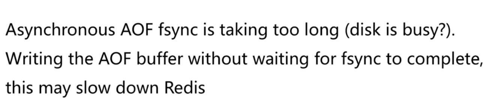

# redis持久化常见问题
---

## fork操作
> fork操作是一个同步操作，是完成内存页的拷贝而不是内存的拷贝，在大部分情况下速度很快。如果fork操作比较慢或者是卡在某个地方，会阻塞redis主进程 
fork执行速度和内存有关，机器类型有关，硬盘速度有关 
info:latest_fork_usec可以查看持久化的执行时间(单位:微秒)

### 改善fork
- 优先使用物理机或者高效支持 fork 操作的虚拟化技术
- 控制 Redis 实例最大可用内存：maxmemory
- 合理配置 Linux 内存分配策略：vm.overcommit_memory=1
- 降低 fork 频率：放宽 AOF 重写触发时机，减少不必要的全量复制

## 进程外开销
> CPU方面:RDB 和 AOF 文件产生，属于 CPU 密集型 
内存方面:fork 内存开销，copy-on-write 
硬盘方面: AOF 和 RDB 文件写入，可以结合 iostat、iotop 分析

### 改善进程外开销
- 不做 CPU 绑定，不和 CPU 密集型应用部署在一起
- 单机多部署的时候不允许产生大量重写，linux提供主进程内存页优化，echo never > /sys/kernel/mm/transparent_hugepage/enabled

#### 硬盘优化
- 不要和高 I/O 服务部署在一起：存储、消息队列等
- no-appendfsync-on-rewrite=yes AOF重写期间不进行追加
- 根据写入量决定磁盘类型：如 SSD
- 单机多实例持久化文件目录可以考虑分盘

## AOF追加阻塞

### AOF阻塞定位

