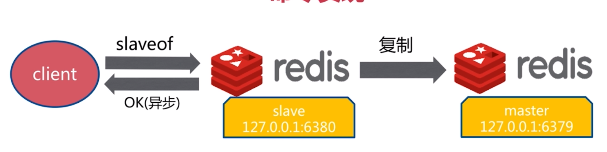
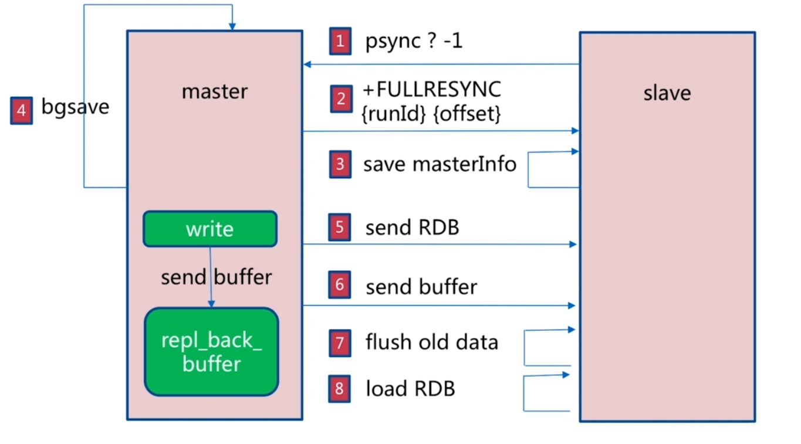
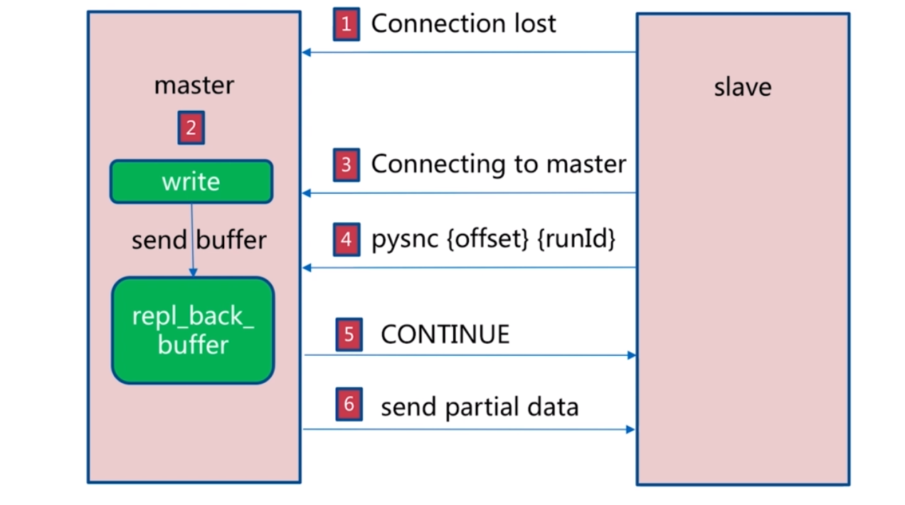
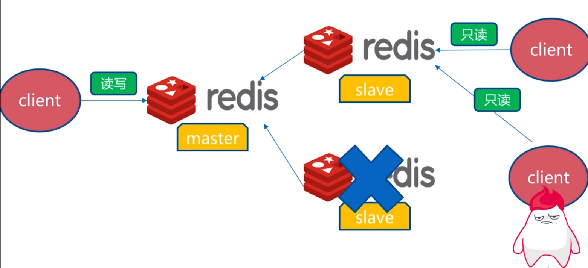
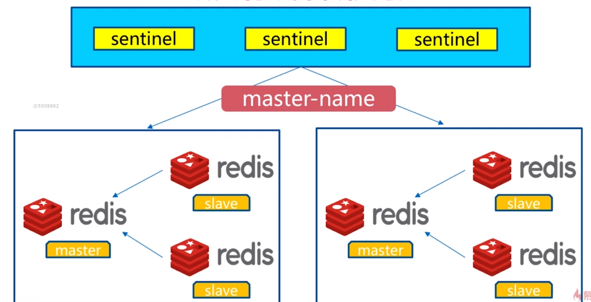

# redis复制
---

## 主从复制
### 单机redis缺点
- 当单机多实例的redis发生机器故障的时候，需要将redis迁移到其他的机器，但是要保证故障机器的数据可以同步过去
- 当单机的时候，redis对内存的要求比较高
- QPS瓶颈

### 主从复制模型
> 如图所示左边是Master节点，右边是slave节点，即主节点和从节点。<br/>
从节点也是可以对外提供服务的，主节点是有数据的，从节点可以通过复制操作将主节点的数据同步过来，并且随着主节点数据不断写入，从节点数据也会做同步的更新。<br/>
整体起到的就是数据备份的效果。


> 除了一主一从模型之外，redis还提供了一主多从的模型，也就是一个master可以有多个slave，也就相当于有了多份的数据副本。<br/>
这样可以做一个更加高可用的选择，例如一个master和一个slave挂掉了，还能有其他的slave数据备份。


### 主从复制的作用
- 数据副本,保证某台服务器宕机，数据能够不丢失
- 扩展读性能,读写分离,提高瓶颈

### 简单总结
- 一个master可以有多个slave
- 一个slave只能有一个master
- 数据流向是单项的，master到slave

## 主从复制实现方式
> 主从复制能够通过两种方式进行实现slaveof的方式和配置的方式进行实现

### slaveof
> 一般生产环境不允许主从节点都在一台机器上，因为没有任何的价值。



#### slaveof 取消复制
> 当某个节点使用slaveof no one进行取消从节点的时候,再命令执行之前同步的数据不会进行清除，但是当这个节点再次使用slaveof成为其他节点的从节点的时候，会清除这个的节点的所有数据


### 配置
```txt
# 配置主节点的IP和端口号
slaveof ip port
# 从节点只做读的操作，保证主从数据的一致性
slave-read-only yes 
```

### slaveof 和配置比较
方式|命令|配置
-|-|-
优点|无需重启|统一配置
缺点|不便于管理|需要重启

### 主从复制演示
> 配置文件
```txt
# 主节点6379配置
port 6379
logfile "6379.log"
dbfilename dump-6379.rdb
dir D:/software/redis/datdba/ms/


# 从节点6380配置
port 6380
logfile "6380.log"
dbfilename dump-6380.rdb
slaveof 127.0.0.1 6379
# masterauth <master-password> 本机演示主节点无密码
slave-read-only yes  默认,保证数据一致性
```

> info replication
```txt
# 主节点6379
role:master
connected_slaves:1
slave0:ip=127.0.0.1,port=6380,state=online,offset=575,lag=0
master_repl_offset:575
repl_backlog_active:1
repl_backlog_size:1048576
repl_backlog_first_byte_offset:2
repl_backlog_histlen:574

# 从节点6380
role:slave
master_host:127.0.0.1
master_port:6379
master_link_status:up
master_last_io_seconds_ago:5
master_sync_in_progress:0
slave_repl_offset:715
slave_priority:100
slave_read_only:1
connected_slaves:0
master_repl_offset:0
repl_backlog_active:0
repl_backlog_size:1048576
repl_backlog_first_byte_offset:0
repl_backlog_histlen:0
```

> log
```txt
# 6379 主节点
...# Server started, Redis version 3.2.100
...* The server is now ready to accept connections on port 6379
...* Slave 127.0.0.1:6380 asks for synchronization
...* Full resync requested by slave 127.0.0.1:6380
...* Starting BGSAVE for SYNC with target: disk
...* Background saving started by pid 9644
...# fork operation complete
...* Background saving terminated with success
...* Synchronization with slave 127.0.0.1:6380 succeeded

# 6380 从节点
... # Server started, Redis version 3.2.100
... * The server is now ready to accept connections on port 6380
... * Connecting to MASTER 127.0.0.1:6379
... * MASTER <-> SLAVE sync started
... * Non blocking connect for SYNC fired the event.
... * Master replied to PING, replication can continue...
... * Partial resynchronization not possible (no cached master)
... * Full resync from master: b6955f55baf370f562e17574f7e4e29244f9d7a7:1
... * MASTER <-> SLAVE sync: receiving 75 bytes from master
... * MASTER <-> SLAVE sync: Flushing old data
... * MASTER <-> SLAVE sync: Loading DB in memory
... * MASTER <-> SLAVE sync: Finished with success
```

> 从上述可以看出主从节点的全量复制本质上还是使用的是bgsave方式生成RDB文件，然后将RDB文件作为媒介来完成的.<br/>
不过当一个节点通过slaveof成为其他节点的从节点的时候，会将当前节点的所有数据进行清除

## runid和复制偏移量
### runid
> run_id:b6955f55baf370f562e17574f7e4e29244f9d7a7<br/>
redis每次启动的时候都会有一个随机的ID，作为一个标识，这个ID就是runid，当然重启之后值就改变<br/>
假如端口为6380的redis去复制6379，知道runid后，在6380上做一个标识，如果runid改变了，说明主可能重启了或者发生了其它变化<br/>
这时候就可以做一个全量复制把数据同步过来。或者第一次启动时根本不知道6379的runid，也会进行全量复制

### 偏移量
> slave0:ip=127.0.0.1,port=6380,state=online,offset=2369,lag=0<br/>
master_repl_offset:2369<br/>
偏移量：数据写入量的字节<br/>
主节点写入数据，就会有一个偏移量，然后从节点同步数据，也会记录一个偏移量，当两个偏移量达到一致时候，实际上数据就是完全同步的状态。<br/>
如果主从节点的偏移量相差过大的情况下，说明主节点和从节点之间的复制出现问题，方便排查问题

## 全量复制
> 全量复制主节点会将RDB文件也就是当前状态去同步给slave，在此期间主新写入的命令会单独记录起来，然后当RDB文件加载完毕之后<br/>
会通过偏移量对比将这个期间产生的写入值同步给slave，这样就能达到数据完全同步的效果



1. slave不知道master的runid和offset，发送psync ? -1进行查询
2. master返回给slave runid 和offset
3. slave保存runid和offset为复制做准备
4. master通过bgsave生成RDB，并将新写入的数据存放到repl_back_buffer中
5. master将RDB发送给slave
6. master将buffer数据发送给slave
7. slave清除数据
8. slave将接收到的RDB和buffer数据写入，完成全量复制

### 全量复制开销
- master通过bgsave生成RDB，需要时间，会对CPU和内存造成压力
- RDB文件网络传输，需要时间，并且占用网络带宽资源
- slave清空节点数据的时间
- slave加载RDB文件的时间
- 在做主从复制的时候，如果AOF开启，会做AOF重写，保证AOF是最新的状态

## 部分复制
> 在从节点第一次复制主节点数据的时候，使用全量复制是合适的，但是如果因为网络波动，从节点断开，再次连接的情况下使用全量复制是不合适的，因为全量复制需要的资源较大，可以使用部分复制



1. slave因为网络问题丢失到master的连接
2. master节点将新数据写入到repl_back_buffer中，buffer默认值1M，可以通过配置文件进行修改
3. slave连接到master
4. slave将runid和offset发送到master
5. master进行检查offset是否在buffer中，如果在buffer中则发送信号到slave
6. master发送buffer中的数据到slave，slave将数据写入


## 故障处理
### slave故障
> slave故障的时候，可以将client转到其他的节点上，但是要考虑其他节点是否能够承受



### master故障
> master故障的时候，可以将某个从节点设置为master，其他从节点作为新的master的从节点


### sentinel自动转移


## 主从复制常见问题
### 读写分离
> 读写分离的主要作用是分摊流量，但是可能遇到一下问题
- 复制数据延迟，数据不一致
- 读到过期数据(在过期数据过多的情况下，可能读到过期数据)
- 从节点故障

### 配置不一致问题
- maxmemory不一致，容易丢失数据
- 数据结构参数优化的时候，例如hash-max-ziplist-entries:内存不一致

### 避免全量复制
- 第一次全量复制不可规避，但是可以优化
- 节点运行ID不一致的问题，主节点重启，运行ID变化,可以使用故障转移的方式
- 复制积压缓冲区不足的问题，可以增大缓冲区的配置repl_backlog_size，降低全量复制可能产生的情况

### 规避复制风暴
> 主机节点复制风暴，会在主节点重启，多从节点复制的时候发生。可以优化拓扑结构


> 单机器复制风暴服务器宕机后，大量全量复制,优化方式有两种，第一种将主节点分放在不同的机器上，第二种高可用的方式


