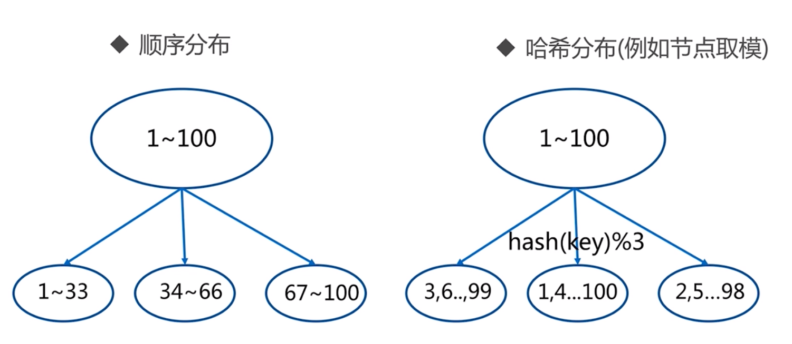
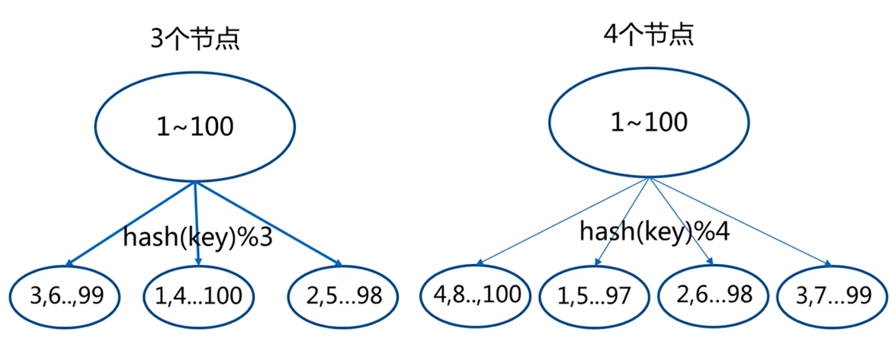
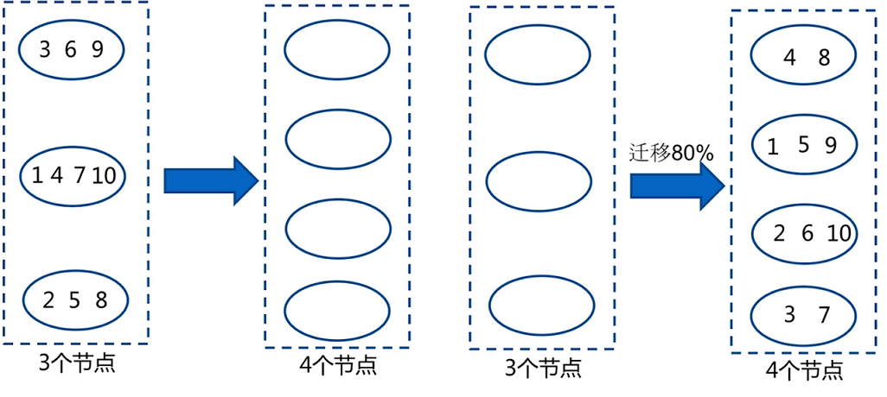
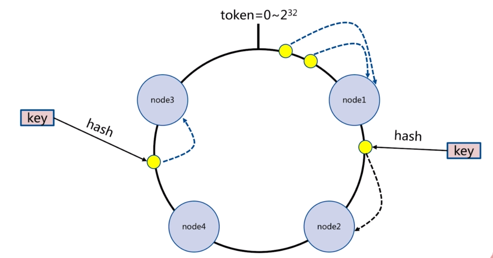
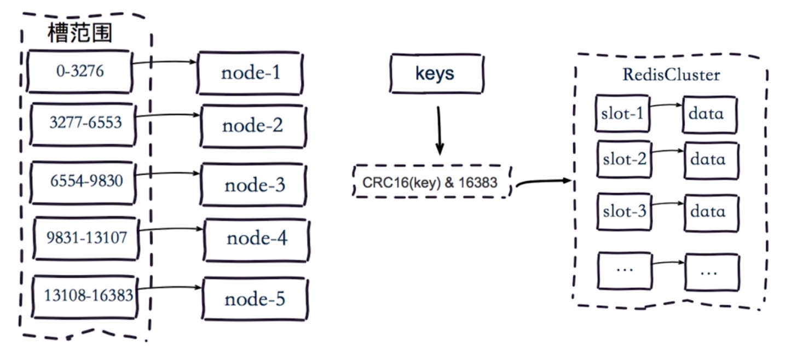
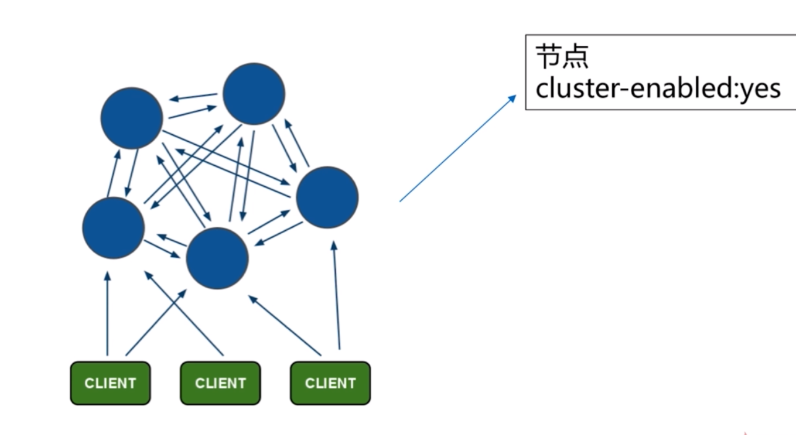
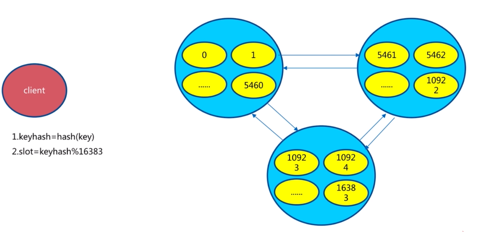

# Redis Cluster
---
## 数据分区

> 常用的分区有两种方式顺序分区和hash分区


### 数据分布方式对比
分布方式|特点|典型产品
-|-|-
哈希分区|数据分散度高，键值分布业务无关，无法顺序访问，支持批量操作|一致性哈希Memcache,redis cluster,其他缓存产品
顺序分区|数据分散度易倾斜,键值业务有关,支持顺序访问，支持批量操作|Habase,bigTable

> 而hash分区有三种，节点取余分区，一致性hash分区，虚拟槽分区

### 哈希分区
#### 节点取余分区




> 节点取余的问题<br/>
> 首先，一定会导致数据漂移。如果要减轻数据漂移，则可以使用翻倍扩容的方式<br/>
> 数据漂移导致的问题:不能够从缓存中取到数据，数据回写耗费时间<br/>

#### 一致性哈希


> 把所有节点、数据看作是在同一个token环=0\~2^32 上的点 <br/>
> 通过hash后,在某个节点范围的数据都保存在顺时针临近的节点上

> 客户端分片：hash + 顺时针优化取模<br/>
> 节点伸缩，只影响邻居节点，但是还是由数据迁移的情况<br/>
> 翻倍伸缩：因为一致性 hash 不能保证所有节点的数据均衡，所以为了保证最小的数据迁移成本和负载均衡，仍然建议翻倍伸缩

#### 虚拟槽分区

> 虚拟槽分区
> 预设虚拟槽：每个槽映射一个数据子集，一般比节点数大
> 槽的范围：0\~16383
> 良好的 hash 函数：如 CRC16
> 服务端去管理节点、槽、数据：如 Redis Cluster

## redis cluster 基本架构
### 单机架构

### 分布式架构
> 分布式架构——Redis Cluster 架构,彼此之间可以通信，meet操作,每个节点都可以读写,每个节点负责一部分slot(指派槽).节点之间也有复制功能

#### meet操作
> A meet B,B返回PONG.依次类推，直到发现所有节点,所有节点都会共享消息,每隔一段时间后，会继续发起meet 来确认

#### 指派槽
> 客户端读写数据时，按照算法计算出数据对应的slot(槽)在哪个节点上，然后去相应的节点读写


## 原生安装
### 配置开启redis节点
```txt
# 7000配置文件
port 7000
daemonize yes
pidfile /var/run/redis-7000.pid
logfile "/opt/redis-3.0.7/log/7000.log"
dbfilename 7000.rdb
dir "/opt/redis-3.0.7/data"
bind 192.168.2.213
cluster-enabled yes
cluster-config-file nodes-7000.conf
cluster-require-full-coverage no
```

```shell
sibyl@sibyl:~/conf2$ sed 's/7000/7001/g' 7000.conf > 7001.conf
sibyl@sibyl:~/conf2$ sed 's/7000/7002/g' 7000.conf > 7002.conf
sibyl@sibyl:~/conf2$ sed 's/7000/7003/g' 7000.conf > 7003.conf
sibyl@sibyl:~/conf2$ sed 's/7000/7004/g' 7000.conf > 7004.conf
sibyl@sibyl:~/conf2$ sed 's/7000/7005/g' 7000.conf > 7005.conf
sibyl@sibyl:~/conf2$ redis-server 7000.conf 
sibyl@sibyl:~/conf2$ redis-server 7001.conf 
sibyl@sibyl:~/conf2$ redis-server 7002.conf 
sibyl@sibyl:~/conf2$ redis-server 7003.conf 
sibyl@sibyl:~/conf2$ redis-server 7004.conf 
sibyl@sibyl:~/conf2$ redis-server 7005.conf 
sibyl@sibyl:~/conf2$ ps -aux | grep redis
sibyl     2014  0.0  0.2  29688  8112 ?        Ssl  22:33   0:00 redis-server 192.168.2.213:7000 [cluster]
sibyl     2020  0.0  0.2  29688 10108 ?        Ssl  22:33   0:00 redis-server 192.168.2.213:7001 [cluster]
sibyl     2024  0.0  0.2  29688 10136 ?        Ssl  22:33   0:00 redis-server 192.168.2.213:7002 [cluster]
sibyl     2028  0.0  0.1  29688  8016 ?        Ssl  22:33   0:00 redis-server 192.168.2.213:7003 [cluster]
sibyl     2032  0.0  0.2  29688  8096 ?        Ssl  22:33   0:00 redis-server 192.168.2.213:7004 [cluster]
sibyl     2036  0.0  0.1  29688  7920 ?        Ssl  22:33   0:00 redis-server 192.168.2.213:7005 [cluster]
sibyl     2045  0.0  0.0   3084   884 pts/0    S+   22:36   0:00 grep redis
sibyl@sibyl:~/conf2$ redis-cli -h 192.168.2.213 -p 7000
192.168.2.213:7000> set hello world
(error) CLUSTERDOWN The cluster is down
192.168.2.213:7000> exit
sibyl@sibyl:~/conf2$ redis-cli -h 192.168.2.213 -p 7000 cluster nodes
9068ed6647920cd617d7dd340b0b6fae196ea784 :7000 myself,master - 0 0 0 connected
sibyl@sibyl:~/conf2$ redis-cli -h 192.168.2.213 -p 7000 cluster info
cluster_state:fail
cluster_slots_assigned:0
cluster_slots_ok:0
cluster_slots_pfail:0
cluster_slots_fail:0
cluster_known_nodes:1
cluster_size:0
cluster_current_epoch:0
cluster_my_epoch:0
cluster_stats_messages_sent:0
cluster_stats_messages_received:0
```
### meet操作
```shell
sibyl@sibyl:~/conf2$ redis-cli -h 192.168.2.213 -p 7000 cluster meet 192.168.2.213 7001
OK
sibyl@sibyl:~/conf2$ redis-cli -h 192.168.2.213 -p 7000 cluster meet 192.168.2.213 7002
OK
sibyl@sibyl:~/conf2$ redis-cli -h 192.168.2.213 -p 7000 cluster meet 192.168.2.213 7003
OK
sibyl@sibyl:~/conf2$ redis-cli -h 192.168.2.213 -p 7000 cluster meet 192.168.2.213 7004
OK
sibyl@sibyl:~/conf2$ redis-cli -h 192.168.2.213 -p 7000 cluster meet 192.168.2.213 7005
OK
sibyl@sibyl:~/conf2$ redis-cli -h 192.168.2.213 -p 7000 cluster info 
cluster_state:fail
cluster_slots_assigned:0
cluster_slots_ok:0
cluster_slots_pfail:0
cluster_slots_fail:0
cluster_known_nodes:6
cluster_size:0
cluster_current_epoch:5
cluster_my_epoch:0
cluster_stats_messages_sent:42
cluster_stats_messages_received:42
sibyl@sibyl:~/conf2$ redis-cli -h 192.168.2.213 -p 7000 cluster nodes
71065895790b7e4d49e60d3e8bf41f8e364fe13f 192.168.2.213:7002 master - 0 1584543081212 2 connected
1f7a09c9293cff5e359d41e5e26325b3bf9e8a57 192.168.2.213:7004 master - 0 1584543079207 4 connected
5a1a689bf46f328cd8a3085617c93c200321912a 192.168.2.213:7001 master - 0 1584543082215 1 connected
78a7f3abc47e516b9664a8f3af92c4be48bdef30 192.168.2.213:7003 master - 0 1584543077202 3 connected
889a456b5761a4930869d957208df48ed1d06c4a 192.168.2.213:7005 master - 0 1584543080209 5 connected
9068ed6647920cd617d7dd340b0b6fae196ea784 192.168.2.213:7000 myself,master - 0 0 0 connected
```
### 指派槽
```shell
# addslots.sh
start=$1
end=$2
port=$3

for slot in `seq ${start} ${end}`
do
	echo 'solt:${solt}'
	redis-cli -h 192.168.2.213 -p ${port} cluster addslots ${slot}
done
```

```shell
sibyl@sibyl:~/conf2$ redis-cli -h 192.168.2.213 -p 7000 cluster info 
cluster_state:fail
cluster_slots_assigned:0
cluster_slots_ok:0
cluster_slots_pfail:0
cluster_slots_fail:0
cluster_known_nodes:6
cluster_size:0
cluster_current_epoch:5
cluster_my_epoch:0
cluster_stats_messages_sent:42
cluster_stats_messages_received:42
sibyl@sibyl:~/conf2$ sh addsolts.sh 0 5461 7000
sibyl@sibyl:~/conf2$ sh addsolts.sh 5462 10922 7001
sibyl@sibyl:~/conf2$ sh addsolts.sh 10923 16383 7002
sibyl@sibyl:~/conf2$ redis-cli -h 192.168.2.213 -p 7000 cluster info
cluster_state:ok
cluster_slots_assigned:5462
cluster_slots_ok:5462
cluster_slots_pfail:0
cluster_slots_fail:0
cluster_known_nodes:6
cluster_size:1
cluster_current_epoch:5
cluster_my_epoch:0
cluster_stats_messages_sent:2003
cluster_stats_messages_received:2003
sibyl@sibyl:~/conf2$ redis-cli -h 192.168.2.213 -p 7000 cluster nodes
71065895790b7e4d49e60d3e8bf41f8e364fe13f 192.168.2.213:7002 master - 0 1584544299028 2 connected 10923-16383
1f7a09c9293cff5e359d41e5e26325b3bf9e8a57 192.168.2.213:7004 master - 0 1584544298024 4 connected
5a1a689bf46f328cd8a3085617c93c200321912a 192.168.2.213:7001 master - 0 1584544300032 1 connected 5462-10922
78a7f3abc47e516b9664a8f3af92c4be48bdef30 192.168.2.213:7003 master - 0 1584544296521 3 connected
889a456b5761a4930869d957208df48ed1d06c4a 192.168.2.213:7005 master - 0 1584544301033 5 connected
9068ed6647920cd617d7dd340b0b6fae196ea784 192.168.2.213:7000 myself,master - 0 0 0 connected 0-5461
```

### 主从
```shell
sibyl@sibyl:~/conf2$ redis-cli -h 192.168.2.213 -p 7003 cluster replicate 9068ed6647920cd617d7dd340b0b6fae196ea784 
OK
sibyl@sibyl:~/conf2$ redis-cli -h 192.168.2.213 -p 7004 cluster replicate 5a1a689bf46f328cd8a3085617c93c200321912a 
OK
sibyl@sibyl:~/conf2$ redis-cli -h 192.168.2.213 -p 7005 cluster replicate 71065895790b7e4d49e60d3e8bf41f8e364fe13f
OK
sibyl@sibyl:~/conf2$ redis-cli -h 192.168.2.213 -p 7000 cluster nodes
71065895790b7e4d49e60d3e8bf41f8e364fe13f 192.168.2.213:7002 master - 0 1584544746356 2 connected 10923-16383
1f7a09c9293cff5e359d41e5e26325b3bf9e8a57 192.168.2.213:7004 slave 5a1a689bf46f328cd8a3085617c93c200321912a 0 1584544741336 4 connected
5a1a689bf46f328cd8a3085617c93c200321912a 192.168.2.213:7001 master - 0 1584544744347 1 connected 5462-10922
78a7f3abc47e516b9664a8f3af92c4be48bdef30 192.168.2.213:7003 slave 9068ed6647920cd617d7dd340b0b6fae196ea784 0 1584544743343 3 connected
889a456b5761a4930869d957208df48ed1d06c4a 192.168.2.213:7005 slave 71065895790b7e4d49e60d3e8bf41f8e364fe13f 0 1584544745351 5 connected
9068ed6647920cd617d7dd340b0b6fae196ea784 192.168.2.213:7000 myself,master - 0 0 0 connected 0-5461
sibyl@sibyl:~/conf2$ redis-cli -h 192.168.2.213 -p 7000 cluster slots
1) 1) (integer) 10923
   2) (integer) 16383
   3) 1) "192.168.2.213"
      2) (integer) 7002
   4) 1) "192.168.2.213"
      2) (integer) 7005
2) 1) (integer) 5462
   2) (integer) 10922
   3) 1) "192.168.2.213"
      2) (integer) 7001
   4) 1) "192.168.2.213"
      2) (integer) 7004
3) 1) (integer) 0
   2) (integer) 5461
   3) 1) "192.168.2.213"
      2) (integer) 7000
   4) 1) "192.168.2.213"
      2) (integer) 7003
sibyl@sibyl:~/conf2$ redis-cli -c -h 192.168.2.213 -p 7000 
192.168.2.213:7000> set hello world
OK
192.168.2.213:7000> exit
```

## redis-trib安装
```shell
# debian buster
sudo apt-get install ruby-full
wget http://rubygems.org/downloads/redis-3.3.0.gem
gem install -l redis-3.3.0.gem
gem list -- check redis gem
cp ${REDIS_HOME}/src/redis-trib.rb /usr/local/bin
```

### redis-trib 构建集群
```txt
# 8000配置文件
port 8000
daemonize yes
pidfile /var/run/redis-8000.pid
logfile "/opt/redis-3.0.7/log/8000.log"
dbfilename 8000.rdb
dir "/opt/redis-3.0.7/data"
bind 192.168.2.213
cluster-enabled yes
cluster-config-file nodes-8000.conf
cluster-require-full-coverage no
```
#### 配置节点
``` shell
sibyl@sibyl:~/conf3$ sed 's/8000/8001/g' 8000.conf > 8001.conf
sibyl@sibyl:~/conf3$ sed 's/8000/8002/g' 8000.conf > 8002.conf
sibyl@sibyl:~/conf3$ sed 's/8000/8003/g' 8000.conf > 8003.conf
sibyl@sibyl:~/conf3$ sed 's/8000/8004/g' 8000.conf > 8004.conf
sibyl@sibyl:~/conf3$ sed 's/8000/8005/g' 8000.conf > 8005.conf
sibyl@sibyl:~/conf3$ redis-server 8000.conf 
sibyl@sibyl:~/conf3$ redis-server 8001.conf 
sibyl@sibyl:~/conf3$ redis-server 8002.conf 
sibyl@sibyl:~/conf3$ redis-server 8003.conf 
sibyl@sibyl:~/conf3$ redis-server 8004.conf 
sibyl@sibyl:~/conf3$ redis-server 8005.conf 
sibyl@sibyl:~/conf3$ ps -axu | grep redis
sibyl     1458  0.0  0.2  29688  8144 ?        Ssl  00:12   0:00 redis-server 192.168.2.213:8000 [cluster]
sibyl     1462  0.0  0.1  29688  8060 ?        Ssl  00:12   0:00 redis-server 192.168.2.213:8001 [cluster]
sibyl     1466  0.0  0.1  29688  8056 ?        Ssl  00:12   0:00 redis-server 192.168.2.213:8002 [cluster]
sibyl     1470  0.0  0.1  29688  8044 ?        Ssl  00:12   0:00 redis-server 192.168.2.213:8003 [cluster]
sibyl     1474  0.0  0.1  29688  8032 ?        Ssl  00:12   0:00 redis-server 192.168.2.213:8004 [cluster]
sibyl     1478  0.0  0.2  29688  8152 ?        Ssl  00:12   0:00 redis-server 192.168.2.213:8005 [cluster]
sibyl     1484  0.0  0.0   3084   888 pts/0    S+   00:12   0:00 grep redis
```
#### redis-trib
```shell
# --replicas <nums> 一个主节点有几个从节点
sibyl@sibyl:~/conf3$ redis-trib.rb create --replicas 1 192.168.2.213:8000 192.168.2.213:8001 192.168.2.213:8002 192.168.2.213:8003 192.168.2.213:8004 192.168.2.213:8005
>>> Creating cluster
/var/lib/gems/2.5.0/gems/redis-3.3.0/lib/redis/client.rb:459: warning: constant ::Fixnum is deprecated
>>> Performing hash slots allocation on 6 nodes...
Using 3 masters:
192.168.2.213:8000
192.168.2.213:8001
192.168.2.213:8002
Adding replica 192.168.2.213:8003 to 192.168.2.213:8000
Adding replica 192.168.2.213:8004 to 192.168.2.213:8001
Adding replica 192.168.2.213:8005 to 192.168.2.213:8002
M: 826082c383ca6b051d26603450ea944f941b0c75 192.168.2.213:8000
   slots:0-5460 (5461 slots) master
M: 8bd3e3ff440dce1de7fe82e8dde5c1629e09cde5 192.168.2.213:8001
   slots:5461-10922 (5462 slots) master
M: b3523be21b3b9c27a0460e76803b8123496d1de8 192.168.2.213:8002
   slots:10923-16383 (5461 slots) master
S: 2ba6582f2115ea0787475b8520fb6f876b302cd7 192.168.2.213:8003
   replicates 826082c383ca6b051d26603450ea944f941b0c75
S: 2a443e96ffe78ac1b14935d53f36efd2946cdfda 192.168.2.213:8004
   replicates 8bd3e3ff440dce1de7fe82e8dde5c1629e09cde5
S: 0fc5de0560713ec8510a7c9c23f7161ba6e64fd9 192.168.2.213:8005
   replicates b3523be21b3b9c27a0460e76803b8123496d1de8
Can I set the above configuration? (type 'yes' to accept): yes
>>> Nodes configuration updated
>>> Assign a different config epoch to each node
>>> Sending CLUSTER MEET messages to join the cluster
Waiting for the cluster to join......
>>> Performing Cluster Check (using node 192.168.2.213:8000)
M: 826082c383ca6b051d26603450ea944f941b0c75 192.168.2.213:8000
   slots:0-5460 (5461 slots) master
M: 8bd3e3ff440dce1de7fe82e8dde5c1629e09cde5 192.168.2.213:8001
   slots:5461-10922 (5462 slots) master
M: b3523be21b3b9c27a0460e76803b8123496d1de8 192.168.2.213:8002
   slots:10923-16383 (5461 slots) master
M: 2ba6582f2115ea0787475b8520fb6f876b302cd7 192.168.2.213:8003
   slots: (0 slots) master
   replicates 826082c383ca6b051d26603450ea944f941b0c75
M: 2a443e96ffe78ac1b14935d53f36efd2946cdfda 192.168.2.213:8004
   slots: (0 slots) master
   replicates 8bd3e3ff440dce1de7fe82e8dde5c1629e09cde5
M: 0fc5de0560713ec8510a7c9c23f7161ba6e64fd9 192.168.2.213:8005
   slots: (0 slots) master
   replicates b3523be21b3b9c27a0460e76803b8123496d1de8
[OK] All nodes agree about slots configuration.
>>> Check for open slots...
>>> Check slots coverage...
[OK] All 16384 slots covered.
sibyl@sibyl:~/conf3$ redis-cli -h 192.168.2.213 -p 8000 cluster nodes
0fc5de0560713ec8510a7c9c23f7161ba6e64fd9 192.168.2.213:8005 slave b3523be21b3b9c27a0460e76803b8123496d1de8 0 1584548275060 6 connected
b3523be21b3b9c27a0460e76803b8123496d1de8 192.168.2.213:8002 master - 0 1584548274057 3 connected 10923-16383
826082c383ca6b051d26603450ea944f941b0c75 192.168.2.213:8000 myself,master - 0 0 1 connected 0-5460
2a443e96ffe78ac1b14935d53f36efd2946cdfda 192.168.2.213:8004 slave 8bd3e3ff440dce1de7fe82e8dde5c1629e09cde5 0 1584548276064 5 connected
8bd3e3ff440dce1de7fe82e8dde5c1629e09cde5 192.168.2.213:8001 master - 0 1584548275562 2 connected 5461-10922
2ba6582f2115ea0787475b8520fb6f876b302cd7 192.168.2.213:8003 slave 826082c383ca6b051d26603450ea944f941b0c75 0 1584548272050 4 connected
sibyl@sibyl:~/conf3$ redis-cli -h 192.168.2.213 -p 8000 cluster info 
cluster_state:ok
cluster_slots_assigned:16384
cluster_slots_ok:16384
cluster_slots_pfail:0
cluster_slots_fail:0
cluster_known_nodes:6
cluster_size:3
cluster_current_epoch:6
cluster_my_epoch:1
cluster_stats_messages_sent:234
cluster_stats_messages_received:234
```
#### 原生方式和redis-trib的笔记
- 原生命令安装
	- 便于理解 redis cluster 架构
	- 生产环境不使用，步骤多，容易犯错、不便排查
- 官方工具安装
	- 高效、准确
- 其他
	可视化部署cache cloud（自建运维平台）


