# 深入 redis cluster
---
## 集群伸缩
> 伸缩原理,基于redis cluster架构,本质就是槽和数据在节点之间迁移


## 扩容集群
### 启动新节点
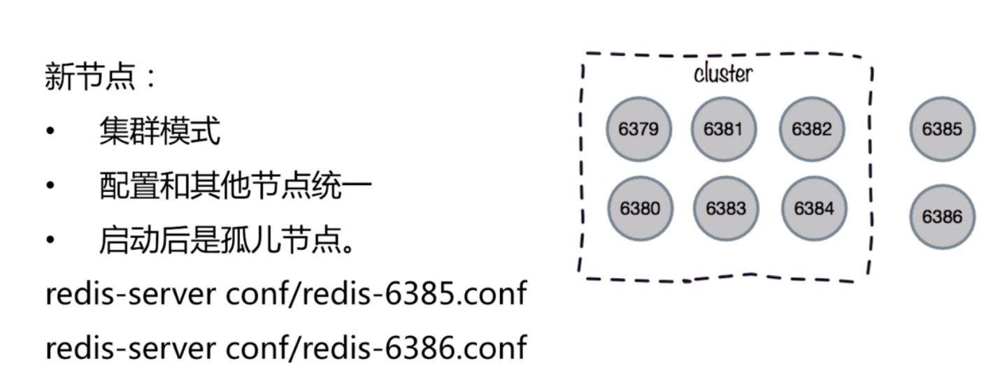
### 加入集群
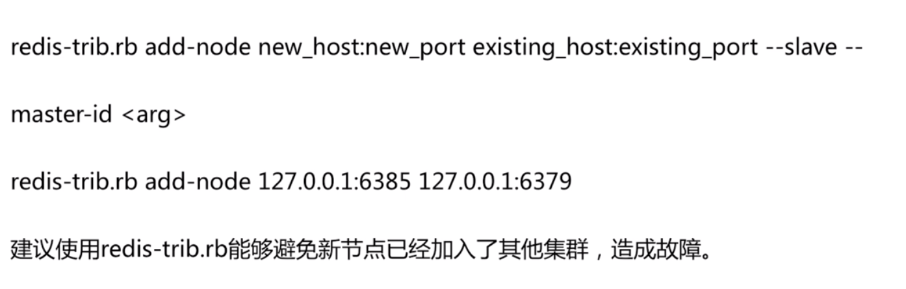
> 加入集群的作用：
> - 迁移槽和数据实现扩容
> - 作为从节点实现故障转移
### 迁移槽和数据
#### 槽迁移计划

#### 迁移数据

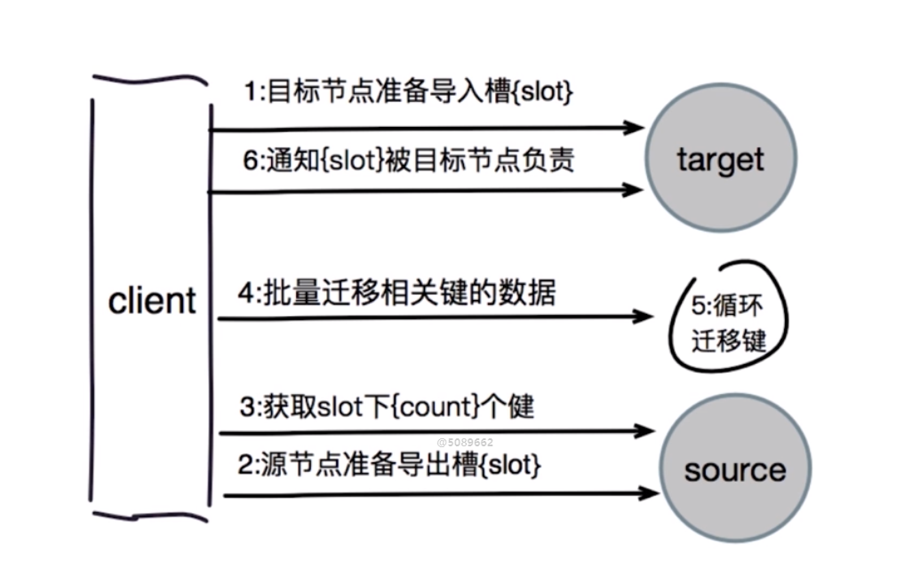

### 集群库容演示
```shell
# 启动新节点
sibyl@sibyl:~/conf3$ sed 's/8000/8006/g' 8000.conf > 8006.conf
sibyl@sibyl:~/conf3$ sed 's/8000/8007/g' 8000.conf > 8007.conf
sibyl@sibyl:~/conf3$ redis-server 8006.conf 
sibyl@sibyl:~/conf3$ redis-server 8007.conf 
sibyl@sibyl:~/conf3$ ps -aux | grep redis
sibyl     1458  0.0  0.2  29688 10504 ?        Ssl  00:12   0:00 redis-server 192.168.2.213:8000 [cluster]
sibyl     1462  0.0  0.2  29688 10896 ?        Ssl  00:12   0:00 redis-server 192.168.2.213:8001 [cluster]
sibyl     1466  0.0  0.2  29688  8840 ?        Ssl  00:12   0:00 redis-server 192.168.2.213:8002 [cluster]
sibyl     1470  0.0  0.2  29688  8724 ?        Ssl  00:12   0:00 redis-server 192.168.2.213:8003 [cluster]
sibyl     1474  0.0  0.2  29688 10800 ?        Ssl  00:12   0:00 redis-server 192.168.2.213:8004 [cluster]
sibyl     1478  0.0  0.2  29688  8760 ?        Ssl  00:12   0:00 redis-server 192.168.2.213:8005 [cluster]
sibyl     1616  0.0  0.2  29688  8140 ?        Ssl  00:45   0:00 redis-server 192.168.2.213:8006 [cluster]
sibyl     1620  0.0  0.1  29688  8064 ?        Ssl  00:45   0:00 redis-server 192.168.2.213:8007 [cluster]
sibyl     1624  0.0  0.0   3084   884 pts/0    S+   00:45   0:00 grep redis

# 加入集群
sibyl@sibyl:~/conf3$ redis-cli -h 192.168.2.213 -p 8000 cluster meet 192.168.2.213 8006
OK
sibyl@sibyl:~/conf3$ redis-cli -h 192.168.2.213 -p 8000 cluster meet 192.168.2.213 8007
OK
sibyl@sibyl:~/conf3$ redis-cli -h 192.168.2.213 -p 8000 cluster nodes
0fc5de0560713ec8510a7c9c23f7161ba6e64fd9 192.168.2.213:8005 slave b3523be21b3b9c27a0460e76803b8123496d1de8 0 1584550077081 6 connected
b3523be21b3b9c27a0460e76803b8123496d1de8 192.168.2.213:8002 master - 0 1584550078083 3 connected 10923-16383
a2e0e7edc3d44cbb75f25e96a47370479f901c35 192.168.2.213:8006 master - 0 1584550075077 7 connected
826082c383ca6b051d26603450ea944f941b0c75 192.168.2.213:8000 myself,master - 0 0 1 connected 0-5460
2a443e96ffe78ac1b14935d53f36efd2946cdfda 192.168.2.213:8004 slave 8bd3e3ff440dce1de7fe82e8dde5c1629e09cde5 0 1584550079085 5 connected
e0c98ab0ad70f9be28ed457b1ff418802186a2eb 192.168.2.213:8007 master - 0 1584550078585 0 connected
8bd3e3ff440dce1de7fe82e8dde5c1629e09cde5 192.168.2.213:8001 master - 0 1584550076078 2 connected 5461-10922
2ba6582f2115ea0787475b8520fb6f876b302cd7 192.168.2.213:8003 slave 826082c383ca6b051d26603450ea944f941b0c75 0 1584550074073 4 connected

# 配置新节点的主从
sibyl@sibyl:~/conf3$ redis-cli -h 192.168.2.213 -p 8007 cluster replicate a2e0e7edc3d44cbb75f25e96a47370479f901c35
OK
sibyl@sibyl:~/conf3$ redis-cli -h 192.168.2.213 -p 8000 cluster nodes
0fc5de0560713ec8510a7c9c23f7161ba6e64fd9 192.168.2.213:8005 slave b3523be21b3b9c27a0460e76803b8123496d1de8 0 1584550179340 6 connected
b3523be21b3b9c27a0460e76803b8123496d1de8 192.168.2.213:8002 master - 0 1584550180344 3 connected 10923-16383
a2e0e7edc3d44cbb75f25e96a47370479f901c35 192.168.2.213:8006 master - 0 1584550182347 7 connected
826082c383ca6b051d26603450ea944f941b0c75 192.168.2.213:8000 myself,master - 0 0 1 connected 0-5460
2a443e96ffe78ac1b14935d53f36efd2946cdfda 192.168.2.213:8004 slave 8bd3e3ff440dce1de7fe82e8dde5c1629e09cde5 0 1584550177334 5 connected
e0c98ab0ad70f9be28ed457b1ff418802186a2eb 192.168.2.213:8007 slave a2e0e7edc3d44cbb75f25e96a47370479f901c35 0 1584550178337 7 connected
8bd3e3ff440dce1de7fe82e8dde5c1629e09cde5 192.168.2.213:8001 master - 0 1584550180845 2 connected 5461-10922
2ba6582f2115ea0787475b8520fb6f876b302cd7 192.168.2.213:8003 slave 826082c383ca6b051d26603450ea944f941b0c75 0 1584550181346 4 connected

# 配置新加入主节点的槽
redis-trib.rb reshard 192.168.2.213:8000 
```

## 收缩集群

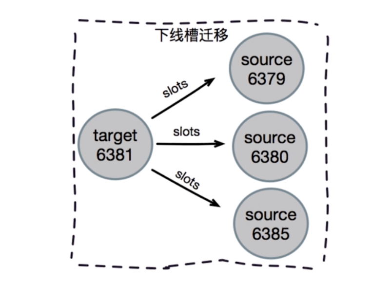
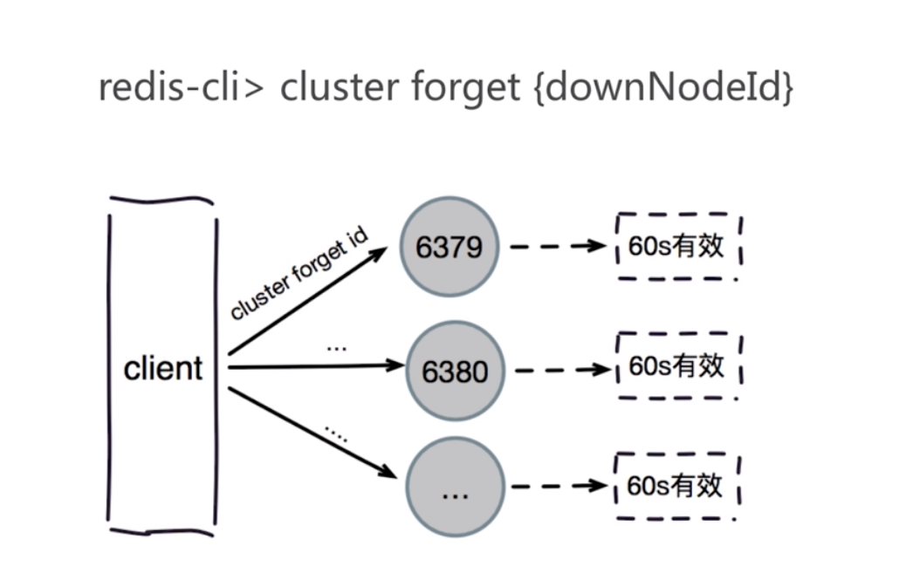

### 收缩集群演示
```shell
# 迁移槽
sibyl@sibyl:~/conf3$ redis-trib.rb reshard --from a2e0e7edc3d44cbb75f25e96a47370479f901c35 --to 826082c383ca6b051d26603450ea944f941b0c75 --slots 1366 192.168.2.213:8006
sibyl@sibyl:~/conf3$ redis-cli -h 192.168.2.213 -p 8000 cluster nodes
0fc5de0560713ec8510a7c9c23f7161ba6e64fd9 192.168.2.213:8005 slave b3523be21b3b9c27a0460e76803b8123496d1de8 0 1584551019369 6 connected
b3523be21b3b9c27a0460e76803b8123496d1de8 192.168.2.213:8002 master - 0 1584551021373 3 connected 12288-16383
a2e0e7edc3d44cbb75f25e96a47370479f901c35 192.168.2.213:8006 master - 0 1584551022373 7 connected 5462-6826 10923-12287
826082c383ca6b051d26603450ea944f941b0c75 192.168.2.213:8000 myself,master - 0 0 8 connected 0-5461
2a443e96ffe78ac1b14935d53f36efd2946cdfda 192.168.2.213:8004 slave 8bd3e3ff440dce1de7fe82e8dde5c1629e09cde5 0 1584551018366 5 connected
e0c98ab0ad70f9be28ed457b1ff418802186a2eb 192.168.2.213:8007 slave a2e0e7edc3d44cbb75f25e96a47370479f901c35 0 1584551020369 7 connected
8bd3e3ff440dce1de7fe82e8dde5c1629e09cde5 192.168.2.213:8001 master - 0 1584551017364 2 connected 6827-10922
2ba6582f2115ea0787475b8520fb6f876b302cd7 192.168.2.213:8003 slave 826082c383ca6b051d26603450ea944f941b0c75 0 1584551016363 8 connected
sibyl@sibyl:~/conf3$ redis-trib.rb reshard --from a2e0e7edc3d44cbb75f25e96a47370479f901c35 --to 8bd3e3ff440dce1de7fe82e8dde5c1629e09cde5 --slots 1365 192.168.2.213:8006
sibyl@sibyl:~/conf3$ redis-cli -h 192.168.2.213 -p 8000 cluster nodes
0fc5de0560713ec8510a7c9c23f7161ba6e64fd9 192.168.2.213:8005 slave b3523be21b3b9c27a0460e76803b8123496d1de8 0 1584551244961 6 connected
b3523be21b3b9c27a0460e76803b8123496d1de8 192.168.2.213:8002 master - 0 1584551243960 3 connected 12288-16383
a2e0e7edc3d44cbb75f25e96a47370479f901c35 192.168.2.213:8006 master - 0 1584551245962 7 connected 10923-12287
826082c383ca6b051d26603450ea944f941b0c75 192.168.2.213:8000 myself,master - 0 0 8 connected 0-5461
2a443e96ffe78ac1b14935d53f36efd2946cdfda 192.168.2.213:8004 slave 8bd3e3ff440dce1de7fe82e8dde5c1629e09cde5 0 1584551242957 9 connected
e0c98ab0ad70f9be28ed457b1ff418802186a2eb 192.168.2.213:8007 slave a2e0e7edc3d44cbb75f25e96a47370479f901c35 0 1584551244961 7 connected
8bd3e3ff440dce1de7fe82e8dde5c1629e09cde5 192.168.2.213:8001 master - 0 1584551239449 9 connected 5462-10922
2ba6582f2115ea0787475b8520fb6f876b302cd7 192.168.2.213:8003 slave 826082c383ca6b051d26603450ea944f941b0c75 0 1584551242457 8 connected
sibyl@sibyl:~/conf3$ redis-trib.rb reshard --from a2e0e7edc3d44cbb75f25e96a47370479f901c35 --to b3523be21b3b9c27a0460e76803b8123496d1de8 --slots 1365 192.168.2.213:8006
sibyl@sibyl:~/conf3$ redis-cli -h 192.168.2.213 -p 8000 cluster nodes
0fc5de0560713ec8510a7c9c23f7161ba6e64fd9 192.168.2.213:8005 slave b3523be21b3b9c27a0460e76803b8123496d1de8 0 1584551333190 10 connected
b3523be21b3b9c27a0460e76803b8123496d1de8 192.168.2.213:8002 master - 0 1584551329179 10 connected 10923-16383
a2e0e7edc3d44cbb75f25e96a47370479f901c35 192.168.2.213:8006 master - 0 1584551332188 7 connected
826082c383ca6b051d26603450ea944f941b0c75 192.168.2.213:8000 myself,master - 0 0 8 connected 0-5461
2a443e96ffe78ac1b14935d53f36efd2946cdfda 192.168.2.213:8004 slave 8bd3e3ff440dce1de7fe82e8dde5c1629e09cde5 0 1584551331186 9 connected
e0c98ab0ad70f9be28ed457b1ff418802186a2eb 192.168.2.213:8007 slave b3523be21b3b9c27a0460e76803b8123496d1de8 0 1584551331687 10 connected
8bd3e3ff440dce1de7fe82e8dde5c1629e09cde5 192.168.2.213:8001 master - 0 1584551334194 9 connected 5462-10922
2ba6582f2115ea0787475b8520fb6f876b302cd7 192.168.2.213:8003 slave 826082c383ca6b051d26603450ea944f941b0c75 0 1584551334193 8 connected

# 忘记节点
# 忘记从节点
sibyl@sibyl:~/conf3$ redis-trib.rb del-node 192.168.2.213:8000 e0c98ab0ad70f9be28ed457b1ff418802186a2eb
>>> Removing node e0c98ab0ad70f9be28ed457b1ff418802186a2eb from cluster 192.168.2.213:8000
/var/lib/gems/2.5.0/gems/redis-3.3.0/lib/redis/client.rb:459: warning: constant ::Fixnum is deprecated
>>> Sending CLUSTER FORGET messages to the cluster...
>>> SHUTDOWN the node.
sibyl@sibyl:~/conf3$ redis-trib.rb del-node 192.168.2.213:8000 a2e0e7edc3d44cbb75f25e96a47370479f901c35
>>> Removing node a2e0e7edc3d44cbb75f25e96a47370479f901c35 from cluster 192.168.2.213:8000
/var/lib/gems/2.5.0/gems/redis-3.3.0/lib/redis/client.rb:459: warning: constant ::Fixnum is deprecated
>>> Sending CLUSTER FORGET messages to the cluster...
>>> SHUTDOWN the node.
sibyl@sibyl:~/conf3$ redis-cli -h 192.168.2.213 -p 8000 cluster nodes
0fc5de0560713ec8510a7c9c23f7161ba6e64fd9 192.168.2.213:8005 slave b3523be21b3b9c27a0460e76803b8123496d1de8 0 1584551598879 10 connected
b3523be21b3b9c27a0460e76803b8123496d1de8 192.168.2.213:8002 master - 0 1584551594866 10 connected 10923-16383
826082c383ca6b051d26603450ea944f941b0c75 192.168.2.213:8000 myself,master - 0 0 8 connected 0-5461
2a443e96ffe78ac1b14935d53f36efd2946cdfda 192.168.2.213:8004 slave 8bd3e3ff440dce1de7fe82e8dde5c1629e09cde5 0 1584551595868 9 connected
8bd3e3ff440dce1de7fe82e8dde5c1629e09cde5 192.168.2.213:8001 master - 0 1584551597877 9 connected 5462-10922
2ba6582f2115ea0787475b8520fb6f876b302cd7 192.168.2.213:8003 slave 826082c383ca6b051d26603450ea944f941b0c75 0 1584551596873 8 connected
```

## 客户端路由
### moved 重定向
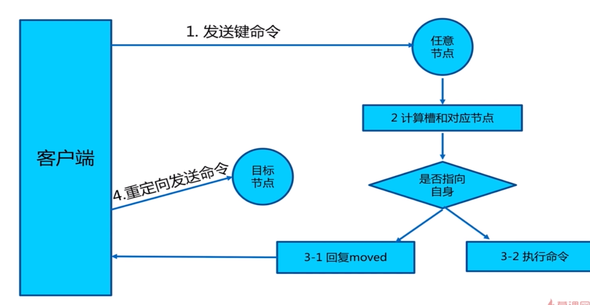
#### 槽命中(直接返回)

#### 槽未命中(moved异常)
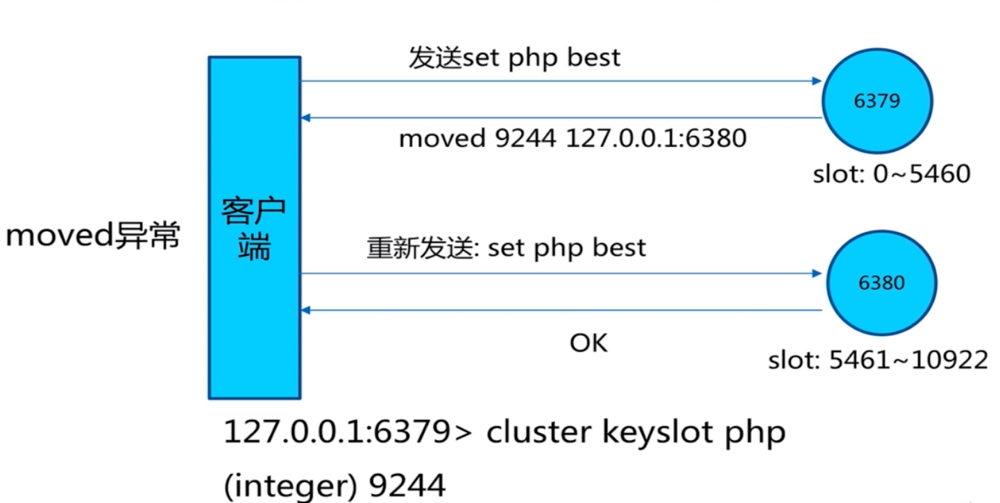

#### 操作演示
```shell
sibyl@sibyl:~$ redis-cli -c -h 192.168.2.213 -p 8000
192.168.2.213:8000> keys *
(empty list or set)
192.168.2.213:8000> set hello world
OK
192.168.2.213:8000> cluster keyslot hello
(integer) 866
192.168.2.213:8000> cluster keyslot php
(integer) 9244
192.168.2.213:8000> set php java
-> Redirected to slot [9244] located at 192.168.2.213:8001
OK
192.168.2.213:8001> get php
"java"
```
### ask 重定向
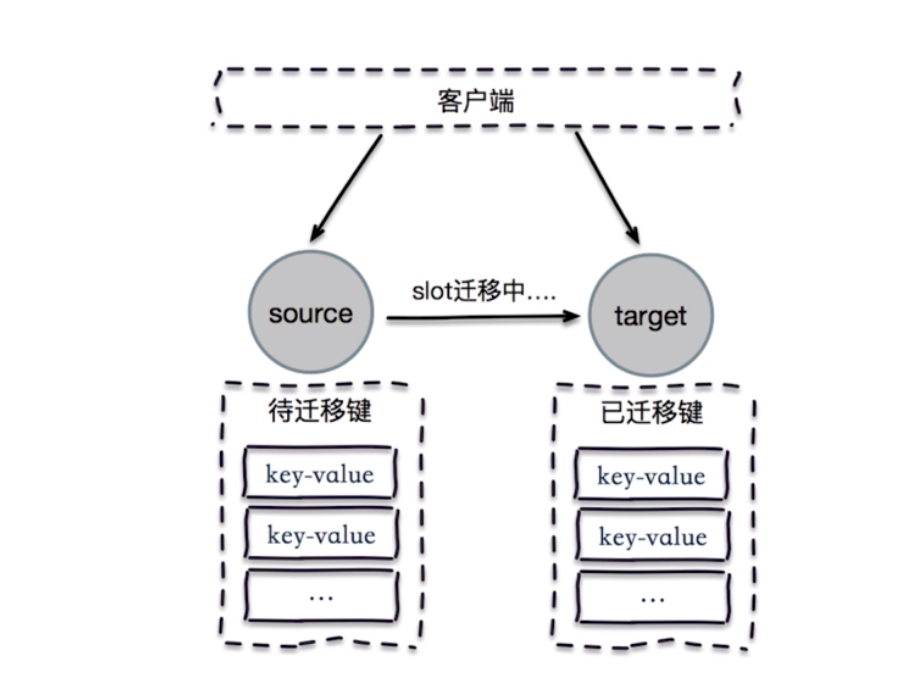
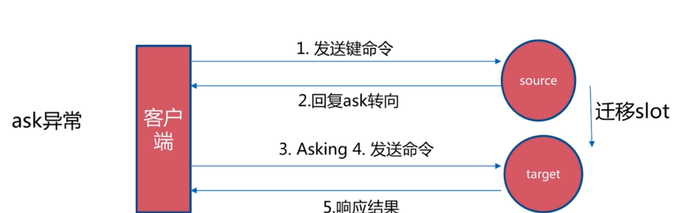

### ask 和 moved的区别
- 两者都是客户端重定向
- moved:确定槽已经迁移
- ask:槽还在迁移中

### smart客户端

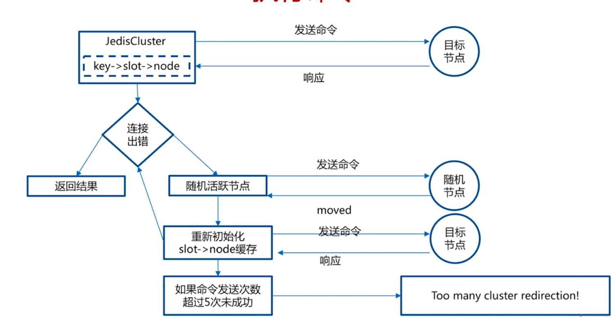

#### jedisCluster 源代码
```java
private T runWithRetries(final int slot, int attempts, boolean tryRandomNode, JedisRedirectionException redirect) {
    //尝试次数默认是5次，如果小于0,则抛出异常
    if (attempts <= 0) {
      throw new JedisClusterMaxAttemptsException("No more cluster attempts left.");
    }

    Jedis connection = null;
    try {

      if (redirect != null) {
        connection = this.connectionHandler.getConnectionFromNode(redirect.getTargetNode());
        if (redirect instanceof JedisAskDataException) {
          // TODO: Pipeline asking with the original command to make it faster....
          connection.asking();
        }
      } else {
      	// 尝试随机节点
        if (tryRandomNode) {
          connection = connectionHandler.getConnection();
        } else {
          // 算出槽并尝试连接
          connection = connectionHandler.getConnectionFromSlot(slot);
        }
      }

      return execute(connection);

      // 如果没有节点可达
    } catch (JedisNoReachableClusterNodeException jnrcne) {
      throw jnrcne;
 	// JedisConnectionException该异常不属于槽和节点关系的异常
    } catch (JedisConnectionException jce) {
      // release current connection before recursion
      // 如果出现连接异常，就会把该连接释放掉
      releaseConnection(connection);
      connection = null;

      // 如果尝试次数小于等于1 则会刷新缓存
      if (attempts <= 1) {
        //We need this because if node is not reachable anymore - we need to finally initiate slots
        //renewing, or we can stuck with cluster state without one node in opposite case.
        //But now if maxAttempts = [1 or 2] we will do it too often.
        //TODO make tracking of successful/unsuccessful operations for node - do renewing only
        //if there were no successful responses from this node last few seconds
        this.connectionHandler.renewSlotCache();
      }

      return runWithRetries(slot, attempts - 1, tryRandomNode, redirect);
      // move和ask异常
    } catch (JedisRedirectionException jre) {
      // if MOVED redirection occurred,
      if (jre instanceof JedisMovedDataException) {
        // it rebuilds cluster's slot cache recommended by Redis cluster specification
        this.connectionHandler.renewSlotCache(connection);
      }

      // release current connection before recursion
      releaseConnection(connection);
      connection = null;

      return runWithRetries(slot, attempts - 1, false, jre);
    } finally {
      releaseConnection(connection);
    }
  }
```
### redis-cluster
```java
public class JedisClusterPoolTest {
    public static void main(String[] args) {
        HashSet<HostAndPort> hostAndPorts = new HashSet<HostAndPort>();
        hostAndPorts.add(new HostAndPort("192.168.2.213",8000));
        hostAndPorts.add(new HostAndPort("192.168.2.213",8001));
        hostAndPorts.add(new HostAndPort("192.168.2.213",8002));

        int timeout = 10000;
        JedisPoolConfig poolConfig = new JedisPoolConfig();
        JedisCluster jedisCluster = new JedisCluster(hostAndPorts, timeout, poolConfig);

        System.out.println(jedisCluster.get("hello"));

        if(jedisCluster != null)
            jedisCluster.close();
    }
}
```
### 多节点操作命令
```java
public class JedisClusterPoolTest2 {
    private static Logger logger = LoggerFactory.getLogger(JedisClusterPoolTest2.class);

    public static void main(String[] args) {
        HashSet<HostAndPort> hostAndPorts = new HashSet<HostAndPort>();
        hostAndPorts.add(new HostAndPort("192.168.2.213",8000));
        hostAndPorts.add(new HostAndPort("192.168.2.213",8001));
        hostAndPorts.add(new HostAndPort("192.168.2.213",8002));

        int timeout = 10000;
        JedisPoolConfig poolConfig = new JedisPoolConfig();
        JedisCluster jedisCluster = new JedisCluster(hostAndPorts, timeout, poolConfig);

        Map<String, JedisPool> clusterNodes = jedisCluster.getClusterNodes();

        for(Map.Entry<String,JedisPool> itemEntity:clusterNodes.entrySet())
        {
            JedisPool pool = itemEntity.getValue();
            String replication = pool.getResource().info("replication");
            if(replication.contains("role:master"))
            {
                // 主节点操作
                // ...
            }

            if(pool != null)
                pool.close();
        }
    }
}
```

### 批量操作优化(多key)
> 再cluster环境下，mset，mget所有的key必须在一个槽上

#### 串行mget
> 将key进行for循环操作，效率较差

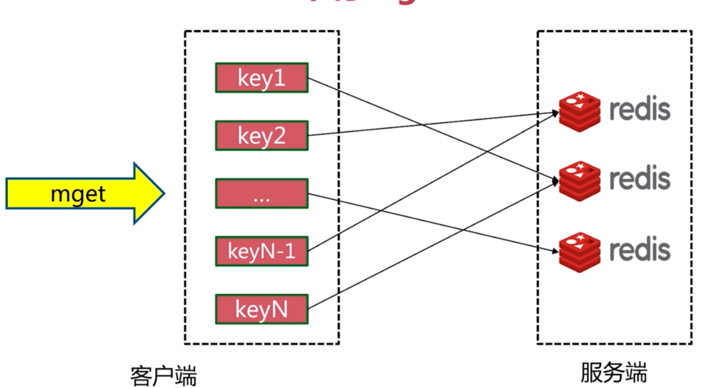

#### 串行IO
> 建立 node 个子集，把对应同一个node的查询放到同一个子集中，使用pipeline花费 node 次网络时间完成查询
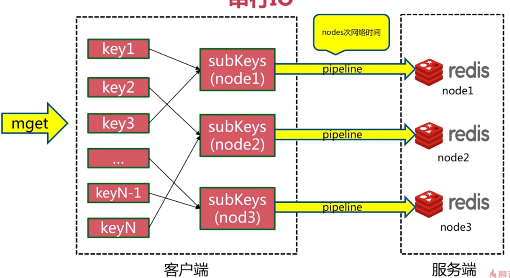

#### 并行IO
> 建立 node 个子集，把对应同一个node的查询放到同一个子集中，使用pipeline花费 node 次网络时间完成查询,不过是使用多线程的方式
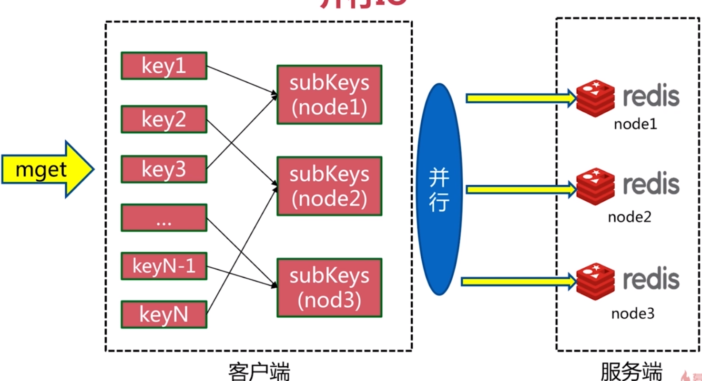

#### hash_tag
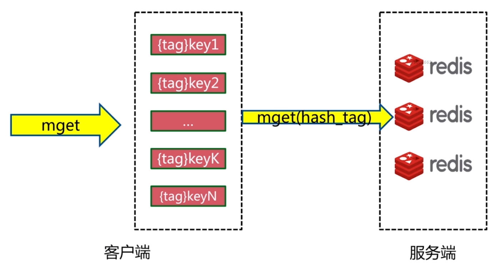

#### 比较方式
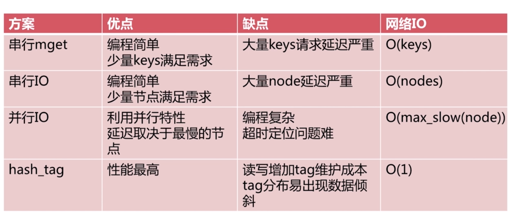

### 故障转移

#### 故障发现
- 通过 ping /pong 消息实现故障发现：不需要 sentinel
- 同样分为主观下线和客观下线

##### 主观下线
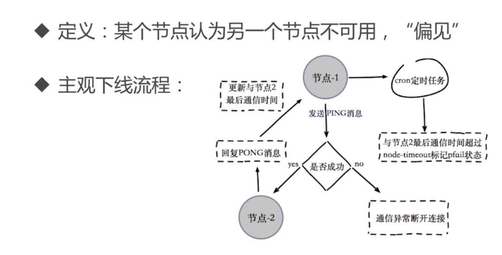
##### 客观下线
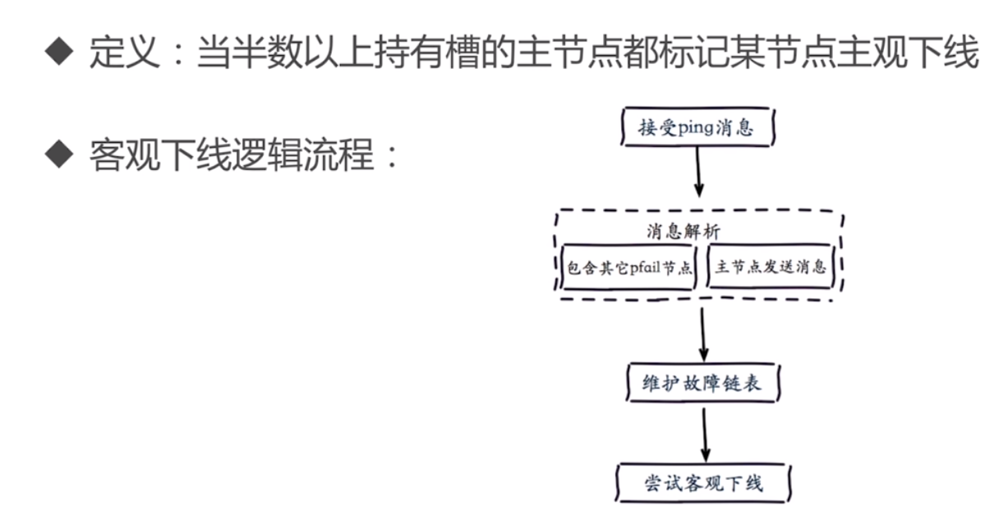
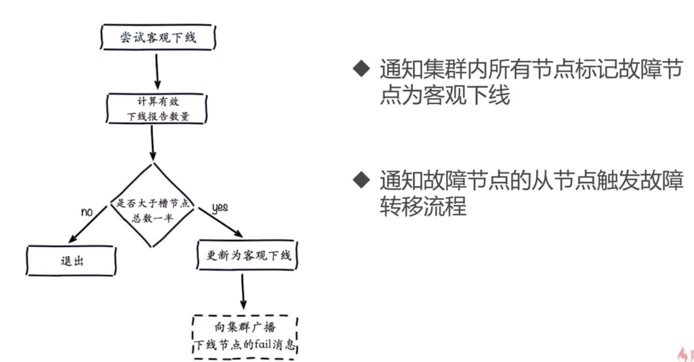