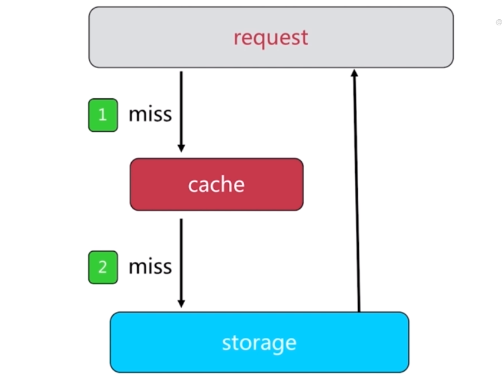
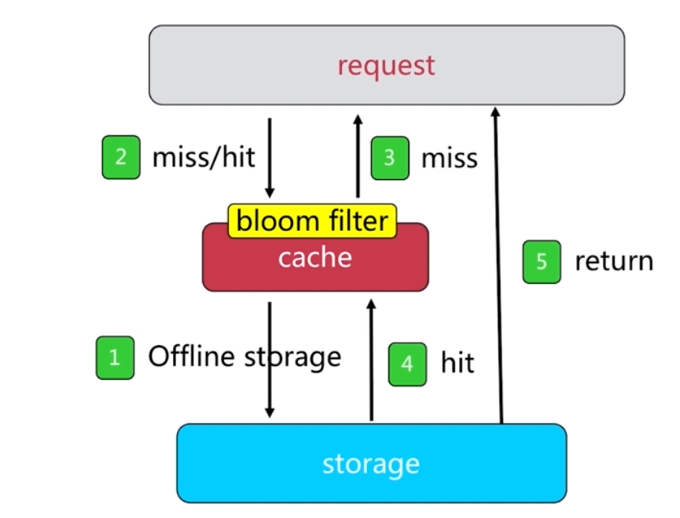

# redis 缓存设计与优化
---
## 缓存的收益与成本
### 收益
- 加速读写,通过缓存加速读写：L1/L2/L3 Cache、Linux page cache 加速硬盘读写、浏览器缓存、ehcache 缓存数据库结果
- 降低后端负载,后端服务器通过前端缓存降低负载;业务端使用Redis降低MySQL负载

### 成本
- 数据不一致,缓存层和数据层有时间窗口不一致，和更新策略有关
- 代码维护成本,多了一层缓存逻辑
- 运维成本,Redis Cluster

### 缓存使用场景
- 降低后端负载,对高消耗的SQL:join 结果集、分组统计结果缓存
- 加速请求响应时间
- 大量写合并为批量写,如计数器先在Redis累加,再批量写DB

## 缓存更新策略
- LRU/LFU/FIFO 算法剔除,maxmemory-policy
- 超时剔除,expire
- 主动更新,开发控制生命周期

### 三种策略对比
策略|一致性|维护成本
-|-|-
LRU/LIRS算法剔除|最差|低
超时剔除|较差|低
主动更新|强|高

> 低一致性:最大内存和淘汰策略
> 高一致性:超时剔除和主动更新结合的策略，最大内存和淘汰策略兜底

## 缓存粒度


- 通用性,全量属性更好
- 占用空间,部分属性更省空间
- 代码维护,表面上全量属性更好
> 实际使用中可能空间、性能更重要，需要综合考虑

## 缓存穿透问题
> 如果大量请求未命中，流量就会打到数据存储层，缓存就会失去意义，对存储层危害很大


### 穿透问题原因
- 业务代码自身逻辑有问题
- 恶意攻击、爬虫等等

### 穿透问题如何发现
- 业务的相应时间
- 业务本身问题
- 相关指标：总掉用数、缓存层命中数、存储层命中数

### 缓存穿透问题解决方案
#### 缓存空对象
> 对查询结果为空的对象也进行缓存，如果是集合，可以缓存一个空的集合（非null），如果是缓存单个对象，可以通过字段标识来区分。这样避免请求穿透到后端数据库。这种方式实现起来成本较低。


> - 需要更多的键(设置过期时间)
> - 缓存层和存储层数据短期内不一致的问题

```java
public String getPassThrough(String key)
{
	String cacheValue = cache.get(key)
	if(StringUtil.isBlack(cacheValue))
	{
		String storageValue = storage.get(key);
		cache.set(key,storageValue);
		if(StringUtil.isBlack(storageValue))
		{
			cache.expire(key,60*3);
		}
		return storageValue;
	}
	else
	{
		return cacheValue;
	}
}
```
> 如果后面某个为空的记录在数据库中有数据了，该如何处理？
> - 可以提前设置缓存的时效性，等过期之后自然会到后端刷新新数据。
> - 如果时效性要求很高的话，那就采用数据库与缓存双写的模式来实现。
> - 如果时效性要求不高的话，可以设置一个消息队列，专门用来接收数据库记录变更的消息，然后由专门的缓存服务去取出新数据并更新到缓存中。
#### 布隆过滤器拦截


## 缓存雪崩


### 缓存雪崩优化
- 保证缓存的高可用性,个别节点、个别机器、甚至是机房,如 Redis Cluster、Redis Sentinel
- 依赖隔离组件为后端限流,服务降级
- 提前演练,如压力测试


## 无底洞问题
> 2010年, Facebook有了3000个memcached 节点.发现问题："加"机器性能没提升，反而下降了
> - 更多的机器!=更多的性能
> - 批量接口需求（mget、mset 等）
> - 数据增长与水平扩展需求


### IO优化问题
- 命令本身优化：如 慢查询 keys、hgetall bigkey
- 减少网络通信次数
- 降低接入成本：如客户端长连接、连接池、NIO 等


## 热点key的重建优化
> 开发人员使用"缓存+过期时间"的策略既可以加速数据读写，又保证数据的定期更新，这种模式基本能够满足绝大部分需求。但是有两个问题如果同时出现，可能就会对应用造成致命的危害：
> - 当前key是一个热点key（例如一个热门的娱乐新闻），并发量非常大。
> - 重建缓存不能再短时间完成，可能是一个复杂计算，例如复杂的SQL、多次IO、多个依赖等。

在缓存失效的瞬间，有大量线程来重建缓存，造成后端负载过大，甚至可能会让应用崩溃。

> 要解决这个问题也不是很复杂，但是不能为了解决这个问题给系统带来更多的麻烦，所以需要制定如下目标：
> - 减少重建缓存的次数。
> - 数据尽可能一致。
> - 较少的潜在危险。

### 解决方案
#### 互斥锁

```java
public String get(String key)
{
	String value = redis.get(key);
	if(value != null)
	{
		String mutexKey = "mutex:key:"+key;
		if(redis.set(mutexKey,"1","ex 180","nx"))
		{
			value = storage.get(value);
			redis.set(key, value);
			redis.delete(mutexKey);
		}
		else{
			Thread.sleep(50);
			get(key);
		}
	}
	return value;
}
```
#### 永不过期
- 缓存层：没有设置过期时间（没有 expire）
- 功能层：为每个value添加逻辑过期时间，但发现超过逻辑过期时间后，会使用单独的线程去构建缓存


```java
public String get(String key)
{
	V v = redis.get(key);
	String value = v.getVlaue();
	long logicTimeOut = v.getLogicTimeOut();
	if(logicTimeOut >= System.currentTimeMillis())
	{
		String mutexKey = "mutex:key:"+key;
		if(redis.set(mutexKey,"1","ex 180","nx")){
			// 后台异步更新redis

			threadPool.execute(new Runnable(){
				public void run(){
					String storageValue = storage.get(key);
					redis.set(key,(storageValue,newLogicTimeOut))
					redis.delete(mutexKey)
				}
			});
		}
	}
	return value;
}
```

#### 两种方式优化


## 本章总结
- 缓存收益：加速读写、降低后端存储负载
- 缓存成本：缓存和存储数据不一致性、代码维护成本、运维成本
- 推荐结合剔除、超时、主动更新三种方案共同完成
- 穿透问题：使用缓存空对象和布隆过滤器来解决，注意它们各自的使用场景和局限性
- 无敌洞问题：分布式缓存中，有更多的机器不保证有更高的性能。有四种批量操作方式：串行命令、串行 I/O、并行 、hash_tag
- 雪崩问题：缓存层高可用、客户端降级、提前演练是解决雪崩问题的重要方法
- 热点 key 问题：互斥锁、永不过期 能够在一定程度上解决热点 key 问题，开发时要了解它们各自的使用成本