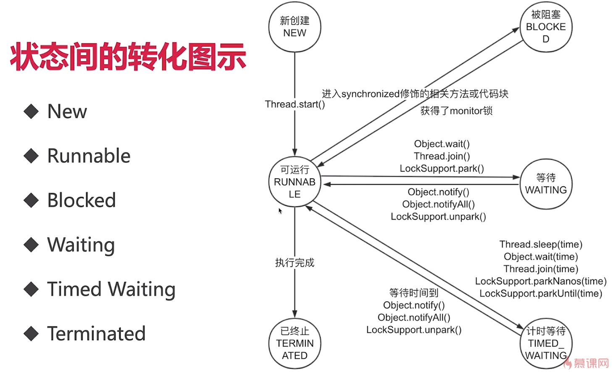
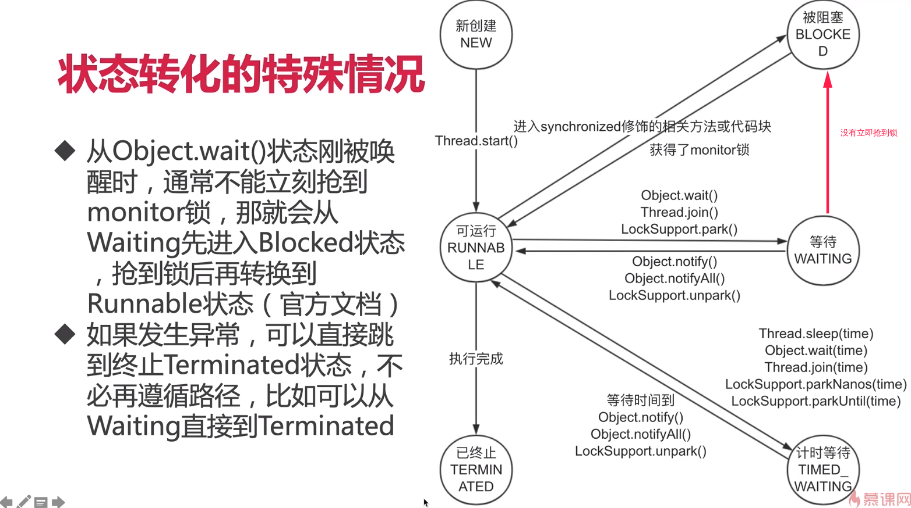

# 线程生命状态
---

## 线程的每个状态和含义
* New(新创建): 已经创建，但是还未启动的新线程
* Runnable(可运行状态): **一旦调用start方法，无论线程有没有执行，线程都会进入Runnable状态，其实对应线程的两种状态等待执行和运行中的**
* Blocked(被阻塞状态): 当一个线程进入**synchronized**方法或代码块，并且**该锁已经被其他线程所拿走的情况**下，线程的状态就是Blocked
* Waiting(等待状态): 可运行的线程通过**Object.wait(),Thread.join(),LockSupport.park()**方法进入Waiting状态
* Timed_Waiting(计时等待状态): 可运行的线程通过**Object.wait(time),Thread.join(time),Thread.sleep(time),LockSupport.parkNanos(time),LockSupport.parkUtil(time)**方法进入Timed_Waiting状态
* Terminated(终止状态):线程执行完成，**出现没有被捕获的异常导致以外终止**



## 线程转换演示
### New,Runnable,Terminated

```java

/**
 * 描述:展示线程New Runnable Terminated 三种状态，即使是正在运行，也是Runnable状态，而不是Running
 */
public class NewRunnableTerminated {

    public static void main(String[] args) {
        Runnable runnable = () ->{
            for(int i=0;i<1000;i++)
            {
                System.out.println(i);
            }
        };

        Thread thread = new Thread(runnable);
        System.out.println(thread.getState()); //打印出 NEW

        thread.start();
        System.out.println(thread.getState()); //打印出 RUNNABLE

        try {
            Thread.sleep(10);
        } catch (InterruptedException e) {
            e.printStackTrace();
        }
        System.out.println(thread.getState()); //确保执行中打印状态，打印出 RUNNABLE

        try {
            Thread.sleep(1000);
        } catch (InterruptedException e) {
            e.printStackTrace();
        }
        System.out.println(thread.getState()); //打印出 TERMINATED

    }
}

```
## Blocked,Waiting,Timed_Waiting

```java

/**
 * 描述：展示Waiting，Timed_Waiting，Blocked状态
 */
public class BlockedWaitingTimedWaiting implements Runnable{
    public static void main(String[] args) throws InterruptedException {

        BlockedWaitingTimedWaiting blockedWaitingTimedWaiting = new BlockedWaitingTimedWaiting();
        Thread thread_01 = new Thread(blockedWaitingTimedWaiting);
        thread_01.start();
        Thread thread_02 = new Thread(blockedWaitingTimedWaiting);
        thread_02.start();
        Thread.sleep(5);

        //打印出TIMED_WAITING 状态是因为thread_01正在执行 Thread.sleep(1000),
        System.out.println(thread_01.getState());
        //打印出 BLOCKED 状态是因为thread_02想拿到syn()的锁，却拿不到
        System.out.println(thread_02.getState());

        Thread.sleep(1300);
        //打印出 WAITING 状态是因为thread_01执行到了wait()方法
        System.out.println(thread_01.getState());
    }

    @Override
    public void run() {
        syn();
    }

    private synchronized void syn()
    {
        try {
            Thread.sleep(1000);
            wait();
        } catch (InterruptedException e) {
            e.printStackTrace();
        }
    }
}
```

## 状态转换注意点和阻塞的定义
### 状态转换注意点
> 线程状态之间的**转换不可逆(例如New->Runnable,Runnable->Terminated)**
> 线程状态时间的转换**不可跳转(例如New->Blocked，线程就必须经历Runnable状态)**

### 阻塞的定义
> 一般习惯而言，把**Blocked(被阻塞状态),Waiting(等待状态),Timed_Waiting(计时等待状态)都称之为阻塞状态**,而不仅仅是Blocked(阻塞状态)状态

## 线程状态转换的特殊情况
* **从Object.wait()状态刚被唤醒的时候，通常不能立即抢到monitor锁，那就会从Waiting状态先进入到Blocked状态，抢到锁再进入到Runnable状态**
* **如果发生异常，可以直接跳到终止Terminated状态，不必遵循线程转换状态图示，比如Waiting状态发生异常，则直接进入到Terminated状态**




