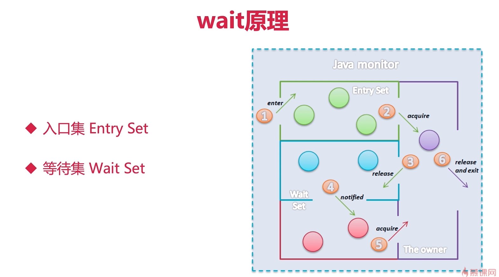
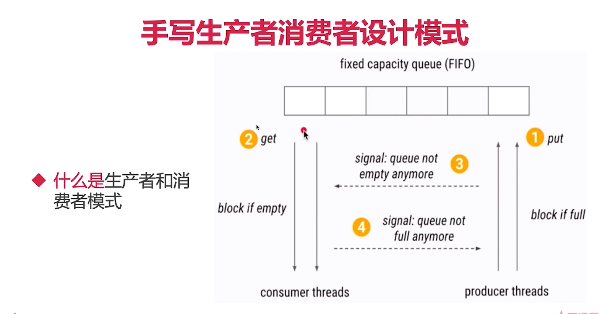

# Object和Thread方法解析
---

## 方法概览
类|方法名|简介|线程状态转换
-|-|-|-
Thread|sleep()相关|sleep相关的方法，使线程陷入沉睡|Runnable->Timed_Wating
Thread|join()|等待其他线程执行完毕|Runnable->Waiting/Timed_Wating
Thread|yield()相关|放弃已经获取到的CPU资源|
Thread|currentThread()|获取当前执行线程的引用|
Thread|start(),run()相关|启动线程|New->Runnable
Thread|interrupt()相关|中断线程|Runnable->Terminated
Thread|stop(),suspend(),resuem()相关|已废弃|(stop)Runnable->Terminated,suspend(jdk1.8确实是Runnable->Terminated)
Object|wait()/notify()/notifyAll()相关|让线程暂时休息和唤醒|Runnable->Waiting/Timed_Waiting,Waiting/Timed_Waiting->Runnable

## wait，notify，notifyAll
> wait方法是让线程进入阻塞状态即Runnable->Runnable->Waiting/Timed_Waiting,**但是阻塞的前提是线程必须拥有锁才能进入阻塞状态**，notify是唤醒锁对象上的其他线程中的一个线程，notifyAll是唤醒锁对象上所有线程，

### wait的作用和用法
> wait方法进入阻塞阶段，遇到一下其中一种情况才能被唤醒
* **另一个线程调用这个对象的notify()方法，而且刚好唤醒的是本线程**(notify唤醒的选择是随机的，java并没有对此进行严格的规范)
* **另一个线程调用这个对象的notifyAll()方法**(notifyAll唤醒本对象上所有的线程，但是获取到锁的线程是随机的，执行的线程是随机的)
* **过了wait(long timeout)规定的时候超时时间,如果传入0就是永久等待**
* **线程自身调用了interrupt()**

```java

/**
 * 描述:展示wait和notify的基本用法
 * 1, 研究代码的执行顺序
 * 2, 证明wait释放锁
 */
public class Wait {
    public static Object object = new Object();

    static class Thread_01 extends Thread{
        @Override
        public void run() {
            synchronized (object)
            {
                System.out.println("Thread_01开始执行");
                try {
                    object.wait();
                } catch (InterruptedException e) {
                    e.printStackTrace();
                }
                System.out.println("Thread_01获取到锁");
            }
        }
    }
    static class Thread_02 extends Thread {
        @Override
        public void run() {
            synchronized (object)
            {
                object.notify();
                System.out.println("Thread_02 调用notify()");
            }
        }
    }
    public static void main(String[] args) throws InterruptedException {
        Thread_01 thread_01 = new Thread_01();
        Thread_02 thread_02 = new Thread_02();

        thread_01.start();
        Thread.sleep(200);
        thread_02.start();
    }
    /*
        打印结果：
            Thread_01开始执行
            Thread_02 调用notify()
            Thread_01获取到锁
     */
}

```
> 当线程Thread_01执行object.wait();语句的时候释放了锁，然后将锁移交给线程Thread_02,线程Thread_02开始执行，执行到object.notify();的时候，唤醒了线程Thread_01,但是并没有立即释放锁，需要等到线程Thread_02执行完成synchronized代码块的语句才会将锁移交给线程Thread_01,线程Thread_01才会再次执行synchronized代码块的语句

> wait()方法是立即释放锁，notify()方法并没有立即释放锁，需要等到synchronized代码块的语句执行完成才会释放锁

### notify 和 notifyAll的区别
```java

/**
 * 描述: 3个线程，线程1和线程2首先被阻塞，线程3唤醒他们，notify，notifyAll
 * start先执行并不代表线程先启动
 */
public class WaitNotifyAll implements Runnable{

    private static final Object resourceA = new Object();

    public static void main(String[] args) throws InterruptedException {
        Runnable runnable = new WaitNotifyAll();

        Thread thread_A = new Thread(runnable);
        Thread thread_B = new Thread(runnable);

        Thread thread_C = new Thread(new Runnable() {
            @Override
            public void run() {
                synchronized (resourceA) {
                    resourceA.notify();
                    System.out.println("thread_C 已经成功notifyAll");
                }
            }
        });

        thread_A.start();
        thread_B.start();
        Thread.sleep(200);
        thread_C.start();
    }
    @Override
    public void run() {
        synchronized (resourceA)
        {
            System.out.println(Thread.currentThread().getName() + "获取到resourceA锁");
            try {
                System.out.println(Thread.currentThread().getName() + "释放resourceA锁，等待下一步的开始");
                resourceA.wait();
                System.out.println(Thread.currentThread().getName() + "重新获取到resourceA锁，马上运行结束");
            } catch (InterruptedException e) {
                e.printStackTrace();
            }
        }
    }

    /*
      resourceA.notifyAll();
      打印结果：
        Thread-0获取到resourceA锁
        Thread-0释放resourceA锁，等待下一步的开始
        Thread-1获取到resourceA锁
        Thread-1释放resourceA锁，等待下一步的开始
        thread_C 已经成功notifyAll
        Thread-1重新获取到resourceA锁，马上运行结束
        Thread-0重新获取到resourceA锁，马上运行结束

      resourceA.notifyAll();
      打印结果：
        Thread-1获取到resourceA锁
        Thread-1释放resourceA锁，等待下一步的开始
        Thread-0获取到resourceA锁
        Thread-0释放resourceA锁，等待下一步的开始
        thread_C 已经成功notifyAll
        Thread-1重新获取到resourceA锁，马上运行结束
        ...线程thread_B没有释放锁，导致线程thread_A进入永久等待
    */
}
```
> 线程start()方法先执行并不代表线程先启动

### wait只释放当前的锁
```java
/**
 * 描述：证明wait只释放当前的那把锁
 */
public class WaitNotifyReleaseOwnMonitor {

    private static volatile Object resourceA = new Object();
    private static volatile Object resourceB = new Object();

    public static void main(String[] args) {
        Runnable runnableA = () -> {
          synchronized (resourceA)
          {
              System.out.println("thread A 获取到resourceA锁");
              synchronized (resourceB)
              {
                  System.out.println("thread A 获取到resourceB锁");
                  try {
                      System.out.println("thread A 释放resourceA锁");
                      resourceA.wait();
                  } catch (InterruptedException e) {
                      e.printStackTrace();
                  }
              }
          }
        };
        Runnable runnableB = () -> {
            try {
                Thread.sleep(1000);
            } catch (InterruptedException e) {
                e.printStackTrace();
            }
            synchronized (resourceA)
            {
                System.out.println("thread B 获取到resourceA锁");
                System.out.println("thread B 尝试获取到resourceB锁");
                synchronized (resourceB)
                {
                    System.out.println("thread B 获取到resourceB锁");
                }
            }
        };

        Thread threadA = new Thread(runnableA);
        Thread threadB = new Thread(runnableB);

        threadA.start();
        threadB.start();

        /*
          打印结果：
            thread A 获取到resourceA锁
            thread A 获取到resourceB锁
            thread A 释放resourceA锁
            thread B 获取到resourceA锁
            thread B 尝试获取到resourceB锁
         */

    }
}
```
> 如果使用wait释放锁，必须具体指定释放的是哪一把锁，threadA resourceA.wait();释放resourceA锁，并没有释放resourceB锁。

### wait,notify,notifyAll特点和性质
* wait,notify,notifyAll执行的前必须获取到synchronized锁，否则报出异常
* notify 只能唤醒一个线程，如果有多个线程在等待的情况下，不能预知唤醒的是哪个线程
* wait,notify,notifyAll 是Object类中的方法，并且被final所修饰不可被重写，并且是native方法。
* 类似功能的Condition
* 同时持有多个锁的情况下，要防止死锁的发生

### wait 原理图示

> 1, 准备抢锁的线程进入到入口集
> 2, 当入口集的某个线程获取到锁，开始执行，这里分为两种情况：a(Waiting，Timed_Waiting状态，释放锁并进入到等待集)，b(正常执行完成，释放锁并退出)
> 3, 当等待集中的某个元素被唤醒，线程就会重新等待持有锁的线程释放，准备抢锁

### 生产者消费者模式
>生产者和消费者模式是常用的设计模式，主要用来解藕生产者和消费者，平衡生产者和消费者的能力，提高代码的运行效率



```java
package com.company.objectandthread;

import java.util.ArrayList;
import java.util.Date;
import java.util.LinkedList;
import java.util.List;

/**
 * 描述：用 wait/notify 来实现生产者和消费者模式
 */
public class ProducerConsumerModel {

    public static void main(String[] args) {
        EventStorage storage = new EventStorage();
        Thread producer = new Thread(new Producer(storage));
        Thread consumer = new Thread(new Consumer(storage));

        producer.start();
        consumer.start();
    }
}
class Consumer implements Runnable
{
    private EventStorage storage;
    public Consumer(EventStorage storage) {
        this.storage = storage;
    }

    @Override
    public void run() {
        for(int i=0;i<70;i++)
            storage.take();
    }
}
class Producer implements Runnable
{
    private EventStorage storage;
    public Producer(EventStorage storage) {
        this.storage = storage;
    }

    @Override
    public void run() {
        for(int i=0;i<70;i++)
            storage.put();
    }
}

class EventStorage
{
    private int maxSize;
    private LinkedList<Date> storage;

    public EventStorage() {
        this.maxSize = 15;
        this.storage = new LinkedList<>();
    }

    public synchronized void put()
    {
        while(storage.size() == maxSize)
        {
            try {
                wait();
            } catch (InterruptedException e) {
                e.printStackTrace();
            }
        }
        storage.add(new Date());
        System.out.println("仓库中有了" + this.storage.size()+"个日期");
        notify();
    }

    public synchronized void take()
    {
        while(storage.size() == 0)
        {
            try {
                wait();
            } catch (InterruptedException e) {
                e.printStackTrace();
            }
        }
        System.out.println("拿到了"+storage.poll()+",线程仓库还剩下"+storage.size());
        notify();
    }
}
```
> 这里的生产者和消费并不是生产10个便消费10个，而是两者交替进行的<br/>
> ...<br/>
仓库中有了7个日期<br/>
仓库中有了8个日期<br/>
仓库中有了9个日期<br/>
仓库中有了10个日期<br/>
仓库中有了11个日期<br/>
仓库中有了12个日期<br/>
仓库中有了13个日期<br/>
仓库中有了14个日期<br/>
仓库中有了15个日期<br/>
拿到了Mon Feb 03 ... CST 2019,线程仓库还剩下14<br/>
拿到了Mon Feb 03 ... CST 2019,线程仓库还剩下13<br/>
拿到了Mon Feb 03 ... CST 2019,线程仓库还剩下12<br/>
拿到了Mon Feb 03 ... CST 2019,线程仓库还剩下11<br/>
拿到了Mon Feb 03 ... CST 2019,线程仓库还剩下10<br/>
仓库中有了11个日期<br/>
仓库中有了12个日期<br/>
仓库中有了13个日期<br/>
仓库中有了14个日期<br/>
仓库中有了15个日期<br/>
> ...

## sleep方法概览，不释放锁
> 作用:只想让线程在预期的时间执行，其他时间不要占用CPU资源

* sleep不释放锁
    * synchronized或者是lock加的锁，通通不会释放
    * 和wait不同，sleep带锁休息，wait会将锁移交给别的线程而sleep不会


### sleep不释放synchronized的锁
```java
/**
 * 描述：展示线程sleep的时间不会释放synchronized的锁，等到sleep结束时间，正常执行
 */
public class SleepDontReleaseMonitor implements Runnable {

    public static void main(String[] args) {
        SleepDontReleaseMonitor sleepDontReleaseMonitor = new SleepDontReleaseMonitor();
        new Thread(sleepDontReleaseMonitor).start();
        new Thread(sleepDontReleaseMonitor).start();
    }

    @Override
    public void run() {
        sync();
    }

    private synchronized void sync() {
        System.out.println("线程"+Thread.currentThread().getName()+"获取到锁");
        try {
            Thread.sleep(5000);
        } catch (InterruptedException e) {
            e.printStackTrace();
        }
        System.out.println("线程"+Thread.currentThread().getName()+"退出了同步代码块");
    }
}

```

### sleep不释放lock的锁
```java
import java.util.concurrent.locks.Lock;
import java.util.concurrent.locks.ReentrantLock;

public class SleepDontReleaseLock implements Runnable {

    private static final Lock lock = new ReentrantLock();

    public static void main(String[] args) {
        SleepDontReleaseLock sleepDontReleaseLock = new SleepDontReleaseLock();
        new Thread(sleepDontReleaseLock).start();
        new Thread(sleepDontReleaseLock).start();
    }

    @Override
    public void run() {
        lock.lock();
        System.out.println("线程"+Thread.currentThread().getName()+"获取到锁");
        try {
            Thread.sleep(5000);
            System.out.println("线程"+Thread.currentThread().getName()+"被唤醒");
        } catch (InterruptedException e) {
            e.printStackTrace();
        }
        finally {
            lock.unlock();
        }
    }
}
```

## sleep方法对于中断的响应
>sleep方法可以让线程进入Timed_Waiting状态，并且不占用CPU资源，但是不释放锁,直到规定时间后在执行,休眠期间如果被打断，会抛出异常并清除中断状态。

```java

/**
 * 描述:  每隔1秒钟输出当前时间，被中断，观察其反映
 * Thread.sleep()
 * TimeUtil.SECONDS.sleep()
 */
public class SleepInterrupted implements Runnable{
    public static void main(String[] args) throws InterruptedException {
        Thread thread = new Thread(new SleepInterrupted());
        thread.start();
        Thread.sleep(5000);
        thread.interrupt();
    }

    @Override
    public void run() {
        try {
            for (int i=0;i<10;i++)
            {
                System.out.println(new Date());
                TimeUnit.SECONDS.sleep(1);
            }
        } catch (InterruptedException e) {
            System.out.println("被中断！");
            e.printStackTrace();
        }
    }
}
```

## join()方法的作用和普通用法
> 作用：因为新的线程加入我们，所以我们要等待他执行完成再执行

> 用法: main等待thread1执行完成，注意谁等谁

### join的普通用法
```java
import java.util.concurrent.TimeUnit;

/**
 * 描述：演示Join的普通用法，并注意执行顺序
 */
public class Join {
    public static void main(String[] args) throws InterruptedException {
        Thread thread1 = new Thread(new Runnable() {
            @Override
            public void run() {
                try {
                    TimeUnit.SECONDS.sleep(1);
                } catch (InterruptedException e) {
                    e.printStackTrace();
                }
                System.out.println(Thread.currentThread().getName() + "线程执行完毕");
            }
        });
        Thread thread2 = new Thread(new Runnable() {
            @Override
            public void run() {
                try {
                    TimeUnit.SECONDS.sleep(1);
                } catch (InterruptedException e) {
                    e.printStackTrace();
                }
                System.out.println(Thread.currentThread().getName() + "线程执行完毕");
            }
        });

        thread1.start();
        thread2.start();
        System.out.println("等待子线程执行完毕");
        thread1.join();
        thread2.join();
        System.out.println("所有子线程执行完毕");

        /*
            打印结果:
                等待子线程执行完毕
                Thread-0线程执行完毕
                Thread-1线程执行完毕
                所有子线程执行完毕
         */
    }
}
```

### join遇到中断
```java

/**
 * 描述：演示join的中断状态
 */
public class JoinInterrput {
    public static void main(String[] args) {
        Thread mainThread = Thread.currentThread();

        Thread thread1 = new Thread(new Runnable() {
            @Override
            public void run() {
                try {
                    mainThread.interrupt();
                    Thread.sleep(5000);
                    System.out.println("Thread1 finished！");
                } catch (InterruptedException e) {
                    System.out.println("子线程中断");
                }
            }
        });

        thread1.start();
        System.out.println("等待子线程运行完毕");
        try {
            thread1.join();
        } catch (InterruptedException e) {
            System.out.println(Thread.currentThread().getName()+" 主线程被中断");
        }
        System.out.println("子线程运行完毕");

        /*
            打印结果:
                等待子线程运行完毕
                main 主线程被中断
                子线程运行完毕
                Thread1 finished！
         */
        // 这里出现不一致的问题，主线程已经被中断了，但是子线程还是在运行
        //可以将主线程的中断传递给子线程
        thread1.interrupt();
        /*
            通知子线程中断之后的运行结果:
                等待子线程运行完毕
                main 主线程被中断
                子线程运行完毕
                子线程中断
         */

    }
}
```

### join期间线程的状态
```java
/**
 * 描述：先join再mainThread.getState()或通过debugger看线程join前后的状态对比
 */
public class JoinThreadState {
    public static void main(String[] args) throws InterruptedException {
        Thread mainThread = Thread.currentThread();
        Thread thread = new Thread(new Runnable() {
            @Override
            public void run() {
                try {
                    Thread.sleep(3000);
                    System.out.println(mainThread.getState());
                    System.out.println("Thread-0运行结束");
                } catch (InterruptedException e) {
                    e.printStackTrace();
                }
            }
        });
        thread.start();
        System.out.println("等待子线程运行结束");
        thread.join();
        System.out.println("等待子线程运行完毕");
        /*
            打印结果：
                等待子线程运行结束
                WAITING
                Thread-0运行结束
                等待子线程运行完毕
         */
    }
}
```

### join注意点，原理，源码分析，替代写法
> 为了防止多线程情况的发生，最好不要自己使用底层方法，推荐使用**CountDonwLatch或CyclicBarrier**

```java
public final void join() throws InterruptedException {
    join(0);
}
public final synchronized void join(long millis)
    throws InterruptedException {
        long base = System.currentTimeMillis();
        long now = 0;

        if (millis < 0) {
            throw new IllegalArgumentException("timeout value is negative");
        }

        if (millis == 0) {
            while (isAlive()) {
                wait(0);
            }
        } else {
            while (isAlive()) {
                long delay = millis - now;
                if (delay <= 0) {
                    break;
                }
                wait(delay);
                now = System.currentTimeMillis() - base;
            }
        }
    }
```
> join()方法底层使用的是wait(0)这个方法，但是使用wait(0)之后线程会陷入无尽等待中，而wait方法本身又没有唤醒其他线程，原因是：**在每一个Thread执行完成之后，会自动唤醒其他线程，这也是推荐Threa类充当锁的缘故，例如Thread.wait()就会在等待完成之后执行类似notifyAll的操作**

```java

/**
 * 描述:通过Join的原理，写出Join的替代写法
 */
public class JoinPrinciple {
    public static void main(String[] args) throws InterruptedException {
        Thread thread = new Thread(new Runnable() {
            @Override
            public void run() {
                try {
                    Thread.sleep(1000);
                } catch (InterruptedException e) {
                    e.printStackTrace();
                }
                System.out.println(Thread.currentThread().getName() + "执行完毕");
            }
        });

        thread.start();
        System.out.println("等待子线程运行完毕");
        //thread.join();
        synchronized (thread)
        {
            thread.wait();// 这里利用thread.wait()之后会唤醒其他线程
        }
        System.out.println("所有子线程执行完毕");

        /*
            打印结果：
                等待子线程运行完毕
                Thread-0执行完毕
                所有子线程执行完毕
         */
    }
}

```

## yield的作用，定位
> 作用:释放本线程的CPU时间片，yield释放CPU时间片的同时不会释放锁，也不会陷入阻塞，所以yield的方法线程状态是Runnable，而不是Waiting，Blocked

> 定位: JVM不保证遵循

## Thread.currentThread()
>Thread.currentThread()返回的是当前线程的引用

```java

/**
 * 描述：演示Thread.currentThread()
 */
public class CurrentThread implements Runnable {
    public static void main(String[] args) {
        new CurrentThread().run();
        new Thread(new CurrentThread()).start();
        new Thread(new CurrentThread()).start();

        /*
            打印结果:
                main
                Thread-0
                Thread-1
         */
    }

    @Override
    public void run() {
        System.out.println(Thread.currentThread().getName());
    }
}
```
