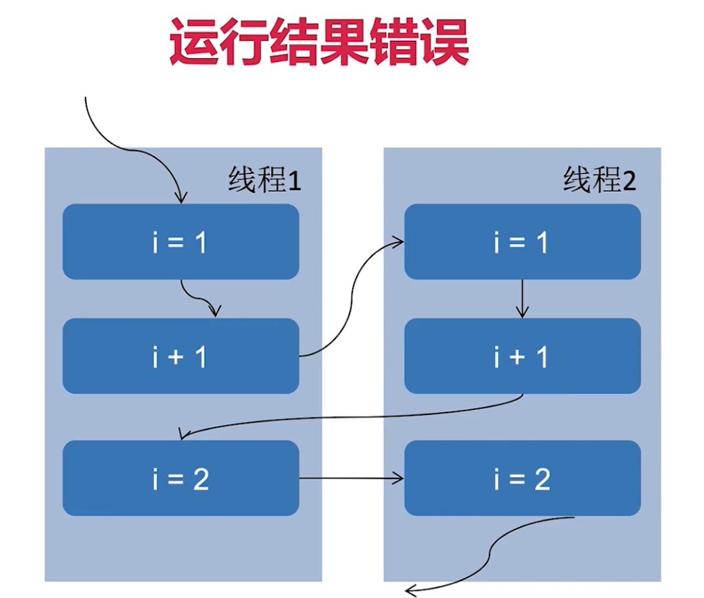

# 并发线程安全
---

## 什么是线程安全？
> 不管业务逻辑中遇到怎么样的多线程访问某个对象或者是某个方法的时候，而编写这个业务逻辑的时候，**都不需要进行任何额外的处理**（也就是像单线程一样），线程也可以正常运行（不会因为多线程出错），就可以称之为线程安全

> 相反，如果在编程的时候，需要考虑这些线程在运行时的调度和交替（例如在get()调用到期间不能调用set()），或者需要进行额外的同步（比如使用synchronized关键字等），那么就是线程不安全的。


## 什么情况下会出现线程安全问题？
> 数据争用，两个线程同时写入数据，必然会有一方的数据被丢弃

> 竞争条件，就是线程的执行顺序，假设在其他线程没有完成之后进行读取，必然读取到的是错误的数据

* 运行结果错误：a++多线程情况下消失的请求现象
* 活跃性问题：死锁，活锁，饥饿
* 对象发布和初始化的时候的安全问题


## a++ 运行错误
```java
/**
 * 描述：第一种：运行结果出错
 * 演示计数不准确（减少）,找出具体出错的位置
 */
public class MultiThreadError implements Runnable {

    int index = 0;
    static MultiThreadError multiThreadError = new MultiThreadError();
    public static void main(String[] args) throws InterruptedException {
        Thread thread1 = new Thread(multiThreadError);
        Thread thread2 = new Thread(multiThreadError);

        thread1.start();
        thread2.start();
        thread1.join();
        thread2.join();

        System.out.println(multiThreadError.index);
    }

    @Override
    public void run() {
        for (int i=0;i<10000;i++)
        {
            index++;
        }
    }
}

```
>多线程情况下 a++的具体错误就是a++并不是一条语句，而是三条语句。在三条语句的执行过程中，发生了多线程冲突才是线程a++运行结果错误的主要原因


### a++ 运行错误分析
```java
/**
 * 描述：抓取错误的具体位置
 * 1,用mark数据将执行过得进行标记
 * 2,由于index漂移，用synchronized保护
 * 3,由于synchronized的可见性的问题，使用CyclicBarrier对线程流程的控制
 * 4,修改判断条件，过滤无线程错误
 */
public class MultiThreadError implements Runnable {

    int index = 0;
    static MultiThreadError multiThreadError = new MultiThreadError();

    final boolean[] mark = new boolean[20001];
    static AtomicInteger realIndex = new AtomicInteger();
    static AtomicInteger wrongCount = new AtomicInteger();

    static volatile CyclicBarrier cyclicBarrier1 = new CyclicBarrier(2);
    static volatile CyclicBarrier cyclicBarrier2 = new CyclicBarrier(2);

    public static void main(String[] args) throws InterruptedException {
        Thread thread1 = new Thread(multiThreadError);
        Thread thread2 = new Thread(multiThreadError);

        thread1.start();
        thread2.start();
        thread1.join();
        thread2.join();

        System.out.println("表面执行结果："+multiThreadError.index);
        System.out.println("真正执行结果："+realIndex.get());
        System.out.println("错误次数："+wrongCount.get());
    }

    @Override
    public void run() {
        mark[0] = true;
        for (int i=0;i<10000;i++)
        {
            try {
                cyclicBarrier2.await();
                cyclicBarrier1.await();
            } catch (InterruptedException e) {
                e.printStackTrace();
            } catch (BrokenBarrierException e) {
                e.printStackTrace();
            }
            index++;
            try {
                cyclicBarrier1.reset();
                cyclicBarrier2.await();
            } catch (InterruptedException e) {
                e.printStackTrace();
            } catch (BrokenBarrierException e) {
                e.printStackTrace();
            }
            realIndex.incrementAndGet();
            synchronized (multiThreadError)
            {
                if(mark[index-1] && mark[index])
                {
                    System.out.println("发生错误："+index);
                    wrongCount.incrementAndGet();
                }
                mark[index]=true;
            }
        }
    }
}

```

## 活跃性问题-死锁
> 在申请锁时发生了交叉闭环申请。即线程在获得了锁A并且没有释放的情况下去申请锁B，这时，另一个线程已经获得了锁B，在释放锁B之前又要先获得锁A，因此闭环发生，陷入死锁循环 

```java
/**
 * 描述：必然死锁演示
 */
public class MultiThreadError2 implements Runnable {
    int flag = 1;
    static Object o1 = new Object();
    static Object o2 = new Object();

    public static void main(String[] args) {
        MultiThreadError2 r1 = new MultiThreadError2();
        MultiThreadError2 r2 = new MultiThreadError2();

        r1.flag = 1;
        r2.flag = 0;

        new Thread(r1).start();
        new Thread(r2).start();

    }
    @Override
    public void run() {
        System.out.println("flag = "+flag);
        if(flag == 1)
        {
            synchronized (o1)
            {
                try {
                    Thread.sleep(500);
                } catch (InterruptedException e) {
                    e.printStackTrace();
                }
                synchronized (o2)
                {
                    System.out.println(1);
                }
            }
        }
        if(flag == 0)
        {
            synchronized (o2)
            {
                try {
                    Thread.sleep(500);
                } catch (InterruptedException e) {
                    e.printStackTrace();
                }
                synchronized (o1)
                {
                    System.out.println(0);
                }
            }
        }
    }
}
```

## 对象发布和初始化的安全问题
* 发布：这个对象可以让超过这个类范围的地方去使用(public,return对象，作为参数传递到其他方法)
* 逸出：发布到不该发布的地方就是逸出
    * 方法返回一个private对象(private 的本意是不让外部访问)
    * 还未完成初始化(构造函数还未执行完毕)，就把对象提供给外界
        * 在构造函数中未初始化完毕就this赋值
        * 隐式逸出-注册监听事件
        * 构造函数中运行线程
    
### 发布逸出演示
```java

/**
 * 描述：发布逸出
 */
public class MultiThreadError3 {

    private Map<String,String> status;

    public MultiThreadError3() {
        this.status = new HashMap<>();
        this.status.put("1","周一");
        this.status.put("2","周二");
        this.status.put("3","周三");
        this.status.put("4","周四");
    }

    public Map<String, String> getStatus() {
        return status;
    }

    public static void main(String[] args) {
        MultiThreadError3 multiThreadError3 = new MultiThreadError3();
        Map<String, String> status = multiThreadError3.getStatus();
        System.out.println(status.get("1"));
        status.remove("1");
        System.out.println(status.get("1"));

        /**
         * 打印：
         * 周一
         * null
         */
    }
}
```
### 在构造函数中未初始化完毕就this赋值演示
```java
package com.company.backgroud;

/**
 * 描述：初始化未完毕，就进行this赋值
 */
public class MultiThreadError4 {
    static Point point;

    public static void main(String[] args) throws InterruptedException {
        new PointMaker().start();
        Thread.sleep(15);
        if(point != null)
        {
            System.out.println(point);
            /**
             * 打印结果：
             *      Point{x=1, y=0}
             */
        }
    }

}
class PointMaker extends Thread
{
    @Override
    public void run() {
        try {
            Point point = new Point(1, 1);
        } catch (InterruptedException e) {
            e.printStackTrace();
        }
    }
}
class Point{
    private int x;
    private int y;

    public Point(int x, int y) throws InterruptedException {
        this.x = x;
        MultiThreadError4.point = this;
        Thread.sleep(100);
        this.y = y;
    }

    @Override
    public String toString() {
        return "Point{" +
                "x=" + x +
                ", y=" + y +
                '}';
    }
}

```
### 隐式逸出-注册监听事件演示
```java

/**
 * 描述：观察者模式
 */
public class MultiThreadError5 {

    int count;
    public MultiThreadError5(MySource source)
    {
        source.registerEventListener(new EventListener() {
            @Override
            public void onEvent(Event e) {
                System.out.println("\n我得到的数字是："+count);
            }
        });
        for (int i=0;i<1000;i++)
        {
            System.out.print(i);
        }
        count = 100;
    }

    public static void main(String[] args) {
        MySource mySource = new MySource();
        new Thread(new Runnable() {
            @Override
            public void run() {
                try {
                    Thread.sleep(10);
                } catch (InterruptedException e) {
                    e.printStackTrace();
                }
                mySource.eventCome(new Event() {});
            }
        }).start();
        MultiThreadError5 multiThreadError5 = new MultiThreadError5(mySource);
        /**
         * 打印结果：
         *      0123456789101112...
         *      我得到的数字是：0
         *      9589599609619629...
         */
    }

    static class MySource
    {
        private EventListener listener;

        void registerEventListener(EventListener listener)
        {
            this.listener = listener;
        }
        void eventCome(Event e)
        {
            if(listener != null)
                listener.onEvent(e);
            else
                System.out.println("还未初始化完毕");
        }
    }

    interface EventListener
    {
        void onEvent(Event e);
    }
    interface Event
    {
    }

}

```

### 在构造函数中运行线程演示
```java

/**
 * 描述：在构造函数中运行线程演示
 */
public class MultiThreadError6 {
    private Map<String,String> status;

    public MultiThreadError6() {
        new Thread(new Runnable() {
            @Override
            public void run() {
                status = new HashMap<>();
                status.put("1","周一");
                status.put("2","周二");
                status.put("3","周三");
                status.put("4","周四");
            }
        }).start();

    }

    public Map<String, String> getStatus() {
        return status;
    }

    public static void main(String[] args) {
        MultiThreadError6 multiThreadError6 = new MultiThreadError6();
        Map<String, String> status = multiThreadError6.getStatus();
        System.out.println(status.get("1"));
        status.remove("1");
        System.out.println(status.get("1"));

        /**
         * 打印：
         * Exception in thread "main" java.lang.NullPointerException
         *  at com.company.backgroud.MultiThreadError6.main(MultiThreadError6.java:30)
         */
    }
}

```

## 解决逸出
### 对于private对象逸出解决-副本
```java
public Map<String,String> getStatusImproved()
{
    //返回副本，可以防止逸出
    return new HashMap<>(status);
}
```
### 对于还未完成初始化就发布的逸出解决-工厂模式
```java

/**
 * 描述：对于监听器逸出的使用工厂模式进行修复
 */
public class MultiThreadError7 {
    int count;
    private EventListener listener;
    private MultiThreadError7(MySource source)
    {
        listener = new EventListener() {
            @Override
            public void onEvent(Event e) {
                System.out.println("\n我得到的数字是："+count);
            }
        };
        for (int i=0;i<1000;i++)
        {
            System.out.print(i);
        }
        count = 100;
    }

    public static MultiThreadError7 getInstance(MySource source)
    {
        MultiThreadError7 salfListener = new MultiThreadError7(source);
        source.registerEventListener(salfListener.listener);
        return salfListener;
    }

    public static void main(String[] args) {
        MySource mySource = new MySource();
        MultiThreadError7 safeListener = getInstance(mySource);
        new Thread(new Runnable() {
            @Override
            public void run() {
                try {
                    Thread.sleep(10);
                } catch (InterruptedException e) {
                    e.printStackTrace();
                }
                mySource.eventCome(new Event() {});
            }
        }).start();
        /**
         * 打印结果：
         *      0123456789101112...
         *      我得到的数字是：100
         */
    }

    static class MySource
    {
        private EventListener listener;

        void registerEventListener(EventListener listener)
        {
            this.listener = listener;
        }
        void eventCome(Event e)
        {
            if(listener != null)
                listener.onEvent(e);
            else
                System.out.println("还未初始化完毕");
        }
    }

    interface EventListener
    {
        void onEvent(Event e);
    }
    interface Event
    {
    }
}
```
## 需要考虑线程安全的情况
* 访问共享的变量或资源，会有并发风险，比如对象的属性、静态变量、共享缓存、数据库等
* 所有依赖时序的操作，即使每一步操作都是线程安全的，还是存在并发问题，如read-modify-write(如a++),check-then-act
* 不同的数据之间存在捆绑关系的时候,如ip和端口
* 我们使用其他类的时候，如果对方没有声明自己是线程安全的，那么大概率会存在并发问题,如Hashmap

## 多线程会导致的性能问题
> 性能问题的具体体现为：内存，响应时间 ...
### 多线程性能问题的原因
* 调度原因：上下文切换
* 协作原因：内存同步

#### 调度：上下文切换
> * 上下文切换：当某一个线程运行到Thread.sleep(),调度器就会将线程阻塞，然后让另一个等待CPU的线程进入到runnable状态，这样的动作就是上下文切换
> * 上下文切换步骤：1）挂起当前线程2）将线程状态存储在内存中（线程目前执行到哪一个指令，指令位置在哪儿，后续需要切换回来，跳转到阻塞之前的状态）（状态就是上下文）

> 缓存开销：缓存失效

> 何时会导致密集的上下文切换：抢锁，IO
