# java 内存模型
---

## java代码到cpu指令

* 最开始编写的是java代码，是\*.java文件
* 在编译(javac命令)后，从刚才的\*.java文件转为一个新的java字节码(\*.class)文件
* jvm会执行刚刚生成的字节码文件(\*.class)并把字节码文件转化为机器指令
* 机器指令可以直接在cpu上执行，也就是最终的程序执行

> 而不同的JVM实现会带来不同的“翻译”，不同的CPU平台的机器指令又千差万别；所以我们在java代码层写的各种Lock，其实最后依赖的是JVM的具体实现（不同版本会有不同实现）和CPU的指令，才能帮我们达到线程安全的效果。<br/>
由于最终效果依赖处理器，不同处理器结果不一样，这样无法保证并发安全，所以需要一个标准，让多线程运行的结果可预期，这个标准就是JMM。

## jvm内存结构、jvm内存模型、java对象模型
* jvm内存结构和java虚拟机的运行区域有关
* java内存模型和java的并发编程有关
* java对象模型和java对象在虚拟机中的表现形式有关


### jvm内存结构
> 分析 JVM 内存结构，主要就是分析 JVM 运行时数据存储区域。JVM 的运行时数据区主要包括：堆、栈、方法区、程序计数器等。而 JVM 的优化问题主要在线程共享的数据区中：堆、方法区。

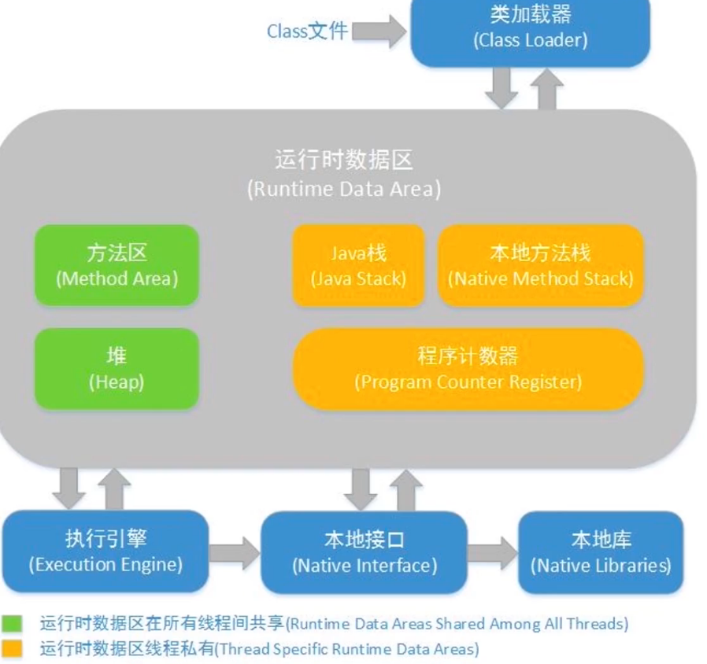

#### 方法区
> 方法区同Java堆一样是被所有线程共享的区间，用于存储已被虚拟机加载的类信息、常量、静态变量、即时编译器编译后的代码。更具体的说，静态变量+常量+类信息（版本、方法、字段等）+运行时常量池存在方法区中。常量池是方法区的一部分。

##### 常量池
> 常量池中存储编译器生成的各种字面量和符号引用。字面量就是Java中常量的意思。比如文本字符串，final修饰的常量等。方法引用则包括类和接口的全限定名，方法名和描述符，字段名和描述符等。**常量池避免了频繁的创建和销毁对象而影响系统性能，其实现了对象的共享。**


###### integer 常量池
> 常规的Integer x = 1;其实是经过了通过Integer.valueOf方法自动装箱，而Integer.valueOf通过IntegerCache完成常量池的缓存
```java
public final class Integer extends Number implements Comparable<Integer> {
	public static Integer valueOf(int i) {
		// -128-127
	    if (i >= IntegerCache.low && i <= IntegerCache.high)
	        return IntegerCache.cache[i + (-IntegerCache.low)];
	    return new Integer(i);
	}
}

private static class IntegerCache {
        static final int low = -128;
        static final int high;
        static final Integer cache[];

        static {
            // high value may be configured by property
            int h = 127;
            String integerCacheHighPropValue =
                sun.misc.VM.getSavedProperty("java.lang.Integer.IntegerCache.high");
            if (integerCacheHighPropValue != null) {
                try {
                    int i = parseInt(integerCacheHighPropValue);
                    i = Math.max(i, 127);
                    // Maximum array size is Integer.MAX_VALUE
                    h = Math.min(i, Integer.MAX_VALUE - (-low) -1);
                } catch( NumberFormatException nfe) {
                    // If the property cannot be parsed into an int, ignore it.
                }
            }
            high = h;

            cache = new Integer[(high - low) + 1];
            int j = low;
            for(int k = 0; k < cache.length; k++)
                cache[k] = new Integer(j++);

            // range [-128, 127] must be interned (JLS7 5.1.7)
            assert IntegerCache.high >= 127;
        }
        private IntegerCache() {}
    }

```


###### String 常量池
> 常规的String str = "x";其实是经过了通过String类中intern方法自动装箱，而intern完成字符串常量池的缓存

> String str = "x";先在栈上创建一个 String 类的对象引用变量 x，然后通过符号引用去字符串常量池中找有没有 "x"，如果没有，则将"x"存放到字符串常量池中，并将栈上的str变量引用指向常量池中的"x"。如果常量池中已经有"x"了，则不会再常量池中创建"x"，而是直接将str引用指向常量池中的"x"。

```java
/**
	返回字符串对象的规范表示。
	字符串池（最初为空）由该类私有维护
	调用intern方法时，如果池中已经包含一个等于此方法确定的对象的字符串，然后返回池中的字符串。 否则，将此对象添加到池中，并返回对该对象的引用。
*/
/**
 * Returns a canonical representation for the string object.
 * <p>
 * A pool of strings, initially empty, is maintained privately by the
 * class {@code String}.
 * <p>
 * When the intern method is invoked, if the pool already contains a
 * string equal to this {@code String} object as determined by
 * the {@link #equals(Object)} method, then the string from the pool is
 * returned. Otherwise, this {@code String} object is added to the
 * pool and a reference to this {@code String} object is returned.
 * <p>
 * It follows that for any two strings {@code s} and {@code t},
 * {@code s.intern() == t.intern()} is {@code true}
 * if and only if {@code s.equals(t)} is {@code true}.
 * <p>
 * All literal strings and string-valued constant expressions are
 * interned. String literals are defined in section 3.10.5 of the
 * <cite>The Java&trade; Language Specification</cite>.
 *
 * @return  a string that has the same contents as this string, but is
 *          guaranteed to be from a pool of unique strings.
 */
    public native String intern();
```

#### 堆
> 堆是Java虚拟机所管理的内存中最大的一块存储区域。堆内存被所有线程共享。主要存放使用new关键字创建的对象。所有对象实例以及数组都要在堆上分配。垃圾收集器就是根据GC算法，收集堆上对象所占用的内存空间（收集的是对象占用的空间而不是对象本身）。

> Java堆分为年轻代（Young Generation）和老年代（Old Generation）；年轻代又分为伊甸园（Eden）和幸存区（Survivor区）；幸存区又分为From Survivor空间和 To Survivor空间。

> 年轻代存储“新生对象”，我们新创建的对象存储在年轻代中。当年轻内存占满后，会触发Minor GC，清理年轻代内存空间。

> 老年代存储长期存活的对象和大对象。年轻代中存储的对象，经过多次GC后仍然存活的对象会移动到老年代中进行存储。老年代空间占满后，会触发Full GC。

> Full GC是清理整个堆空间，包括年轻代和老年代。如果Full GC之后，堆中仍然无法存储对象，就会抛出OutOfMemoryError异常

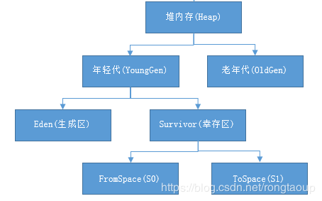

#### java栈
> 线程共享的一块区域，用来存放对象实例的（由于现在有了逃逸分析技术，也可以将对象分配在栈上），该区域是垃圾回收的主要区域，垃圾回收主要是分代回收，有年轻代和老年代，堆可以是物理上不连续的区域，只要逻辑上连续即可。

### java对象模型
> java对象模型是指java类本身的存储模型，jvm会给该类创建一个instanceClass，保存在方法区，用来在JVM层表示该类.当我们在Java代码中，使用new创建一个对象的时候，JVM会创建一个instanceOopDesc对象，这个对象中包含了对象头和是实例数据

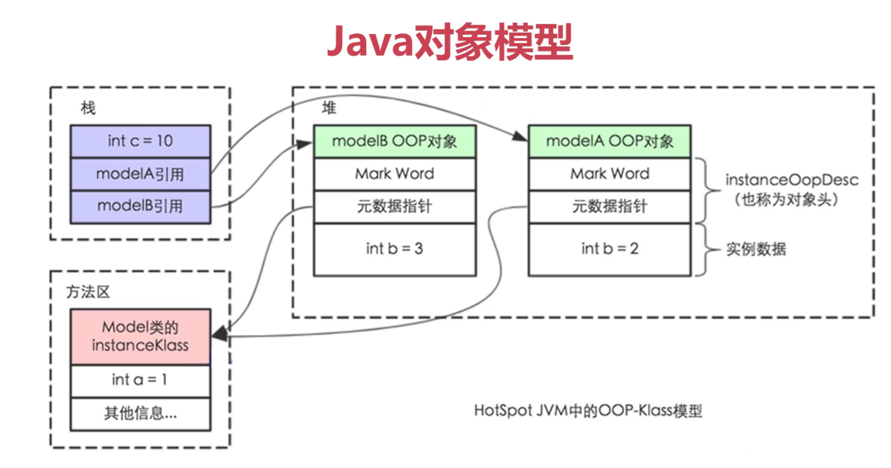

### java内存模型
> 对于java中的内存模型可以参考C语言，C语言不存在内存模型，C语言依赖处理器本身的内存一致性模型，而每个处理器的内存一致性模型不同，这样就导致了很大的问题，如并发安全问题。这种情况下就需要JMM来保证多线程的运行结果可预期。

>JMM是一种规范，需要各个JVM来遵循的规范，以便于开发者来运行这种规范，更方便的开发多线程程序。

>JMM同时也是工具类和关键字的原理，如volatile，synchronized，Lock等关键字的原理，如果没有JMM就需要我们自己指定什么时候使用内存栅栏(工作内存和主内存之间的拷贝和同步)，但是由于有了JMM，我们仅仅需要使用同步工具和关键字就可以开发并发程序。

#### 重排序

```java

/**
 * 描述：演示重排序
 */
public class OutOfOrderExecution {
    private static int x = 0,y = 0;
    private static int a = 0,b = 0;

    public static void main(String[] args) throws InterruptedException {
        int i = 0;
        for (;;)
        {
            i++;
            x = 0;
            y = 0;
            a = 0;
            b = 0;

            CountDownLatch countDownLatch = new CountDownLatch(1);
            Thread one = new Thread(new Runnable() {
                @Override
                public void run() {
                    try {
                        countDownLatch.await();
                    } catch (InterruptedException e) {
                        e.printStackTrace();
                    }
                    a = 1;
                    x = b;
                }
            });
            Thread two = new Thread(new Runnable() {
                @Override
                public void run() {
                    try {
                        countDownLatch.await();
                    } catch (InterruptedException e) {
                        e.printStackTrace();
                    }
                    b = 1;
                    y = a;
                }
            });

            // 第一种情况
    //        one.start();
    //        two.start();
    //        one.join();
    //        two.join();

            // 第二种情况
    //        two.start();
    //        one.start();
    //        one.join();
    //        two.join();

            //第三种情况

            one.start();
            two.start();
            countDownLatch.countDown();
            one.join();
            two.join();

            String result = "第"+i+"次,(x="+x+",y="+y+")";
            if(x ==1 && y==1)
            {
                System.out.println(result);
                break;
            }
            else
            {
                System.out.println(result);
            }
        }
    }
}

```
> 上述代码的运行决定了x,y的最终结果，一共有三种情况:
* a=1,x=b(0),b=1,y=a(1),最终结果x=0,y=1
* b=1,y=a(0),a=1,x=b(1),最终结果x=1,y=0
* b=1,a=1,y=a(1),x=b(1),最终结果x=1,y=1
* 上述仅仅分析了三种情况，还有一种情况是y=a,a=1,x=b,b=1;在更改条件的情况下，确实出现x=0;y=0情况;这里真正发生了重排序

> 重排序：在线程内部代码的实际执行顺序和java文件中的顺序不一致，代码指令并不是严格按照代码语句的执行顺序执行的，他们的顺序被改变了，这就是重排序。

##### 重排序的好处
> 在线程内部的执行顺序不是按照文件代码顺序进行执行的情况下，会出现不可掌控的情况，那为什么还要重排序？重排序的好处主要是提高代码的执行顺序
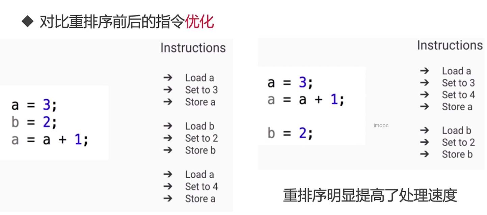

> 重排序的三种情况：
* 编译器优化包括JVM，JIT优化,编译器（包括JVM，JIT编译器等）出于优化的目的（例如当前有了数据a，那么如果把对a的操作放到一起效率会更高，避免了读取b后又返回来重新读取a的时间开销），在编译的过程中会进行一定程度的重排，导致生成的机器指令和之前的字节码的顺序不一致。
* CPU 的优化行为，和编译器优化很类似，是通过乱序执行的技术，来提高执行效率。所以就算编译器不发生重排，CPU 也可能对指令进行重排，所以我们开发中，一定要考虑到重排序带来的后果。
* 内存重排序，内存系统内不存在重排序，但是内存会带来看上去和重排序一样的效果，所以这里的“重排序”打了双引号。由于内存有缓存的存在，在JMM里表现为主存和本地内存，由于主存和本地内存的不一致，会使得程序表现出乱序的行为。


#### 可见性
```java
public class FieldVisiBility {
    int a = 1;
    int b = 2;
    // volatile int a = 1;
    // volatile int b = 2;

    private void print() {
        System.out.println("b="+b+",a="+a);
    }

    private void change() {
        a = 3;
        b = a;
    }

    public static void main(String[] args) {

        while(true)
        {
            FieldVisiBility fieldVisiBility = new FieldVisiBility();
            new Thread(new Runnable() {
                @Override
                public void run() {
                    try {
                        Thread.sleep(1);
                    } catch (InterruptedException e) {
                        e.printStackTrace();
                    }
                    fieldVisiBility.change();
                }
            }).start();
            new Thread(new Runnable() {
                @Override
                public void run() {
                    try {
                        Thread.sleep(1);
                    } catch (InterruptedException e) {
                        e.printStackTrace();
                    }
                    fieldVisiBility.print();
                }
            }).start();
        }

    }
}
```
> 上述代码的运行决定了a,b的最终结果，一共有三种情况:
* a=3,b=2
* a=1,b=2
* a=3,b=3
* b=3,a=1，这种情况是真正发生可见性的问题，线程只能读取到部分的已修改数据

> 由于线程之间只能通过主内存进行通信，而线程将数据写入主内存又需要时间，这便是可见性问题产生的主要原因，可以使用volatile进行处理,volatile修饰的关键字在被线程修改的时候，会将修改的值强制刷入主内存，这样其他线程读取的时候就保证一致，因此解决可见性的问题。

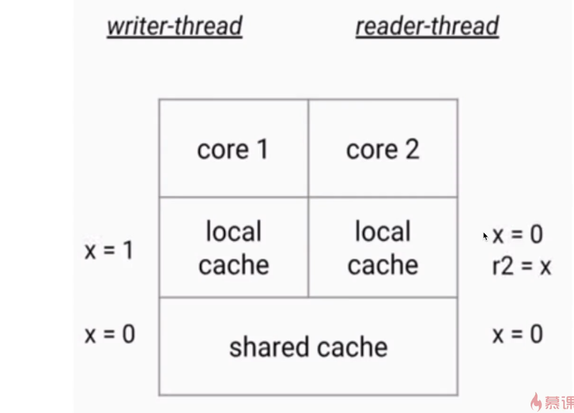

##### 可见性问题分析
* cpu有多级缓存导致读的数据可能会过期
    * 高速缓存的容量比主内存小，但是速度紧次于寄存器，所以cpu和ram之间就多了cache层
    * 线程之间的对于共享变量的可见性问题不是由于多核心直接引起的，而是多级缓存引起的
    * 如果多核心之间都只用一个缓存，那么也不会引起可见性问题。
    * 每一个内核都会将数据读取到独占的缓存当中，数据修改后也是写入到缓存当中，等待刷入主内存，所以会导致有些核心读取的值是一个过期的值

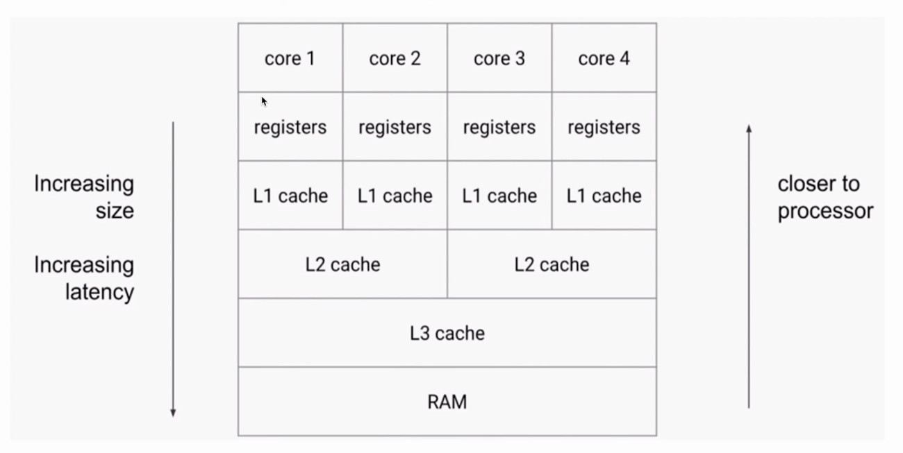

#### JMM抽象
> Java 作为高级语言，屏蔽了CPU多层缓存这些底层细节，用 JMM 定义了一套读写内存数据的规范，虽然我们不再需要关心一级缓存和二级缓存的问题，但是，JMM 抽象了主内存和本地内存的概念。这里说的本地内存并不是真的是一块给每个线程分配的内存，而是 JMM 的一个抽象，是对于寄存器、一级缓存、二级缓存等的抽象。

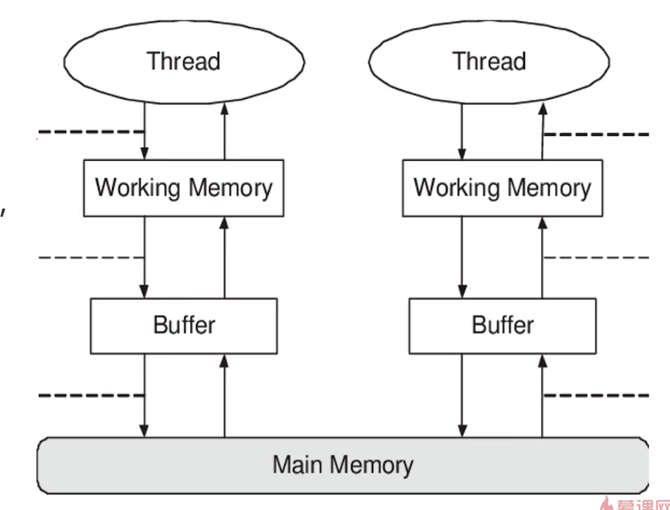

##### 主内存和本地内存的关系
* JMM规定
    * 所有的变量都存储在主内存中，同时每个线程也有自己独立的工作内存，工作内存中的变量内容是主内存中的拷贝
    * 线程不能直接读写主内存中的变量,而是只能操作自己工作内存中的变量，然后再同步到主内存中
    * 主内存是多个线程共享的，但线程间不共享工作内存,如果线程间需要通信，必须借助主内存中转来完成
> 所有的共享变量存在于主内存中，每个线程有自己的本地内存，而且线程读写共享数据也是通过本地内存交换的，所以才导致了可见性问题。

#### happens-before原则
* 什么是happens-before
    * happens-before规则是用来解决可见性问题的：在时间上，动作A发生在动作B之前，B保证能看见A,这就是happens-before
* 不是happens-before
    * 两个线程没有互相配合的机制，所以代码X和Y的执行结果并不能保证总被对方看到，这就不具备happens-before

##### happens-before规则
* 单线程规则:在一个线程之内，后面的语句一定可以看到前面的语句的操作
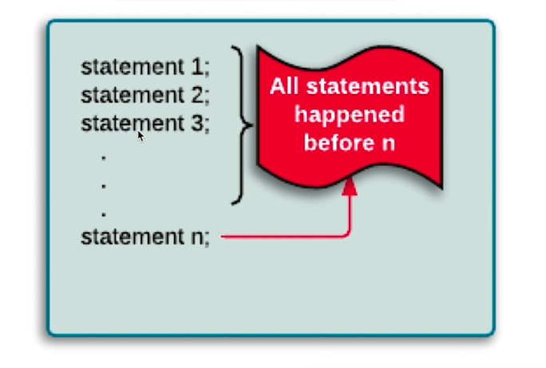
* 锁操作(synchronized和Lock):假设A先抢到锁执行完成，B一定可以看到A所有的操作
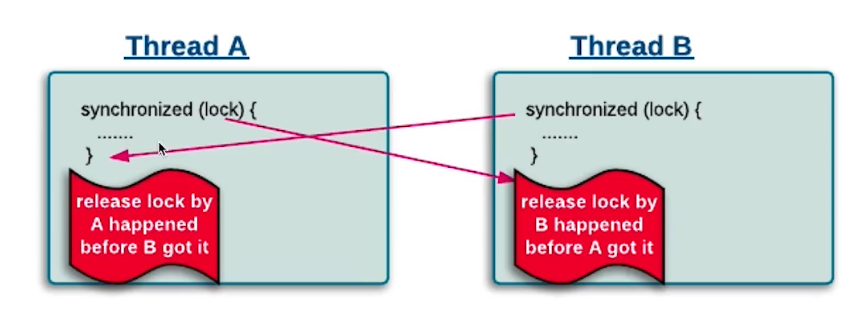
* volatile变量:只要已经写入了被volatile所修饰的变量，就一定能够读取到最新的结果
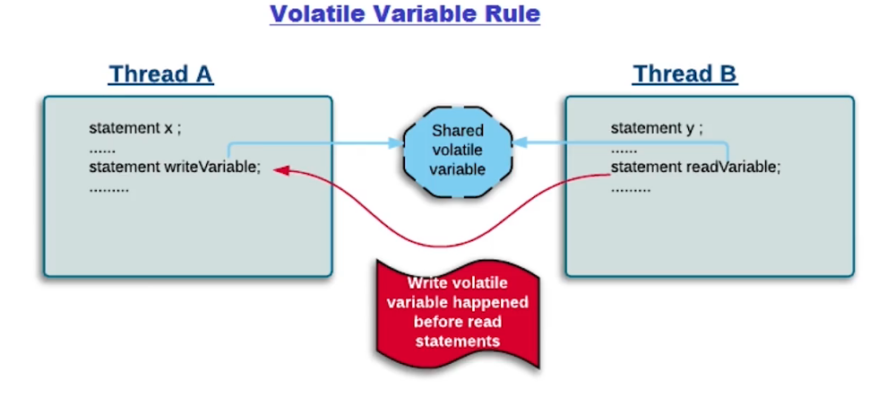
* 线程启动:子线程执行的所有语句都能看到主线程之前所有语句的执行结果
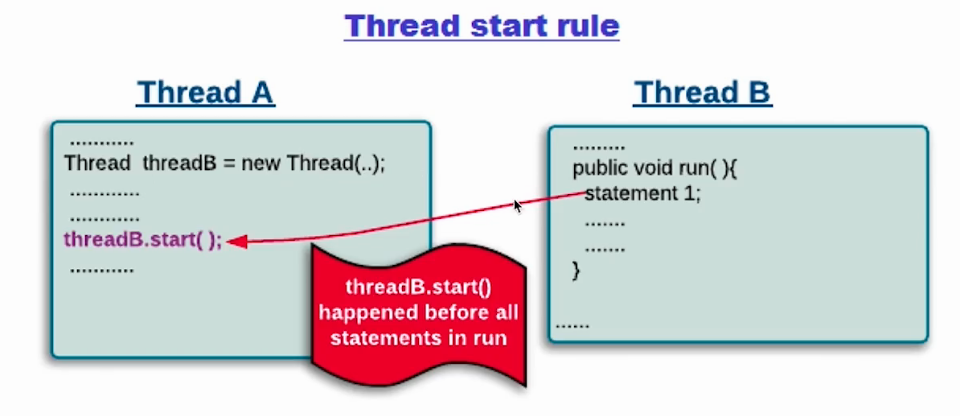
* 线程join:join后面的语句一定可以看到等待线程所执行的所有语句
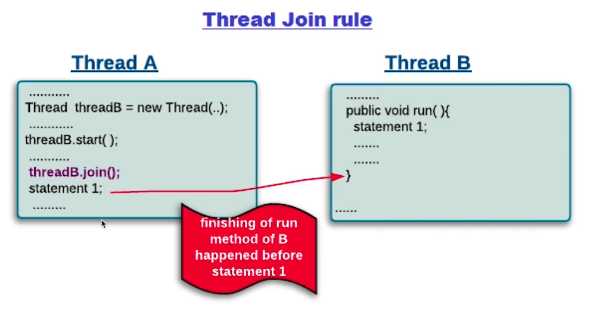
* 传递性:如果hb(A,B)而且hb(B,C),那么可以推出hb(A,C)
* 中断：一个线程被其他线程interrupt,那么检测中断isInterrupted或者抛出InterruptedException一定能看到
* 构造方法：对象构造方法的最后一行语句happens-before于finalize()方法的第一行指令
* 工具类的Happens-before原则
    * 线程安全的容器get一定可以看到之前的put等操作
    * CountDownLatch
    * Semaphore
    * CyclicBarrier
    * Future
    * 线程池

#### volatile
> volatile是一种同步机制，比synchronized或Lock更清量，因为使用volatile并不会发生上下文切换等开销很大的行为

##### volatitle 不适用于a++
```java

/**
 * 描述：不适用于Volatile的情况
 */
public class NoVolatile implements Runnable
{
    volatile int a;
    AtomicInteger realA = new AtomicInteger();

    public static void main(String[] args) throws InterruptedException
    {
        Runnable r = new NoVolatile();
        Thread thred1 = new Thread(r);
        Thread thred2 = new Thread(r);
        thred1.start();
        thred2.start();
        thred1.join();
        thred2.join();
        System.out.println(((NoVolatile) r).a); // 19323

        System.out.println(((NoVolatile) r).realA.get()); //20000
    }

    @Override
    public void run()
    {
        for (int i = 0; i < 10000; i++)
        {
            a++;
            realA.incrementAndGet();
        }
    }
}
 ```
##### volatitle 不适用于boolean flag(依赖之前的状态)
```java
/**
 * 描述：volatile不适用于boolean flag，依赖之前的状态
 */
public class NoVolatile2 implements Runnable
{
    volatile boolean flag = false;
    AtomicInteger realA = new AtomicInteger();

    public static void main(String[] args) throws InterruptedException
    {
        Runnable r = new NoVolatile2();
        Thread thred1 = new Thread(r);
        Thread thred2 = new Thread(r);
        thred1.start();
        thred2.start();
        thred1.join();
        thred2.join();
        System.out.println(((NoVolatile2) r).flag); // true或者是true

        System.out.println(((NoVolatile2) r).realA.get()); //20000
    }

    @Override
    public void run()
    {
        for (int i = 0; i < 10000; i++)
        {
            setDone();
            realA.incrementAndGet();
        }
    }

    private void setDone()
    {
        flag = !flag;
    }
}
```

##### volatitle适用场合
* 使用场合一：boolean flag，如果一个共享变量自始至终只被各个线程赋值，而没有其他操作，那么就可以使用volatile代替synchronized或者代替原子变量，因为赋值自身是有原子性的，而volatile又保证了可见性，所以足以保证线程安全

```java
/**
 * 描述：volatile适用场合
 */
public class VolatileBooleanFlag implements Runnable
{
    volatile boolean flag = false;
    AtomicInteger realA = new AtomicInteger();

    public static void main(String[] args) throws InterruptedException
    {
        Runnable r = new VolatileBooleanFlag();
        Thread thred1 = new Thread(r);
        Thread thred2 = new Thread(r);
        thred1.start();
        thred2.start();
        thred1.join();
        thred2.join();
        System.out.println(((VolatileBooleanFlag) r).flag); // true

        System.out.println(((VolatileBooleanFlag) r).realA.get()); //20000
    }

    @Override
    public void run()
    {
        for (int i = 0; i < 10000; i++)
        {
            setDone();
            realA.incrementAndGet();
        }
    }

    private void setDone()
    {
        flag = true;
    }
}
```

* 使用场合二：作为刷新之前变量的触发器
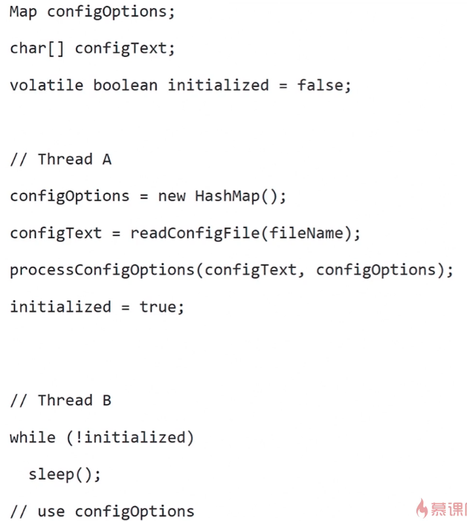

##### volatile作用和synchronized
> 作用：
> * 可见性：读一个volatile变量之前，需要先使相应的本地缓存失效，这样就必须要主内存读取最新值，写一个volatile属性会立即刷入到主内存中
> * 禁止指令重排序优化：解决单例双重锁乱序问题

> volatile和synchronized的关系
> * volatile是一个轻量版的synchronized
> * 实现的作用类似，都是保证线程安全
> * volatile适用场景较少：修饰的变量自始至终被各个线程赋值。没有读取、根据现在的值进行修改等这些情况，那么volatile可以代替synchronized。能保证线程安全的原因是，赋值操作是原子性的，volatile保证了可见性

#### volatile总结
* volatile适用于以下场景：某个属性被多个线程共享，其中有一个线程修改了此属性，其他线程可以立即得到修改后的值，比如boolean flag，或者是作为触发器使用
* volatile 属性的读写操作都是无锁的，它不能代替synchronized，因为它没有提供原子性和互斥性，因为无锁，所以不需要在获取锁和释放锁上花费过多的时间，因此是低成本的
* volatile 只能作为属性，我们用volatile修饰属性，这样compilers就不会对这个属性做指令重排序
* volatile 提供了可见性，任何一个线程对其的修改都可以立刻对其他线程可见，volatile属性不会被线程缓存，始终从主线程读取
* volatile 提供了happens-before保证，对volatile 变量v的happens-before所有其他线程后续对v的读写操作
* volatile 可以使long，double的赋值是原子性的，long，double 本身的赋值并不是原子性

#### 保证可见性的措施
* 除了volatile能够保证变量可见性之外，synchronized，lock，并发集合，Thread.join(),Thread.start()等都可以保证可见性

#### synchronized
* synchronized不仅保证了原子性，还保证了可见性
* synchronized具有连带性，不仅让被保护的代码安全，而且之前的代码同样可以保证可见性

### 原子性
> 原子性：一系列的操作，要么全部成功，要么全部不执行，不出现执行到一半的情况，是不可分割的。

* java中的原子操作有哪些？
    * 除了long和double植之外的基本类型的赋值操作
    * 所有引用reference的赋值操作
    * java.concurrent.Atomic.*

> double和long为什么不是原子性？<br/>
long和double值的单个写入被视为两个单独的写入，每个32位写一半。这可能导致线程从一次写入看到64位值的钱32位，而从另一次写入看到第二次32位的情况,在商用虚拟机上已经保证了long和double写入的原子性

> 原子操作的组合<br/>
原子操作+原子操作 != 原子操作

> 全新的hashMap也并不是完全安全，比如读取-判断-写入，这三个操作都是原子性的，但是当组合在一起的时候，按照原子操作+原子操作 != 原子操作原则，整个原子组合操作并不是原子性的，因此需要小心线程安全问题

## 单例模式和JMM
> 单例模式是指在整个系统中仅仅存在一个实例，单例模式可以节省内存和计算，保证结果正确，因为只有一个实例方便管理
* 单例模式使用场景：
    * 无状态工具类，比如日志工具类，不管在哪里使用，我们需要的只是帮助我们记录日志。
    * 全局信息类，比如在一个类上记录网站的访问次数，类似于计数器

### 饿汉式(静态常量)[可用]
```java
/**
 * 描述：饿汉式(静态常量)
 */
public class Singleton1
{
    // static 保证类在加载的时候将instance实例化，避免了多线程的同步问题
    private final static Singleton1 instance = new Singleton1();
    private Singleton1(){}
    public Singleton1 getInstance()
    {
        return instance;
    }
}
```
### 饿汉式(静态代码块)[可用]
```java
/**
 * 描述：饿汉式(静态常量)
 */
public class Singleton2
{
    private final static Singleton2 instance;
    static {
        instance = new Singleton2()
    }
    private Singleton2(){}
    public Singleton2 getInstance()
    {
        return instance;
    }
}

```
### 懒汉式(线程不安全)[不可用]
```java
/**
 * 描述：懒汉式(线程不安全)
 */
public class Singleton3
{
    private static Singleton3 instance;
    private Singleton3(){};

    public static Singleton3 getInstance()
    {
        if(instance == null)
            instance = new Singleton3();
        return instance;
    }
}
```
### 懒汉式(线程安全，同步方法)[不推荐使用]
```java
/**
 * 描述：懒汉式(线程安全，同步方法) 效率低下
 */
public class Singleton4
{
    private static Singleton4 instance;
    private Singleton4(){};

    public synchronized static Singleton4 getInstance()
    {
        if(instance == null)
            instance = new Singleton4();
        return instance;
    }
}
```
### 懒汉式(双重检查)
```java
public class Singleton5
{
    private volatile static Singleton5 instance;
    private Singleton5(){};

    public static Singleton5 getInstance()
    {
        if(instance == null)
            synchronized (Singleton5.class)
            {
                if(instance == null)
                {
                    // new Singleton5()，对象的创建不具备原子性，
                    // 这里分为三个步骤：1，创建空对象，2，调用构造方法，3,引用赋值给instance，这里可能会发生重排序的问题，导致后面调用发生NPE，使用volatile关键字来防止重排序
                    instance = new Singleton5();
                }
            }
        return instance;
    }
}
```
### 懒汉式(静态内部类)
```java
/**
 * 描述：静态内部类的方式实现懒汉式
 */
public class Singleton6
{
    private Singleton6(){}
    private static class SingletonInstance
    {
        private static final Singleton6 INSTANCE = new Singleton6();
    }
    public static Singleton6 getInstance()
    {
        return SingletonInstance.INSTANCE;
    }
}
```

### 懒汉式(枚举)
> 枚举类在反编译之后是一个final class，并且继承Enum，并且各个实例都是通过static来定义的，在这种情况下，第一次使用的时候才会被加载进来，并且具备一个其他方法都不具备的优势**避免反序列化破坏单例**
```java
public enum Singleton7
{
    INSTANCE;
    public void method(){}
}

```