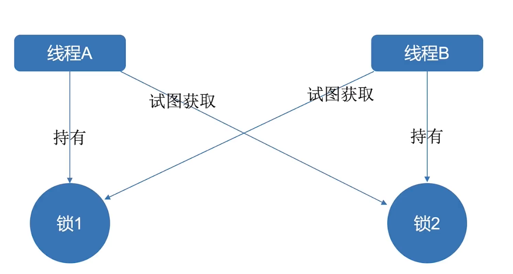
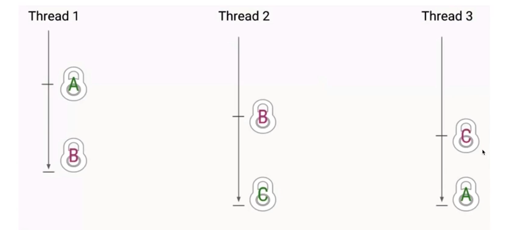
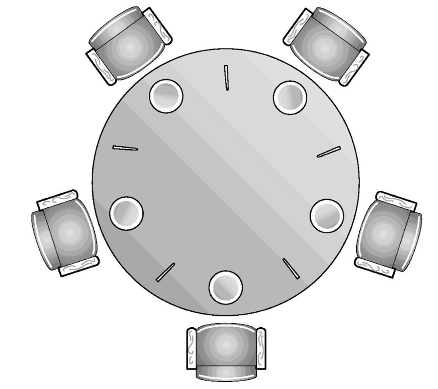

# 死锁问题
---

## 死锁概述
> 在多线程情况下，当两个或多个线程互相持有对方的所需要的资源，又不主动释放，导致所有线程都无法继续执行，导致线程进入无尽等待，这就是死锁。



### 多个线程造成死锁的情况
> 如果多个线程之间的依赖关系是环形，存在环路的锁的 依赖关系，那么也可能会发生死锁



### 死锁的影响
> 死锁在不同的系统中是不同的，这取决于系统对死锁的处理能力.在数据库中，如果发生死锁，InnoDB 目前处理死锁的方站是, 将持有最少行级排他锁的事务进行回攘(这是相对比较简单的死锁回滚算法)。而JVM并不会对死锁进行自动处理

* 死锁一旦发生，多是高并发场景，影响用户多
* 死锁会造成整个系统崩溃，子系统崩溃，性能降低
* 压力测试或的单元测试无法找出所有的死锁

## 死锁示例

```java
/**
 * 描述：必然死锁
 */
public class MustDeadlock implements Runnable
{
    int flag = 1;

    private static Object o1 = new Object();
    private static Object o2 = new Object();

    public static void main(String[] args)
    {
        MustDeadlock r1 = new MustDeadlock();
        MustDeadlock r2 = new MustDeadlock();

        r1.flag = 1;
        r2.flag = 2;

        new Thread(r1).start();
        new Thread(r2).start();
    }

    @Override
    public void run()
    {
        if(flag == 1)
        {
            synchronized (o1)
            {
                try
                {
                    Thread.sleep(500);
                }
                catch (InterruptedException e)
                {
                    e.printStackTrace();
                }
                synchronized (o2)
                {
                    System.out.println("线程1成功拿到两把锁");
                }
            }
        }
        if(flag == 2)
        {
            synchronized (o2)
            {
                try
                {
                    Thread.sleep(500);
                }
                catch (InterruptedException e)
                {
                    e.printStackTrace();
                }
                synchronized (o1)
                {
                    System.out.println("线程2成功拿到两把锁");
                }
            }
        }
    }
}
```

```java
/**
 * 描述：转账示例产生死锁
 */
public class TransferMoney implements Runnable
{
    int flag = 1;
    
    static Account a = new Account(500);
    static Account b = new Account(500);

    public static void main(String[] args) throws InterruptedException
    {
        TransferMoney r1 = new TransferMoney();
        TransferMoney r2 = new TransferMoney();

        r1.flag = 1;
        r2.flag = 2;
        Thread t1 = new Thread(r1);
        Thread t2 = new Thread(r2);
        t1.start();
        t2.start();
        t1.join();
        t2.join();
        System.out.println("a的余额"+a.balance);
        System.out.println("b的余额"+b.balance);

    }

    @Override
    public void run()
    {
        if(flag == 1)
        {
            tansfer(a,b,200);
        }
        if(flag == 2)
        {
            tansfer(b,a,200);
        }
    }

    private void tansfer(Account from, Account to, int amount)
    {
        synchronized (from)
        {
//            try
//            {
//                Thread.sleep(500);
//            }
//            catch (InterruptedException e)
//            {
//                e.printStackTrace();
//            }

            synchronized (to)
            {
                if(from.balance - amount < 0)
                {
                    System.out.println("余额不足");
                }
                from.balance-=amount;
                to.balance+=amount;
                System.out.println("成功转账，转账"+amount);
            }
        }
    }

    static class Account
    {
        int balance;

        public Account(int balance)
        {
            this.balance = balance;
        }

    }
}
```

```java

/**
 * 描述：多人随机转账
 */
public class MultiTransferMoney
{

    private static final int NUM_ACCOUNTS = 500;
    private static final int NUM_MONEY = 1000;
    private static final int NUM_ITERATIONS = 10000;
    private static final int NUM_THREAD = 20;

    public static void main(String[] args)
    {
        Random random = new Random();
        TransferMoney.Account[] accounts = new TransferMoney.Account[NUM_ACCOUNTS];
        for (int i=0;i<accounts.length;i++)
        {
            accounts[i] = new TransferMoney.Account(NUM_MONEY);
        }
        class TransferThread extends Thread{
            @Override
            public void run()
            {
                for (int i=0;i<NUM_ITERATIONS;i++)
                {
                    int fromAccount = random.nextInt(NUM_ACCOUNTS);
                    int toAccount = random.nextInt(NUM_ACCOUNTS);
                    int amount = random.nextInt(NUM_MONEY);

                    TransferMoney.tansfer(accounts[fromAccount],accounts[toAccount],amount);
                }
            }
        }
        for (int i=0;i<NUM_THREAD;i++)
        {
            new TransferThread().start();
        }

    }
}
```

### 死锁发生的必要条件
* 互斥条件：一个资源每一次只能被同一个线程或进程使用
* 请求与保持条件：一个线程去请求第二把锁，但是同时也保持第一把锁
* 不剥夺条件：死锁发生的时候不能有第三方介入
* 循环等待：多个线程之间不构成环路等待

## 排查死锁
### jstack命令
```shell
[manjaro@manjaro-pc ~]$ ${JAVA_HOME}/bin/jps 
5936 Launcher
5938 MultiTransferMoney
5271 KotlinCompileDaemon
4872 Main
6010 Jps

[manjaro@manjaro-pc ~]$ ${JAVA_HOME}/bin/jstack 5938
...
Found one Java-level deadlock:
=============================
"Thread-1":
  waiting to lock monitor 0x00007facd40064b8 (object 0x000000076cab1ac0, a java.lang.Object),
  which is held by "Thread-0"
"Thread-0":
  waiting to lock monitor 0x00007facd4002418 (object 0x000000076cab1ad0, a java.lang.Object),
  which is held by "Thread-1"

Java stack information for the threads listed above:
===================================================
"Thread-1":
        at com.company.deadlock.MustDeadlock.run(MustDeadlock.java:60)
        - waiting to lock <0x000000076cab1ac0> (a java.lang.Object)
        - locked <0x000000076cab1ad0> (a java.lang.Object)
        at java.lang.Thread.run(Thread.java:748)
"Thread-0":
        at com.company.deadlock.MustDeadlock.run(MustDeadlock.java:42)
        - waiting to lock <0x000000076cab1ad0> (a java.lang.Object)
        - locked <0x000000076cab1ac0> (a java.lang.Object)
        at java.lang.Thread.run(Thread.java:748)

Found 1 deadlock.
```
### ThreadMXBean
```java

/**
 * 描述：使用 ThreadMXBean 检测死锁
 */
public class ThreadMXBeanDetection implements Runnable
{
    int flag = 1;

    private static Object o1 = new Object();
    private static Object o2 = new Object();

    public static void main(String[] args) throws InterruptedException
    {
        ThreadMXBeanDetection r1 = new ThreadMXBeanDetection();
        ThreadMXBeanDetection r2 = new ThreadMXBeanDetection();

        r1.flag = 1;
        r2.flag = 2;

        new Thread(r1).start();
        new Thread(r2).start();

        Thread.sleep(1000);

        //检测死锁
        ThreadMXBean mxBean = ManagementFactory.getThreadMXBean();
        long[] deadlockedThreads = mxBean.findDeadlockedThreads();
        if(deadlockedThreads != null && deadlockedThreads.length > 0)
        {
            for (int i = 0; i < deadlockedThreads.length; i++)
            {
                ThreadInfo threadInfo = mxBean.getThreadInfo(deadlockedThreads[i]);
                String threadName = threadInfo.getThreadName();
                System.out.println("发现死锁:"+threadName);
            }
        }
    }

    @Override
    public void run()
    {
        if (flag == 1)
        {
            synchronized (o1)
            {
                try
                {
                    Thread.sleep(500);
                }
                catch (InterruptedException e)
                {
                    e.printStackTrace();
                }
                synchronized (o2)
                {
                    System.out.println("线程1成功拿到两把锁");
                }
            }
        }
        if (flag == 2)
        {
            synchronized (o2)
            {
                try
                {
                    Thread.sleep(500);
                }
                catch (InterruptedException e)
                {
                    e.printStackTrace();
                }
                synchronized (o1)
                {
                    System.out.println("线程2成功拿到两把锁");
                }
            }
        }
    }
}

```

## 死锁处理
### 死锁避免策略
> **死锁避免策略是避免相反的获取锁的顺序**

```java
public class TransferMoney2 implements Runnable
{
    int flag = 1;

    static TransferMoney2.Account a = new TransferMoney2.Account(500);
    static TransferMoney2.Account b = new TransferMoney2.Account(500);
    static Object lock = new Object();

    public static void main(String[] args) throws InterruptedException
    {
        TransferMoney2 r1 = new TransferMoney2();
        TransferMoney2 r2 = new TransferMoney2();

        r1.flag = 1;
        r2.flag = 2;
        Thread t1 = new Thread(r1);
        Thread t2 = new Thread(r2);
        t1.start();
        t2.start();
        t1.join();
        t2.join();
        System.out.println("a的余额"+a.balance);
        System.out.println("b的余额"+b.balance);

    }

    @Override
    public void run()
    {
        if(flag == 1)
        {
            tansfer(a,b,200);
        }
        if(flag == 2)
        {
            tansfer(b,a,200);
        }
    }

    public static void tansfer(TransferMoney2.Account from, TransferMoney2.Account to, int amount)
    {
        class Helper{
            public void transfer(){
                if(from.balance - amount < 0)
                {
                    System.out.println("余额不足");
                }
                from.balance-=amount;
                to.balance+=amount;
                System.out.println("成功转账，转账"+amount);
            }
        }

        // 这里通过 对象的hash的大小来保证获取锁的顺序固定
        // 实际开发中可以使用主键，这样可以保证不会发生hash碰撞
        int fromHash = System.identityHashCode(from);
        int toHash = System.identityHashCode(to);
        if(fromHash < toHash)
        {
            synchronized (from)
            {
                synchronized (to)
                {
                   new Helper().transfer();
                }
            }
        }
        else if(fromHash > toHash)
        {
            synchronized (to)
            {
                synchronized (from)
                {
                    new Helper().transfer();
                }
            }
        }
        else{
            // 这里避免hash碰撞
            synchronized (lock)
            {
                synchronized (to)
                {
                    synchronized (from){
                        new Helper().transfer();
                    }
                }
            }
        }
    }

    static class Account
    {
        int balance;
        public Account(int balance)
        {
            this.balance = balance;
        }
    }
}

```
## 哲学家就餐问题

>死锁：每个哲学家都拿着左侧(或右侧)的筷子，所有人都等待其他人放弃筷子，这样就产生了环形依赖，导致死锁的发生

```java

/**
 * 描述：演示哲学家就餐的问题
 */
public class DiningPhilosophers
{
    public static void main(String[] args)
    {
        Philosopher[] philosophers = new Philosopher[5];
        Object[] chopsticks = new Object[philosophers.length];

        for (int i = 0; i <chopsticks.length ; i++)
        {
            chopsticks[i] = new Object();
        }
        for (int i = 0; i <philosophers.length ; i++)
        {
            Object leftChopstick = chopsticks[i];
            Object rightChopstick = chopsticks[(i+1)%chopsticks.length];
            philosophers[i] = new Philosopher(leftChopstick,rightChopstick);

            new Thread(philosophers[i],"哲学家"+(i+1)+"号").start();
        }
    }
    public static class Philosopher implements Runnable
    {
        private Object leftChopstick;
        private Object rightChopstick;

        public Philosopher(Object leftChopstick, Object rightChopstick)
        {
            this.leftChopstick = leftChopstick;
            this.rightChopstick = rightChopstick;
        }

        @Override
        public void run()
        {
            try
            {
                while (true)
                {
                    doAction("Thinking");
                    synchronized (leftChopstick)
                    {
                        doAction("Picked up left chopstick");
                        synchronized (rightChopstick)
                        {
                            doAction("Picked up right chopstick - eating");
                            doAction("Put down right chopstick");
                        }
                        doAction("Put down left chopstick");
                    }
                }
            }
            catch (InterruptedException e)
            {
                e.printStackTrace();
            }
        }

        private void doAction(String action) throws InterruptedException
        {
            System.out.println(Thread.currentThread().getName() + "," + action);
            Thread.sleep((long) Math.random() * 10);
        }
    }
}
```
```shell
哲学家1号,Thinking
哲学家2号,Thinking
哲学家3号,Thinking
哲学家4号,Thinking
哲学家5号,Thinking
哲学家3号,Picked up left chopstick
哲学家1号,Picked up left chopstick
哲学家5号,Picked up left chopstick
哲学家2号,Picked up left chopstick
哲学家4号,Picked up left chopstick
```

### 哲学家就餐问题解决方案
- 改变一个哲学家拿叉子的顺序（避免策略），类似于银行转账
- 餐票（避免策略）
- 服务员检查（避免策略 ）
- 领导调节 （检测与恢复策略）（破块了死锁的不可剥夺条件）

#### 改变一个哲学家拿叉子的顺序(优先推荐)
```java
...
for (int i = 0; i <philosophers.length ; i++)
{
    Object leftChopstick = chopsticks[i];
    Object rightChopstick = chopsticks[(i+1)%chopsticks.length];
    // 改变最后一个哲学家拿筷子的顺序，避免死锁发生的条件，环形依赖
    if(i==philosophers.length-1)
    {
        philosophers[i] = new Philosopher(rightChopstick,leftChopstick);
    }
    else
    {
        philosophers[i] = new Philosopher(leftChopstick,rightChopstick);
    }

    new Thread(philosophers[i],"哲学家"+(i+1)+"号").start();
}
...
```

## 实际工作中如何避免死锁
- 设置超时时间
	- lock的tryLock(long timeout, TimeUnit unit)
- 多使用并发类而不是自己设计锁
    - ConcurrentHashMap、ConcurrentLinkedQueue、AtomicBoolean等
- 降低锁使用的粒度：用不同的锁而不是一个锁
- 使用synchronized的时候，尽量使用同步代码块
- 给线程取名，便于debug排查问题
- 避免锁的嵌套
- 分配资源前看看能不能收回
- 尽量不要几个功能使用同一把锁：专锁专用

```java
/**
 * 描述：使用tryLock避免死锁
 */
public class TryLockDeadlock implements Runnable
{
    int flag = 1;
    static Lock lock1 = new ReentrantLock();
    static Lock lock2 = new ReentrantLock();

    public static void main(String[] args)
    {
        TryLockDeadlock r1 = new TryLockDeadlock();
        TryLockDeadlock r2 = new TryLockDeadlock();
        r1.flag = 1;
        r1.flag = 2;
        new Thread(r1).start();
        new Thread(r2).start();

    }

    @Override
    public void run()
    {
        for (int i = 0; i < 100; i++)
        {
            if (flag == 1)
            {
                try
                {
                    if (lock1.tryLock(800, TimeUnit.MILLISECONDS))
                    {
                        if (lock2.tryLock(800, TimeUnit.MILLISECONDS))
                        {
                            System.out.println(Thread.currentThread().getName()+"成功获取到两把锁");
                            lock2.unlock();
                            lock1.unlock();
                            break;
                        }
                        else
                        {
                            System.out.println(Thread.currentThread().getName()+"获取锁2失败");
                            lock1.unlock();
                            Thread.sleep(new Random().nextInt(1000));
                        }
                    }
                    else
                    {
                        System.out.println(Thread.currentThread().getName()+"获取锁1失败");
                    }
                }
                catch (InterruptedException e)
                {
                    e.printStackTrace();
                }
            }
            if (flag == 2)
            {
                try
                {
                    if (lock2.tryLock(800, TimeUnit.MILLISECONDS))
                    {
                        if (lock1.tryLock(800, TimeUnit.MILLISECONDS))
                        {
                            System.out.println(Thread.currentThread().getName()+"成功获取到两把锁");
                            lock1.unlock();
                            lock2.unlock();
                            break;
                        }
                        else
                        {
                            System.out.println(Thread.currentThread().getName()+"获取锁1失败");
                            lock2.unlock();
                            Thread.sleep(new Random().nextInt(1000));
                        }
                    }
                    else
                    {
                        System.out.println(Thread.currentThread().getName()+"获取锁2失败");
                    }
                }
                catch (InterruptedException e)
                {
                    e.printStackTrace();
                }
            }
        }
    }
}
```
## 活锁
> 死锁是常见的活跃性问题，不过除了死锁以外还有活锁，饥饿，会导致程序无法正常执行，统称为活跃性问题

- 线程没有堵塞，始终在运行，但是程序得不到进展，重复做同样的事情
- 与死锁效果一样，但是如果发生死锁，线程是堵塞状态。活锁不会堵塞，会更加耗费CPU资源。