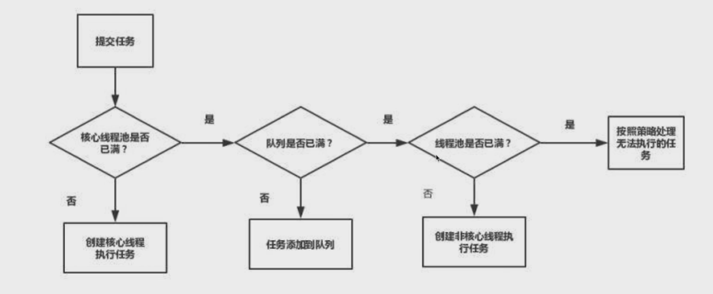
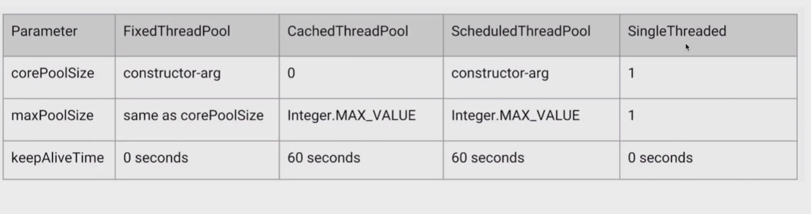
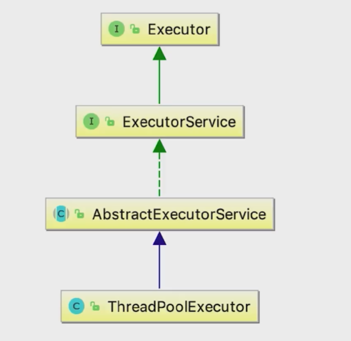

# 线程池-治理线程
---

## 线程池介绍

### 为什么使用线程池

> 如果不使用线程池，每个任务都单开一个线程，在某种意义上可行的，不过当任务数量过多的情况会引发两个问题：
> - jvm对线程的数量是有要求的,过多的线程占用太多内存
> - 频繁的创建线程和销毁线程成本过高
    > 线程池就就是使用少量的线程，避免内存占用过高；让部分线程一直保持工作，且反复执行任务，避免生命周期的损耗

### 线程池的好处

- 通过避免频繁的创建和销毁，加快响应速度
- 合理的利用CPU和内存
- 统一分配和管理线程

### 线程池的使用场景

> - 服务器接收到大量请求时，使用线程池的技术是合适的，它可以大大减少线程的创建和销毁次数，提高服务器的运行效率
> - 在实际开发中，如果需要创建5个以上的线程时就需要使用线程池

## 增减线程的时机

> maximumPoolSize和maxPoolSize的含义相同，不做额外区分。
> 实际上，在ThreadPoolExecutor类的参数中，变量名是maximumPoolSize；
> 不过在org.springframework.scheduling.concurrent包的ThreadPoolExecutorFactoryBean类等其他类中，
> 也有使用maxPoolSize作为参数名的情况，我们直接理解为maximumPoolSize和maxPoolSize是相同的就可以了。

### 线程池构造函数

参数名称|类型|含义 
-|-|- 
corePoolSize|int|核心线程数 
maxPoolSize|int|最大线程数量 
workQueue|BlockingQueue|任务存储队列
keepAliveTime|long|保持队列存活时间 
threadFactory|ThreadFactory|当线程池需要新的线程的时候，会使用threadFactory来生成新的线程
Handler|RejectedExecutionHandler|由于线程池无法接收你所提交的任务时的拒绝策略

#### corePoolSize 和 maxPoolSize

> corePoolSize指的是核心线程数：线程池完成初始化之后，默认情况下，线程池中并没有任何线程，线程池会等待有任务来时再去创建新线程执行任务
> 线程池有可能在核心线程数的基础上，额外增加一些线程，但是这些新增加的线程是有一个上限，就是最大量maxPoolSize


##### 添加线程规则

- 如果线程数小于corePoolSize,即使其他工作线程处于空闲状态，也会创建一个新的线程来运行新任务
- 如果线程数量小于或大于corePoolSize,同时少于maxinumPoolSize，则会将任务放入队列中
- 如果队列已经满了，并且线程数量小于maxPoolSize，则会创建一个新的线程来运行任务
- 如果队列已经满了，并且线程数量大于maxPoolSize，则拒绝该任务



> 增加线程的判断顺序: corePoolSize,workQueue,maxPoolSize

##### 增减线程的特点

- 通过设置相同的corePoolSize和maximumPoolSize，就可以创建固定大小的线程池
- 线程池希望保持较少的线程数量，并且只有在负载变得很大的时候，才会增加线程
- 通过设置maximumPoolSize为很高的值，例如Integer.MAX_VALUE,可以允许线程池容纳任意数量的并发任务
- 只有在队列填满的时，才会创建多于corePoolSize的线程，所以如果你使用的是无界队列，例如LinkedBlockingQueue,那么线程数量就不会超过corePoolSize

##### keepAliveTime 和 ThreadFactory

- 如果线程池当前的线程数多余corePoolSize，那么多余的线程空闲时间超过KeepAliveTime，他们就会被终止
- 新的线程是由ThreadFactory创建的，默认是Exectors.defauultThreadFactory()创建出来的线程都在同一个线程组,拥有相同的NORMAL_PRIORITY优先级，并且都不是守护线程
  .如果自己指定ThreadFactory,那么就可以改变线程名称、线程组、线程优先级、是否是守护线程

```java
 static class DefaultThreadFactory implements ThreadFactory {
    private static final AtomicInteger poolNumber = new AtomicInteger(1);
    private final ThreadGroup group;
    private final AtomicInteger threadNumber = new AtomicInteger(1);
    private final String namePrefix;

    DefaultThreadFactory() {
        SecurityManager s = System.getSecurityManager();
        group = (s != null) ? s.getThreadGroup() :
                Thread.currentThread().getThreadGroup();
        namePrefix = "pool-" +
                poolNumber.getAndIncrement() +
                "-thread-";
    }

    public Thread newThread(Runnable r) {
        Thread t = new Thread(group, r,
                namePrefix + threadNumber.getAndIncrement(),
                0);
        if (t.isDaemon())
            t.setDaemon(false);
        if (t.getPriority() != Thread.NORM_PRIORITY)
            t.setPriority(Thread.NORM_PRIORITY);
        return t;
    }
}
```

##### workQueue 工作队列

- 直接交换: SynchronousQueue，该任务队列不会存储任务，在实际使用中maxPoolSize需要大一点
- 无界队列: LinkedBlockingQueue，使用该队列意味着maxPoolSize失效,当处理的速度跟不上任务提交的速度情况下,容易发生OOM异常
- 有界队列: ArrayBlockingQueue

## 线程池用法演示

### newFixedThreadPool

```java
public class FixedThreadPoolTest {
    public static void main(String[] args) {
        Runnable task = () -> {
            System.out.println(Thread.currentThread().getName());
        };

        ExecutorService executorService = Executors.newFixedThreadPool(4);
        for (int i = 0; i < 1000; i++) {
            executorService.submit(task);
        }
    }
}
```

```java
public class Executors {
    public static ExecutorService newFixedThreadPool(int nThreads) {
        // corePoolSize = nThreads，maxPoolSize = nThreads, 该线程池实际上是固定大小的线程池
        // keepAlive = 0L 是无意义的
        // LinkedBlockingQueue 无界队列
        return new ThreadPoolExecutor(nThreads, nThreads, 0L, TimeUnit.MILLISECONDS, new LinkedBlockingQueue<Runnable>());
    }
}
```

> 由于是使用LinkedBlockingQueue是没有容量限制的,所以当请求数量越来越多,并且无法及时处理的时候，也就是请求堆积的时候，会容易造成大量的内存占用，容易OOM

```java
public class FixedThreadPoolOOMTest {

    public static void main(String[] args) {
        Runnable task = () -> {
            try {
                Thread.sleep(10000 * 10000);
            } catch (InterruptedException e) {
                e.printStackTrace();
            }
        };
        ExecutorService executorService = Executors.newFixedThreadPool(1);
        for (int i = 0; i < Integer.MAX_VALUE; i++) {
            executorService.submit(task);
        }
    }
}
```

### newSingleThreadExecutor

```java
public class Executors {
    public static ExecutorService newSingleThreadExecutor(ThreadFactory threadFactory) {
        // 只有一个线程在执行的无界线程池
        return new FinalizableDelegatedExecutorService
                (new ThreadPoolExecutor(1, 1, 0L, TimeUnit.MILLISECONDS, new LinkedBlockingQueue<Runnable>(), threadFactory));
    }
}
```

> 可以看出，和newFixedThreadPool原理基本一致,只不过直接把线程的coreSize 和maxPoolSize设置为1，这也会导致同样的问题，就是当请求堆积的时候，可能会占用大量内存

### newCachedThreadPool

```java
public class Executors {
    public static ExecutorService newCachedThreadPool(ThreadFactory threadFactory) {
        //coreSize =0，maxPoolSize=Integer.MAX_VALUE
        // keepAlive 为 60秒
        // 使用直接交换队列，无缓存
        return new ThreadPoolExecutor(0, Integer.MAX_VALUE, 60L, TimeUnit.SECONDS, new SynchronousQueue<Runnable>(), threadFactory);
    }
}
```

```java
public class CachedThreadPoolTest {
    public static void main(String[] args) {
        Runnable task = () -> {
            System.out.println(Thread.currentThread().getName());
        };
        ExecutorService executorService = Executors.newCachedThreadPool(Executors.defaultThreadFactory());
        for (int i = 0; i < Integer.MAX_VALUE; i++) {
            executorService.submit(task);
        }
    }
}
```

> 这种线程池设置corePoolSize为0,maxPoolSize为Integer.MAX_VALUE,代表线程池本身不会初始化线程，会不停的创建线程。但是通过keepAlive设置时间来销毁线程，当线程数量特别多的情况下，会OOM

### newScheduledThreadPool

> 支持定时和周期性的执行任务

```java
public class ScheduledThreadPoolTest {
    public static void main(String[] args) {
        Runnable task = () -> {
            System.out.println(Thread.currentThread().getName());
        };
        ScheduledExecutorService executorService = Executors.newScheduledThreadPool(5, Executors.defaultThreadFactory());

        // 固定时间后执行1次,5秒钟后执行
        // executorService.schedule(task,5, TimeUnit.SECONDS);

        // 固定频率运行 最开始1秒钟，然后每隔3秒钟执行任务
        executorService.scheduleAtFixedRate(task, 1, 3, TimeUnit.SECONDS);
    }
}
```

### 线程池里线程的数量设置多少比较合适?

- cpu密集型(加密,计算),最佳线程数量为CPU数量的1-2倍
- 耗时IO型(读写数据库，文件，网络读写): 最佳线程数量一般大于cpu核心数量的很多倍,以JVM线程监控显示繁忙为标准，保证线程空闲可以衔接上,参数Brain Goetz推荐的计算方法: 线程数量 = cpu核心数*(
  1+平均等待时间/平均工作时间)

### 线程池比对

- FixedThreadPool,固定数量的线程池
- CacheThreadPool,可缓存并可回收的线程池
- ScheduledThreadPool,周期执行的线程池，替代定时器
- SingleThreadExector, 单线程的线程池，只有唯一的线程运行工作



### 线程池的阻塞队列分析

> FixedTrehadPool和SingleThreadExector的Queue是LinkedBlockingQueue？ 固定线程池和单一线程线程池,本身是无法通过maxPoolSize来扩容，因此只能通过Queue来做存储

> CachedThreadPool 使用的是Queue是SynchronousQueue? 可缓存可回收线程池可以通过maxPoolSize来实现立即执行，及有任务就直接给线程执行，不需要走队列缓存。

> ScheduledThreadPool 使用的是延迟队列DelayedWorkQueue

> workStrealingPool(是JDK1.8加入的),这种队列适合有子任务的，并且有窃取的能力，注意:(使用时尽量不要加锁,由于窃取导致执行结果无序)

## 线程池关闭

- shutdown,线程池中正在执行以及正在等待的任务执行完成之后，才会关闭线程池。但是不会接收新的任务，会执行拒绝操作
- isShutdown,线程池是否进入关闭状态
- isTerminated,线程池是否真的运行结束
- awaitTermination，多少时间内线程执行完成,该方法为阻塞方法，只有三种情况下为true,（所有任务执行完毕、等待对的时间到了、等待期间被打断了抛出中断异常）
- showDownNow,立刻把线程池关闭，对于正在运行的线程,发送中断信号;正在队列中等待的线程会直接返回

```java
public class ShutDownTest {
    public static void main(String[] args) throws InterruptedException {

        Runnable task = () -> {
            try {
                Thread.sleep(500);
            } catch (InterruptedException e) {
                System.out.println(Thread.currentThread().getName() + ": 线程收到中断信号");
                e.printStackTrace();
            }
            System.out.println(Thread.currentThread().getName());
        };

        ExecutorService executorService = Executors.newFixedThreadPool(10);
        for (int i = 0; i < 1000; i++) {
            executorService.submit(task);
        }

        // 测试 shutdownNow
        List<Runnable> runnables = executorService.shutdownNow();
        System.out.println("返回队列中任务数量: " + runnables.size());

        // 测试 awaitTermination
        // executorService.shutdown();
        // boolean b = executorService.awaitTermination(20, TimeUnit.SECONDS);
        // System.out.println("线程执行状态: " + b);

        // 测试 isTerminated
        // executorService.shutdown();
        // 线程是否结束: false
        // System.out.println("线程是否结束: " + executorService.isTerminated());
        // Thread.sleep(5000);
        // 线程是否结束: true
        // System.out.println("线程是否结束: " + executorService.isTerminated());

        // 测试 shutdown
        // 线程是否进入关闭: false
        // System.out.println("线程是否进入关闭: " + executorService.isShutdown());
        // executorService.shutdown();
        // 线程是否进入关闭: true
        // System.out.println("线程是否进入关闭: " + executorService.isShutdown());

        // 测试拒绝
        // Exception in thread "main" java.util.concurrent.RejectedExecutionException: Task threadpool.ShutDownTest$$Lambda$1/1324119927@568db2f2 rejected from java.util.concurrent.ThreadPoolExecutor@378bf509[Shutting down, pool size = 10, active threads = 10, queued tasks = 99990, completed tasks = 0]
        //	at java.util.concurrent.ThreadPoolExecutor$AbortPolicy.rejectedExecution(ThreadPoolExecutor.java:2063)
        //	at java.util.concurrent.ThreadPoolExecutor.reject(ThreadPoolExecutor.java:830)
        //	at java.util.concurrent.ThreadPoolExecutor.execute(ThreadPoolExecutor.java:1379)
        // executorService.shutdown();
        // executorService.execute(task);
    }
}
```

## 线程池钩子方法

### 线程池拒绝线程

- 当Executor关闭的时候，新提交的任务会被拒绝
- 当Executor对最大线程和工作队列容量使用有限边界并且已经饱和的情况下，线程池会拒绝线程

### 线程池拒绝策略

- AbortPolicy 直接拒绝，抛出RejectedExecutionException异常
- DiscordPolicy 丢弃
- DiscordOldestPolicy 丢弃老的任务
- CallerRunsPolicy 谁提交的任务谁执行(保证了任务的完整性,主动反馈、降低任务提交速度)

### 可暂停和恢复的线程池

```java
public class PauseableThreadPool extends ThreadPoolExecutor {

    // 锁
    private final ReentrantLock lock = new ReentrantLock();

    // 标记位
    private boolean isPaused;

    //
    private Condition unpaused = lock.newCondition();

    public PauseableThreadPool(int corePoolSize, int maximumPoolSize, long keepAliveTime, TimeUnit unit, BlockingQueue<Runnable> workQueue) {
        super(corePoolSize, maximumPoolSize, keepAliveTime, unit, workQueue);
    }

    @Override
    protected void beforeExecute(Thread t, Runnable r) {
        super.beforeExecute(t, r);

        // 检测标记位置
        lock.lock();
        try {
            while (isPaused) {
                unpaused.await();
            }
        } catch (InterruptedException e) {
            e.printStackTrace();
        } finally {
            lock.unlock();
        }
    }

    /**
     * @Description: 暂停线程
     * @Param: []
     * @return: void
     * @Author: liweilong
     * @Date: 2021/5/24
     */
    private void pause() {
        lock.lock();
        try {
            isPaused = true;
        } finally {
            lock.unlock();
        }
    }

    /**
     * @Description: 唤醒已经暂停的线程
     * @Param: []
     * @return: void
     * @Author: liweilong
     * @Date: 2021/5/24
     */
    private void resume() {
        lock.lock();
        try {
            isPaused = false;
            unpaused.signalAll();
        } finally {
            lock.unlock();
        }
    }

    public static void main(String[] args) throws InterruptedException {
        PauseableThreadPool pauseableThreadPool = new PauseableThreadPool(10, 20, 10L, TimeUnit.SECONDS, new LinkedBlockingQueue<>());
        Runnable runnable = () -> {
            try {
                Thread.sleep(500);
            } catch (InterruptedException e) {
                e.printStackTrace();
            }
            System.out.println(Thread.currentThread().getName() + ": 正在运行");
        };

        for (int i = 0; i < 10000; i++) {
            pauseableThreadPool.submit(runnable);
        }

        Thread.sleep(5000);
        pauseableThreadPool.pause();
        System.out.println("线程池被暂停了");
        Thread.sleep(5000);
        System.out.println("线程池被恢复了");
        pauseableThreadPool.resume();
    }
}
```

## 线程池原理 Executo
### 线程池组成部分

- 线程池管理器：创建线程池，关闭线程池，管理线程池使用
- 工作线程，反复的从队列取线程执行
- 任务队列，缓存任务
- 任务接口

### 线程池家族解析



### 线程池实现任务复用的原理

> 相同的线程执行不同的方法

```java
public class ThreadPoolExecutor extends AbstractExecutorService {
    public void execute(Runnable command) {
        if (command == null)
            throw new NullPointerException();
        /*
         * Proceed in 3 steps:
         *
         * 1. If fewer than corePoolSize threads are running, try to
         * start a new thread with the given command as its first
         * task.  The call to addWorker atomically checks runState and
         * workerCount, and so prevents false alarms that would add
         * threads when it shouldn't, by returning false.
         *
         * 2. If a task can be successfully queued, then we still need
         * to double-check whether we should have added a thread
         * (because existing ones died since last checking) or that
         * the pool shut down since entry into this method. So we
         * recheck state and if necessary roll back the enqueuing if
         * stopped, or start a new thread if there are none.
         *
         * 3. If we cannot queue task, then we try to add a new
         * thread.  If it fails, we know we are shut down or saturated
         * and so reject the task.
         */
        int c = ctl.get();
        if (workerCountOf(c) < corePoolSize) {
            if (addWorker(command, true))
                return;
            c = ctl.get();
        }
        if (isRunning(c) && workQueue.offer(command)) {
            int recheck = ctl.get();
            if (!isRunning(recheck) && remove(command))
                reject(command);
            else if (workerCountOf(recheck) == 0)
                addWorker(null, false);
        } else if (!addWorker(command, false))
            reject(command);
    }
}
```


