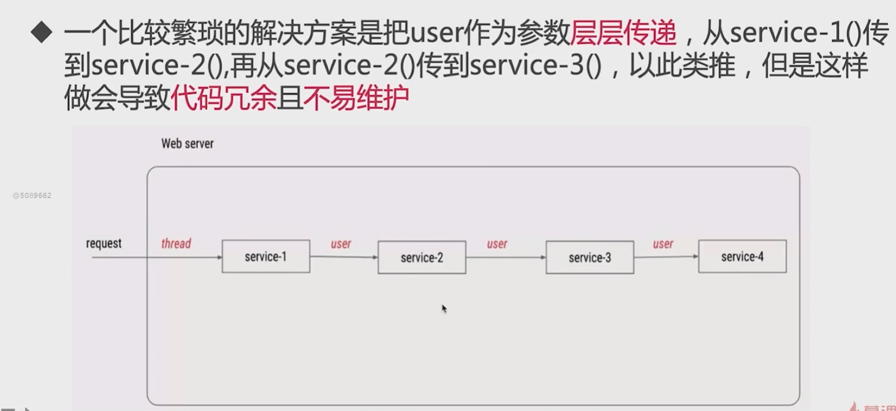
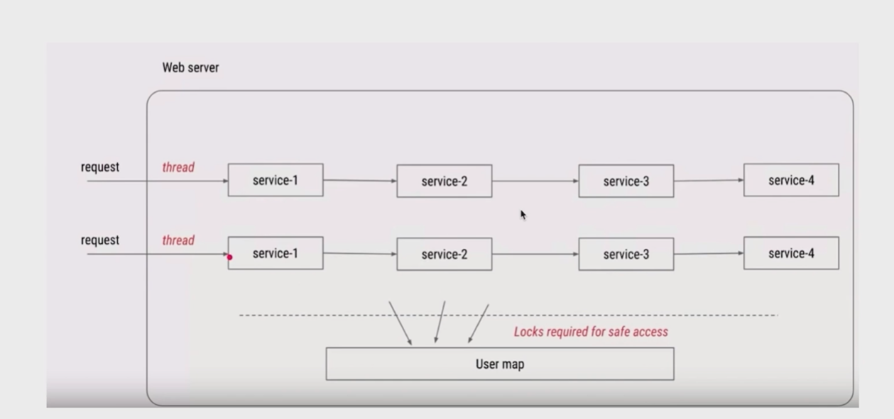
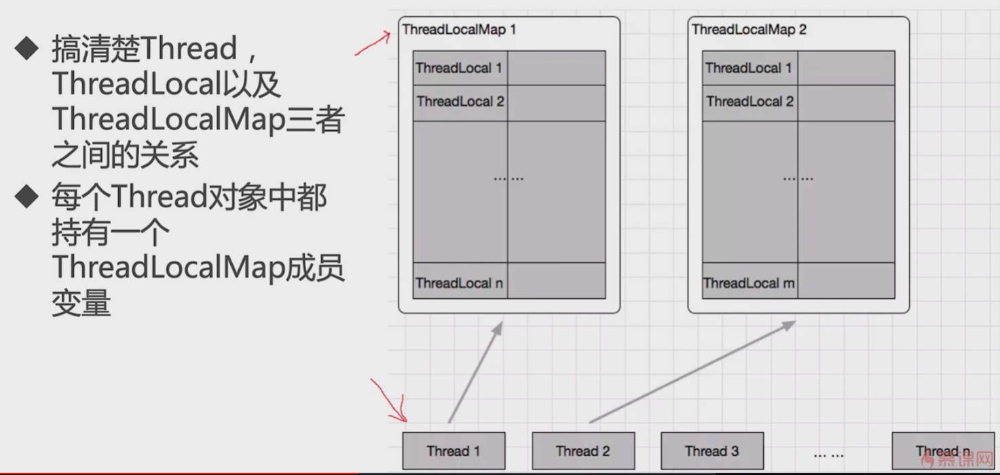
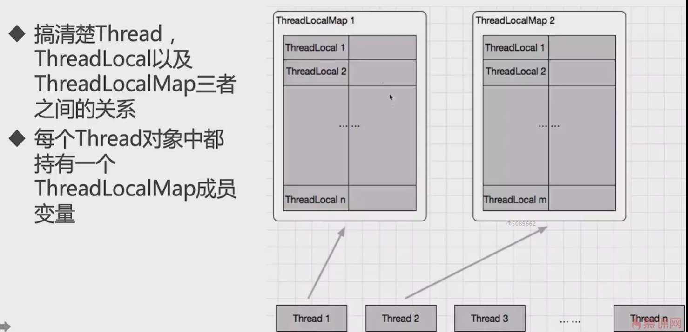

# ThreadLocal

---

## 使用场景

- 每一个线程都需要一个独享的对象(通常是工具类,工具类没有做线程安全的处理.典型的需要使用的工具类有SimpleDateFormat和Random)
    - 这个场景的诉求是: 工具类线程不安全，想让每个线程有自己独占的工具类
- 每一个县线程内需要保存全局变量(例如在拦截器中获取用户信息)，可以让不同的方式直接使用，避免参数传递的麻烦
    - 这种场景的诉求是: 避免参数传递的麻烦

## 第一种场景: 独享对象

> 每一个thread内有自己的实例副本，只能由当前的线程访问到，其他线程访问不到,不进行共享

### SimpleDateFormat 线程不安全示例

```java
/**
 * @program: currentency_tool_practice
 * @description:
 * @author: liweilong
 * @create: 2021-05-25 20:03
 **/
public class ThreaLocalNormalUsage03 {

    public static ExecutorService executorService = Executors.newFixedThreadPool(10);
    SimpleDateFormat format = new SimpleDateFormat("yyyy-MM-dd HH:mm:ss");

    public static void main(String[] args) {
        for (int i = 0; i < 1000; i++) {
            int finalI = i;
            executorService.submit(() -> {
                String date = new ThreaLocalNormalUsage03().date(finalI);
                System.out.println(date);
            });
        }
        // 任务执行结果会有重复日期
        executorService.shutdown();
    }

    public String date(int seconds) {
        // 参数的单位是毫秒，从 1970.1.1 00:00:00 GMT计时
        Date date = new Date(seconds * 1000);
        return format.format(date);
    }
}
```

> 当所有任务共用同一个SimpleDateFormat对象的时候，而且SimpleDateFormat本身又不是线程安全的，所以会出现重复日期的情况

### 加锁和ThreadLocal

> 加锁可以解决这个问题，但是加锁代表着线程需要等待和排队

```java
public class ThreaLocalNormalUsage03 {

    public static ExecutorService executorService = Executors.newFixedThreadPool(10);
    SimpleDateFormat format = new SimpleDateFormat("yyyy-MM-dd HH:mm:ss");

    public static void main(String[] args) {
        for (int i = 0; i < 1000; i++) {
            int finalI = i;
            executorService.submit(() -> {
                String date = new ThreaLocalNormalUsage03().date(finalI);
                System.out.println(date);
            });
        }
        executorService.shutdown();
    }

    public String date(int seconds) {
        // 参数的单位是毫秒，从 1970.1.1 00:00:00 GMT计时
        Date date = new Date(seconds * 1000);
        String format = null;
        synchronized (ThreaLocalNormalUsage03.class) {
            format = this.format.format(date);
        }
        return format;
    }
}
```

```java
public class ThreahLocalNormalUsage04 {

    // 常规写法
    public static ThreadLocal<SimpleDateFormat> dateFormatThreadLocal = new ThreadLocal<SimpleDateFormat>() {
        @Override
        protected SimpleDateFormat initialValue() {
            return new SimpleDateFormat("yyyy-MM-dd HH:mm:ss");
        }
    };

    // lambda 写法
    public static ThreadLocal<SimpleDateFormat> dateFormatThreadLocal2 = ThreadLocal.withInitial(() -> {
        return new SimpleDateFormat("yyyy-MM-dd HH:mm:ss");
    });


    public String date(int seconds) {
        // 参数的单位是毫秒，从 1970.1.1 00:00:00 GMT计时
        Date date = new Date(seconds * 1000);
        return dateFormatThreadLocal2.get().format(date);
    }


    public static ExecutorService executorService = Executors.newFixedThreadPool(10);

    public static void main(String[] args) {
        for (int i = 0; i < 1000; i++) {
            int finalI = i;
            executorService.execute(() -> {
                String date = new ThreahLocalNormalUsage04().date(finalI);
                System.out.println(date);
            });
        }
        executorService.shutdown();
    }
}

```

## 第二种场景: 避免参数传递

> 每个线程内保存全局变量，可以让不同的方法直接调用，避免参数传递的麻烦





> 当多线程在工作的时候，我们需要保证线程的安全，可以使用synchronized，也可以使用ConcurrentHashMap.但是无论使用什么，对性能都是有影响的。
> 更好的办法就是在使用ThreadLocal，这样无需加锁，可以在不影响性能的情况下，也不需要层层传递参数，就可以达到保存当前线程的用户信息的目的

> - **第二种方法强调的是同一个请求内(同一个线程内)不同方法的共享**
> - 不需要重写initialValue()方法，但是必须手动调用set()方法

```java
public class ThreadLocalNormalUsage06 {
    private static ExecutorService executorService = Executors.newFixedThreadPool(10);

    public static void main(String[] args) {
        for (int i = 0; i < 10; i++) {
            int finalI = i;
            executorService.submit(() -> {
                new Service1().process("用户:" + finalI);
            });
        }
        executorService.shutdown();
    }
}


/**
 * 入口方法，将数据存入ThreadLocal
 */
class Service1 {
    public void process(String name) {
        User user = new User(name);
        UserContextHolder.holder.set(user);
        System.out.println("Service1 >>> " + Thread.currentThread().getName() + " >>> " + user.getName());
        new Service2().process();
    }
}

/**
 * 模拟方法，获取ThreadLocal中的数据
 */
class Service2 {
    public void process() {
        User user = UserContextHolder.holder.get();
        System.out.println("Service2 >>> " + Thread.currentThread().getName() + " >>> " + user.getName());
        new Service3().process();
    }
}

/**
 * 模拟方法，获取ThreadLocal中的数据
 */
class Service3 {
    public void process() {
        User user = UserContextHolder.holder.get();
        System.out.println("Service3 >>> " + Thread.currentThread().getName() + " >>> " + user.getName());
    }
}


class UserContextHolder {
    public static ThreadLocal<User> holder = new ThreadLocal<User>();
}

class User {
    private String name;

    public User(String name) {
        this.name = name;
    }

    public String getName() {
        return name;
    }

    public void setName(String name) {
        this.name = name;
    }
}
```

## ThreadLocal两种场景总结

- 让某个需要用到的对象在线程间隔离(每个线程都有自己独立的对象)
- 在任何方法中都能轻松的获取到该对象

### initialValue

> 在ThreadLocal第一次get的时候就将对象初始化出来了，对象的初始化进程完成由我们控制

### set

> 如果需要保存到ThreadLocal里面的对象的生成时机不由我们随意控制，例如拦截器生成的用户信息,用ThreadLocal.set直接放到ThreadLocal中，以便后续使用

## ThreadLocal的好处

- 保证线程安全
- 不需要加锁，提高执行效率
- 更高效的利用内存、节省开支: 相比于每个线程创建一个对象，显然用ThreadLocal更节省内存和开销
- 免去传参的麻烦，无论是场景一还是场景二，都可以在任何地方直接通过ThreadLocal拿到，不需要每次传递同样的参数,降低代码耦合度

## ThreadLocal原理



```java
public class Thread implements Runnable {
    /* ThreadLocal values pertaining to this thread. This map is maintained
     * by the ThreadLocal class. */
    ThreadLocal.ThreadLocalMap threadLocals = null;
}
```

### initialValue()

> - 该方法会返回当前线程的初始值，这是一个延迟加载的方法，只有在调用get方法的时候，才会触发
> - 当线程第一次调用get方法访问变量的时候，将调用此方法。除非线程之前已经调用了set方法，在这种情况下，不会为线程调用initialValue方法
> - 通常每个线程最多调用此方法一次，但是如果已经调用了remove方法后，再调用get方法，则可以再次调用此方法
> - 如果不重写方法，这个方法会返回null。一般使用匿名内部类的方法来重写initialValue()方法，以便再后续中可以初始化副本对象

### void set(T t)

> 为这个线程设置一个新的值

### T get()

> 得到这个线程对应的value，如果是首次调用get()，则会调用initialize来完成初始化

### void remove()

> 删除对应这个线程的值

> **通过ThreadLocalMap保存的值是存储在当前线程中的，具体的存储是ThreadLocal的引用作为key，实际存储的值作为value**

```java
public class ThreadLocal<T> {
    /**
     * Returns the current thread's "initial value" for this
     * thread-local variable.  This method will be invoked the first
     * time a thread accesses the variable with the {@link #get}
     * method, unless the thread previously invoked the {@link #set}
     * method, in which case the {@code initialValue} method will not
     * be invoked for the thread.  Normally, this method is invoked at
     * most once per thread, but it may be invoked again in case of
     * subsequent invocations of {@link #remove} followed by {@link #get}.
     *
     * <p>This implementation simply returns {@code null}; if the
     * programmer desires thread-local variables to have an initial
     * value other than {@code null}, {@code ThreadLocal} must be
     * subclassed, and this method overridden.  Typically, an
     * anonymous inner class will be used.
     *
     * @return the initial value for this thread-local
     */
    protected T initialValue() {
        return null;
    }

    /**
     * Returns the value in the current thread's copy of this
     * thread-local variable.  If the variable has no value for the
     * current thread, it is first initialized to the value returned
     * by an invocation of the {@link #initialValue} method.
     *
     * @return the current thread's value of this thread-local
     */
    public T get() {
        // 拿到当前线程
        Thread t = Thread.currentThread();
        // 获取当前线程的 ThreadLocalMap;
        ThreadLocalMap map = getMap(t);
        if (map != null) {
            // 如果不为空，则将当前线程的引用传入进去，获取到 
            ThreadLocalMap.Entry e = map.getEntry(this);
            // 如果取出的值不为空，则直接强转返回,反之则进行初始化
            if (e != null) {
                @SuppressWarnings("unchecked")
                T result = (T) e.value;
                return result;
            }
        }
        return setInitialValue();
    }

    /**
     * Variant of set() to establish initialValue. Used instead
     * of set() in case user has overridden the set() method.
     *
     * @return the initial value
     */
    private T setInitialValue() {
        T value = initialValue();
        Thread t = Thread.currentThread();
        ThreadLocalMap map = getMap(t);
        if (map != null)
            map.set(this, value);
        else
            createMap(t, value);
        return value;
    }

    /**
     * Get the map associated with a ThreadLocal. Overridden in
     * InheritableThreadLocal.
     *
     * @param  t the current thread
     * @return the map
     */
    ThreadLocalMap getMap(Thread t) {
        return t.threadLocals;
    }


    /**
     * Sets the current thread's copy of this thread-local variable
     * to the specified value.  Most subclasses will have no need to
     * override this method, relying solely on the {@link #initialValue}
     * method to set the values of thread-locals.
     *
     * @param value the value to be stored in the current thread's copy of
     *        this thread-local.
     */
    public void set(T value) {
        // 获取当前线程的引用
        Thread t = Thread.currentThread();
        // 获取 从线程中获取ThreadLocalMap
        ThreadLocalMap map = getMap(t);
        // 如果为空则创建，不为空则设置引用，覆盖
        if (map != null)
            map.set(this, value);
        else
            createMap(t, value);
    }

    /**
     * Removes the current thread's value for this thread-local
     * variable.  If this thread-local variable is subsequently
     * {@linkplain #get read} by the current thread, its value will be
     * reinitialized by invoking its {@link #initialValue} method,
     * unless its value is {@linkplain #set set} by the current thread
     * in the interim.  This may result in multiple invocations of the
     * {@code initialValue} method in the current thread.
     *
     * @since 1.5
     */
    public void remove() {
        ThreadLocalMap m = getMap(Thread.currentThread());
        if (m != null)
            m.remove(this);
    }
}
```

## ThreadLocalMap

> ThreadLocalMap 类就是Thread.threadLocals
> ThreadLocalMap类是每个线程Thread里面的变量，里面最重要的是一个键值对数组Entry[] table,可以认为是一个Map，键值对：key这个ThreadLocal，value是实际需要的成员变量

```java
 static class ThreadLocalMap {

    /**
     * The table, resized as necessary.
     * table.length MUST always be a power of two.
     */
    private Entry[] table;

    /**
     * Construct a new map initially containing (firstKey, firstValue).
     * ThreadLocalMaps are constructed lazily, so we only create
     * one when we have at least one entry to put in it.
     */
    ThreadLocalMap(ThreadLocal<?> firstKey, Object firstValue) {
        table = new Entry[INITIAL_CAPACITY];
        int i = firstKey.threadLocalHashCode & (INITIAL_CAPACITY - 1);
        table[i] = new Entry(firstKey, firstValue);
        size = 1;
        setThreshold(INITIAL_CAPACITY);
    }
}
```



> ThredLocal的两种使用场景，独享对象和避免参数传递的情况下，**本质上从源码上看还是将ThreadLocal和实际对象存储到ThreadLocalMap中**

- 通过源码分析可以看出，setInitialValue和直接set都是利用map.set()方法进行设置值
- 也就是说，最后都会对应到ThreadLocalMap的一个Entry，只不过起点和终点不一样

## ThreadLocal使用注意点

### 内存泄露

> 内存泄露是指: 某个对象不在有用，但是占用的内存却不能被回收,Entry的源码分析，可以看出Entry的key不是使用正常的方式进行赋值，而是使用弱引用进行赋值
> **弱引用的特点是：如果这个对象只被弱引用关联(没有任何强引用关联),那么这个对象就可以被回收**

```java
      static class Entry extends WeakReference<ThreadLocal<?>> {
    /** The value associated with this ThreadLocal. */
    Object value;

    Entry(ThreadLocal<?> k, Object v) {
        super(k);
        value = v;
    }
}

```