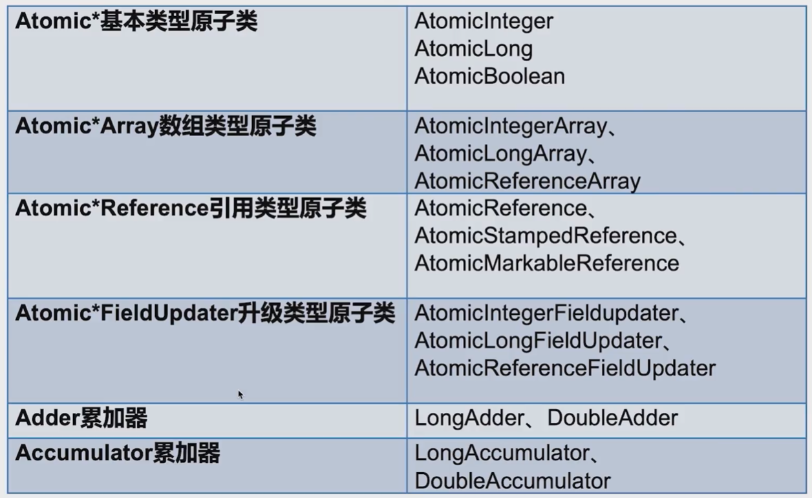
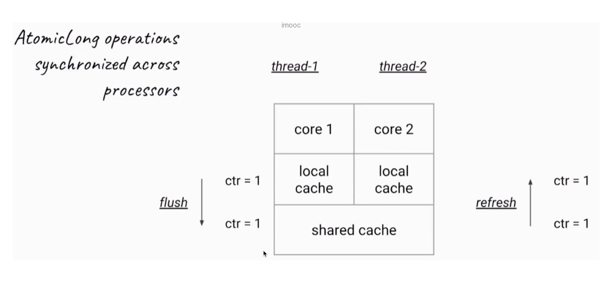
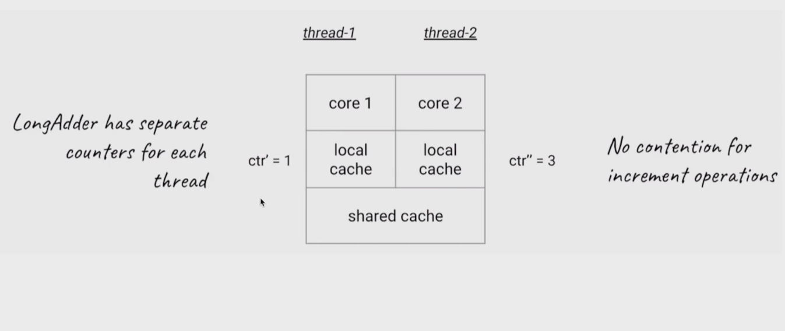

# 原子类
--- 
> 原子性: 一个操作是不可中断的，即使是多线程的情况下也可以保证

## 原子类存在的必要性

> 原子类的作用和锁类似，是为了保证并发情况下的线程安全，不过原子类相对于锁有一定的优势  
> **粒度更细：原子变量可以把竞争的范围缩小到变量级别，这样我们可以获得到更细粒度的情况了，通常锁的粒度都要大于原子变量的粒度。**  
> **效率更高: 通常使用原子类的效率会高于使用锁的效率，除了高度竞争的情况**

## 原子类纵览



## AtomicInteger

### 常用方法

- public final int get() // 获取当前值
- public final int getAndSet(int newValue) // 获取当前值，并设置新值
- public final int getAndIncrement() // 获取当前值，并自增
- public final int getAndDecrement() // 获取当前值，并自减
- public final int getAndAdd(int delta) // 获取当前值，并加上预期值
- boolean compareAndSet(int expect,int update) // 如果当前的数值等于预期值，则以原子类将该值设置为输入值

```java
package lock.atomicDemo;

import java.util.concurrent.atomic.AtomicInteger;

/**
 * @program: currentency_tool_practice
 * @description:
 * @author: liweilong
 * @create: 2021-07-01 23:28
 **/
public class AtomicIntegerDemo implements Runnable {

    private static AtomicInteger atomicInteger = new AtomicInteger(0);
    private static volatile int basicInteger = 0;

    public void atomicAdd() {
        atomicInteger.incrementAndGet();
    }

    public void basicAdd() {
        basicInteger++;
    }


    public static void main(String[] args) throws InterruptedException {
        AtomicIntegerDemo r = new AtomicIntegerDemo();
        Thread t1 = new Thread(r);
        Thread t2 = new Thread(r);

        t1.start();
        t2.start();

        t1.join();
        t2.join();

        System.out.println("原子整数计算结果: " + atomicInteger.get());
        System.out.println("普通整数计算结果: " + basicInteger);

//        原子整数计算结果: 40000
//        普通整数计算结果: 36330
    }

    @Override
    public void run() {
        for (int i = 0; i < 20000; i++) {
            atomicAdd();
            basicAdd();
        }
    }
}

```

## AtomicArray

```java
package lock.atomicDemo;

import java.util.concurrent.atomic.AtomicIntegerArray;

/**
 * @program: currentency_tool_practice
 * @description:
 * @author: liweilong
 * @create: 2021-07-01 23:40
 **/
public class AtomicArrayDemo {

    private static AtomicIntegerArray array = new AtomicIntegerArray(1000);

    public static void main(String[] args) {
        Thread[] addArray = new Thread[100];
        Thread[] subtracArray = new Thread[100];

        Add add = new Add(array);
        Subtract subtract = new Subtract(array);

        for (int i = 0; i < 100; i++) {
            addArray[i] = new Thread(add);
            subtracArray[i] = new Thread(subtract);

            addArray[i].start();
            subtracArray[i].start();
        }

        for (int i = 0; i < 100; i++) {
            try {
                addArray[i].join();
                subtracArray[i].join();
            } catch (InterruptedException e) {
                e.printStackTrace();
            }
        }

        for (int i = 0; i < array.length(); i++) {
            System.out.println(array.get(i));
        }
        System.out.println("运行结束");

    }
}

class Subtract implements Runnable {

    private AtomicIntegerArray array;

    public Subtract(AtomicIntegerArray array) {
        this.array = array;
    }

    @Override
    public void run() {
        for (int i = 0; i < array.length(); i++) {
            array.getAndDecrement(i);
        }
    }
}

class Add implements Runnable {

    private AtomicIntegerArray array;

    public Add(AtomicIntegerArray array) {
        this.array = array;
    }

    @Override
    public void run() {
        for (int i = 0; i < array.length(); i++) {
            array.getAndIncrement(i);
        }
    }
}
```

### 普通数组

```java
package lock.atomicDemo;

/**
 * @program: currentency_tool_practice
 * @description:
 * @author: liweilong
 * @create: 2021-07-01 23:40
 **/
public class AtomicArrayDemo {

    private static Integer[] array = new Integer[1000];

    public static void main(String[] args) {
        Thread[] addArray = new Thread[100];
        Thread[] subtracArray = new Thread[100];

        for (int i = 0; i < array.length; i++) {
            array[i] = 0;
        }
        Add add = new Add(array);
        Subtract subtract = new Subtract(array);

        for (int i = 0; i < 100; i++) {
            addArray[i] = new Thread(add);
            subtracArray[i] = new Thread(subtract);

            addArray[i].start();
            subtracArray[i].start();
        }

        for (int i = 0; i < 100; i++) {
            try {
                addArray[i].join();
                subtracArray[i].join();
            } catch (InterruptedException e) {
                e.printStackTrace();
            }
        }

        Integer errorCount = 0;
        for (int i = 0; i < array.length; i++) {
            if (0 != array[i]) {
                errorCount++;
            }
        }
        System.out.println("运行结束,错误数量: " + errorCount);
//        运行结束,错误数量: 48
//        运行结束,错误数量: 46
//        运行结束,错误数量: 107
    }
}

class Subtract implements Runnable {

    private Integer[] array;

    public Subtract(Integer[] array) {
        this.array = array;
    }

    @Override
    public void run() {
        for (int i = 0; i < array.length; i++) {
            array[i] -= 1;
        }
    }
}

class Add implements Runnable {

    private Integer[] array;

    public Add(Integer[] array) {
        this.array = array;
    }

    @Override
    public void run() {
        for (int i = 0; i < array.length; i++) {
            array[i] += 1;
        }
    }
}
```

## Atomic*Reference引用类型原子类

> AtomicReference类的作用和AtomicInteger没有本质的区别，AtomicInteger可以让一个整数保证原子性，而AtomicReference可以让一个对象保证原子  
> 当然AtomicReference的功能明显比AtomicInteger强，因为一个对象可以包含很多属性，用法和AtomicInteger类似.

> AtomicReference最重要的方法是 compareAndSet。将比较和替换合并成一个原子操作，自旋锁实现的原理也就是 compareAndSet

```java
package lock.readwrite;

import java.util.concurrent.atomic.AtomicReference;

/**
 * @program: currentency_tool_practice
 * @description:
 * @author: liweilong
 * @create: 2021-07-01 22:27
 **/
public class SpinLock {

    AtomicReference<Thread> sign = new AtomicReference<>();

    private void lock() {
        Thread current = Thread.currentThread();
        // 上锁操作，当前锁没有任何线程持有，指是null，就使用原子操作将其设置为当前线程的引用.
        while (!sign.compareAndSet(null, current)) {
            System.out.println(Thread.currentThread().getName() + ">>> 尝试获取锁中...");
        }
    }

    private void unlock() {
        Thread current = Thread.currentThread();
        // 解锁操作 
        sign.compareAndSet(current, null);
    }

    public static void main(String[] args) {

        SpinLock spinLock = new SpinLock();
        Runnable runnable = () -> {
            System.out.println(Thread.currentThread().getName() + ">>> 开始获取自旋锁");
            spinLock.lock();
            System.out.println(Thread.currentThread().getName() + ">>> 已经获取到自旋锁");
            try {
                Thread.sleep(300);
            } catch (InterruptedException e) {
                e.printStackTrace();
            } finally {
                System.out.println(Thread.currentThread().getName() + ">>> 释放自旋锁");
                spinLock.unlock();
            }
        };

        new Thread(runnable, "Thread-1").start();
        new Thread(runnable, "Thread-2").start();
    }
}
```

## AtomicIntegerFieldUpdater

> AtomicInteger本身的消耗是大于包装类的，当项目中出现大量的原子类的时候，会占用太多的消耗。
> 使用场景: 当一个类的字段在大多数情况下是不需要保证线程安全的，仅仅在某些特定的情况下需要使用原子get、set操作

```java
package lock.atomicDemo;

import java.util.concurrent.atomic.AtomicInteger;
import java.util.concurrent.atomic.AtomicIntegerFieldUpdater;

/**
 * @program: currentency_tool_practice
 * @description:
 * @author: liweilong
 * @create: 2021-07-10 14:52
 **/
public class AtomicIntegerFieldUpdaterDemo implements Runnable {

    static Candidate tom;
    static Candidate peter;

    public static AtomicIntegerFieldUpdater<Candidate> scoreUpdater = AtomicIntegerFieldUpdater.newUpdater(Candidate.class, "score");

    public static void main(String[] args) throws InterruptedException {
        tom = new Candidate();
        peter = new Candidate();

        AtomicIntegerFieldUpdaterDemo r = new AtomicIntegerFieldUpdaterDemo();
        Thread t1 = new Thread(r);
        Thread t2 = new Thread(r);

        t1.start();
        t2.start();

        t1.join();
        t2.join();

        System.out.println("普通变量 " + peter.score);
        System.out.println("升级后的结果 " + tom.score);

        // 普通变量 1958
        // 升级后的结果 2000

    }

    @Override
    public void run() {
        for (int i = 0; i < 1000; i++) {
            peter.score++;
            scoreUpdater.getAndIncrement(tom);
        }
    }

    public static class Candidate {
        volatile int score;
    }
}
```

### 注意点

> AtomicIntegerFieldUpdater本质上还是通过反射进行升级的，因此对是有要求的
> - 字段必须保证可见性。即被volatile所修饰，保证每个线程都能看到最新的修改后的值
> - 字段不能被static所修饰

### Adder累加器

> 高并发情况下，LongAdder比AtomicLong的效率高，不过本质上是空间换时间  
> 激烈竞争的情况下，LongAdder把不同的线程对应到不同的Cell上进行修改，降低了冲突的概率，是多段锁的理念，提高了并发性。

```java
package lock.atomicDemo;

import java.util.concurrent.Executor;
import java.util.concurrent.ExecutorService;
import java.util.concurrent.Executors;
import java.util.concurrent.atomic.AtomicLong;
import java.util.concurrent.atomic.LongAdder;

/**
 * @program: currentency_tool_practice
 * @description:
 * @author: liweilong
 * @create: 2021-07-10 15:11
 **/
public class AtomicLongDemo {
    public static void main(String[] args) {
        atomicLongMethod();
        longAdderMethod();

        // AtomicLong 耗时:1144,结果:100000000
        // LongAdder 耗时:106,结果:100000000

    }

    private static void longAdderMethod() {
        LongAdder counter = new LongAdder();
        ExecutorService executorService = Executors.newFixedThreadPool(20);

        long start = System.currentTimeMillis();
        for (int i = 0; i < 10000; i++) {
            executorService.submit(new Task2(counter));
        }

        executorService.shutdown();
        while (!executorService.isTerminated()) {
        }
        long end = System.currentTimeMillis();
        System.out.println("LongAdder 耗时:" + (end - start) + ",结果:" + counter.longValue());
    }

    private static void atomicLongMethod() {
        AtomicLong counter = new AtomicLong();
        ExecutorService executorService = Executors.newFixedThreadPool(20);

        long start = System.currentTimeMillis();
        for (int i = 0; i < 10000; i++) {
            executorService.submit(new Task(counter));
        }

        executorService.shutdown();
        while (!executorService.isTerminated()) {
        }
        long end = System.currentTimeMillis();
        System.out.println("AtomicLong 耗时:" + (end - start) + ",结果:" + counter.get());
    }

    private static class Task2 implements Runnable {

        private LongAdder counter;

        public Task2(LongAdder counter) {
            this.counter = counter;
        }

        @Override
        public void run() {
            for (int i = 0; i < 10000; i++) {
                counter.add(1);
            }
        }
    }

    private static class Task implements Runnable {

        private AtomicLong counter;

        public Task(AtomicLong counter) {
            this.counter = counter;
        }

        @Override
        public void run() {
            for (int i = 0; i < 10000; i++) {
                counter.incrementAndGet();
            }
        }
    }
}
```

### AtomicInteger的弊端



> 在AtomicLong中，每一次新增操作都需要将结果由线程本地内存flush到共享内存中，同时将最新的值由共享内存flush到每个线程的本地内存中。  
> 由于Atomic的实现原理决定的，所以每一次加法都是需要做同步的。在高并发的时候导致冲突比较多，也就降低了效率


> LongAdder采用的是分段累加的思想。其主要分为两个部分，一个部分是分段累计，另一个部分是汇总  
> 分段累计：每个线程自身进行累计，避免AtomicInteger中频繁的flush和reflush，避免了冲突
> 汇总: 每个线程内部维护一个base变量和Cell数组。当竞争不激烈的时候直接累加到该变量上.当竞争激烈的时候，每个线程分散累加到自己的漕Cell[i]中
> 本质上是空间换时间，每个线程维护了一个Cell数组

### sum方法解析

```java
public class LongAdder extends Striped64 implements Serializable {
    private static final long serialVersionUID = 7249069246863182397L;

    public long sum() {
        Cell[] as = cells;
        Cell a;
        long sum = base;
        // 当cell数组为空，说明没有使用到cell数组，直接返回sum
        if (as != null) {
            // 当cell数组不为空的时候，直接对cell数组进行求和返回
            for (int i = 0; i < as.length; ++i) {
                if ((a = as[i]) != null)
                    sum += a.value;
            }
        }
        return sum;
    }
}
```

**可以看出，LongAdder sum方法并没有加锁，因此sum方法是线程不安全的。也就是意味着sum方法的求和是不准确的**

### 使用场景
- 在低争用的情况下，AtomicLong和LongAdder这两个类都是具有相似的特征，但是在激烈竞争的情况下，LongAdder的预期吞吐量要高的多，但是要消耗更多的空间
- LongAdder适用的场景是统计、求和、计数。而且LongAdder基本上只提供了add方法，而AtomicLong还具备了cas方法

## Accumulator累加器
```java
public class AccumulatorDemo {
    public static void main(String[] args) {
        method1();
        method2();
    }

    private static void method1() {
        LongAccumulator longAccumulator = new LongAccumulator((x, y) -> x + y, 100);
        longAccumulator.accumulate(1);
        longAccumulator.accumulate(2);
        System.out.println(longAccumulator.getThenReset());
    }

    private static void method2() {
        LongAccumulator longAccumulator = new LongAccumulator((x, y) -> x * y, 1);
        ExecutorService executorService = Executors.newFixedThreadPool(10);
        IntStream.range(1, 10).forEach(item -> executorService.submit(() -> longAccumulator.accumulate(item)));
        executorService.shutdown();
        while (!executorService.isTerminated()) {
        }
        System.out.println(longAccumulator.getThenReset());
    }
}
```

### 适用场景
- 需要将串行计算转化为并行计算，利用到多个核心
- **在并行计算中，对执行的顺序没有要求，如果对执行顺序有要求，是没有办法使用 Accumulator累加器的**

### AtomicInteger 在高并发下性能不好，如何解决？为什么？
> 对于 AtomicLong 内部的 value 属性而言，也就是保存当前 AtomicLong 数值的属性，它是被 volatile 修饰的，所以它需要保证自身可见性。  
> 这样一来，每一次它的数值有变化的时候，它都需要进行 flush 和 refresh。比如说，如果开始时，ctr 的数值为 0 的话，那么如图所示，一旦 core 1 把它改成 1 的话，它首先会在左侧把这个 1 的最新结果给 flush 到下方的共享内存。然后，再到右侧去往上 refresh 到核心 2 的本地内存。这样一来，对于核心 2 而言，它才能感知到这次变化。  
> 由于竞争很激烈，这样的 flush 和 refresh 操作耗费了很多资源，而且 CAS 也会经常失败。  
> 在 JDK 8 中又新增了 LongAdder 这个类，这是一个针对 Long 类型的操作工具类。LongAdder 会把不同线程对应到不同的 Cell 上进行修改，降低了冲突的概率，这是一种分段的理念，提高了并发性，这就和 Java 7 的 ConcurrentHashMap 的 16 个 Segment 的思想类似。  
> 竞争激烈的时候，LongAdder 会通过计算出每个线程的 hash 值来给线程分配到不同的 Cell 上去，每个 Cell 相当于是一个独立的计数器，这样一来就不会和其他的计数器干扰，Cell 之间并不存在竞争关系，所以在自加的过程中，就大大减少了刚才的 flush 和 refresh，以及降低了冲突的概率，这就是为什么 LongAdder 的吞吐量比 AtomicLong 大的原因，本质是空间换时间，因为它有多个计数器同时在工作，所以占用的内存也要相对更大一些。  
> 在低竞争的情况下，AtomicLong 和 LongAdder 这两个类具有相似的特征，吞吐量也是相似的，因为竞争不高。但是在竞争激烈的情况下，LongAdder 的预期吞吐量要高得多，经过试验，LongAdder 的吞吐量大约是 AtomicLong 的十倍，不过凡事总要付出代价，LongAdder 在保证高效的同时，也需要消耗更多的空间。  