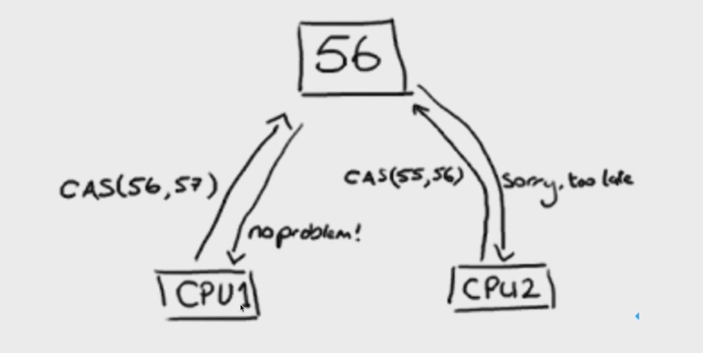

# CAS

> **cas是在并行环境下，保证在原子操作内完成数据的比对和交换，其最根本是依赖于cpu指令的**
> 简而言之: 就是我认为V的值应该是A，如果是的话那我就把它修改成B，如果不是A(说明被修改过) 那我就不进行修改，避免多人同时修改的时候导致出错   
> cas有三个操作数:**内存值V，预期值A，要修改的值B，而且仅当预期值A和内存值V相同的时候，才将内存值修改为B，否则什么都不处理，最后返回现在的值V**



## CAS等价代码

```java
public class SimulatedCAS {
    private volatile int value;

    // 原子性的比较并交换
    public synchronized int compareAndSwap(int expectedValue, int newValue) {
        int oldValue = value;
        if (oldValue == expectedValue) {
            value = newValue;
        }
        return oldValue;
    }
}
```

```java
public class TwoThreadCompetitiom implements Runnable {
    private volatile int value;

    // 原子性的比较并交换
    public synchronized int compareAndSwap(int expectedValue, int newValue) {
        int oldValue = value;
        if (oldValue == expectedValue) {
            value = newValue;
            System.out.println(Thread.currentThread().getName() + " >> 修改成功");
        } else {
            System.out.println(Thread.currentThread().getName() + " >> 修改失败");
        }
        return oldValue;
    }

    public static void main(String[] args) throws InterruptedException {
        TwoThreadCompetitiom r = new TwoThreadCompetitiom();
        r.value = 0;

        Thread t1 = new Thread(r, "Thread-1");
        Thread t2 = new Thread(r, "Thread-2");

        t1.start();
        t2.start();

        t1.join();
        t2.join();

        System.out.println(r.value);

        // Thread-1 >> 修改成功
        // Thread-2 >> 修改失败
        // 1

    }

    @Override
    public void run() {
        compareAndSwap(0, 1);
    }
}
```

## 应用场景

### 乐观锁 CAS,

> 例如mysql的MVVM的版本号

### 并发容器

```java
public class ConcurrentHashMap<K, V> extends AbstractMap<K, V>
        implements ConcurrentMap<K, V>, Serializable {
    private static final long serialVersionUID = 7249069246763182397L;

    final V putVal(K key, V value, boolean onlyIfAbsent) {
        if (key == null || value == null) throw new NullPointerException();
        int hash = spread(key.hashCode());
        int binCount = 0;
        for (Node<K, V>[] tab = table; ; ) {
            Node<K, V> f;
            int n, i, fh;
            if (tab == null || (n = tab.length) == 0)
                tab = initTable();
            else if ((f = tabAt(tab, i = (n - 1) & hash)) == null) {
                // cas方法
                if (casTabAt(tab, i, null,
                        new Node<K, V>(hash, key, value, null)))
                    break;                   // no lock when adding to empty bin
            } else if ((fh = f.hash) == MOVED)
                tab = helpTransfer(tab, f);
            else {
                V oldVal = null;
                synchronized (f) {
                    if (tabAt(tab, i) == f) {
                        if (fh >= 0) {
                            binCount = 1;
                            for (Node<K, V> e = f; ; ++binCount) {
                                K ek;
                                if (e.hash == hash &&
                                        ((ek = e.key) == key ||
                                                (ek != null && key.equals(ek)))) {
                                    oldVal = e.val;
                                    if (!onlyIfAbsent)
                                        e.val = value;
                                    break;
                                }
                                Node<K, V> pred = e;
                                if ((e = e.next) == null) {
                                    pred.next = new Node<K, V>(hash, key,
                                            value, null);
                                    break;
                                }
                            }
                        } else if (f instanceof TreeBin) {
                            Node<K, V> p;
                            binCount = 2;
                            if ((p = ((TreeBin<K, V>) f).putTreeVal(hash, key,
                                    value)) != null) {
                                oldVal = p.val;
                                if (!onlyIfAbsent)
                                    p.val = value;
                            }
                        }
                    }
                }
                if (binCount != 0) {
                    if (binCount >= TREEIFY_THRESHOLD)
                        treeifyBin(tab, i);
                    if (oldVal != null)
                        return oldVal;
                    break;
                }
            }
        }
        addCount(1L, binCount);
        return null;
    }
}
```

### 原子类中CAS的应用

- AtomicInteger加载Unsafe工具，用来直接操作内存数据
- 用Unsafe来实现底层操作
- 用volatile修饰value字段，保证可见性

#### getAndAddInt方法分析

```java
public class AtomicInteger extends Number implements java.io.Serializable {
    private static final long serialVersionUID = 6214790243416807050L;

    // setup to use Unsafe.compareAndSwapInt for updates
    // Unsafe是CAS的核心类。Java无法直接访问底层操作系统，而是通过本地（native）方法来访问。
    // 不过尽管如此，JVM还是开了一个后门，JDK中有一个类Unsafe，它提供了硬件级别的原子操作。
    private static final Unsafe unsafe = Unsafe.getUnsafe();
    private static final long valueOffset;

    static {
        try {
            valueOffset = unsafe.objectFieldOffset
                    (AtomicInteger.class.getDeclaredField("value"));
        } catch (Exception ex) {
            throw new Error(ex);
        }
    }

    // 在AtomicInteger数据定义的部分，我们还获取了unsafe实例，并且定义了valueOffset。
    // 再看到static块，懂类加载过程的都知道，static块的加载发生于类加载的时候，是最先初始化的，
    // 这时候我们调用unsafe的objectFieldOffset从Atomic类文件中获取value的偏移量，那么valueOffset其实就是记录value的偏移量的。

    // valueOffset表示的是变量值在内存中的偏移地址，因为Unsafe就是根据内存偏移地址获取数据的原值的，
    // 这样我们就能通过unsafe来实现CAS了。value是用volatile修饰的，保证了多线程之间看到的value值是同一份。

    private volatile int value;

    public final int get() {
        return value;
    }


    public final int getAndIncrement() {
        return unsafe.getAndAddInt(this, valueOffset, 1);
    }
}

public final class Unsafe {
    public final int getAndAddInt(Object var1, long var2, int var4) {
        int var5;
        // 自旋加CAS比较
        do {
            var5 = this.getIntVolatile(var1, var2);
        } while (!this.compareAndSwapInt(var1, var2, var5, var5 + var4));

        return var5;
    }

    // 我们看var5获取的是什么，通过调用unsafe的getIntVolatile(var1, var2)，
    // 这是个native方法，其实就是获取var1中，var2偏移量处的值。
    // var1就是AtomicInteger，var2就是我们前面提到的valueOffset,这样我们就从内存里获取到现在valueOffset处的值了。

    // 现在重点来了，compareAndSwapInt（var1, var2, var5, var5 + var4）其实换成compareAndSwapInt（obj, offset, expect, update）比较清楚，
    // 意思就是如果obj内的value和expect相等，就证明没有其他线程改变过这个变量，那么就更新它为update，
    // 如果这一步的CAS没有成功，那就采用自旋的方式继续进行CAS操作。

    // Unsafe的getAndAddInt方法分析：自旋 + CAS，在这个过程中
    // 通过compareAndSwapInt比较并更新value值，如果更新失败，重新获取，然后再次更新，直到更新成功。
}
```

## CAS的缺点

### ABA问题
> 线程1准备用CAS将变量的值由A替换为B，在此之前，线程2将变量的值由A替换为C，又由C替换为A，然后线程1执行CAS时发现变量的值仍然为A，所以CAS成功。  
> 但实际上这时的现场已经和最初不同了，尽管CAS成功，但可能存在潜藏的问题，解决ABA问题可以通过添加版本戳的方式来解决

### 长时间的自旋
> 当竞争特别激烈的时候，CAS长时间的自旋会带来很大的资源消耗
