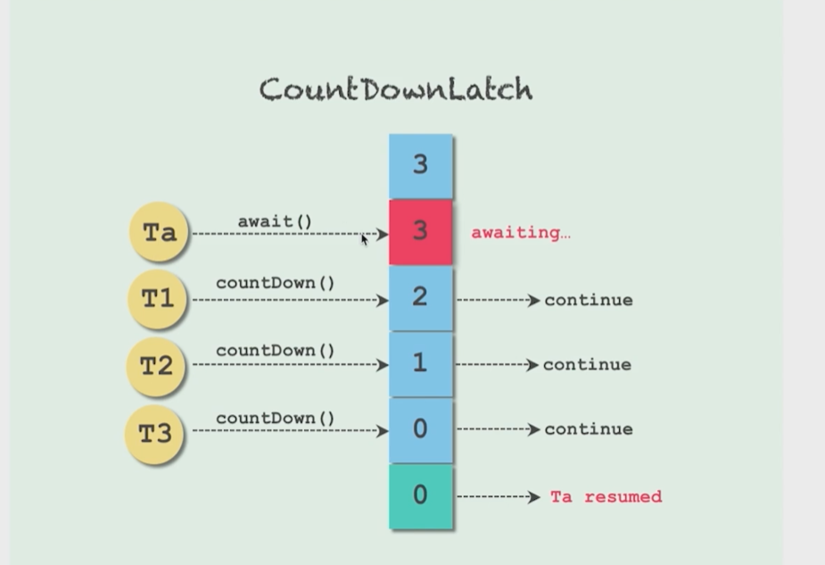
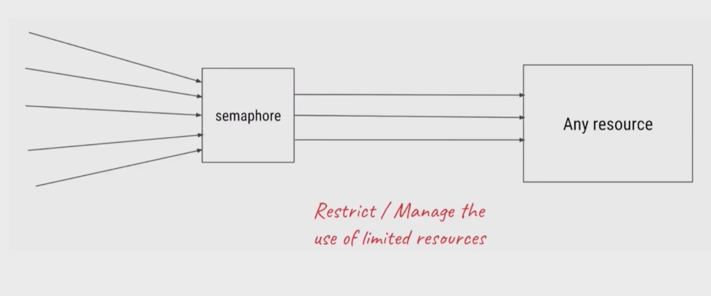
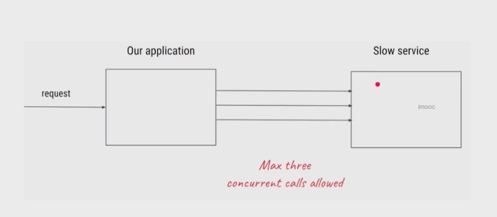
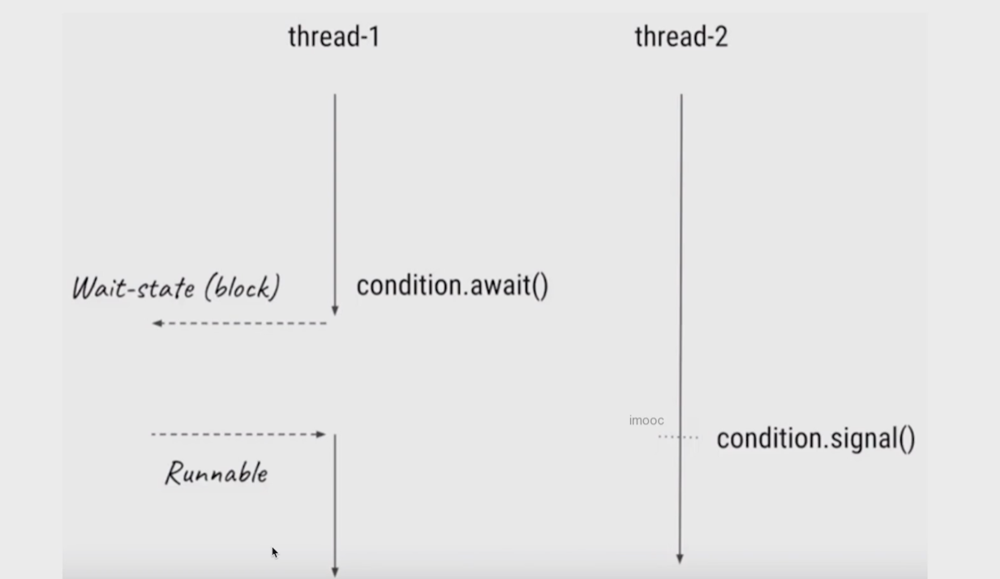

# 线程协作

--- 

## 常见的并发工具类

类|作用|说明 
-|-|-
Semaphore|信号量,可以通过控制许可证的数量,来保证线程之间的相互配合|线程由于在拿到许可证之后才能继续运行,相比于其他同步器更加灵活
CyclicBarrier|线程会等待，直到足够多线程达到了事先规定的数量，一旦触发就可以进行下一步动作|适用于线程之间相互等待处理结果就绪的场景 Phaser|和CyclicBarrier类似，但是计数器可变|jdk7加入
CountDownLatch|和CyclicBarrier类似，数量递减到0时，触发动作|不可重复使用 Exchanger|让两个线程在合适时机交换对象|适用场景，当两个线程工作在同一个类的不同实例上，用于交换数据
Condition|可以控制线程的等待和唤醒|时Object.wait()的升级版

## CountDownLatch

- 倒数结束之前，一直处于等待状态，直到倒计时结束了，此线程才会继续工作

### 主要方法

- CountDownLatch(int count),仅有一个构造函数，参数count为需要倒数的数值
- await(),调用await()方法的线程会被挂起，直到等待直到count值为0才继续执行
- countDown(),将count的值减一，直到0，等待的线程会被唤起



### 典型用法

#### 一等多

> 一个线程等待多个线程都执行完毕,再继续自己的工作

```java
public class CountDownLatchDemo1 {
    public static void main(String[] args) throws InterruptedException {
        CountDownLatch latch = new CountDownLatch(5);
        ExecutorService executorService = Executors.newFixedThreadPool(5);
        for (int i = 0; i < 5; i++) {
            Runnable runnable = () -> {
                try {
                    System.out.println("执行中...");
                    Thread.sleep((long) Math.random() * 100);

                } catch (InterruptedException e) {
                    e.printStackTrace();
                } finally {
                    latch.countDown();
                }
            };
            executorService.execute(runnable);
        }
        executorService.shutdown();
        System.out.println("等待线程执行完毕");
        latch.await();
        System.out.println("执行完成");

    }
}

```

#### 多等一

> 多个线程等待一个线程的信号执行，同时执行

```java
public class CountDownLatchDemo2 {
    public static void main(String[] args) throws InterruptedException {
        CountDownLatch latch = new CountDownLatch(1);


        ExecutorService executorService = Executors.newFixedThreadPool(10);
        for (int i = 0; i < 10; i++) {
            Runnable runnable = () -> {
                try {
                    System.out.println("等待中");
                    latch.await();
                } catch (Exception e) {
                    e.printStackTrace();
                }
            };
            executorService.submit(runnable);

        }
        executorService.shutdown();
        Thread.sleep(5000);
        System.out.println("开始执行");
        latch.countDown();
    }
}
```

#### 一等多和多等一配合

```java
public class CountDownLatchDemo3 {

    public static void main(String[] args) throws InterruptedException {
        CountDownLatch begin = new CountDownLatch(1);
        CountDownLatch end = new CountDownLatch(5);


        ExecutorService executorService = Executors.newFixedThreadPool(5);
        for (int i = 0; i < 5; i++) {
            Runnable runnable = () -> {
                try {
                    System.out.println("等待中");
                    begin.await();
                    System.out.println("执行完成");
                } catch (Exception e) {
                    e.printStackTrace();
                } finally {
                    end.countDown();
                }
            };
            executorService.submit(runnable);

        }
        executorService.shutdown();
        Thread.sleep(5000);
        System.out.println("开始执行");
        begin.countDown();
        end.await();
        System.out.println("所有线程执行完成");

    }
}
```

### 注意点

- 多个线程等待多个线程执行完成是可以使用countDownLatch来实现的
- CountDownLatch是不能够重用的，如果需要重新计数，可以考虑使用CyclicBarrier或者创建新的CountDownLatch实例

## Semaphore 信号量

> 信号量的作用是维护一个许可证的数量，线程可以释放许可证(信号量加一),获取许可证(信号量减一)  
> 当信号量所拥有的许可证数量为0，那么下一个线程想要获取许可证的数量,就需要等待另外的线程释放了许可证





### 信号量使用流程

- 初始化Semaphore并指定许可证
- 在需要被限制的代码前面加入acquire()或者是acquireUninterruptible()方法
- 在任务执行结束后，调用release()来释放许可证

### 重要方法介绍

- new Semaphore(int permits,boolean fair):这里可以设置是否使用公平策略,如果传入true,则就会把之前的线程放入FIFO队列中,以便于有了新的许可证,可以分发给之前等待时间最长的线程
- acquire() 获取许可证,可以响应中断
- acquireUninterruptible() 获取许可证,不响应中断
- tryAcquire() 看看有没有空闲的许可证,如果有就获取,如果没有就做其他事情,不会陷入阻塞状态
- tryAcquire(timeout) 尝试获取许可证,但是多了一个超时时间
- release() 归还许可证

### 用法

```java
public class SemaphoreDemo1 {
    public static Semaphore semaphore = new Semaphore(4);

    public static void main(String[] args) {
        ExecutorService executorService = Executors.newFixedThreadPool(10);

        for (int i = 0; i < 10; i++) {
            Runnable runnable = () -> {
                try {
                    // 分配许可证
                    semaphore.acquire(4);
                } catch (Exception e) {
                    e.printStackTrace();
                }
                System.out.println(Thread.currentThread().getName() + " 已经获取到许可证");
                try {
                    Thread.sleep(200);
                } catch (InterruptedException e) {
                    e.printStackTrace();
                }
                System.out.println(Thread.currentThread().getName() + " 释放许可证");
                // 释放许可证
                semaphore.release(4);
            };
            executorService.submit(runnable);
        }
        executorService.shutdown();
    }
}
```

### 注意点

> - **获取许可证和释放许可证的数量必须一致。如果不一致最后许可证的数量不够，程序会卡死(虽然信号量类不对释放和获取的数量做规定)**
> - 在初始化信号量的时候,一定要设置公平性。因为本身就是慢服务,如果一直插队会发生饥饿
> - **并不是由获取线程的许可证释放许可证,事实上获取和释放许可证对线程并无要求,也许是A获取了,然后B释放了.只要逻辑合理即可**
> - 信号量的作用除了控制临界区最多有N个线程访问外,另一个作用是实现条件等待,A线程acquire(),B线程release()这样的话就是轻量级的CountDownLatch

## Condition

> 当某个线程需要等待某个条件的时候，就去执行condition.await()方法，一旦执行了await()方法，该线程就会陷入阻塞状态  
> 然后通常是另一个线程去执行对应的条件,直到这个条件达成的时候,线程二就会去执行conditon.signal()方法，这个时候JVM就会从阻塞的线程中查找等待该condition的线程,当线程收到可执行信号的时候。
> 它的线程状态就会变成Runnable状态



```java
public class ConditionDemo1 {
    private static ReentrantLock lock = new ReentrantLock(true);
    private static Condition condition = lock.newCondition();

    void method1() {
        lock.lock();
        try {
            System.out.println("main thread start await");
            condition.await();
            System.out.println("main thread is running");
        } catch (InterruptedException e) {
            e.printStackTrace();
        } finally {
            lock.unlock();
        }
    }

    void method2() {
        lock.lock();
        try {
            System.out.println("notify another thread");
            condition.signal();
        } catch (Exception e) {
            e.printStackTrace();
        } finally {
            lock.unlock();
        }

    }

    public static void main(String[] args) {
        ConditionDemo1 conditionDemo1 = new ConditionDemo1();
        new Thread(() -> {
            try {
                Thread.sleep(1000);
            } catch (InterruptedException e) {
                e.printStackTrace();
            }
            conditionDemo1.method2();
        }).start();
        conditionDemo1.method1();
    }
}
```

### 生产者和消费者模式

```java
public class ConditionDemo3 {
    private static Integer queueSize = 10;
    private static LinkedList<Integer> queue = new LinkedList<Integer>();

    private static ReentrantLock lock = new ReentrantLock(true);
    private static Condition notFull = lock.newCondition();
    private static Condition notEmpty = lock.newCondition();

    public static void main(String[] args) {
        ConditionDemo3 demo3 = new ConditionDemo3();
        Producer producer = demo3.new Producer();
        Consumer consumer = demo3.new Consumer();
        new Thread(producer).start();
        new Thread(consumer).start();
    }

    class Producer implements Runnable {

        @Override
        public void run() {
            while (true) {
                lock.lock();
                try {
                    while (queue.size() == queueSize) {
                        System.out.println("queue is full,waiting");
                        try {
                            notFull.await();
                        } catch (InterruptedException e) {
                            e.printStackTrace();
                        }
                    }
                    queue.push(1);
                    System.out.println("producer push one element");
                    notEmpty.signal();
                    System.out.println("producer print current queue size :" + queue.size());
                } finally {
                    lock.unlock();
                }
            }
        }
    }

    class Consumer implements Runnable {

        @Override
        public void run() {
            while (true) {
                lock.lock();
                try {
                    while (queue.size() == 0) {
                        System.out.println("queue is empty,waiting");
                        try {
                            notEmpty.await();
                        } catch (InterruptedException e) {
                            e.printStackTrace();
                        }
                    }
                    Integer poll = queue.poll();
                    System.out.println("consume element: " + poll);
                    notFull.signal();
                    System.out.println("current print current queue size :" + queue.size());
                } finally {
                    lock.unlock();
                }
            }

        }
    }
}

```

### condition的注意点

- 如果说Lock就是用来替代synchronize的话,那么Condition就是替代相对应的Object.wait()/notify()的，性质几乎一致
- await()方法会自动释放持有的Lock锁,和Object.wait()方法一致，不需要手动释放锁
- 调用await()方法的时候,必须持有锁,否则就抛出异常,和Object.wait()方法一致

## CyclicBarrier

> CyclicBarrier循环栅栏和CountDownLatch类似,都能堵塞

> 当有大量线程相互配合,分别计算不同的任务,并且需要最后统一汇总的时候，我们可以使用CyclicBarrier,CyclicBarrier可以构造一个集结点  
> 当某个线程执行完毕,它就会到集结点等待，直到所有线程都到了集结点，那么该栅栏就会撤销，所有线程再统一触发，继续执行剩下的任务

### 用法

```java
public class CyclicBarrierDemo {
    public static void main(String[] args) {
        CyclicBarrier cyclicBarrier = new CyclicBarrier(5, () -> {
            System.out.println("all thread finished, main start");
        });
        for (int i = 0; i < 10; i++) {
            new Thread(new Task(i, cyclicBarrier)).start();
        }
    }

    static class Task implements Runnable {

        private int id;
        private CyclicBarrier cyclicBarrier;

        public Task(int id, CyclicBarrier cyclicBarrier) {
            this.id = id;
            this.cyclicBarrier = cyclicBarrier;
        }

        @Override
        public void run() {
            System.out.println("task " + id + " start running");
            try {
                Thread.sleep((long) (Math.random() * 1000));
                System.out.println("task " + id + " finished,start waiting other thread");
                cyclicBarrier.await();
                System.out.println("task " + id + " execute again");
            } catch (Exception e) {
                e.printStackTrace();
            }
        }
    }
}
```

## cyclicBarrier 和 countdownlatch 的区别

- 作用不同: CyclicBarrier要等固定数量的线程都到达栅栏位置才能继续执行,而CountDownLatch只需要等待数字到达0,也就是说CountDownLatch用于事件，而CyclicBarrier是用于线程的
- 可重用性不同: CountDownLatch在倒数到0并触发门阀的时打开后就不能再次使用,除非创建新的实例,而CyclicBarrier可以重复使用
