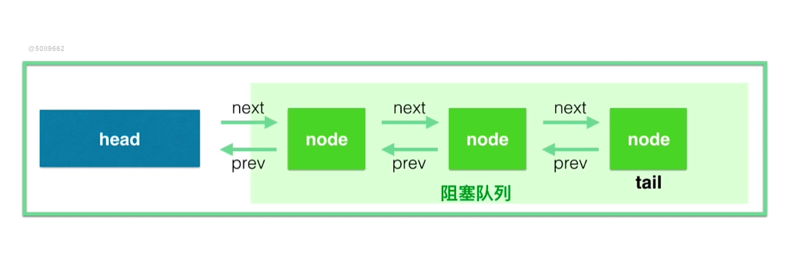

# AQS
---

## 为什么需要AQS

> 锁和协作类有共同点: 闸门
> 事实上，不仅仅是ReentrantLock 和 Semaphore 包括CountDownLatch，ReentrantReadWriteLock都有这样类似的协作(或者说是同步)功能  
> 其实底层都有一个共同的基类，这就是AQS

> **Semaphore、CountDownLatch 内部有一个Sync类，Sync类继承了AQS**

> AQS是一个用于构建锁、同步器、协作工具类的工具类(框架).有了AQS,构建线程协作类就方便很多。

## AQS内部原理解析

> AQS最核心的就是三大部分:
>   - state
>   - 控制线程抢锁和配合的FIFO队列
>   - 期望协作工具类去实现的获取/释放等重要方法

### state状态

```java
public abstract class AbstractQueuedSynchronizer
        extends AbstractOwnableSynchronizer
        implements java.io.Serializable {
    /**
     * The synchronization state.
     */
    private volatile int state;


    /**
     * Returns the current value of synchronization state.
     * This operation has memory semantics of a {@code volatile} read.
     * @return current state value
     */
    protected final int getState() {
        return state;
    }

    /**
     * Sets the value of synchronization state.
     * This operation has memory semantics of a {@code volatile} write.
     * @param newState the new state value
     */
    protected final void setState(int newState) {
        state = newState;
    }

    /**
     * Atomically sets synchronization state to the given updated
     * value if the current state value equals the expected value.
     * This operation has memory semantics of a {@code volatile} read
     * and write.
     *
     * @param expect the expected value
     * @param update the new value
     * @return {@code true} if successful. False return indicates that the actual
     *         value was not equal to the expected value.
     */
    protected final boolean compareAndSetState(int expect, int update) {
        // See below for intrinsics setup to support this
        // 通过底层指令的原子性保证操作的原子性
        return unsafe.compareAndSwapInt(this, stateOffset, expect, update);
    }
}
```

- 这里的state的具体含义、会根据具体实现类的不同而不同,比如在Semaphore里,它表示**剩余的许可证的数量**,而在CountDownLatch中,它表示**还需要倒数的数量**
-

state是被volatile修饰的，会被并发的修改，所以所有修改state的方法都需要保证线程安全，比如getState,setState以及compareAndSetState操作来读取和更新这个状态，这些方法都依赖于j.u.c.atomic包的操作

#### state在ReentrantLock

> ReentrantLock 中 **state用来表示锁的占用情况，包括可重入计数,当state的值为0的时候，标识该Lock不被任何线程占有**

```java
abstract static class Sync extends AbstractQueuedSynchronizer {
    private static final long serialVersionUID = -5179523762034025860L;

    /**
     * Performs {@link #}. The main reason for subclassing
     * is to allow fast path for nonfair version.
     */
    abstract void lock();

    /**
     * Performs non-fair tryLock.  tryAcquire is implemented in
     * subclasses, but both need nonfair try for trylock method.
     */
    final boolean nonfairTryAcquire(int acquires) {
        final Thread current = Thread.currentThread();
        int c = getState();
        if (c == 0) {
            if (compareAndSetState(0, acquires)) {
                setExclusiveOwnerThread(current);
                return true;
            }
        } else if (current == getExclusiveOwnerThread()) {
            int nextc = c + acquires;
            if (nextc < 0) // overflow
                throw new Error("Maximum lock count exceeded");
            setState(nextc);
            return true;
        }
        return false;
    }

    protected final boolean tryRelease(int releases) {
        int c = getState() - releases;
        if (Thread.currentThread() != getExclusiveOwnerThread())
            throw new IllegalMonitorStateException();
        boolean free = false;
        if (c == 0) {
            free = true;
            setExclusiveOwnerThread(null);
        }
        setState(c);
        return free;
    }

    protected final boolean isHeldExclusively() {
        // While we must in general read state before owner,
        // we don't need to do so to check if current thread is owner
        return getExclusiveOwnerThread() == Thread.currentThread();
    }

    final ConditionObject newCondition() {
        return new ConditionObject();
    }

    // Methods relayed from outer class

    final Thread getOwner() {
        return getState() == 0 ? null : getExclusiveOwnerThread();
    }

    final int getHoldCount() {
        return isHeldExclusively() ? getState() : 0;
    }

    // 判断锁是否被锁住就是通过判断state是否等于0
    final boolean isLocked() {
        return getState() != 0;
    }

    /**
     * Reconstitutes the instance from a stream (that is, deserializes it).
     */
    private void readObject(java.io.ObjectInputStream s)
            throws java.io.IOException, ClassNotFoundException {
        s.defaultReadObject();
        setState(0); // reset to unlocked state
    }
}
```

### FIFO队列

> 控制线程抢锁和配合的FIFO队列  
> 这个队列用来存放等待的锁,AQS就是排队管理器,当多个线程争用同一把锁的时候，必须要有排队机制将哪些没有拿到锁的线程串到一起  
> 当锁释放的时候，锁管理器就会挑选一个合适的线程来占有这个刚刚释放的锁。  
> **AQS 会维护一个等待的线程队列,把线程都放到这个队列里面**



### 获取和释放的方法

> 这里的获取和释放方法发，是利用AQS协作类里面最重要方法，是由协作类自己去实现，并且含义各不相同
>

#### 获取方法

- 获取方法依赖于state变量，经常会阻塞(比如获取不到锁的时候)
- 在Semaphore中获取就是acquire方法,作用是获取一个许可证.
- 而在CountDownLatch中，获取就是await方法，作用是等待直到倒数结束

#### 释放方法

- 释放方法不会阻塞
- 在Semaphore中,释放就是release方法,作用是释放一个许可证
- CountDownLatch中，释放就是countDown方法，作用就是倒数一个数

## AQS应用实例

### AQS用法

1、写一个类，想好实现逻辑，实现获取/释放方法 2、内部写一个Sync类继承AbstractQueuedSynchronizer 3、根据是否独占**来重写tryAcquire/tryRelease或trAcquireShared(int
acquires)和tryReleaseShared(int releases)等方法**，在之前写的获取/释放方法中调用AQS的acquire/release或者Shared方法

### CountDownLatch和AQS

```java
public class CountDownLatch {

    private static final class Sync extends AbstractQueuedSynchronizer {
        private static final long serialVersionUID = 4982264981922014374L;

        Sync(int count) {
            setState(count);
        }

        int getCount() {
            return getState();
        }

        protected int tryAcquireShared(int acquires) {
            // 如果state为0，表示所有的都需要放行，到 tryAcquireShared 方法不符合if条件，就不需要进入队列
            return (getState() == 0) ? 1 : -1;
        }

        protected boolean tryReleaseShared(int releases) {
            // Decrement count; signal when transition to zero
            // 自旋
            for (; ; ) {
                // 获取cas中state的数值
                int c = getState();
                // 如果c==0表示已经有人释放了,就不需要释放
                if (c == 0)
                    return false;
                // 计算更新后的方法
                int nextc = c - 1;
                // 通过cas方法进行更新
                if (compareAndSetState(c, nextc))
                    // 一旦结果等于0,就会等于0，将之前等待的线程全部唤醒
                    return nextc == 0;
            }
        }
    }

    public CountDownLatch(int count) {
        if (count < 0) throw new IllegalArgumentException("count < 0");
        this.sync = new Sync(count);
    }

    public long getCount() {
        return sync.getCount();
    }

    // 如果倒数没有结束，则将线程加入阻塞队列
    // 如果倒数没有结束，则将线程直接放行
    public void await() throws InterruptedException {
        sync.acquireSharedInterruptibly(1);
    }

    /**
     * Decrements the count of the latch, releasing all waiting threads if
     * the count reaches zero.
     *
     * <p>If the current count is greater than zero then it is decremented.
     * If the new count is zero then all waiting threads are re-enabled for
     * thread scheduling purposes.
     *
     * <p>If the current count equals zero then nothing happens.
     */
    // 对state进行减一操作，如果操作结果为0，则直接唤醒里面的线程
    public void countDown() {
        sync.releaseShared(1);
    }


}
```

```java

public abstract class AbstractQueuedSynchronizer
        extends AbstractOwnableSynchronizer {

    public final void acquireSharedInterruptibly(int arg)
            throws InterruptedException {
        if (Thread.interrupted())
            throw new InterruptedException();
        // 如果小于0 则需要进入阻塞队列，如果大于0 则不需要进入阻塞队列
        if (tryAcquireShared(arg) < 0)
            // 把线程放入阻塞队列中,并让其阻塞
            doAcquireSharedInterruptibly(arg);
    }

    /**
     * Acquires in shared interruptible mode.
     * @param arg the acquire argument
     */
    private void doAcquireSharedInterruptibly(int arg)
            throws InterruptedException {
        final Node node = addWaiter(Node.SHARED);
        boolean failed = true;
        try {
            for (; ; ) {
                final Node p = node.predecessor();
                if (p == head) {
                    int r = tryAcquireShared(arg);
                    if (r >= 0) {
                        setHeadAndPropagate(node, r);
                        p.next = null; // help GC
                        failed = false;
                        return;
                    }
                }
                if (shouldParkAfterFailedAcquire(p, node) &&
                        parkAndCheckInterrupt())
                    throw new InterruptedException();
            }
        } finally {
            if (failed)
                cancelAcquire(node);
        }
    }

    /**
     * Releases in shared mode.  Implemented by unblocking one or more
     * threads if {@link #tryReleaseShared} returns true.
     *
     * @param arg the release argument.  This value is conveyed to
     *        {@link #tryReleaseShared} but is otherwise uninterpreted
     *        and can represent anything you like.
     * @return the value returned from {@link #tryReleaseShared}
     */
    public final boolean releaseShared(int arg) {
        if (tryReleaseShared(arg)) {
            // 从1减少到0,唤醒所有线程
            doReleaseShared();
            return true;
        }
        return false;
    }
}
```

> - 调用CountDownLatch的await方法的时候，便会尝试获取共享锁,不过一开始是获取不到该锁的,于是线程被阻塞
> - 而共享锁可以获取的条件就算是 锁计数器为0
> - 而计数器的初始值是count，每当一个线程调用CountDownLatch对象的countDown方法的时候，才会将计数器-1
> - count个线程调用countDown()之后，锁计数器才为0，而前面提供的等待获取共享锁的线程才能继续运行

### Semaphore 和AQS

```java
public class Semaphore implements java.io.Serializable {
    private static final long serialVersionUID = -3222578661600680210L;
    /** All mechanics via AbstractQueuedSynchronizer subclass */
    private final Sync sync;

    /**
     * Synchronization implementation for semaphore.  Uses AQS state
     * to represent permits. Subclassed into fair and nonfair
     * versions.
     */
    abstract static class Sync extends AbstractQueuedSynchronizer {
        private static final long serialVersionUID = 1192457210091910933L;

        Sync(int permits) {
            setState(permits);
        }

        final int getPermits() {
            return getState();
        }

        // 返回标识位，如果是整数表示获取成功，如果是负数表示获取失败
        final int nonfairTryAcquireShared(int acquires) {
            // 自旋
            for (; ; ) {
                // 获取state数量
                int available = getState();
                // 假设许可证数量为0，则计算的值为负数，满足下方if语句，直接返回-1，则所有的线程都会进入阻塞队列进行等待(许可证不满足，所有线程进入等待队列)
                // 假设许可证数量为1，计算条件为整数，直接通过cas进行更新，更新成功返回正数，表示获取成功，直接放行
                int remaining = available - acquires;
                if (remaining < 0 ||
                        compareAndSetState(available, remaining))
                    return remaining;
            }
        }

        protected final boolean tryReleaseShared(int releases) {
            for (; ; ) {
                int current = getState();
                int next = current + releases;
                if (next < current) // overflow
                    throw new Error("Maximum permit count exceeded");
                if (compareAndSetState(current, next))
                    return true;
            }
        }

        final void reducePermits(int reductions) {
            for (; ; ) {
                int current = getState();
                int next = current - reductions;
                if (next > current) // underflow
                    throw new Error("Permit count underflow");
                if (compareAndSetState(current, next))
                    return;
            }
        }

        final int drainPermits() {
            for (; ; ) {
                int current = getState();
                if (current == 0 || compareAndSetState(current, 0))
                    return current;
            }
        }
    }

    /**
     * NonFair version
     */
    static final class NonfairSync extends Sync {
        private static final long serialVersionUID = -2694183684443567898L;

        NonfairSync(int permits) {
            super(permits);
        }

        protected int tryAcquireShared(int acquires) {
            return nonfairTryAcquireShared(acquires);
        }
    }

    /**
     * Fair version
     */
    static final class FairSync extends Sync {
        private static final long serialVersionUID = 2014338818796000944L;

        FairSync(int permits) {
            super(permits);
        }

        protected int tryAcquireShared(int acquires) {
            for (; ; ) {
                if (hasQueuedPredecessors())
                    return -1;
                int available = getState();
                int remaining = available - acquires;
                if (remaining < 0 ||
                        compareAndSetState(available, remaining))
                    return remaining;
            }
        }
    }


    /**
     * Creates a {@code Semaphore} with the given number of
     * permits and nonfair fairness setting.
     *
     * @param permits the initial number of permits available.
     *        This value may be negative, in which case releases
     *        must occur before any acquires will be granted.
     */
    public Semaphore(int permits) {
        // 默认是非公平的，并且将state设置为许可证的数量
        sync = new NonfairSync(permits);
    }

    /**
     * Creates a {@code Semaphore} with the given number of
     * permits and the given fairness setting.
     *
     * @param permits the initial number of permits available.
     *        This value may be negative, in which case releases
     *        must occur before any acquires will be granted.
     * @param fair {@code true} if this semaphore will guarantee
     *        first-in first-out granting of permits under contention,
     *        else {@code false}
     */
    public Semaphore(int permits, boolean fair) {
        sync = fair ? new FairSync(permits) : new NonfairSync(permits);
    }

    /**
     * Acquires a permit from this semaphore, blocking until one is
     * available, or the thread is {@linkplain Thread#interrupt interrupted}.
     *
     * <p>Acquires a permit, if one is available and returns immediately,
     * reducing the number of available permits by one.
     *
     * <p>If no permit is available then the current thread becomes
     * disabled for thread scheduling purposes and lies dormant until
     * one of two things happens:
     * <ul>
     * <li>Some other thread invokes the {@link #release} method for this
     * semaphore and the current thread is next to be assigned a permit; or
     * <li>Some other thread {@linkplain Thread#interrupt interrupts}
     * the current thread.
     * </ul>
     *
     * <p>If the current thread:
     * <ul>
     * <li>has its interrupted status set on entry to this method; or
     * <li>is {@linkplain Thread#interrupt interrupted} while waiting
     * for a permit,
     * </ul>
     * then {@link InterruptedException} is thrown and the current thread's
     * interrupted status is cleared.
     *
     * @throws InterruptedException if the current thread is interrupted
     */
    public void acquire() throws InterruptedException {
        sync.acquireSharedInterruptibly(1);
    }

    /**
     * Acquires a permit from this semaphore, blocking until one is
     * available.
     *
     * <p>Acquires a permit, if one is available and returns immediately,
     * reducing the number of available permits by one.
     *
     * <p>If no permit is available then the current thread becomes
     * disabled for thread scheduling purposes and lies dormant until
     * some other thread invokes the {@link #release} method for this
     * semaphore and the current thread is next to be assigned a permit.
     *
     * <p>If the current thread is {@linkplain Thread#interrupt interrupted}
     * while waiting for a permit then it will continue to wait, but the
     * time at which the thread is assigned a permit may change compared to
     * the time it would have received the permit had no interruption
     * occurred.  When the thread does return from this method its interrupt
     * status will be set.
     */
    public void acquireUninterruptibly() {
        sync.acquireShared(1);
    }

}
```

> - 在Semaphore中，state表示许可证的剩余数量
> - 看tryAcquire方法判断nonfairTryAcquireShared大于等于0的话，代表成功
> - 首先检查剩余的许可证数量够不够本次使用，用减法来计数，如果直接不够，就返回负数，表示失败，  
    > 如果够了就用自旋加compareAndSetState来改变state状态，直到改变成功就返回负数；  
    > 或者期间如果被其他人修改了导致剩余数量不够了，那也返回负数代表获取失败

### ReentrantLock 和AQS

```java
public class ReentrantLock implements Lock, java.io.Serializable {
    private static final long serialVersionUID = 7373984872572414699L;
    /** Synchronizer providing all implementation mechanics */
    private final Sync sync;

    /**
     * Base of synchronization control for this lock. Subclassed
     * into fair and nonfair versions below. Uses AQS state to
     * represent the number of holds on the lock.
     */
    abstract static class Sync extends AbstractQueuedSynchronizer {
        private static final long serialVersionUID = -5179523762034025860L;

        /**
         * Performs {@link Lock#lock}. The main reason for subclassing
         * is to allow fast path for nonfair version.
         */
        abstract void lock();

        /**
         * Performs non-fair tryLock.  tryAcquire is implemented in
         * subclasses, but both need nonfair try for trylock method.
         */
        final boolean nonfairTryAcquire(int acquires) {
            final Thread current = Thread.currentThread();
            int c = getState();
            // 如果state等于0，则通过cas设置为1，并且将当前线程设置为持有锁的线程
            if (c == 0) {
                if (compareAndSetState(0, acquires)) {
                    setExclusiveOwnerThread(current);
                    return true;
                }
            } else if (current == getExclusiveOwnerThread()) {
                // 如果当前线程是持有锁的线程，则将state的状态加1，即重入次数加1
                int nextc = c + acquires;
                if (nextc < 0) // overflow
                    throw new Error("Maximum lock count exceeded");
                setState(nextc);
                return true;
            }
            // 除去上面两种情况，则锁被其他线程持有
            return false;
        }

        protected final boolean tryRelease(int releases) {
            // state代表可重入的次数
            int c = getState() - releases;
            // 当前线程是不是持有锁的线程,如果不是着直接抛出异常
            if (Thread.currentThread() != getExclusiveOwnerThread())
                throw new IllegalMonitorStateException();
            boolean free = false;
            if (c == 0) {
                // free 代表这把锁是不是自由的状态，true代表自由
                free = true;
                // 设置当前这把锁的线程为null，表示没有线程持有这把锁
                setExclusiveOwnerThread(null);
            }
            // 如果不等于0，则直接将重入的次数减少一次
            setState(c);
            return free;
        }

        protected final boolean isHeldExclusively() {
            // While we must in general read state before owner,
            // we don't need to do so to check if current thread is owner
            return getExclusiveOwnerThread() == Thread.currentThread();
        }

        final ConditionObject newCondition() {
            return new ConditionObject();
        }

        // Methods relayed from outer class

        final Thread getOwner() {
            return getState() == 0 ? null : getExclusiveOwnerThread();
        }

        final int getHoldCount() {
            return isHeldExclusively() ? getState() : 0;
        }

        final boolean isLocked() {
            return getState() != 0;
        }

        /**
         * Reconstitutes the instance from a stream (that is, deserializes it).
         */
        private void readObject(java.io.ObjectInputStream s)
                throws java.io.IOException, ClassNotFoundException {
            s.defaultReadObject();
            setState(0); // reset to unlocked state
        }
    }


    /**
     * Sync object for non-fair locks
     */
    static final class NonfairSync extends Sync {
        private static final long serialVersionUID = 7316153563782823691L;

        /**
         * Performs lock.  Try immediate barge, backing up to normal
         * acquire on failure.
         */
        final void lock() {
            // CAS 只有当前没有任何线程持有这把锁，代表设置成功
            if (compareAndSetState(0, 1))
                // 将当前的线程设置持有锁的线程
                setExclusiveOwnerThread(Thread.currentThread());
            else
                acquire(1);
        }

        protected final boolean tryAcquire(int acquires) {
            return nonfairTryAcquire(acquires);
        }
    }

    /**
     * Sync object for fair locks
     */
    static final class FairSync extends Sync {
        private static final long serialVersionUID = -3000897897090466540L;

        final void lock() {
            acquire(1);
        }

        /**
         * Fair version of tryAcquire.  Don't grant access unless
         * recursive call or no waiters or is first.
         */
        protected final boolean tryAcquire(int acquires) {
            final Thread current = Thread.currentThread();
            int c = getState();
            if (c == 0) {
                if (!hasQueuedPredecessors() &&
                        compareAndSetState(0, acquires)) {
                    setExclusiveOwnerThread(current);
                    return true;
                }
            } else if (current == getExclusiveOwnerThread()) {
                int nextc = c + acquires;
                if (nextc < 0)
                    throw new Error("Maximum lock count exceeded");
                setState(nextc);
                return true;
            }
            return false;
        }
    }

    // 解锁
    public void unlock() {
        sync.release(1);
    }

    // 加锁
    public void lock() {
        sync.lock();
    }

}
```

```java
public abstract class AbstractQueuedSynchronizer
        extends AbstractOwnableSynchronizer
        implements java.io.Serializable {

    /**
     * Releases in exclusive mode.  Implemented by unblocking one or
     * more threads if {@link #tryRelease} returns true.
     * This method can be used to implement method {@link Lock#unlock}.
     *
     * @param arg the release argument.  This value is conveyed to
     *        {@link #tryRelease} but is otherwise uninterpreted and
     *        can represent anything you like.
     * @return the value returned from {@link #tryRelease}
     */
    public final boolean release(int arg) {
        // 如果返回true，表示当前没有线程持有锁
        if (tryRelease(arg)) {
            // 唤醒后面的线程
            Node h = head;
            if (h != null && h.waitStatus != 0)
                unparkSuccessor(h);
            return true;
        }
        return false;
    }


    /**
     * Acquires in exclusive mode, ignoring interrupts.  Implemented
     * by invoking at least once {@link #tryAcquire},
     * returning on success.  Otherwise the thread is queued, possibly
     * repeatedly blocking and unblocking, invoking {@link
     * #tryAcquire} until success.  This method can be used
     * to implement method {@link Lock#lock}.
     *
     * @param arg the acquire argument.  This value is conveyed to
     *        {@link #tryAcquire} but is otherwise uninterpreted and
     *        can represent anything you like.
     */
    public final void acquire(int arg) {
        if (!tryAcquire(arg) &&
                // 如果获取锁，则将当前线程放入阻塞队列中，并设置类型为互斥锁
                acquireQueued(addWaiter(Node.EXCLUSIVE), arg))
            selfInterrupt();
    }
}
```
> - 释放锁tryRelease  
> 由于是可重入的，所以state代表重入的次数，每次释放锁都先判断是不是当前持有锁的线程释放的，如果不是就抛出异常，如果是就将重入次数减一。如果减少到了0，就说明完全释放，于是free为true，并将state设置为0
> - 加锁
> 判断当前state是不是等于0也会去判断当前线程是不是持有锁的线程,如果都不是代表你拿不到这把锁,于是把线程放入队列中等待,并在以后合适的时机唤醒

## AQS扩展
- [美团技术团队《从ReentrantLock的实现看AQS的原理及应用》](https://mp.weixin.qq.com/s/sA01gxC4EbgypCsQt5pVog)
- [老钱《打通 Java 任督二脉 —— 并发数据结构的基石》](https://juejin.im/post/5c11d6376fb9a049e82b6253)
- [HongJie《一行一行源码分析清楚AbstractQueuedSynchronizer》](https://javadoop.com/post/AbstractQueuedSynchronizer)
- [爱吃鱼的KK《AbstractQueuedSynchronizer 源码分析 (基于Java 8)》](https://www.jianshu.com/p/e7659436538b)
- [waterystone《Java并发之AQS详解》](https://www.cnblogs.com/waterystone/p/4920797.html)
- [英文论文的中文翻译](https://www.cnblogs.com/dennyzhangdd/p/7218510.html)
- [AQS作者的英文论文](http://gee.cs.oswego.edu/dl/papers/aqs.pdf)